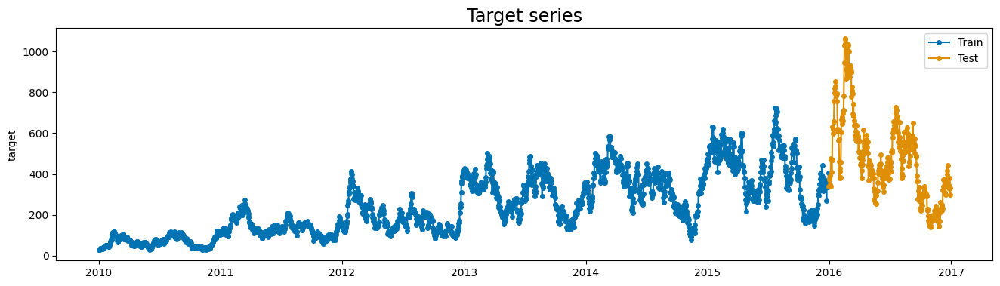
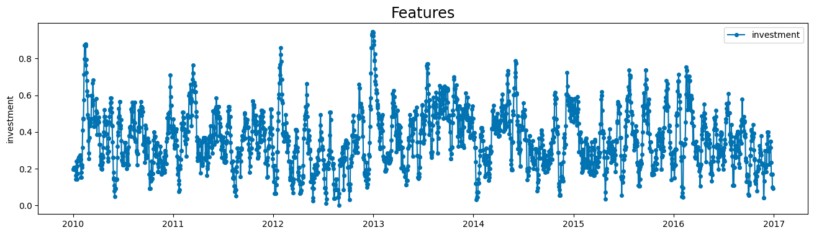
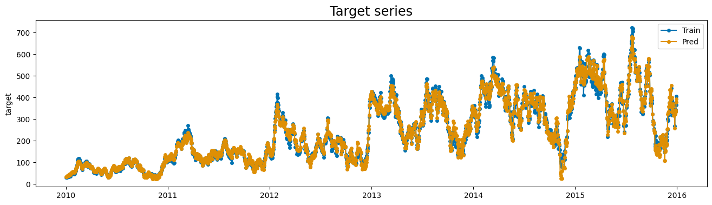
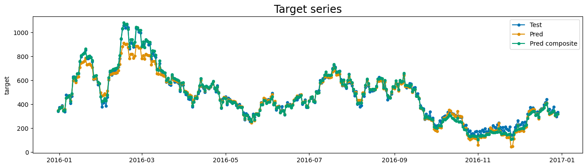
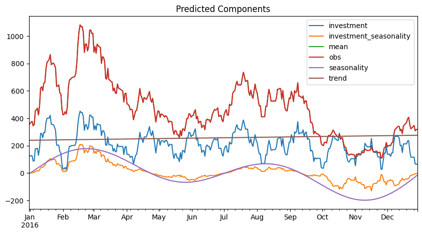

# Composition of effects

In previous examples, we saw how to create a simple custom effect,
which applies a simple transformation to the input data. However, the effect's
interface allows us to apply more complex transformations, such as using the output
of previous components as input for the current component, or creating a composite
effect that wraps an effect and applies some sort of transformation. This example
will cover these topics.

## Creating a custom effect

The idea here is to create an effect that uses another predicted component
to scale the impact of an exogenous variable.

One classic use-case for this would be using seasonality to scale
the effect of investment, that might be proportional to it.
Marketing investments are a good example of this. We will implement such a composite
effect in this section.

### Example dataset

The dataset we use is synthetic, and the relation between the exogenous variable
and the target is known. However, let's pretend we don't know this relation, and
analize the data to find some insights that motivate the creation of a custom
effect. The dataset has a target variable, which is a time series, and an exogenous
variable, which is the investment made for each date.


```python

import numpyro.distributions as dist
from matplotlib import pyplot as plt
from sktime.split import temporal_train_test_split
from sktime.utils.plotting import plot_series

from prophetverse.datasets.synthetic import load_composite_effect_example

y, X = load_composite_effect_example()

y_train, y_test, X_train, X_test = temporal_train_test_split(y, X, test_size=365)

display(y_train.head())
display(X_train.head())

plot_series(y_train, y_test, labels=["Train", "Test"], title="Target series")

plot_series(
    X["investment"],
    labels=["investment"],
    title="Features",
)
plt.show()


```
<p class="cell-output-title jp-RenderedText jp-OutputArea-output">Output: <span class="cell-output-count">[1]</span></p>


<div>
<style scoped>
    .dataframe tbody tr th:only-of-type {
        vertical-align: middle;
    }

    .dataframe tbody tr th {
        vertical-align: top;
    }

    .dataframe thead th {
        text-align: right;
    }
</style>
<table border="1" class="dataframe">
  <thead>
    <tr style="text-align: right;">
      <th></th>
      <th>target</th>
    </tr>
    <tr>
      <th>time</th>
      <th></th>
    </tr>
  </thead>
  <tbody>
    <tr>
      <th>2010-01-01</th>
      <td>29.375431</td>
    </tr>
    <tr>
      <th>2010-01-02</th>
      <td>30.268786</td>
    </tr>
    <tr>
      <th>2010-01-03</th>
      <td>29.128912</td>
    </tr>
    <tr>
      <th>2010-01-04</th>
      <td>31.014165</td>
    </tr>
    <tr>
      <th>2010-01-05</th>
      <td>31.890928</td>
    </tr>
  </tbody>
</table>
</div>


<div>
<style scoped>
    .dataframe tbody tr th:only-of-type {
        vertical-align: middle;
    }

    .dataframe tbody tr th {
        vertical-align: top;
    }

    .dataframe thead th {
        text-align: right;
    }
</style>
<table border="1" class="dataframe">
  <thead>
    <tr style="text-align: right;">
      <th></th>
      <th>investment</th>
    </tr>
    <tr>
      <th>time</th>
      <th></th>
    </tr>
  </thead>
  <tbody>
    <tr>
      <th>2010-01-01</th>
      <td>0.198274</td>
    </tr>
    <tr>
      <th>2010-01-02</th>
      <td>0.198274</td>
    </tr>
    <tr>
      <th>2010-01-03</th>
      <td>0.198274</td>
    </tr>
    <tr>
      <th>2010-01-04</th>
      <td>0.198274</td>
    </tr>
    <tr>
      <th>2010-01-05</th>
      <td>0.207695</td>
    </tr>
  </tbody>
</table>
</div>


    

    


    

    


The timeseries has a yearly seasonality, and it seems that some oscillations are
proportional to
the investment. Below, we model the timeseries with a simple linear effect between
the investment and the target, and a yearly seasonality based on fourier terms.
Then, we will analize the residuals to see if there is any pattern that we can
capture with a custom effect.


```python
from prophetverse.effects import LinearEffect
from prophetverse.effects.fourier import LinearFourierSeasonality
from prophetverse.effects.trend import PiecewiseLinearTrend
from prophetverse.engine import MAPInferenceEngine
from prophetverse.sktime import Prophetverse
from prophetverse.utils.regex import exact, no_input_columns

model = Prophetverse(
    trend=PiecewiseLinearTrend(
        changepoint_interval=500,
        changepoint_prior_scale=0.00001,
        changepoint_range=-500,
    ),
    exogenous_effects=[
        (
            "seasonality",
            LinearFourierSeasonality(
                freq="D",
                sp_list=[365.25],
                fourier_terms_list=[5],
                prior_scale=1,
                effect_mode="multiplicative",
            ),
            no_input_columns,
        ),
        (
            "investment",
            LinearEffect("multiplicative", prior=dist.Normal(0, 1)),
            exact("investment"),
        ),
    ],
    inference_engine=MAPInferenceEngine(),
)

model.fit(y=y_train, X=X_train)
model


```
<p class="cell-output-title jp-RenderedText jp-OutputArea-output">Output: <span class="cell-output-count">[2]</span></p>


<style>#sk-5fb2d78a-dfb8-4467-b0eb-449028736763 {
    /* Definition of color scheme common for light and dark mode */
    --sklearn-color-text: black;
    --sklearn-color-line: gray;
    /* Definition of color scheme for objects */
    --sklearn-color-level-0: #fff5e6;
    --sklearn-color-level-1: #f6e4d2;
    --sklearn-color-level-2: #ffe0b3;
    --sklearn-color-level-3: chocolate;

    /* Specific color for light theme */
    --sklearn-color-text-on-default-background: var(--theme-code-foreground, var(--jp-content-font-color1, black));
    --sklearn-color-background: var(--theme-background, var(--jp-layout-color0, white));
    --sklearn-color-border-box: var(--theme-code-foreground, var(--jp-content-font-color1, black));
    --sklearn-color-icon: #696969;

    @media (prefers-color-scheme: dark) {
      /* Redefinition of color scheme for dark theme */
      --sklearn-color-text-on-default-background: var(--theme-code-foreground, var(--jp-content-font-color1, white));
      --sklearn-color-background: var(--theme-background, var(--jp-layout-color0, #111));
      --sklearn-color-border-box: var(--theme-code-foreground, var(--jp-content-font-color1, white));
      --sklearn-color-icon: #878787;
    }
  }

  #sk-5fb2d78a-dfb8-4467-b0eb-449028736763 {
    color: var(--sklearn-color-text);
  }

  #sk-5fb2d78a-dfb8-4467-b0eb-449028736763 pre {
    padding: 0;
  }

  #sk-5fb2d78a-dfb8-4467-b0eb-449028736763 input.sk-hidden--visually {
    border: 0;
    clip: rect(1px 1px 1px 1px);
    clip: rect(1px, 1px, 1px, 1px);
    height: 1px;
    margin: -1px;
    overflow: hidden;
    padding: 0;
    position: absolute;
    width: 1px;
  }

  #sk-5fb2d78a-dfb8-4467-b0eb-449028736763 div.sk-dashed-wrapped {
    border: 1px dashed var(--sklearn-color-line);
    margin: 0 0.4em 0.5em 0.4em;
    box-sizing: border-box;
    padding-bottom: 0.4em;
    background-color: var(--sklearn-color-background);
  }

  #sk-5fb2d78a-dfb8-4467-b0eb-449028736763 div.sk-container {
    /* jupyter's `normalize.less` sets `[hidden] { display: none; }`
       but bootstrap.min.css set `[hidden] { display: none !important; }`
       so we also need the `!important` here to be able to override the
       default hidden behavior on the sphinx rendered scikit-learn.org.
       See: https://github.com/scikit-learn/scikit-learn/issues/21755 */
    display: inline-block !important;
    position: relative;
  }

  #sk-5fb2d78a-dfb8-4467-b0eb-449028736763 div.sk-text-repr-fallback {
    display: none;
  }

  div.sk-parallel-item,
  div.sk-serial,
  div.sk-item {
    /* draw centered vertical line to link estimators */
    background-image: linear-gradient(var(--sklearn-color-text-on-default-background), var(--sklearn-color-text-on-default-background));
    background-size: 2px 100%;
    background-repeat: no-repeat;
    background-position: center center;
  }

  /* Parallel-specific style estimator block */

  #sk-5fb2d78a-dfb8-4467-b0eb-449028736763 div.sk-parallel-item::after {
    content: "";
    width: 100%;
    border-bottom: 2px solid var(--sklearn-color-text-on-default-background);
    flex-grow: 1;
  }

  #sk-5fb2d78a-dfb8-4467-b0eb-449028736763 div.sk-parallel {
    display: flex;
    align-items: stretch;
    justify-content: center;
    background-color: var(--sklearn-color-background);
    position: relative;
  }

  #sk-5fb2d78a-dfb8-4467-b0eb-449028736763 div.sk-parallel-item {
    display: flex;
    flex-direction: column;
  }

  #sk-5fb2d78a-dfb8-4467-b0eb-449028736763 div.sk-parallel-item:first-child::after {
    align-self: flex-end;
    width: 50%;
  }

  #sk-5fb2d78a-dfb8-4467-b0eb-449028736763 div.sk-parallel-item:last-child::after {
    align-self: flex-start;
    width: 50%;
  }

  #sk-5fb2d78a-dfb8-4467-b0eb-449028736763 div.sk-parallel-item:only-child::after {
    width: 0;
  }

  /* Serial-specific style estimator block */

  #sk-5fb2d78a-dfb8-4467-b0eb-449028736763 div.sk-serial {
    display: flex;
    flex-direction: column;
    align-items: center;
    background-color: var(--sklearn-color-background);
    padding-right: 1em;
    padding-left: 1em;
  }


  /* Toggleable style: style used for estimator/Pipeline/ColumnTransformer box that is
  clickable and can be expanded/collapsed.
  - Pipeline and ColumnTransformer use this feature and define the default style
  - Estimators will overwrite some part of the style using the `sk-estimator` class
  */

  /* Pipeline and ColumnTransformer style (default) */

  #sk-5fb2d78a-dfb8-4467-b0eb-449028736763 div.sk-toggleable {
    /* Default theme specific background. It is overwritten whether we have a
    specific estimator or a Pipeline/ColumnTransformer */
    background-color: var(--sklearn-color-background);
  }

  /* Toggleable label */
  #sk-5fb2d78a-dfb8-4467-b0eb-449028736763 label.sk-toggleable__label {
    cursor: pointer;
    display: block;
    width: 100%;
    margin-bottom: 0;
    padding: 0.5em;
    box-sizing: border-box;
    text-align: center;
  }

  #sk-5fb2d78a-dfb8-4467-b0eb-449028736763 label.sk-toggleable__label-arrow:before {
    /* Arrow on the left of the label */
    content: "▸";
    float: left;
    margin-right: 0.25em;
    color: var(--sklearn-color-icon);
  }

  #sk-5fb2d78a-dfb8-4467-b0eb-449028736763 label.sk-toggleable__label-arrow:hover:before {
    color: var(--sklearn-color-text);
  }

  /* Toggleable content - dropdown */

  #sk-5fb2d78a-dfb8-4467-b0eb-449028736763 div.sk-toggleable__content {
    max-height: 0;
    max-width: 0;
    overflow: hidden;
    text-align: left;
    background-color: var(--sklearn-color-level-0);
  }

  #sk-5fb2d78a-dfb8-4467-b0eb-449028736763 div.sk-toggleable__content pre {
    margin: 0.2em;
    border-radius: 0.25em;
    color: var(--sklearn-color-text);
    background-color: var(--sklearn-color-level-0);
  }

  #sk-5fb2d78a-dfb8-4467-b0eb-449028736763 input.sk-toggleable__control:checked~div.sk-toggleable__content {
    /* Expand drop-down */
    max-height: 200px;
    max-width: 100%;
    overflow: auto;
  }

  #sk-5fb2d78a-dfb8-4467-b0eb-449028736763 input.sk-toggleable__control:checked~label.sk-toggleable__label-arrow:before {
    content: "▾";
  }

  /* Pipeline/ColumnTransformer-specific style */

  #sk-5fb2d78a-dfb8-4467-b0eb-449028736763 div.sk-label input.sk-toggleable__control:checked~label.sk-toggleable__label {
    color: var(--sklearn-color-text);
    background-color: var(--sklearn-color-level-2);
  }

  /* Estimator-specific style */

  /* Colorize estimator box */
  #sk-5fb2d78a-dfb8-4467-b0eb-449028736763 div.sk-estimator input.sk-toggleable__control:checked~label.sk-toggleable__label {
    /* unfitted */
    background-color: var(--sklearn-color-level-2);
  }

  #sk-5fb2d78a-dfb8-4467-b0eb-449028736763 div.sk-label label.sk-toggleable__label,
  #sk-5fb2d78a-dfb8-4467-b0eb-449028736763 div.sk-label label {
    /* The background is the default theme color */
    color: var(--sklearn-color-text-on-default-background);
  }

  /* On hover, darken the color of the background */
  #sk-5fb2d78a-dfb8-4467-b0eb-449028736763 div.sk-label:hover label.sk-toggleable__label {
    color: var(--sklearn-color-text);
    background-color: var(--sklearn-color-level-2);
  }

  /* Estimator label */

  #sk-5fb2d78a-dfb8-4467-b0eb-449028736763 div.sk-label label {
    font-family: monospace;
    font-weight: bold;
    display: inline-block;
    line-height: 1.2em;
  }

  #sk-5fb2d78a-dfb8-4467-b0eb-449028736763 div.sk-label-container {
    text-align: center;
  }

  /* Estimator-specific */
  #sk-5fb2d78a-dfb8-4467-b0eb-449028736763 div.sk-estimator {
    font-family: monospace;
    border: 1px dotted var(--sklearn-color-border-box);
    border-radius: 0.25em;
    box-sizing: border-box;
    margin-bottom: 0.5em;
    background-color: var(--sklearn-color-level-0);
  }

  /* on hover */
  #sk-5fb2d78a-dfb8-4467-b0eb-449028736763 div.sk-estimator:hover {
    background-color: var(--sklearn-color-level-2);
  }

  /* Specification for estimator info */

  .sk-estimator-doc-link,
  a:link.sk-estimator-doc-link,
  a:visited.sk-estimator-doc-link {
    float: right;
    font-size: smaller;
    line-height: 1em;
    font-family: monospace;
    background-color: var(--sklearn-color-background);
    border-radius: 1em;
    height: 1em;
    width: 1em;
    text-decoration: none !important;
    margin-left: 1ex;
    border: var(--sklearn-color-level-1) 1pt solid;
    color: var(--sklearn-color-level-1);
  }

  /* On hover */
  div.sk-estimator:hover .sk-estimator-doc-link:hover,
  .sk-estimator-doc-link:hover,
  div.sk-label-container:hover .sk-estimator-doc-link:hover,
  .sk-estimator-doc-link:hover {
    background-color: var(--sklearn-color-level-3);
    color: var(--sklearn-color-background);
    text-decoration: none;
  }

  /* Span, style for the box shown on hovering the info icon */
  .sk-estimator-doc-link span {
    display: none;
    z-index: 9999;
    position: relative;
    font-weight: normal;
    right: .2ex;
    padding: .5ex;
    margin: .5ex;
    width: min-content;
    min-width: 20ex;
    max-width: 50ex;
    color: var(--sklearn-color-text);
    box-shadow: 2pt 2pt 4pt #999;
    background: var(--sklearn-color-level-0);
    border: .5pt solid var(--sklearn-color-level-3);
  }

  .sk-estimator-doc-link:hover span {
    display: block;
  }

  /* "?"-specific style due to the `<a>` HTML tag */

  #sk-5fb2d78a-dfb8-4467-b0eb-449028736763 a.estimator_doc_link {
    float: right;
    font-size: 1rem;
    line-height: 1em;
    font-family: monospace;
    background-color: var(--sklearn-color-background);
    border-radius: 1rem;
    height: 1rem;
    width: 1rem;
    text-decoration: none;
    color: var(--sklearn-color-level-1);
    border: var(--sklearn-color-level-1) 1pt solid;
  }

  /* On hover */
  #sk-5fb2d78a-dfb8-4467-b0eb-449028736763 a.estimator_doc_link:hover {
    background-color: var(--sklearn-color-level-3);
    color: var(--sklearn-color-background);
    text-decoration: none;
  }
</style><div id='sk-5fb2d78a-dfb8-4467-b0eb-449028736763' class="sk-top-container"><div class="sk-text-repr-fallback"><pre>Prophetverse(exogenous_effects=[(&#x27;seasonality&#x27;,
                                 LinearFourierSeasonality(effect_mode=&#x27;multiplicative&#x27;,
                                                          fourier_terms_list=[5],
                                                          freq=&#x27;D&#x27;,
                                                          prior_scale=1,
                                                          sp_list=[365.25]),
                                 &#x27;^$&#x27;),
                                (&#x27;investment&#x27;,
                                 LinearEffect(prior=&lt;numpyro.distributions.continuous.Normal object at 0x30eabfb50&gt;),
                                 &#x27;^investment$&#x27;)],
             inference_engine=MAPInferenceEngine(),
             trend=PiecewiseLinearTrend(changepoint_interval=500,
                                        changepoint_prior_scale=1e-05,
                                        changepoint_range=-500))</pre><b>Please rerun this cell to show the HTML repr or trust the notebook.</b></div><div class="sk-container" hidden><div class="sk-item sk-dashed-wrapped"><div class='sk-label-container'><div class="sk-label sk-toggleable"><input class="sk-toggleable__control sk-hidden--visually" id=UUID('ddc29969-cab7-40a6-af08-7f04c5bed23d') type="checkbox" ><label for=UUID('ddc29969-cab7-40a6-af08-7f04c5bed23d') class='sk-toggleable__label sk-toggleable__label-arrow'>Prophetverse</label><div class="sk-toggleable__content"><pre>Prophetverse(exogenous_effects=[(&#x27;seasonality&#x27;,
                                 LinearFourierSeasonality(effect_mode=&#x27;multiplicative&#x27;,
                                                          fourier_terms_list=[5],
                                                          freq=&#x27;D&#x27;,
                                                          prior_scale=1,
                                                          sp_list=[365.25]),
                                 &#x27;^$&#x27;),
                                (&#x27;investment&#x27;,
                                 LinearEffect(prior=&lt;numpyro.distributions.continuous.Normal object at 0x30eabfb50&gt;),
                                 &#x27;^investment$&#x27;)],
             inference_engine=MAPInferenceEngine(),
             trend=PiecewiseLinearTrend(changepoint_interval=500,
                                        changepoint_prior_scale=1e-05,
                                        changepoint_range=-500))</pre></div></div></div><div class="sk-parallel"><div class="sk-parallel-item"><div class="sk-item"><div class='sk-label-container'><div class="sk-label sk-toggleable"><label>effects</label></div></div><div class="sk-serial"><div class="sk-item"><div class="sk-serial"><div class='sk-item'><div class="sk-estimator sk-toggleable"><input class="sk-toggleable__control sk-hidden--visually" id=UUID('c977d064-fa96-4929-9837-9317425e2280') type="checkbox" ><label for=UUID('c977d064-fa96-4929-9837-9317425e2280') class='sk-toggleable__label sk-toggleable__label-arrow'>PiecewiseLinearTrend</label><div class="sk-toggleable__content"><pre>PiecewiseLinearTrend(changepoint_interval=500, changepoint_prior_scale=1e-05,
                     changepoint_range=-500)</pre></div></div></div><div class='sk-item'><div class="sk-estimator sk-toggleable"><input class="sk-toggleable__control sk-hidden--visually" id=UUID('0f573cff-a422-4a24-bc30-2bbd1bc73bff') type="checkbox" ><label for=UUID('0f573cff-a422-4a24-bc30-2bbd1bc73bff') class='sk-toggleable__label sk-toggleable__label-arrow'>LinearFourierSeasonality</label><div class="sk-toggleable__content"><pre>LinearFourierSeasonality(effect_mode=&#x27;multiplicative&#x27;, fourier_terms_list=[5],
                         freq=&#x27;D&#x27;, prior_scale=1, sp_list=[365.25])</pre></div></div></div><div class='sk-item'><div class="sk-estimator sk-toggleable"><input class="sk-toggleable__control sk-hidden--visually" id=UUID('1037b42b-03e1-4278-94d8-24a4a54bb63c') type="checkbox" ><label for=UUID('1037b42b-03e1-4278-94d8-24a4a54bb63c') class='sk-toggleable__label sk-toggleable__label-arrow'>LinearEffect</label><div class="sk-toggleable__content"><pre>LinearEffect(prior=&lt;numpyro.distributions.continuous.Normal object at 0x30eabfb50&gt;)</pre></div></div></div></div></div></div></div></div><div class="sk-parallel-item"><div class="sk-item"><div class='sk-label-container'><div class="sk-label sk-toggleable"><label>inference_engine</label></div></div><div class="sk-serial"><div class='sk-item'><div class="sk-estimator sk-toggleable"><input class="sk-toggleable__control sk-hidden--visually" id=UUID('5e212d22-5c9a-464a-a7fa-94c07e13713e') type="checkbox" ><label for=UUID('5e212d22-5c9a-464a-a7fa-94c07e13713e') class='sk-toggleable__label sk-toggleable__label-arrow'>MAPInferenceEngine</label><div class="sk-toggleable__content"><pre>MAPInferenceEngine()</pre></div></div></div></div></div></div></div></div></div></div>


We plot the predictions on training set to see if the model performs well.


```python
y_pred = model.predict(X=X_train, fh=y_train.index)
plot_series(y_train, y_pred, labels=["Train", "Pred"], title="Target series")
plt.show()


```
<p class="cell-output-title jp-RenderedText jp-OutputArea-output">Output: <span class="cell-output-count">[3]</span></p>


    

    


We can see that some peaks are not captured by the model.
Our hypothesis to explain this phenomenon
is that the investment has more impact on the target when it is
done during the positive seasonality periods. To test this, we plot the residuals
of the model against the investment, and color the points based on the seasonality
component. We can see that slopes are different for positive and negative
seasonality, which indicates that our hypothesis is possibly correct.


```python
components = model.predict_components(X=X_train, fh=y_train.index)

residual = y_train["target"] - components["mean"]

fig, ax = plt.subplots()
ax.scatter(
    X_train["investment"],
    residual,
    c=components["seasonality"] < 0,
    cmap="Accent",
    alpha=0.9,
)
# Create legend manually
colors = plt.cm.get_cmap("Accent").colors
ax.scatter([], [], color=colors[0], label="Positive seasonality")
ax.scatter([], [], color=colors[1], label="Negative seasonality")
ax.legend()
ax.set(xlabel="Investment", ylabel="Residual", title="Residuals vs Investment")
fig.show()


```
<p class="cell-output-title jp-RenderedText jp-OutputArea-output">Output: <span class="cell-output-count">[4]</span></p>


    

    


## Creating the composite effect
To model this behaviour with Prophetverse, we will create a custom effect, that
scales a new effect by the output of a previous component.
The `_fit` and `_transform` methods call the inner effect's methods, and the
predict method multiplies the inner effect's predictions by the seasonality, which
is passed as `base_effect_name`.


```python
from typing import Any, Dict, List

import jax.numpy as jnp
import pandas as pd

from prophetverse.effects.base import BaseEffect


class WrapEffectAndScaleByAnother(BaseEffect):
    """Wrap an effect and scale it by another effect.

    Parameters
    ----------
    effect : BaseEffect
        The effect to wrap.

    """

    _tags = {"skip_predict_if_no_match": False, "supports_multivariate": False}

    def __init__(
        self,
        effect: BaseEffect,
        base_effect_name: str,
    ):

        self.effect = effect
        self.base_effect_name = base_effect_name

        super().__init__()

        self.clone_tags(effect)

    def _fit(self, y: pd.DataFrame, X: pd.DataFrame, scale: float = 1):
        """Initialize the effect.

        This method is called during `fit()` of the forecasting model.
        It receives the Exogenous variables DataFrame and should be used to initialize
        any necessary parameters or data structures, such as detecting the columns that
        match the regex pattern.

        Parameters
        ----------
        y : pd.DataFrame
            The timeseries dataframe

        X : pd.DataFrame
            The DataFrame to initialize the effect.

        scale : float, optional
            The scale of the timeseries. For multivariate timeseries, this is
            a dataframe. For univariate, it is a simple float.

        Returns
        -------
        None
        """
        self.effect.fit(X=X, y=y, scale=scale)

    def _transform(self, X: pd.DataFrame, fh: pd.Index) -> Dict[str, Any]:
        """Prepare input data to be passed to numpyro model.

        Returns a dictionary with the data for the lift and for the inner effect.

        Parameters
        ----------
        X : pd.DataFrame
            The input DataFrame containing the exogenous variables for the training
            time indexes, if passed during fit, or for the forecasting time indexes, if
            passed during predict.

        fh : pd.Index
            The forecasting horizon as a pandas Index.

        Returns
        -------
        Dict[str, Any]
            Dictionary with data for the lift and for the inner effect
        """
        return self.effect.transform(X=X, fh=fh)

    def _predict(
        self, data: Dict, predicted_effects: Dict[str, jnp.ndarray], params: Dict
    ) -> jnp.ndarray:
        """Apply and return the effect values.

        Parameters
        ----------
        data : Any
            Data obtained from the transformed method.

        predicted_effects : Dict[str, jnp.ndarray], optional
            A dictionary containing the predicted effects, by default None.

        Returns
        -------
        jnp.ndarray
            An array with shape (T,1) for univariate timeseries.
        """
        out = self.effect.predict(data=data, predicted_effects=predicted_effects)

        base_effect = predicted_effects[self.base_effect_name]
        return base_effect * out

    @property
    def input_feature_column_names(self) -> List[str]:
        """Return the input feature columns names."""
        return self.effect.input_feature_column_names


```

### Instantiating the model with the composite effect
To create the model, we use the model instance we have, and the rshift operator to
append the composite effect to the model.


```python
import numpyro.distributions as dist
from prophetverse.engine.optimizer import AdamOptimizer

composite_effect_tuple = (
    "investment_seasonality",  # The effect ID, can be what you want
    # Now the effect object
    WrapEffectAndScaleByAnother(
        # The effect to wrap
        effect=LinearEffect("multiplicative", prior=dist.HalfNormal(1)),
        # The previous effect to use as scale. It is important
        # That this base_effect is passed before this effect in
        # exogenous_effect parameter!
        base_effect_name="seasonality",
    ),
    # The columns to pass to the effect. In this case, we only pass
    # the investment column
    exact("investment"),
)

# We use the rshift operator to append an effect to the model
model_composite = model >> composite_effect_tuple

model_composite.fit(y=y_train, X=X_train)
y_pred_composite = model_composite.predict(X=X_train, fh=y_train.index)


```

We can see below how these oscilations are captured by the model correctly
when adding this joint effect.

plot_series(y_train, y_pred_composite, labels=["Train", "Pred"], title="Target series")


### Evaluating the model on test set
We compare to the previous model to see if the new effect improved the predictions on
test set:


```python

y_pred_composite = model_composite.predict(X=X_test, fh=y_test.index)
y_pred = model.predict(X=X_test, fh=y_test.index)

plot_series(
    y_test,
    y_pred,
    y_pred_composite,
    labels=["Test", "Pred", "Pred composite"],
    title="Target series",
)

plt.show()


```
<p class="cell-output-title jp-RenderedText jp-OutputArea-output">Output: <span class="cell-output-count">[7]</span></p>


    

    


### Extracting the components
The components can be extracted as usual, with the `predict_components` method.


```python
components = model_composite.predict_components(fh=y_test.index, X=X_test)

fig, ax = plt.subplots(figsize=(10, 5))
components.plot.line(ax=ax)
ax.set_title("Predicted Components")
fig.show()

```
<p class="cell-output-title jp-RenderedText jp-OutputArea-output">Output: <span class="cell-output-count">[8]</span></p>


    

    

