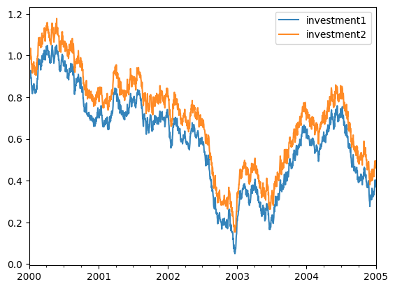
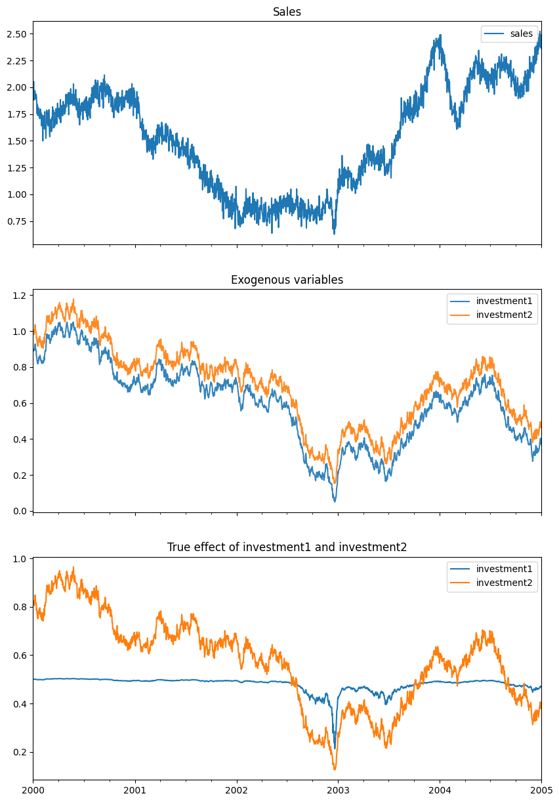
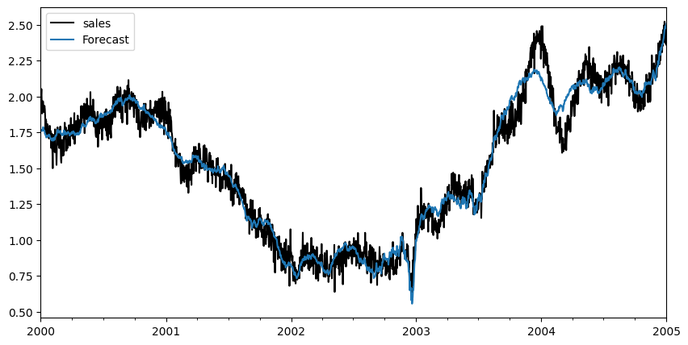
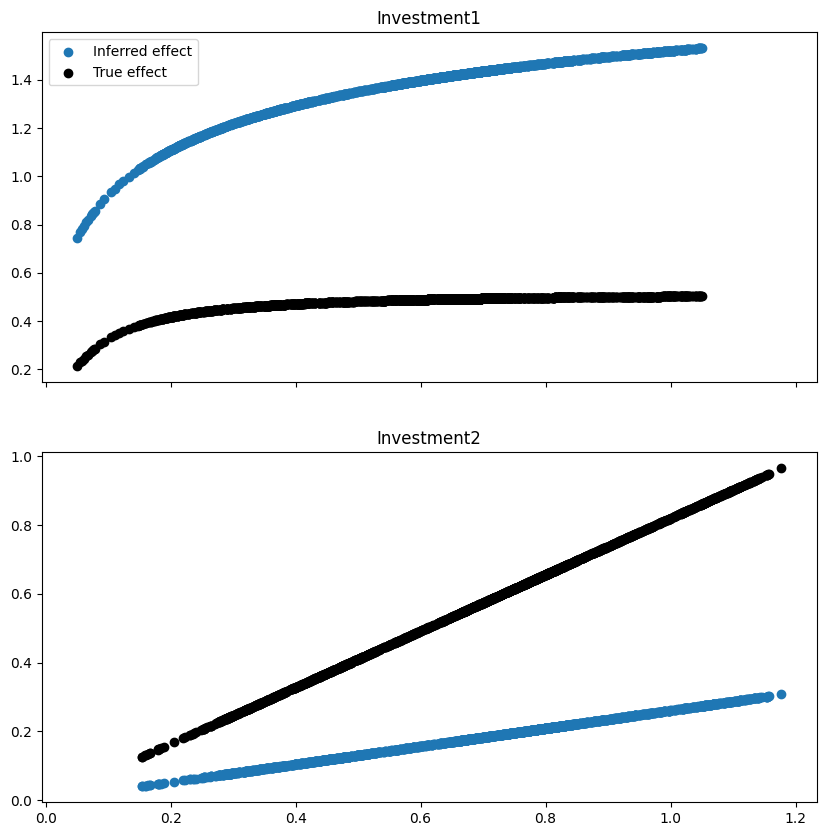
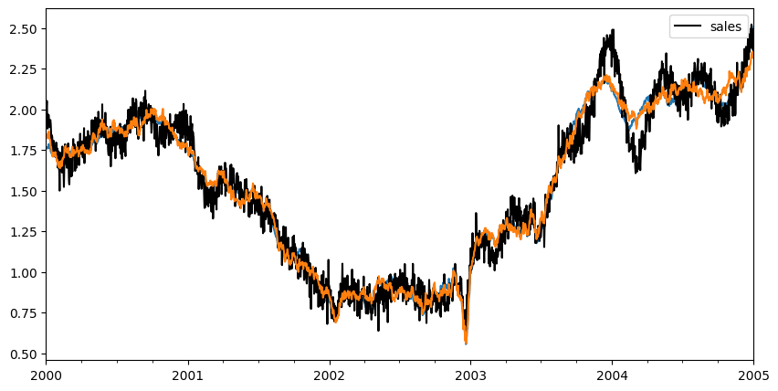
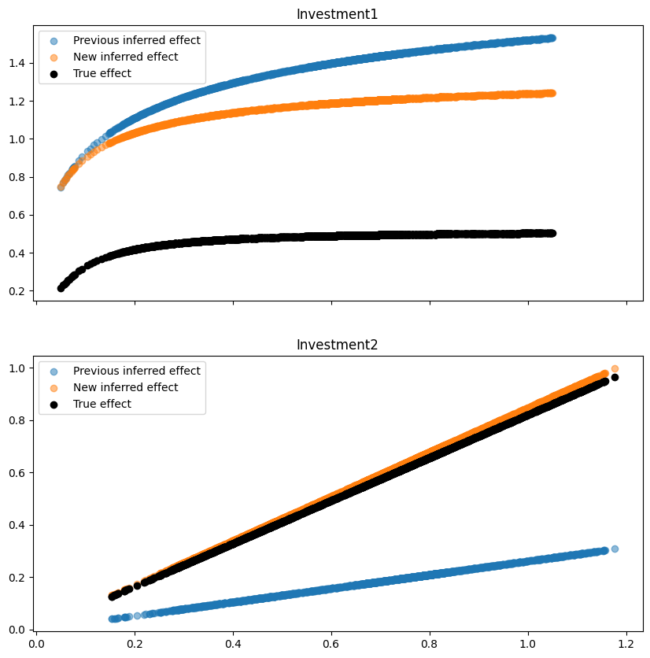

# Lift test
In this example, we will show how you can leverage lift tests executed in the past to improve the detection of the effect of an intervention.
This example is inspired by the one in [PyMC-Marketing documentation](https://www.pymc-marketing.io/en/stable/notebooks/mmm/mmm_lift_test.html).

## Get data from simulated dataset
In this exercise, we will load  a synthetic dataset
composed of a target timeseries (sales, for example) and
two exogenous variables (investment1 and investment2).
The two variables are highly correlated.

From this dataset, we also obtain the results of a lift test.


```python
import matplotlib.pyplot as plt

from prophetverse.datasets._mmm.lifttest import get_dataset

y, X, lift_test, true_effect, model = get_dataset()


```
<p class="cell-output-title jp-RenderedText jp-OutputArea-output">Output: <span class="cell-output-count">[1]</span></p>


    

    


```python

fig, ax = plt.subplots(figsize=(10, 15), nrows=3, sharex=True)
y.plot.line(ax=ax[0])
ax[0].set_title("Sales")
X.plot.line(alpha=0.9, ax=ax[1])
ax[1].set_title("Exogenous variables")
true_effect.plot.line(ax=ax[2])
ax[2].set_title("True effect of investment1 and investment2")
fig.show()


```
<p class="cell-output-title jp-RenderedText jp-OutputArea-output">Output: <span class="cell-output-count">[2]</span></p>


    

    


The lift test dataframe looks like below, with the information
of how a delta in the exogenous variable (investment1 and investment2)
affects the target variable (sales). Note that the lift test
is assigned to dates, since the effect of the intervention can
vary with time.


```python

lift_test1, lift_test2 = lift_test
lift_test1


```
<p class="cell-output-title jp-RenderedText jp-OutputArea-output">Output: <span class="cell-output-count">[3]</span></p>


<div>
<style scoped>
    .dataframe tbody tr th:only-of-type {
        vertical-align: middle;
    }

    .dataframe tbody tr th {
        vertical-align: top;
    }

    .dataframe thead th {
        text-align: right;
    }
</style>
<table border="1" class="dataframe">
  <thead>
    <tr style="text-align: right;">
      <th></th>
      <th>lift</th>
      <th>x_start</th>
      <th>x_end</th>
      <th>y_start</th>
      <th>y_end</th>
    </tr>
  </thead>
  <tbody>
    <tr>
      <th>2004-02-07</th>
      <td>0.143472</td>
      <td>0.577939</td>
      <td>0.112611</td>
      <td>0.487785</td>
      <td>0.344313</td>
    </tr>
    <tr>
      <th>2001-12-04</th>
      <td>0.014595</td>
      <td>0.691897</td>
      <td>0.467489</td>
      <td>0.493686</td>
      <td>0.479091</td>
    </tr>
    <tr>
      <th>2001-08-27</th>
      <td>0.078828</td>
      <td>0.696233</td>
      <td>0.195640</td>
      <td>0.493870</td>
      <td>0.415042</td>
    </tr>
    <tr>
      <th>2002-03-03</th>
      <td>0.013185</td>
      <td>0.635545</td>
      <td>0.455398</td>
      <td>0.491053</td>
      <td>0.477868</td>
    </tr>
    <tr>
      <th>2003-03-12</th>
      <td>0.193963</td>
      <td>0.306861</td>
      <td>0.066836</td>
      <td>0.454695</td>
      <td>0.260732</td>
    </tr>
    <tr>
      <th>2002-12-18</th>
      <td>0.092940</td>
      <td>0.057872</td>
      <td>0.031467</td>
      <td>0.236796</td>
      <td>0.143856</td>
    </tr>
    <tr>
      <th>2003-08-06</th>
      <td>0.030218</td>
      <td>0.324261</td>
      <td>0.223216</td>
      <td>0.458520</td>
      <td>0.428301</td>
    </tr>
    <tr>
      <th>2000-12-22</th>
      <td>0.046073</td>
      <td>0.698281</td>
      <td>0.280037</td>
      <td>0.493956</td>
      <td>0.447883</td>
    </tr>
    <tr>
      <th>2000-03-18</th>
      <td>0.003848</td>
      <td>0.994642</td>
      <td>0.830796</td>
      <td>0.502389</td>
      <td>0.498541</td>
    </tr>
    <tr>
      <th>2001-12-06</th>
      <td>0.184070</td>
      <td>0.700610</td>
      <td>0.090196</td>
      <td>0.494053</td>
      <td>0.309983</td>
    </tr>
  </tbody>
</table>
</div>


## Creating the model
We create the model to estimate the effect of the exogenous variables.
Since this is an exercise, we use the effects that are the ground truth.
However, we will see that even with a correct specification, the correlated
exogenous variables can lead to bad estimates.


```python
import numpyro.distributions as dist

from prophetverse.effects import (HillEffect, LinearEffect,
                                  LinearFourierSeasonality)
from prophetverse.effects.trend import PiecewiseLinearTrend
from prophetverse.engine import MAPInferenceEngine
from prophetverse.engine.optimizer import LBFGSSolver
from prophetverse.sktime import Prophetverse
from prophetverse.utils.regex import exact, no_input_columns

model = Prophetverse(
    trend=PiecewiseLinearTrend(
        changepoint_interval=100,
        changepoint_prior_scale=0.001,
        changepoint_range=-100,
    ),
    exogenous_effects=[
        (
            "seasonality",
            LinearFourierSeasonality(
                freq="D",
                sp_list=[365.25],
                fourier_terms_list=[3],
                prior_scale=0.1,
                effect_mode="multiplicative",
            ),
            no_input_columns,
        ),
        (
            "investment1",
            HillEffect(
                half_max_prior=dist.HalfNormal(0.2),
                slope_prior=dist.Gamma(2, 1),
                max_effect_prior=dist.HalfNormal(1.5),
                effect_mode="additive",
            ),
            exact("investment1"),
        ),
        (
            "investment2",
            LinearEffect(
                prior=dist.HalfNormal(0.5),
                effect_mode="additive",
            ),
            exact("investment2"),
        ),
    ],
    inference_engine=MAPInferenceEngine(
        num_steps=1000, optimizer=LBFGSSolver(memory_size=100, max_linesearch_steps=100)
    ),
)

model.fit(y=y, X=X)
components = model.predict_components(fh=X.index, X=X)


```
<p class="cell-output-title jp-RenderedText jp-OutputArea-output">Output: <span class="cell-output-count">[4]</span></p>


```python

fig, ax = plt.subplots(figsize=(10, 5))
y.plot.line(ax=ax, color="black", label="Sales")
components["obs"].to_frame("Forecast").plot.line(ax=ax)
fig.show()


```
<p class="cell-output-title jp-RenderedText jp-OutputArea-output">Output: <span class="cell-output-count">[5]</span></p>


    

    


```python

fig, axs = plt.subplots(figsize=(10, 10), nrows=2, sharex=True)

ax = axs[0]

ax.scatter(X["investment1"], 
           components["investment1"],
           label="Inferred effect")
ax.scatter(X["investment1"], 
           true_effect["investment1"],
            label="True effect", color="black")
ax.set_title("Investment1")
ax.legend()

ax = axs[1]
ax.scatter(X["investment2"], components["investment2"])
ax.scatter(X["investment2"], true_effect["investment2"], color="black")
ax.set_title("Investment2")

fig.show()


```
<p class="cell-output-title jp-RenderedText jp-OutputArea-output">Output: <span class="cell-output-count">[6]</span></p>


    

    


## Using lift test to improve the estimation
We will use the lift test to improve the estimation of the effect of the exogenous variables.
We wrap the original effects of `investment1` and `investment2` in a `LiftExperimentLikelihood` effect.
This effect will use the lift test data to add a new likelihood term to the model.

### Creating the effects


```python

from prophetverse.effects.lift_likelihood import LiftExperimentLikelihood

lift_experiment_effect1 = LiftExperimentLikelihood(
       effect=model.get_params()["investment1"],
        lift_test_results=lift_test1,
        prior_scale=1e-2,
        likelihood_scale=1,
)

lift_experiment_effect2 = LiftExperimentLikelihood(
    effect=model.get_params()["investment2"],
    lift_test_results=lift_test2,
    prior_scale=1e-2,
    likelihood_scale=1,
)


```

### Fitting the new model


```python
new_model = model.clone()
new_model.set_params(
    investment1=lift_experiment_effect1,
    investment2=lift_experiment_effect2,
)
new_model.fit(y=y, X=X)


```
<p class="cell-output-title jp-RenderedText jp-OutputArea-output">Output: <span class="cell-output-count">[8]</span></p>


<style>#sk-47fc8526-c5ae-404e-95da-8c993f5cf847 {
    /* Definition of color scheme common for light and dark mode */
    --sklearn-color-text: black;
    --sklearn-color-line: gray;
    /* Definition of color scheme for objects */
    --sklearn-color-level-0: #fff5e6;
    --sklearn-color-level-1: #f6e4d2;
    --sklearn-color-level-2: #ffe0b3;
    --sklearn-color-level-3: chocolate;

    /* Specific color for light theme */
    --sklearn-color-text-on-default-background: var(--theme-code-foreground, var(--jp-content-font-color1, black));
    --sklearn-color-background: var(--theme-background, var(--jp-layout-color0, white));
    --sklearn-color-border-box: var(--theme-code-foreground, var(--jp-content-font-color1, black));
    --sklearn-color-icon: #696969;

    @media (prefers-color-scheme: dark) {
      /* Redefinition of color scheme for dark theme */
      --sklearn-color-text-on-default-background: var(--theme-code-foreground, var(--jp-content-font-color1, white));
      --sklearn-color-background: var(--theme-background, var(--jp-layout-color0, #111));
      --sklearn-color-border-box: var(--theme-code-foreground, var(--jp-content-font-color1, white));
      --sklearn-color-icon: #878787;
    }
  }

  #sk-47fc8526-c5ae-404e-95da-8c993f5cf847 {
    color: var(--sklearn-color-text);
  }

  #sk-47fc8526-c5ae-404e-95da-8c993f5cf847 pre {
    padding: 0;
  }

  #sk-47fc8526-c5ae-404e-95da-8c993f5cf847 input.sk-hidden--visually {
    border: 0;
    clip: rect(1px 1px 1px 1px);
    clip: rect(1px, 1px, 1px, 1px);
    height: 1px;
    margin: -1px;
    overflow: hidden;
    padding: 0;
    position: absolute;
    width: 1px;
  }

  #sk-47fc8526-c5ae-404e-95da-8c993f5cf847 div.sk-dashed-wrapped {
    border: 1px dashed var(--sklearn-color-line);
    margin: 0 0.4em 0.5em 0.4em;
    box-sizing: border-box;
    padding-bottom: 0.4em;
    background-color: var(--sklearn-color-background);
  }

  #sk-47fc8526-c5ae-404e-95da-8c993f5cf847 div.sk-container {
    /* jupyter's `normalize.less` sets `[hidden] { display: none; }`
       but bootstrap.min.css set `[hidden] { display: none !important; }`
       so we also need the `!important` here to be able to override the
       default hidden behavior on the sphinx rendered scikit-learn.org.
       See: https://github.com/scikit-learn/scikit-learn/issues/21755 */
    display: inline-block !important;
    position: relative;
  }

  #sk-47fc8526-c5ae-404e-95da-8c993f5cf847 div.sk-text-repr-fallback {
    display: none;
  }

  div.sk-parallel-item,
  div.sk-serial,
  div.sk-item {
    /* draw centered vertical line to link estimators */
    background-image: linear-gradient(var(--sklearn-color-text-on-default-background), var(--sklearn-color-text-on-default-background));
    background-size: 2px 100%;
    background-repeat: no-repeat;
    background-position: center center;
  }

  /* Parallel-specific style estimator block */

  #sk-47fc8526-c5ae-404e-95da-8c993f5cf847 div.sk-parallel-item::after {
    content: "";
    width: 100%;
    border-bottom: 2px solid var(--sklearn-color-text-on-default-background);
    flex-grow: 1;
  }

  #sk-47fc8526-c5ae-404e-95da-8c993f5cf847 div.sk-parallel {
    display: flex;
    align-items: stretch;
    justify-content: center;
    background-color: var(--sklearn-color-background);
    position: relative;
  }

  #sk-47fc8526-c5ae-404e-95da-8c993f5cf847 div.sk-parallel-item {
    display: flex;
    flex-direction: column;
  }

  #sk-47fc8526-c5ae-404e-95da-8c993f5cf847 div.sk-parallel-item:first-child::after {
    align-self: flex-end;
    width: 50%;
  }

  #sk-47fc8526-c5ae-404e-95da-8c993f5cf847 div.sk-parallel-item:last-child::after {
    align-self: flex-start;
    width: 50%;
  }

  #sk-47fc8526-c5ae-404e-95da-8c993f5cf847 div.sk-parallel-item:only-child::after {
    width: 0;
  }

  /* Serial-specific style estimator block */

  #sk-47fc8526-c5ae-404e-95da-8c993f5cf847 div.sk-serial {
    display: flex;
    flex-direction: column;
    align-items: center;
    background-color: var(--sklearn-color-background);
    padding-right: 1em;
    padding-left: 1em;
  }


  /* Toggleable style: style used for estimator/Pipeline/ColumnTransformer box that is
  clickable and can be expanded/collapsed.
  - Pipeline and ColumnTransformer use this feature and define the default style
  - Estimators will overwrite some part of the style using the `sk-estimator` class
  */

  /* Pipeline and ColumnTransformer style (default) */

  #sk-47fc8526-c5ae-404e-95da-8c993f5cf847 div.sk-toggleable {
    /* Default theme specific background. It is overwritten whether we have a
    specific estimator or a Pipeline/ColumnTransformer */
    background-color: var(--sklearn-color-background);
  }

  /* Toggleable label */
  #sk-47fc8526-c5ae-404e-95da-8c993f5cf847 label.sk-toggleable__label {
    cursor: pointer;
    display: block;
    width: 100%;
    margin-bottom: 0;
    padding: 0.5em;
    box-sizing: border-box;
    text-align: center;
  }

  #sk-47fc8526-c5ae-404e-95da-8c993f5cf847 label.sk-toggleable__label-arrow:before {
    /* Arrow on the left of the label */
    content: "▸";
    float: left;
    margin-right: 0.25em;
    color: var(--sklearn-color-icon);
  }

  #sk-47fc8526-c5ae-404e-95da-8c993f5cf847 label.sk-toggleable__label-arrow:hover:before {
    color: var(--sklearn-color-text);
  }

  /* Toggleable content - dropdown */

  #sk-47fc8526-c5ae-404e-95da-8c993f5cf847 div.sk-toggleable__content {
    max-height: 0;
    max-width: 0;
    overflow: hidden;
    text-align: left;
    background-color: var(--sklearn-color-level-0);
  }

  #sk-47fc8526-c5ae-404e-95da-8c993f5cf847 div.sk-toggleable__content pre {
    margin: 0.2em;
    border-radius: 0.25em;
    color: var(--sklearn-color-text);
    background-color: var(--sklearn-color-level-0);
  }

  #sk-47fc8526-c5ae-404e-95da-8c993f5cf847 input.sk-toggleable__control:checked~div.sk-toggleable__content {
    /* Expand drop-down */
    max-height: 200px;
    max-width: 100%;
    overflow: auto;
  }

  #sk-47fc8526-c5ae-404e-95da-8c993f5cf847 input.sk-toggleable__control:checked~label.sk-toggleable__label-arrow:before {
    content: "▾";
  }

  /* Pipeline/ColumnTransformer-specific style */

  #sk-47fc8526-c5ae-404e-95da-8c993f5cf847 div.sk-label input.sk-toggleable__control:checked~label.sk-toggleable__label {
    color: var(--sklearn-color-text);
    background-color: var(--sklearn-color-level-2);
  }

  /* Estimator-specific style */

  /* Colorize estimator box */
  #sk-47fc8526-c5ae-404e-95da-8c993f5cf847 div.sk-estimator input.sk-toggleable__control:checked~label.sk-toggleable__label {
    /* unfitted */
    background-color: var(--sklearn-color-level-2);
  }

  #sk-47fc8526-c5ae-404e-95da-8c993f5cf847 div.sk-label label.sk-toggleable__label,
  #sk-47fc8526-c5ae-404e-95da-8c993f5cf847 div.sk-label label {
    /* The background is the default theme color */
    color: var(--sklearn-color-text-on-default-background);
  }

  /* On hover, darken the color of the background */
  #sk-47fc8526-c5ae-404e-95da-8c993f5cf847 div.sk-label:hover label.sk-toggleable__label {
    color: var(--sklearn-color-text);
    background-color: var(--sklearn-color-level-2);
  }

  /* Estimator label */

  #sk-47fc8526-c5ae-404e-95da-8c993f5cf847 div.sk-label label {
    font-family: monospace;
    font-weight: bold;
    display: inline-block;
    line-height: 1.2em;
  }

  #sk-47fc8526-c5ae-404e-95da-8c993f5cf847 div.sk-label-container {
    text-align: center;
  }

  /* Estimator-specific */
  #sk-47fc8526-c5ae-404e-95da-8c993f5cf847 div.sk-estimator {
    font-family: monospace;
    border: 1px dotted var(--sklearn-color-border-box);
    border-radius: 0.25em;
    box-sizing: border-box;
    margin-bottom: 0.5em;
    background-color: var(--sklearn-color-level-0);
  }

  /* on hover */
  #sk-47fc8526-c5ae-404e-95da-8c993f5cf847 div.sk-estimator:hover {
    background-color: var(--sklearn-color-level-2);
  }

  /* Specification for estimator info */

  .sk-estimator-doc-link,
  a:link.sk-estimator-doc-link,
  a:visited.sk-estimator-doc-link {
    float: right;
    font-size: smaller;
    line-height: 1em;
    font-family: monospace;
    background-color: var(--sklearn-color-background);
    border-radius: 1em;
    height: 1em;
    width: 1em;
    text-decoration: none !important;
    margin-left: 1ex;
    border: var(--sklearn-color-level-1) 1pt solid;
    color: var(--sklearn-color-level-1);
  }

  /* On hover */
  div.sk-estimator:hover .sk-estimator-doc-link:hover,
  .sk-estimator-doc-link:hover,
  div.sk-label-container:hover .sk-estimator-doc-link:hover,
  .sk-estimator-doc-link:hover {
    background-color: var(--sklearn-color-level-3);
    color: var(--sklearn-color-background);
    text-decoration: none;
  }

  /* Span, style for the box shown on hovering the info icon */
  .sk-estimator-doc-link span {
    display: none;
    z-index: 9999;
    position: relative;
    font-weight: normal;
    right: .2ex;
    padding: .5ex;
    margin: .5ex;
    width: min-content;
    min-width: 20ex;
    max-width: 50ex;
    color: var(--sklearn-color-text);
    box-shadow: 2pt 2pt 4pt #999;
    background: var(--sklearn-color-level-0);
    border: .5pt solid var(--sklearn-color-level-3);
  }

  .sk-estimator-doc-link:hover span {
    display: block;
  }

  /* "?"-specific style due to the `<a>` HTML tag */

  #sk-47fc8526-c5ae-404e-95da-8c993f5cf847 a.estimator_doc_link {
    float: right;
    font-size: 1rem;
    line-height: 1em;
    font-family: monospace;
    background-color: var(--sklearn-color-background);
    border-radius: 1rem;
    height: 1rem;
    width: 1rem;
    text-decoration: none;
    color: var(--sklearn-color-level-1);
    border: var(--sklearn-color-level-1) 1pt solid;
  }

  /* On hover */
  #sk-47fc8526-c5ae-404e-95da-8c993f5cf847 a.estimator_doc_link:hover {
    background-color: var(--sklearn-color-level-3);
    color: var(--sklearn-color-background);
    text-decoration: none;
  }
</style><div id='sk-47fc8526-c5ae-404e-95da-8c993f5cf847' class="sk-top-container"><div class="sk-text-repr-fallback"><pre>Prophetverse(exogenous_effects=[(&#x27;seasonality&#x27;,
                                 LinearFourierSeasonality(effect_mode=&#x27;multiplicative&#x27;,
                                                          fourier_terms_list=[3],
                                                          freq=&#x27;D&#x27;,
                                                          prior_scale=0.1,
                                                          sp_list=[365.25]),
                                 &#x27;^$&#x27;),
                                (&#x27;investment1&#x27;,
                                 LiftExperimentLikelihood(effect=HillEffect(effect_mode=&#x27;additive&#x27;,
                                                                            half_max_prior=&lt;numpyro.distributions.continuous.HalfNormal object at 0x33ef3df90&gt;,
                                                                            max_effect_prior...
2000-11-27  0.541452  0.784530  0.124246  0.643338  0.101885
2004-12-14  0.133384  0.402284  0.239626  0.329885  0.196500
2001-10-14  0.388873  0.771138  0.296920  0.632356  0.243483,
                                                          prior_scale=0.01),
                                 &#x27;^investment2$&#x27;)],
             inference_engine=MAPInferenceEngine(num_steps=1000,
                                                 optimizer=LBFGSSolver(max_linesearch_steps=100,
                                                                       memory_size=100)),
             trend=PiecewiseLinearTrend(changepoint_interval=100,
                                        changepoint_range=-100))</pre><b>Please rerun this cell to show the HTML repr or trust the notebook.</b></div><div class="sk-container" hidden><div class="sk-item sk-dashed-wrapped"><div class='sk-label-container'><div class="sk-label sk-toggleable"><input class="sk-toggleable__control sk-hidden--visually" id=UUID('ff41e207-9124-4d74-a131-7b8edb757d86') type="checkbox" ><label for=UUID('ff41e207-9124-4d74-a131-7b8edb757d86') class='sk-toggleable__label sk-toggleable__label-arrow'>Prophetverse</label><div class="sk-toggleable__content"><pre>Prophetverse(exogenous_effects=[(&#x27;seasonality&#x27;,
                                 LinearFourierSeasonality(effect_mode=&#x27;multiplicative&#x27;,
                                                          fourier_terms_list=[3],
                                                          freq=&#x27;D&#x27;,
                                                          prior_scale=0.1,
                                                          sp_list=[365.25]),
                                 &#x27;^$&#x27;),
                                (&#x27;investment1&#x27;,
                                 LiftExperimentLikelihood(effect=HillEffect(effect_mode=&#x27;additive&#x27;,
                                                                            half_max_prior=&lt;numpyro.distributions.continuous.HalfNormal object at 0x33ef3df90&gt;,
                                                                            max_effect_prior...
2000-11-27  0.541452  0.784530  0.124246  0.643338  0.101885
2004-12-14  0.133384  0.402284  0.239626  0.329885  0.196500
2001-10-14  0.388873  0.771138  0.296920  0.632356  0.243483,
                                                          prior_scale=0.01),
                                 &#x27;^investment2$&#x27;)],
             inference_engine=MAPInferenceEngine(num_steps=1000,
                                                 optimizer=LBFGSSolver(max_linesearch_steps=100,
                                                                       memory_size=100)),
             trend=PiecewiseLinearTrend(changepoint_interval=100,
                                        changepoint_range=-100))</pre></div></div></div><div class="sk-parallel"><div class="sk-parallel-item"><div class="sk-item"><div class='sk-label-container'><div class="sk-label sk-toggleable"><label>effects</label></div></div><div class="sk-serial"><div class="sk-item"><div class="sk-serial"><div class='sk-item'><div class="sk-estimator sk-toggleable"><input class="sk-toggleable__control sk-hidden--visually" id=UUID('7ef89b71-b46d-419c-816c-4f41c141b36c') type="checkbox" ><label for=UUID('7ef89b71-b46d-419c-816c-4f41c141b36c') class='sk-toggleable__label sk-toggleable__label-arrow'>PiecewiseLinearTrend</label><div class="sk-toggleable__content"><pre>PiecewiseLinearTrend(changepoint_interval=100, changepoint_range=-100)</pre></div></div></div><div class='sk-item'><div class="sk-estimator sk-toggleable"><input class="sk-toggleable__control sk-hidden--visually" id=UUID('141327a0-bf29-4966-97e8-08c4875a59ec') type="checkbox" ><label for=UUID('141327a0-bf29-4966-97e8-08c4875a59ec') class='sk-toggleable__label sk-toggleable__label-arrow'>LinearFourierSeasonality</label><div class="sk-toggleable__content"><pre>LinearFourierSeasonality(effect_mode=&#x27;multiplicative&#x27;, fourier_terms_list=[3],
                         freq=&#x27;D&#x27;, prior_scale=0.1, sp_list=[365.25])</pre></div></div></div><div class="sk-item sk-dashed-wrapped"><div class='sk-label-container'><div class="sk-label sk-toggleable"><input class="sk-toggleable__control sk-hidden--visually" id=UUID('f4336ada-ee90-4f19-915c-56b38c4dd739') type="checkbox" ><label for=UUID('f4336ada-ee90-4f19-915c-56b38c4dd739') class='sk-toggleable__label sk-toggleable__label-arrow'>investment1</label><div class="sk-toggleable__content"><pre>LiftExperimentLikelihood(effect=HillEffect(effect_mode=&#x27;additive&#x27;,
                                           half_max_prior=&lt;numpyro.distributions.continuous.HalfNormal object at 0x33ef3df90&gt;,
                                           max_effect_prior=&lt;numpyro.distributions.continuous.HalfNormal object at 0x33effe8d0&gt;,
                                           slope_prior=&lt;numpyro.distributions.continuous.Gamma object at 0x33daaf110&gt;),
                         lift_test_results=                lift   x_start     x_end   y_start     y_end
200...
2002-03-03  0.013185  0.635545  0.455398  0.491053  0.477868
2003-03-12  0.193963  0.306861  0.066836  0.454695  0.260732
2002-12-18  0.092940  0.057872  0.031467  0.236796  0.143856
2003-08-06  0.030218  0.324261  0.223216  0.458520  0.428301
2000-12-22  0.046073  0.698281  0.280037  0.493956  0.447883
2000-03-18  0.003848  0.994642  0.830796  0.502389  0.498541
2001-12-06  0.184070  0.700610  0.090196  0.494053  0.309983,
                         prior_scale=0.01)</pre></div></div></div><div class="sk-parallel"><div class="sk-parallel-item"><div class="sk-item"><div class='sk-label-container'><div class="sk-label sk-toggleable"><input class="sk-toggleable__control sk-hidden--visually" id=UUID('3b5c3785-9fd8-4c08-aecb-70ca597b2390') type="checkbox" ><label for=UUID('3b5c3785-9fd8-4c08-aecb-70ca597b2390') class='sk-toggleable__label sk-toggleable__label-arrow'>effect: HillEffect</label><div class="sk-toggleable__content"><pre>HillEffect(effect_mode=&#x27;additive&#x27;,
           half_max_prior=&lt;numpyro.distributions.continuous.HalfNormal object at 0x33ef3df90&gt;,
           max_effect_prior=&lt;numpyro.distributions.continuous.HalfNormal object at 0x33effe8d0&gt;,
           slope_prior=&lt;numpyro.distributions.continuous.Gamma object at 0x33daaf110&gt;)</pre></div></div></div><div class="sk-serial"><div class='sk-item'><div class="sk-estimator sk-toggleable"><input class="sk-toggleable__control sk-hidden--visually" id=UUID('cbcc8042-2d41-40a4-bbd1-d296046c350e') type="checkbox" ><label for=UUID('cbcc8042-2d41-40a4-bbd1-d296046c350e') class='sk-toggleable__label sk-toggleable__label-arrow'>HillEffect</label><div class="sk-toggleable__content"><pre>HillEffect(effect_mode=&#x27;additive&#x27;,
           half_max_prior=&lt;numpyro.distributions.continuous.HalfNormal object at 0x33ef3df90&gt;,
           max_effect_prior=&lt;numpyro.distributions.continuous.HalfNormal object at 0x33effe8d0&gt;,
           slope_prior=&lt;numpyro.distributions.continuous.Gamma object at 0x33daaf110&gt;)</pre></div></div></div></div></div></div></div></div><div class="sk-item sk-dashed-wrapped"><div class='sk-label-container'><div class="sk-label sk-toggleable"><input class="sk-toggleable__control sk-hidden--visually" id=UUID('f204b476-f943-44e9-b58a-94a0c2e08abf') type="checkbox" ><label for=UUID('f204b476-f943-44e9-b58a-94a0c2e08abf') class='sk-toggleable__label sk-toggleable__label-arrow'>investment2</label><div class="sk-toggleable__content"><pre>LiftExperimentLikelihood(effect=LinearEffect(effect_mode=&#x27;additive&#x27;,
                                             prior=&lt;numpyro.distributions.continuous.HalfNormal object at 0x340a633d0&gt;),
                         lift_test_results=                lift   x_start     x_end   y_start     y_end
2002-10-04  0.134176  0.308693  0.145069  0.253137  0.118960
2003-02-21  0.221322  0.428413  0.158518  0.351311  0.129989
2000-11-29  0.501160  0.779944  0.168795  0.639576  0.138417
2003-10-20  0.36...0.572480  0.129964  0.469450  0.106574
2003-04-09  0.087599  0.436640  0.329816  0.358057  0.270458
2001-09-22  0.497304  0.731445  0.124998  0.599806  0.102502
2004-03-07  0.343710  0.631788  0.212644  0.518085  0.174375
2000-11-27  0.541452  0.784530  0.124246  0.643338  0.101885
2004-12-14  0.133384  0.402284  0.239626  0.329885  0.196500
2001-10-14  0.388873  0.771138  0.296920  0.632356  0.243483,
                         prior_scale=0.01)</pre></div></div></div><div class="sk-parallel"><div class="sk-parallel-item"><div class="sk-item"><div class='sk-label-container'><div class="sk-label sk-toggleable"><input class="sk-toggleable__control sk-hidden--visually" id=UUID('54e1c2cd-7df7-4ee6-855c-2792f01fa4d5') type="checkbox" ><label for=UUID('54e1c2cd-7df7-4ee6-855c-2792f01fa4d5') class='sk-toggleable__label sk-toggleable__label-arrow'>effect: LinearEffect</label><div class="sk-toggleable__content"><pre>LinearEffect(effect_mode=&#x27;additive&#x27;,
             prior=&lt;numpyro.distributions.continuous.HalfNormal object at 0x340a633d0&gt;)</pre></div></div></div><div class="sk-serial"><div class='sk-item'><div class="sk-estimator sk-toggleable"><input class="sk-toggleable__control sk-hidden--visually" id=UUID('df9d94c7-d544-49bc-9c38-3de96e887cb3') type="checkbox" ><label for=UUID('df9d94c7-d544-49bc-9c38-3de96e887cb3') class='sk-toggleable__label sk-toggleable__label-arrow'>LinearEffect</label><div class="sk-toggleable__content"><pre>LinearEffect(effect_mode=&#x27;additive&#x27;,
             prior=&lt;numpyro.distributions.continuous.HalfNormal object at 0x340a633d0&gt;)</pre></div></div></div></div></div></div></div></div></div></div></div></div></div><div class="sk-parallel-item"><div class="sk-item"><div class='sk-label-container'><div class="sk-label sk-toggleable"><label>inference_engine</label></div></div><div class="sk-serial"><div class='sk-item'><div class="sk-estimator sk-toggleable"><input class="sk-toggleable__control sk-hidden--visually" id=UUID('cfccca9c-7112-4291-8b90-91d71735b1a2') type="checkbox" ><label for=UUID('cfccca9c-7112-4291-8b90-91d71735b1a2') class='sk-toggleable__label sk-toggleable__label-arrow'>MAPInferenceEngine</label><div class="sk-toggleable__content"><pre>MAPInferenceEngine(num_steps=1000,
                   optimizer=LBFGSSolver(max_linesearch_steps=100,
                                         memory_size=100))</pre></div></div></div></div></div></div></div></div></div></div>


```python
new_components = new_model.predict_components(fh=X.index, X=X)


```


```python

fig, ax = plt.subplots(figsize=(10, 5))
components["obs"].plot.line(ax=ax)
y.plot.line(ax=ax, color="black")
new_components["obs"].plot.line(ax=ax)


```
<p class="cell-output-title jp-RenderedText jp-OutputArea-output">Output: <span class="cell-output-count">[10]</span></p>


    <Axes: >


    

    


```python
fig, axs = plt.subplots(figsize=(10, 10), nrows=2, sharex=True)

ax = axs[0]

ax.scatter(X["investment1"], 
           components["investment1"],
           label="Previous inferred effect", alpha=0.5)
ax.scatter(X["investment1"], 
           new_components["investment1"],
           label="New inferred effect", alpha=0.5)
ax.scatter(X["investment1"], 
           true_effect["investment1"],
           label="True effect", color="black")
ax.set_title("Investment1")
ax.legend()

ax = axs[1]
ax.scatter(X["investment2"], 
           components["investment2"],
           label="Previous inferred effect", alpha=0.5)
ax.scatter(X["investment2"], 
           new_components["investment2"],
           label="New inferred effect", alpha=0.5)
ax.scatter(X["investment2"], 
           true_effect["investment2"],
           color="black", label="True effect")
ax.set_title("Investment2")
ax.legend()
fig.show()


```
<p class="cell-output-title jp-RenderedText jp-OutputArea-output">Output: <span class="cell-output-count">[11]</span></p>


    

    


## Conclusion

In this example, we showed how you can use lift tests to improve the estimation of the effect of exogenous variables.
The highlights are the following:

- We used a synthetic dataset with two exogenous variables that are highly correlated.
- We showed that even with a correct specification of the model, the correlated exogenous variables can lead to bad estimates.
- We then used the lift test to improve the estimation of the effect of the exogenous variables.
- We wrapped the original effects in a `LiftExperimentLikelihood` effect that uses the lift test data to add a new likelihood term to the model.


