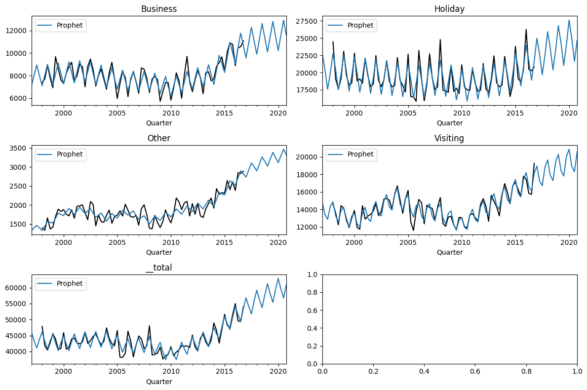
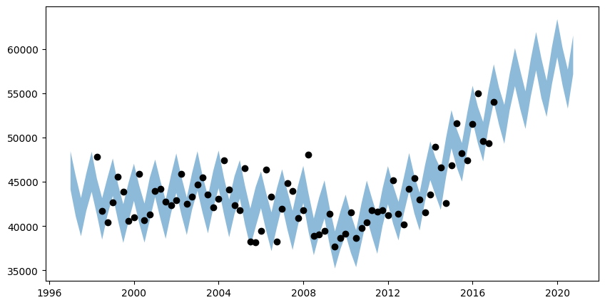
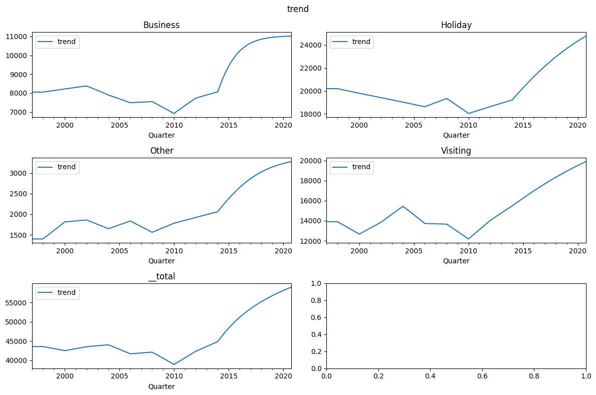

# Hierarchical timeseries
In this example, we will show how to forecast hierarchical timeseries
with the univariate `Prophetverse` and `HierarchicalProphet` models

The univariate `Prophetverse` model can seamlessly handle hierarchical timeseries
due to the package's compatibility with sktime. The `HierarchicalProphet` model
is specifically designed to handle hierarchical timeseries, by forecasting all
bottom-level series at once.

!!! note
    Currently, some features of the univariate Prophet are not available in the hierarchical
    version, such as likelihoods different from Gaussian. We are looking forward to
    adding these features in the future.


```python
import matplotlib.pyplot as plt
import numpy as np
import pandas as pd
from prophetverse.datasets.loaders import load_tourism


```

## Import dataset

Here we use the tourism dataset with purpose-level aggregation.


```python


y = load_tourism(groupby="Purpose")
display(y)


```
<p class="cell-output-title jp-RenderedText jp-OutputArea-output">Output: <span class="cell-output-count">[3]</span></p>


<div>
<style scoped>
    .dataframe tbody tr th:only-of-type {
        vertical-align: middle;
    }

    .dataframe tbody tr th {
        vertical-align: top;
    }

    .dataframe thead th {
        text-align: right;
    }
</style>
<table border="1" class="dataframe">
  <thead>
    <tr style="text-align: right;">
      <th></th>
      <th></th>
      <th>Trips</th>
    </tr>
    <tr>
      <th>Purpose</th>
      <th>Quarter</th>
      <th></th>
    </tr>
  </thead>
  <tbody>
    <tr>
      <th rowspan="5" valign="top">Business</th>
      <th>1998Q1</th>
      <td>7391.962068</td>
    </tr>
    <tr>
      <th>1998Q2</th>
      <td>7701.153191</td>
    </tr>
    <tr>
      <th>1998Q3</th>
      <td>8911.852065</td>
    </tr>
    <tr>
      <th>1998Q4</th>
      <td>7777.766525</td>
    </tr>
    <tr>
      <th>1999Q1</th>
      <td>6917.257864</td>
    </tr>
    <tr>
      <th>...</th>
      <th>...</th>
      <td>...</td>
    </tr>
    <tr>
      <th rowspan="5" valign="top">__total</th>
      <th>2015Q4</th>
      <td>51518.858354</td>
    </tr>
    <tr>
      <th>2016Q1</th>
      <td>54984.720748</td>
    </tr>
    <tr>
      <th>2016Q2</th>
      <td>49583.595515</td>
    </tr>
    <tr>
      <th>2016Q3</th>
      <td>49392.159616</td>
    </tr>
    <tr>
      <th>2016Q4</th>
      <td>54034.155613</td>
    </tr>
  </tbody>
</table>
<p>380 rows × 1 columns</p>
</div>


We define the helper function below to plot the predictions and the observations.


```python
LEVELS = y.index.get_level_values(0).unique()


def plot_preds(y=None, preds={}, axs=None):

    if axs is None:
        fig, axs = plt.subplots(
            figsize=(12, 8), nrows=int(np.ceil(len(LEVELS) / 2)), ncols=2
        )
    ax_generator = iter(axs.flatten())
    for level in LEVELS:
        ax = next(ax_generator)
        if y is not None:
            y.loc[level].iloc[:, 0].rename("Observation").plot(
                ax=ax, label="truth", color="black"
            )
        for name, _preds in preds.items():
            _preds.loc[level].iloc[:, 0].rename(name).plot(ax=ax, legend=True)
        ax.set_title(level)

    # Tight layout
    plt.tight_layout()
    return ax


```

## Fit univariate model

Because of sktime's amazing interface, we can use the univariate Prophet seamlessly with hierarchical data. We do not reconcile it here, but it could be achieved with the `Reconciler` class.


```python

import jax.numpy as jnp

from prophetverse.effects import LinearFourierSeasonality
from prophetverse.effects.trend import (PiecewiseLinearTrend,
                                        PiecewiseLogisticTrend)
from prophetverse.engine import MAPInferenceEngine
from prophetverse.sktime.univariate import Prophetverse
from prophetverse.utils import no_input_columns

model = Prophetverse(
    trend=PiecewiseLogisticTrend(
        changepoint_prior_scale=0.1,
        changepoint_interval=8,
        changepoint_range=-8,
    ),
    exogenous_effects=[
        (
            "seasonality",
            LinearFourierSeasonality(
                sp_list=["Y"],
                fourier_terms_list=[1],
                freq="Q",
                prior_scale=0.1,
                effect_mode="multiplicative",
            ),
            no_input_columns,
        )
    ],
    inference_engine=MAPInferenceEngine()
)
model.fit(y=y)


```
<p class="cell-output-title jp-RenderedText jp-OutputArea-output">Output: <span class="cell-output-count">[5]</span></p>


<style>#sk-da4ee437-f90d-45aa-a2f1-f411b2ce52b6 {
    /* Definition of color scheme common for light and dark mode */
    --sklearn-color-text: black;
    --sklearn-color-line: gray;
    /* Definition of color scheme for objects */
    --sklearn-color-level-0: #fff5e6;
    --sklearn-color-level-1: #f6e4d2;
    --sklearn-color-level-2: #ffe0b3;
    --sklearn-color-level-3: chocolate;

    /* Specific color for light theme */
    --sklearn-color-text-on-default-background: var(--theme-code-foreground, var(--jp-content-font-color1, black));
    --sklearn-color-background: var(--theme-background, var(--jp-layout-color0, white));
    --sklearn-color-border-box: var(--theme-code-foreground, var(--jp-content-font-color1, black));
    --sklearn-color-icon: #696969;

    @media (prefers-color-scheme: dark) {
      /* Redefinition of color scheme for dark theme */
      --sklearn-color-text-on-default-background: var(--theme-code-foreground, var(--jp-content-font-color1, white));
      --sklearn-color-background: var(--theme-background, var(--jp-layout-color0, #111));
      --sklearn-color-border-box: var(--theme-code-foreground, var(--jp-content-font-color1, white));
      --sklearn-color-icon: #878787;
    }
  }

  #sk-da4ee437-f90d-45aa-a2f1-f411b2ce52b6 {
    color: var(--sklearn-color-text);
  }

  #sk-da4ee437-f90d-45aa-a2f1-f411b2ce52b6 pre {
    padding: 0;
  }

  #sk-da4ee437-f90d-45aa-a2f1-f411b2ce52b6 input.sk-hidden--visually {
    border: 0;
    clip: rect(1px 1px 1px 1px);
    clip: rect(1px, 1px, 1px, 1px);
    height: 1px;
    margin: -1px;
    overflow: hidden;
    padding: 0;
    position: absolute;
    width: 1px;
  }

  #sk-da4ee437-f90d-45aa-a2f1-f411b2ce52b6 div.sk-dashed-wrapped {
    border: 1px dashed var(--sklearn-color-line);
    margin: 0 0.4em 0.5em 0.4em;
    box-sizing: border-box;
    padding-bottom: 0.4em;
    background-color: var(--sklearn-color-background);
  }

  #sk-da4ee437-f90d-45aa-a2f1-f411b2ce52b6 div.sk-container {
    /* jupyter's `normalize.less` sets `[hidden] { display: none; }`
       but bootstrap.min.css set `[hidden] { display: none !important; }`
       so we also need the `!important` here to be able to override the
       default hidden behavior on the sphinx rendered scikit-learn.org.
       See: https://github.com/scikit-learn/scikit-learn/issues/21755 */
    display: inline-block !important;
    position: relative;
  }

  #sk-da4ee437-f90d-45aa-a2f1-f411b2ce52b6 div.sk-text-repr-fallback {
    display: none;
  }

  div.sk-parallel-item,
  div.sk-serial,
  div.sk-item {
    /* draw centered vertical line to link estimators */
    background-image: linear-gradient(var(--sklearn-color-text-on-default-background), var(--sklearn-color-text-on-default-background));
    background-size: 2px 100%;
    background-repeat: no-repeat;
    background-position: center center;
  }

  /* Parallel-specific style estimator block */

  #sk-da4ee437-f90d-45aa-a2f1-f411b2ce52b6 div.sk-parallel-item::after {
    content: "";
    width: 100%;
    border-bottom: 2px solid var(--sklearn-color-text-on-default-background);
    flex-grow: 1;
  }

  #sk-da4ee437-f90d-45aa-a2f1-f411b2ce52b6 div.sk-parallel {
    display: flex;
    align-items: stretch;
    justify-content: center;
    background-color: var(--sklearn-color-background);
    position: relative;
  }

  #sk-da4ee437-f90d-45aa-a2f1-f411b2ce52b6 div.sk-parallel-item {
    display: flex;
    flex-direction: column;
  }

  #sk-da4ee437-f90d-45aa-a2f1-f411b2ce52b6 div.sk-parallel-item:first-child::after {
    align-self: flex-end;
    width: 50%;
  }

  #sk-da4ee437-f90d-45aa-a2f1-f411b2ce52b6 div.sk-parallel-item:last-child::after {
    align-self: flex-start;
    width: 50%;
  }

  #sk-da4ee437-f90d-45aa-a2f1-f411b2ce52b6 div.sk-parallel-item:only-child::after {
    width: 0;
  }

  /* Serial-specific style estimator block */

  #sk-da4ee437-f90d-45aa-a2f1-f411b2ce52b6 div.sk-serial {
    display: flex;
    flex-direction: column;
    align-items: center;
    background-color: var(--sklearn-color-background);
    padding-right: 1em;
    padding-left: 1em;
  }


  /* Toggleable style: style used for estimator/Pipeline/ColumnTransformer box that is
  clickable and can be expanded/collapsed.
  - Pipeline and ColumnTransformer use this feature and define the default style
  - Estimators will overwrite some part of the style using the `sk-estimator` class
  */

  /* Pipeline and ColumnTransformer style (default) */

  #sk-da4ee437-f90d-45aa-a2f1-f411b2ce52b6 div.sk-toggleable {
    /* Default theme specific background. It is overwritten whether we have a
    specific estimator or a Pipeline/ColumnTransformer */
    background-color: var(--sklearn-color-background);
  }

  /* Toggleable label */
  #sk-da4ee437-f90d-45aa-a2f1-f411b2ce52b6 label.sk-toggleable__label {
    cursor: pointer;
    display: block;
    width: 100%;
    margin-bottom: 0;
    padding: 0.5em;
    box-sizing: border-box;
    text-align: center;
  }

  #sk-da4ee437-f90d-45aa-a2f1-f411b2ce52b6 label.sk-toggleable__label-arrow:before {
    /* Arrow on the left of the label */
    content: "▸";
    float: left;
    margin-right: 0.25em;
    color: var(--sklearn-color-icon);
  }

  #sk-da4ee437-f90d-45aa-a2f1-f411b2ce52b6 label.sk-toggleable__label-arrow:hover:before {
    color: var(--sklearn-color-text);
  }

  /* Toggleable content - dropdown */

  #sk-da4ee437-f90d-45aa-a2f1-f411b2ce52b6 div.sk-toggleable__content {
    max-height: 0;
    max-width: 0;
    overflow: hidden;
    text-align: left;
    background-color: var(--sklearn-color-level-0);
  }

  #sk-da4ee437-f90d-45aa-a2f1-f411b2ce52b6 div.sk-toggleable__content pre {
    margin: 0.2em;
    border-radius: 0.25em;
    color: var(--sklearn-color-text);
    background-color: var(--sklearn-color-level-0);
  }

  #sk-da4ee437-f90d-45aa-a2f1-f411b2ce52b6 input.sk-toggleable__control:checked~div.sk-toggleable__content {
    /* Expand drop-down */
    max-height: 200px;
    max-width: 100%;
    overflow: auto;
  }

  #sk-da4ee437-f90d-45aa-a2f1-f411b2ce52b6 input.sk-toggleable__control:checked~label.sk-toggleable__label-arrow:before {
    content: "▾";
  }

  /* Pipeline/ColumnTransformer-specific style */

  #sk-da4ee437-f90d-45aa-a2f1-f411b2ce52b6 div.sk-label input.sk-toggleable__control:checked~label.sk-toggleable__label {
    color: var(--sklearn-color-text);
    background-color: var(--sklearn-color-level-2);
  }

  /* Estimator-specific style */

  /* Colorize estimator box */
  #sk-da4ee437-f90d-45aa-a2f1-f411b2ce52b6 div.sk-estimator input.sk-toggleable__control:checked~label.sk-toggleable__label {
    /* unfitted */
    background-color: var(--sklearn-color-level-2);
  }

  #sk-da4ee437-f90d-45aa-a2f1-f411b2ce52b6 div.sk-label label.sk-toggleable__label,
  #sk-da4ee437-f90d-45aa-a2f1-f411b2ce52b6 div.sk-label label {
    /* The background is the default theme color */
    color: var(--sklearn-color-text-on-default-background);
  }

  /* On hover, darken the color of the background */
  #sk-da4ee437-f90d-45aa-a2f1-f411b2ce52b6 div.sk-label:hover label.sk-toggleable__label {
    color: var(--sklearn-color-text);
    background-color: var(--sklearn-color-level-2);
  }

  /* Estimator label */

  #sk-da4ee437-f90d-45aa-a2f1-f411b2ce52b6 div.sk-label label {
    font-family: monospace;
    font-weight: bold;
    display: inline-block;
    line-height: 1.2em;
  }

  #sk-da4ee437-f90d-45aa-a2f1-f411b2ce52b6 div.sk-label-container {
    text-align: center;
  }

  /* Estimator-specific */
  #sk-da4ee437-f90d-45aa-a2f1-f411b2ce52b6 div.sk-estimator {
    font-family: monospace;
    border: 1px dotted var(--sklearn-color-border-box);
    border-radius: 0.25em;
    box-sizing: border-box;
    margin-bottom: 0.5em;
    background-color: var(--sklearn-color-level-0);
  }

  /* on hover */
  #sk-da4ee437-f90d-45aa-a2f1-f411b2ce52b6 div.sk-estimator:hover {
    background-color: var(--sklearn-color-level-2);
  }

  /* Specification for estimator info */

  .sk-estimator-doc-link,
  a:link.sk-estimator-doc-link,
  a:visited.sk-estimator-doc-link {
    float: right;
    font-size: smaller;
    line-height: 1em;
    font-family: monospace;
    background-color: var(--sklearn-color-background);
    border-radius: 1em;
    height: 1em;
    width: 1em;
    text-decoration: none !important;
    margin-left: 1ex;
    border: var(--sklearn-color-level-1) 1pt solid;
    color: var(--sklearn-color-level-1);
  }

  /* On hover */
  div.sk-estimator:hover .sk-estimator-doc-link:hover,
  .sk-estimator-doc-link:hover,
  div.sk-label-container:hover .sk-estimator-doc-link:hover,
  .sk-estimator-doc-link:hover {
    background-color: var(--sklearn-color-level-3);
    color: var(--sklearn-color-background);
    text-decoration: none;
  }

  /* Span, style for the box shown on hovering the info icon */
  .sk-estimator-doc-link span {
    display: none;
    z-index: 9999;
    position: relative;
    font-weight: normal;
    right: .2ex;
    padding: .5ex;
    margin: .5ex;
    width: min-content;
    min-width: 20ex;
    max-width: 50ex;
    color: var(--sklearn-color-text);
    box-shadow: 2pt 2pt 4pt #999;
    background: var(--sklearn-color-level-0);
    border: .5pt solid var(--sklearn-color-level-3);
  }

  .sk-estimator-doc-link:hover span {
    display: block;
  }

  /* "?"-specific style due to the `<a>` HTML tag */

  #sk-da4ee437-f90d-45aa-a2f1-f411b2ce52b6 a.estimator_doc_link {
    float: right;
    font-size: 1rem;
    line-height: 1em;
    font-family: monospace;
    background-color: var(--sklearn-color-background);
    border-radius: 1rem;
    height: 1rem;
    width: 1rem;
    text-decoration: none;
    color: var(--sklearn-color-level-1);
    border: var(--sklearn-color-level-1) 1pt solid;
  }

  /* On hover */
  #sk-da4ee437-f90d-45aa-a2f1-f411b2ce52b6 a.estimator_doc_link:hover {
    background-color: var(--sklearn-color-level-3);
    color: var(--sklearn-color-background);
    text-decoration: none;
  }
</style><div id='sk-da4ee437-f90d-45aa-a2f1-f411b2ce52b6' class="sk-top-container"><div class="sk-text-repr-fallback"><pre>Prophetverse(exogenous_effects=[(&#x27;seasonality&#x27;,
                                 LinearFourierSeasonality(effect_mode=&#x27;multiplicative&#x27;,
                                                          fourier_terms_list=[1],
                                                          freq=&#x27;Q&#x27;,
                                                          prior_scale=0.1,
                                                          sp_list=[&#x27;Y&#x27;]),
                                 &#x27;^$&#x27;)],
             inference_engine=MAPInferenceEngine(),
             trend=PiecewiseLogisticTrend(capacity_prior=&lt;numpyro.distributions.distribution.TransformedDistribution object at 0x30da22610&gt;,
                                          changepoint_interval=8,
                                          changepoint_prior_scale=0.1,
                                          changepoint_range=-8))</pre><b>Please rerun this cell to show the HTML repr or trust the notebook.</b></div><div class="sk-container" hidden><div class="sk-item sk-dashed-wrapped"><div class='sk-label-container'><div class="sk-label sk-toggleable"><input class="sk-toggleable__control sk-hidden--visually" id=UUID('b60971c9-032d-4d2a-a7e7-59fa2f0e02f9') type="checkbox" ><label for=UUID('b60971c9-032d-4d2a-a7e7-59fa2f0e02f9') class='sk-toggleable__label sk-toggleable__label-arrow'>Prophetverse</label><div class="sk-toggleable__content"><pre>Prophetverse(exogenous_effects=[(&#x27;seasonality&#x27;,
                                 LinearFourierSeasonality(effect_mode=&#x27;multiplicative&#x27;,
                                                          fourier_terms_list=[1],
                                                          freq=&#x27;Q&#x27;,
                                                          prior_scale=0.1,
                                                          sp_list=[&#x27;Y&#x27;]),
                                 &#x27;^$&#x27;)],
             inference_engine=MAPInferenceEngine(),
             trend=PiecewiseLogisticTrend(capacity_prior=&lt;numpyro.distributions.distribution.TransformedDistribution object at 0x30da22610&gt;,
                                          changepoint_interval=8,
                                          changepoint_prior_scale=0.1,
                                          changepoint_range=-8))</pre></div></div></div><div class="sk-parallel"><div class="sk-parallel-item"><div class="sk-item"><div class='sk-label-container'><div class="sk-label sk-toggleable"><label>effects</label></div></div><div class="sk-serial"><div class="sk-item"><div class="sk-serial"><div class='sk-item'><div class="sk-estimator sk-toggleable"><input class="sk-toggleable__control sk-hidden--visually" id=UUID('a4d00a70-b0e2-4c4b-89a2-c7e02afcb837') type="checkbox" ><label for=UUID('a4d00a70-b0e2-4c4b-89a2-c7e02afcb837') class='sk-toggleable__label sk-toggleable__label-arrow'>PiecewiseLogisticTrend</label><div class="sk-toggleable__content"><pre>PiecewiseLogisticTrend(capacity_prior=&lt;numpyro.distributions.distribution.TransformedDistribution object at 0x30da22610&gt;,
                       changepoint_interval=8, changepoint_prior_scale=0.1,
                       changepoint_range=-8)</pre></div></div></div><div class='sk-item'><div class="sk-estimator sk-toggleable"><input class="sk-toggleable__control sk-hidden--visually" id=UUID('111f2fb2-30be-4bd8-bcd7-de2eb0aea0f8') type="checkbox" ><label for=UUID('111f2fb2-30be-4bd8-bcd7-de2eb0aea0f8') class='sk-toggleable__label sk-toggleable__label-arrow'>LinearFourierSeasonality</label><div class="sk-toggleable__content"><pre>LinearFourierSeasonality(effect_mode=&#x27;multiplicative&#x27;, fourier_terms_list=[1],
                         freq=&#x27;Q&#x27;, prior_scale=0.1, sp_list=[&#x27;Y&#x27;])</pre></div></div></div></div></div></div></div></div><div class="sk-parallel-item"><div class="sk-item"><div class='sk-label-container'><div class="sk-label sk-toggleable"><label>inference_engine</label></div></div><div class="sk-serial"><div class='sk-item'><div class="sk-estimator sk-toggleable"><input class="sk-toggleable__control sk-hidden--visually" id=UUID('18a6dd41-9d34-4d0c-8335-9e509f395d29') type="checkbox" ><label for=UUID('18a6dd41-9d34-4d0c-8335-9e509f395d29') class='sk-toggleable__label sk-toggleable__label-arrow'>MAPInferenceEngine</label><div class="sk-toggleable__content"><pre>MAPInferenceEngine()</pre></div></div></div></div></div></div></div></div></div></div>


### Forecasting with automatic upcasting
To call the same methods we used in the univariate case, we do not need to change
a single line of code. The only difference is that the output will be a `pd.DataFrame`
with more rows and index levels.


```python
forecast_horizon = pd.period_range("1997Q1",
                                   "2020Q4",
                                   freq="Q")
preds = model.predict(fh=forecast_horizon)
display(preds.head())

# Plot
plot_preds(y, {"Prophet": preds})
plt.show()


```
<p class="cell-output-title jp-RenderedText jp-OutputArea-output">Output: <span class="cell-output-count">[6]</span></p>


<div>
<style scoped>
    .dataframe tbody tr th:only-of-type {
        vertical-align: middle;
    }

    .dataframe tbody tr th {
        vertical-align: top;
    }

    .dataframe thead th {
        text-align: right;
    }
</style>
<table border="1" class="dataframe">
  <thead>
    <tr style="text-align: right;">
      <th></th>
      <th></th>
      <th>Trips</th>
    </tr>
    <tr>
      <th>Purpose</th>
      <th>Quarter</th>
      <th></th>
    </tr>
  </thead>
  <tbody>
    <tr>
      <th rowspan="5" valign="top">Business</th>
      <th>1997Q1</th>
      <td>7088.927246</td>
    </tr>
    <tr>
      <th>1997Q2</th>
      <td>8022.363281</td>
    </tr>
    <tr>
      <th>1997Q3</th>
      <td>8938.646484</td>
    </tr>
    <tr>
      <th>1997Q4</th>
      <td>7996.816406</td>
    </tr>
    <tr>
      <th>1998Q1</th>
      <td>7088.927246</td>
    </tr>
  </tbody>
</table>
</div>


    

    


The same applies to the decomposition method:


```python
decomposition = model.predict_components(fh=forecast_horizon)
decomposition.head()

```
<p class="cell-output-title jp-RenderedText jp-OutputArea-output">Output: <span class="cell-output-count">[7]</span></p>


<div>
<style scoped>
    .dataframe tbody tr th:only-of-type {
        vertical-align: middle;
    }

    .dataframe tbody tr th {
        vertical-align: top;
    }

    .dataframe thead th {
        text-align: right;
    }
</style>
<table border="1" class="dataframe">
  <thead>
    <tr style="text-align: right;">
      <th></th>
      <th></th>
      <th>mean</th>
      <th>obs</th>
      <th>seasonality</th>
      <th>trend</th>
    </tr>
  </thead>
  <tbody>
    <tr>
      <th rowspan="5" valign="top">Business</th>
      <th>1997Q1</th>
      <td>7088.927246</td>
      <td>7064.568848</td>
      <td>-924.645020</td>
      <td>8013.568848</td>
    </tr>
    <tr>
      <th>1997Q2</th>
      <td>8022.363281</td>
      <td>8026.772461</td>
      <td>8.793287</td>
      <td>8013.568848</td>
    </tr>
    <tr>
      <th>1997Q3</th>
      <td>8938.646484</td>
      <td>8962.035156</td>
      <td>925.078003</td>
      <td>8013.568848</td>
    </tr>
    <tr>
      <th>1997Q4</th>
      <td>7996.816406</td>
      <td>8037.610352</td>
      <td>-16.754856</td>
      <td>8013.568848</td>
    </tr>
    <tr>
      <th>1998Q1</th>
      <td>7088.927246</td>
      <td>7082.163086</td>
      <td>-924.645020</td>
      <td>8013.568848</td>
    </tr>
  </tbody>
</table>
</div>


## Hierarchical Prophet

Now, let's use the hierarchical prophet to forecast all of the series at once.
The interface here is the same as the univariate case. The fit step can
take a little longer since there are more parameters to estimate.


```python

from prophetverse.logger import logger

# Set debug level everywhere
logger.setLevel("DEBUG")
logger = logger.getChild("lbfgs")
logger.setLevel("DEBUG")
import numpyro

from prophetverse.sktime.multivariate import HierarchicalProphet

numpyro.enable_x64()
model_hier = HierarchicalProphet(
    trend=PiecewiseLogisticTrend(
        changepoint_prior_scale=0.1,
        changepoint_interval=8,
        changepoint_range=-8,
    ),
    exogenous_effects=[
        (
            "seasonality",
            LinearFourierSeasonality(
                sp_list=["Y"],
                fourier_terms_list=[1],
                freq="Q",
                prior_scale=0.1,
                effect_mode="multiplicative",
            ),
            no_input_columns,
        )
    ],
    inference_engine=MAPInferenceEngine(),
)


model_hier.fit(y=y)


```
<p class="cell-output-title jp-RenderedText jp-OutputArea-output">Output: <span class="cell-output-count">[8]</span></p>


<style>#sk-a726d210-484e-4f6a-ae74-06f3fb902d5a {
    /* Definition of color scheme common for light and dark mode */
    --sklearn-color-text: black;
    --sklearn-color-line: gray;
    /* Definition of color scheme for objects */
    --sklearn-color-level-0: #fff5e6;
    --sklearn-color-level-1: #f6e4d2;
    --sklearn-color-level-2: #ffe0b3;
    --sklearn-color-level-3: chocolate;

    /* Specific color for light theme */
    --sklearn-color-text-on-default-background: var(--theme-code-foreground, var(--jp-content-font-color1, black));
    --sklearn-color-background: var(--theme-background, var(--jp-layout-color0, white));
    --sklearn-color-border-box: var(--theme-code-foreground, var(--jp-content-font-color1, black));
    --sklearn-color-icon: #696969;

    @media (prefers-color-scheme: dark) {
      /* Redefinition of color scheme for dark theme */
      --sklearn-color-text-on-default-background: var(--theme-code-foreground, var(--jp-content-font-color1, white));
      --sklearn-color-background: var(--theme-background, var(--jp-layout-color0, #111));
      --sklearn-color-border-box: var(--theme-code-foreground, var(--jp-content-font-color1, white));
      --sklearn-color-icon: #878787;
    }
  }

  #sk-a726d210-484e-4f6a-ae74-06f3fb902d5a {
    color: var(--sklearn-color-text);
  }

  #sk-a726d210-484e-4f6a-ae74-06f3fb902d5a pre {
    padding: 0;
  }

  #sk-a726d210-484e-4f6a-ae74-06f3fb902d5a input.sk-hidden--visually {
    border: 0;
    clip: rect(1px 1px 1px 1px);
    clip: rect(1px, 1px, 1px, 1px);
    height: 1px;
    margin: -1px;
    overflow: hidden;
    padding: 0;
    position: absolute;
    width: 1px;
  }

  #sk-a726d210-484e-4f6a-ae74-06f3fb902d5a div.sk-dashed-wrapped {
    border: 1px dashed var(--sklearn-color-line);
    margin: 0 0.4em 0.5em 0.4em;
    box-sizing: border-box;
    padding-bottom: 0.4em;
    background-color: var(--sklearn-color-background);
  }

  #sk-a726d210-484e-4f6a-ae74-06f3fb902d5a div.sk-container {
    /* jupyter's `normalize.less` sets `[hidden] { display: none; }`
       but bootstrap.min.css set `[hidden] { display: none !important; }`
       so we also need the `!important` here to be able to override the
       default hidden behavior on the sphinx rendered scikit-learn.org.
       See: https://github.com/scikit-learn/scikit-learn/issues/21755 */
    display: inline-block !important;
    position: relative;
  }

  #sk-a726d210-484e-4f6a-ae74-06f3fb902d5a div.sk-text-repr-fallback {
    display: none;
  }

  div.sk-parallel-item,
  div.sk-serial,
  div.sk-item {
    /* draw centered vertical line to link estimators */
    background-image: linear-gradient(var(--sklearn-color-text-on-default-background), var(--sklearn-color-text-on-default-background));
    background-size: 2px 100%;
    background-repeat: no-repeat;
    background-position: center center;
  }

  /* Parallel-specific style estimator block */

  #sk-a726d210-484e-4f6a-ae74-06f3fb902d5a div.sk-parallel-item::after {
    content: "";
    width: 100%;
    border-bottom: 2px solid var(--sklearn-color-text-on-default-background);
    flex-grow: 1;
  }

  #sk-a726d210-484e-4f6a-ae74-06f3fb902d5a div.sk-parallel {
    display: flex;
    align-items: stretch;
    justify-content: center;
    background-color: var(--sklearn-color-background);
    position: relative;
  }

  #sk-a726d210-484e-4f6a-ae74-06f3fb902d5a div.sk-parallel-item {
    display: flex;
    flex-direction: column;
  }

  #sk-a726d210-484e-4f6a-ae74-06f3fb902d5a div.sk-parallel-item:first-child::after {
    align-self: flex-end;
    width: 50%;
  }

  #sk-a726d210-484e-4f6a-ae74-06f3fb902d5a div.sk-parallel-item:last-child::after {
    align-self: flex-start;
    width: 50%;
  }

  #sk-a726d210-484e-4f6a-ae74-06f3fb902d5a div.sk-parallel-item:only-child::after {
    width: 0;
  }

  /* Serial-specific style estimator block */

  #sk-a726d210-484e-4f6a-ae74-06f3fb902d5a div.sk-serial {
    display: flex;
    flex-direction: column;
    align-items: center;
    background-color: var(--sklearn-color-background);
    padding-right: 1em;
    padding-left: 1em;
  }


  /* Toggleable style: style used for estimator/Pipeline/ColumnTransformer box that is
  clickable and can be expanded/collapsed.
  - Pipeline and ColumnTransformer use this feature and define the default style
  - Estimators will overwrite some part of the style using the `sk-estimator` class
  */

  /* Pipeline and ColumnTransformer style (default) */

  #sk-a726d210-484e-4f6a-ae74-06f3fb902d5a div.sk-toggleable {
    /* Default theme specific background. It is overwritten whether we have a
    specific estimator or a Pipeline/ColumnTransformer */
    background-color: var(--sklearn-color-background);
  }

  /* Toggleable label */
  #sk-a726d210-484e-4f6a-ae74-06f3fb902d5a label.sk-toggleable__label {
    cursor: pointer;
    display: block;
    width: 100%;
    margin-bottom: 0;
    padding: 0.5em;
    box-sizing: border-box;
    text-align: center;
  }

  #sk-a726d210-484e-4f6a-ae74-06f3fb902d5a label.sk-toggleable__label-arrow:before {
    /* Arrow on the left of the label */
    content: "▸";
    float: left;
    margin-right: 0.25em;
    color: var(--sklearn-color-icon);
  }

  #sk-a726d210-484e-4f6a-ae74-06f3fb902d5a label.sk-toggleable__label-arrow:hover:before {
    color: var(--sklearn-color-text);
  }

  /* Toggleable content - dropdown */

  #sk-a726d210-484e-4f6a-ae74-06f3fb902d5a div.sk-toggleable__content {
    max-height: 0;
    max-width: 0;
    overflow: hidden;
    text-align: left;
    background-color: var(--sklearn-color-level-0);
  }

  #sk-a726d210-484e-4f6a-ae74-06f3fb902d5a div.sk-toggleable__content pre {
    margin: 0.2em;
    border-radius: 0.25em;
    color: var(--sklearn-color-text);
    background-color: var(--sklearn-color-level-0);
  }

  #sk-a726d210-484e-4f6a-ae74-06f3fb902d5a input.sk-toggleable__control:checked~div.sk-toggleable__content {
    /* Expand drop-down */
    max-height: 200px;
    max-width: 100%;
    overflow: auto;
  }

  #sk-a726d210-484e-4f6a-ae74-06f3fb902d5a input.sk-toggleable__control:checked~label.sk-toggleable__label-arrow:before {
    content: "▾";
  }

  /* Pipeline/ColumnTransformer-specific style */

  #sk-a726d210-484e-4f6a-ae74-06f3fb902d5a div.sk-label input.sk-toggleable__control:checked~label.sk-toggleable__label {
    color: var(--sklearn-color-text);
    background-color: var(--sklearn-color-level-2);
  }

  /* Estimator-specific style */

  /* Colorize estimator box */
  #sk-a726d210-484e-4f6a-ae74-06f3fb902d5a div.sk-estimator input.sk-toggleable__control:checked~label.sk-toggleable__label {
    /* unfitted */
    background-color: var(--sklearn-color-level-2);
  }

  #sk-a726d210-484e-4f6a-ae74-06f3fb902d5a div.sk-label label.sk-toggleable__label,
  #sk-a726d210-484e-4f6a-ae74-06f3fb902d5a div.sk-label label {
    /* The background is the default theme color */
    color: var(--sklearn-color-text-on-default-background);
  }

  /* On hover, darken the color of the background */
  #sk-a726d210-484e-4f6a-ae74-06f3fb902d5a div.sk-label:hover label.sk-toggleable__label {
    color: var(--sklearn-color-text);
    background-color: var(--sklearn-color-level-2);
  }

  /* Estimator label */

  #sk-a726d210-484e-4f6a-ae74-06f3fb902d5a div.sk-label label {
    font-family: monospace;
    font-weight: bold;
    display: inline-block;
    line-height: 1.2em;
  }

  #sk-a726d210-484e-4f6a-ae74-06f3fb902d5a div.sk-label-container {
    text-align: center;
  }

  /* Estimator-specific */
  #sk-a726d210-484e-4f6a-ae74-06f3fb902d5a div.sk-estimator {
    font-family: monospace;
    border: 1px dotted var(--sklearn-color-border-box);
    border-radius: 0.25em;
    box-sizing: border-box;
    margin-bottom: 0.5em;
    background-color: var(--sklearn-color-level-0);
  }

  /* on hover */
  #sk-a726d210-484e-4f6a-ae74-06f3fb902d5a div.sk-estimator:hover {
    background-color: var(--sklearn-color-level-2);
  }

  /* Specification for estimator info */

  .sk-estimator-doc-link,
  a:link.sk-estimator-doc-link,
  a:visited.sk-estimator-doc-link {
    float: right;
    font-size: smaller;
    line-height: 1em;
    font-family: monospace;
    background-color: var(--sklearn-color-background);
    border-radius: 1em;
    height: 1em;
    width: 1em;
    text-decoration: none !important;
    margin-left: 1ex;
    border: var(--sklearn-color-level-1) 1pt solid;
    color: var(--sklearn-color-level-1);
  }

  /* On hover */
  div.sk-estimator:hover .sk-estimator-doc-link:hover,
  .sk-estimator-doc-link:hover,
  div.sk-label-container:hover .sk-estimator-doc-link:hover,
  .sk-estimator-doc-link:hover {
    background-color: var(--sklearn-color-level-3);
    color: var(--sklearn-color-background);
    text-decoration: none;
  }

  /* Span, style for the box shown on hovering the info icon */
  .sk-estimator-doc-link span {
    display: none;
    z-index: 9999;
    position: relative;
    font-weight: normal;
    right: .2ex;
    padding: .5ex;
    margin: .5ex;
    width: min-content;
    min-width: 20ex;
    max-width: 50ex;
    color: var(--sklearn-color-text);
    box-shadow: 2pt 2pt 4pt #999;
    background: var(--sklearn-color-level-0);
    border: .5pt solid var(--sklearn-color-level-3);
  }

  .sk-estimator-doc-link:hover span {
    display: block;
  }

  /* "?"-specific style due to the `<a>` HTML tag */

  #sk-a726d210-484e-4f6a-ae74-06f3fb902d5a a.estimator_doc_link {
    float: right;
    font-size: 1rem;
    line-height: 1em;
    font-family: monospace;
    background-color: var(--sklearn-color-background);
    border-radius: 1rem;
    height: 1rem;
    width: 1rem;
    text-decoration: none;
    color: var(--sklearn-color-level-1);
    border: var(--sklearn-color-level-1) 1pt solid;
  }

  /* On hover */
  #sk-a726d210-484e-4f6a-ae74-06f3fb902d5a a.estimator_doc_link:hover {
    background-color: var(--sklearn-color-level-3);
    color: var(--sklearn-color-background);
    text-decoration: none;
  }
</style><div id='sk-a726d210-484e-4f6a-ae74-06f3fb902d5a' class="sk-top-container"><div class="sk-text-repr-fallback"><pre>HierarchicalProphet(exogenous_effects=[(&#x27;seasonality&#x27;,
                                        LinearFourierSeasonality(effect_mode=&#x27;multiplicative&#x27;,
                                                                 fourier_terms_list=[1],
                                                                 freq=&#x27;Q&#x27;,
                                                                 prior_scale=0.1,
                                                                 sp_list=[&#x27;Y&#x27;]),
                                        &#x27;^$&#x27;)],
                    inference_engine=MAPInferenceEngine(),
                    trend=PiecewiseLogisticTrend(capacity_prior=&lt;numpyro.distributions.distribution.TransformedDistribution object at 0x334d99d90&gt;,
                                                 changepoint_interval=8,
                                                 changepoint_prior_scale=0.1,
                                                 changepoint_range=-8))</pre><b>Please rerun this cell to show the HTML repr or trust the notebook.</b></div><div class="sk-container" hidden><div class="sk-item sk-dashed-wrapped"><div class='sk-label-container'><div class="sk-label sk-toggleable"><input class="sk-toggleable__control sk-hidden--visually" id=UUID('7eb9c1f8-bc8d-46d8-9d34-a3500c2adb1f') type="checkbox" ><label for=UUID('7eb9c1f8-bc8d-46d8-9d34-a3500c2adb1f') class='sk-toggleable__label sk-toggleable__label-arrow'>HierarchicalProphet</label><div class="sk-toggleable__content"><pre>HierarchicalProphet(exogenous_effects=[(&#x27;seasonality&#x27;,
                                        LinearFourierSeasonality(effect_mode=&#x27;multiplicative&#x27;,
                                                                 fourier_terms_list=[1],
                                                                 freq=&#x27;Q&#x27;,
                                                                 prior_scale=0.1,
                                                                 sp_list=[&#x27;Y&#x27;]),
                                        &#x27;^$&#x27;)],
                    inference_engine=MAPInferenceEngine(),
                    trend=PiecewiseLogisticTrend(capacity_prior=&lt;numpyro.distributions.distribution.TransformedDistribution object at 0x334d99d90&gt;,
                                                 changepoint_interval=8,
                                                 changepoint_prior_scale=0.1,
                                                 changepoint_range=-8))</pre></div></div></div><div class="sk-parallel"><div class="sk-parallel-item"><div class="sk-item"><div class='sk-label-container'><div class="sk-label sk-toggleable"><label>effects</label></div></div><div class="sk-serial"><div class="sk-item"><div class="sk-serial"><div class='sk-item'><div class="sk-estimator sk-toggleable"><input class="sk-toggleable__control sk-hidden--visually" id=UUID('e7ad8928-65c3-4d1b-b274-ae78fcd9a50b') type="checkbox" ><label for=UUID('e7ad8928-65c3-4d1b-b274-ae78fcd9a50b') class='sk-toggleable__label sk-toggleable__label-arrow'>PiecewiseLogisticTrend</label><div class="sk-toggleable__content"><pre>PiecewiseLogisticTrend(capacity_prior=&lt;numpyro.distributions.distribution.TransformedDistribution object at 0x334d99d90&gt;,
                       changepoint_interval=8, changepoint_prior_scale=0.1,
                       changepoint_range=-8)</pre></div></div></div><div class='sk-item'><div class="sk-estimator sk-toggleable"><input class="sk-toggleable__control sk-hidden--visually" id=UUID('e0a08061-131b-4e1b-b014-80551cbfebf0') type="checkbox" ><label for=UUID('e0a08061-131b-4e1b-b014-80551cbfebf0') class='sk-toggleable__label sk-toggleable__label-arrow'>LinearFourierSeasonality</label><div class="sk-toggleable__content"><pre>LinearFourierSeasonality(effect_mode=&#x27;multiplicative&#x27;, fourier_terms_list=[1],
                         freq=&#x27;Q&#x27;, prior_scale=0.1, sp_list=[&#x27;Y&#x27;])</pre></div></div></div></div></div></div></div></div><div class="sk-parallel-item"><div class="sk-item"><div class='sk-label-container'><div class="sk-label sk-toggleable"><label>inference_engine</label></div></div><div class="sk-serial"><div class='sk-item'><div class="sk-estimator sk-toggleable"><input class="sk-toggleable__control sk-hidden--visually" id=UUID('3edd3fe8-2ef5-403f-9487-3b551e04e951') type="checkbox" ><label for=UUID('3edd3fe8-2ef5-403f-9487-3b551e04e951') class='sk-toggleable__label sk-toggleable__label-arrow'>MAPInferenceEngine</label><div class="sk-toggleable__content"><pre>MAPInferenceEngine()</pre></div></div></div></div></div></div></div></div></div></div>


### Forecasting with hierarchical prophet


```python
preds_hier = model_hier.predict(fh=forecast_horizon)

plot_preds(
    y,
    preds={
        "Prophet": preds,
        "HierarchicalProphet": preds_hier,
    },
)


```
<p class="cell-output-title jp-RenderedText jp-OutputArea-output">Output: <span class="cell-output-count">[9]</span></p>


    <Axes: title={'center': '__total'}, xlabel='Quarter'>


    

    


An important difference between the probabilistic features of the
univariate and hierarchical models is that the latter returns quantiles which
consider the correlation between the series. The samples used to compute such quantiles
come from reconciled predictive distributions.


```python
quantiles = model_hier.predict_quantiles(fh=forecast_horizon,
                                         alpha=[0.05, 0.95])
quantiles


```
<p class="cell-output-title jp-RenderedText jp-OutputArea-output">Output: <span class="cell-output-count">[10]</span></p>


<div>
<style scoped>
    .dataframe tbody tr th:only-of-type {
        vertical-align: middle;
    }

    .dataframe tbody tr th {
        vertical-align: top;
    }

    .dataframe thead tr th {
        text-align: left;
    }

    .dataframe thead tr:last-of-type th {
        text-align: right;
    }
</style>
<table border="1" class="dataframe">
  <thead>
    <tr>
      <th></th>
      <th></th>
      <th colspan="2" halign="left">Trips</th>
    </tr>
    <tr>
      <th></th>
      <th></th>
      <th>0.05</th>
      <th>0.95</th>
    </tr>
    <tr>
      <th>Purpose</th>
      <th>Quarter</th>
      <th></th>
      <th></th>
    </tr>
  </thead>
  <tbody>
    <tr>
      <th rowspan="5" valign="top">Business</th>
      <th>1997Q1</th>
      <td>6356.470014</td>
      <td>7866.451994</td>
    </tr>
    <tr>
      <th>1997Q2</th>
      <td>7239.120895</td>
      <td>8770.470782</td>
    </tr>
    <tr>
      <th>1997Q3</th>
      <td>8177.990092</td>
      <td>9719.187510</td>
    </tr>
    <tr>
      <th>1997Q4</th>
      <td>7254.335710</td>
      <td>8769.556728</td>
    </tr>
    <tr>
      <th>1998Q1</th>
      <td>6384.364465</td>
      <td>7884.313301</td>
    </tr>
    <tr>
      <th>...</th>
      <th>...</th>
      <td>...</td>
      <td>...</td>
    </tr>
    <tr>
      <th rowspan="5" valign="top">__total</th>
      <th>2019Q4</th>
      <td>56940.242455</td>
      <td>61151.978082</td>
    </tr>
    <tr>
      <th>2020Q1</th>
      <td>60014.752832</td>
      <td>64352.230476</td>
    </tr>
    <tr>
      <th>2020Q2</th>
      <td>56945.968028</td>
      <td>61180.897949</td>
    </tr>
    <tr>
      <th>2020Q3</th>
      <td>54363.619223</td>
      <td>58791.025500</td>
    </tr>
    <tr>
      <th>2020Q4</th>
      <td>58289.842235</td>
      <td>62655.668853</td>
    </tr>
  </tbody>
</table>
<p>480 rows × 2 columns</p>
</div>


```python
fig, ax = plt.subplots(figsize=(10, 5))

selected_series = "__total"
series = quantiles.loc[selected_series]
ax.fill_between(
    series.index.to_timestamp(),
    series.iloc[:, 0],
    series.iloc[:, -1],
    alpha=0.5,
)
ax.scatter(y.loc[selected_series].index, y.loc[selected_series], marker="o", color="k", alpha=1)
fig.show()


```
<p class="cell-output-title jp-RenderedText jp-OutputArea-output">Output: <span class="cell-output-count">[11]</span></p>


    

    


### Decomposition with hierarchical prophet
We can also extract the components of the time series with the `predict_components`


```python
from sktime.transformations.hierarchical.aggregate import Aggregator

sites = model_hier.predict_components(fh=forecast_horizon)
sites = Aggregator(flatten_single_levels=True).fit_transform(sites)

for column in sites.columns.difference(["obs"]):
    fig, axs = plt.subplots(
        figsize=(12, 8), nrows=int(np.ceil(len(LEVELS) / 2)), ncols=2
    )
    plot_preds(preds={column: sites[[column]]}, axs=axs)
    # Set figure title
    fig.suptitle(column)
    fig.tight_layout()


```
<p class="cell-output-title jp-RenderedText jp-OutputArea-output">Output: <span class="cell-output-count">[12]</span></p>


    

    


    

    


    

    

