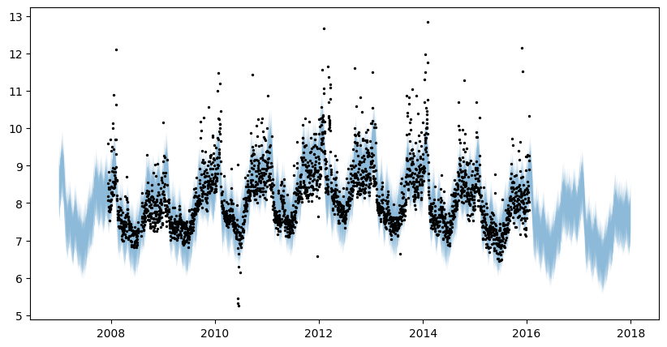

# Basic univariate forecasting
This example shows how to use Prophetverse to perform univariate forecasting
with a time series dataset, using sktime-style interface

Because of this compatibility, you can benefit from all the features of sktime, such
as hierarchical reconciliation, ensemble models, pipelines, etc. There are two main
methods to use Prophetverse with sktime:

* `fit(y, X=None)`:  This method is used to fit the model. It takes as input
a time series `y` and an optional exogenous variable `X`. The `y` time series must be
a `pd.Series` or a `pd.DataFrame`. The `X` variable must be a `pd.DataFrame` or `None`.

* `predict(fh, X=None)`: This method is used to make predictions. It takes as input a
forecast horizon `fh` and an optional exogenous variable `X`. The `fh` forecast horizon
can be a relative or an absolute forecast horizon. The `X` variable must be a
`pd.DataFrame` or `None`, according to the `X` variable used in the `fit` method.

Later in this example, we will also show additional methods to make predictions, such as
`predict_quantiles` and `predict_components`.


```python
import matplotlib.pyplot as plt
import numpy as np
import pandas as pd
from numpyro import distributions as dist


```

## Import dataset

We import a dataset from Prophet's original repository. We then put it into sktime-friendly format, where the index is a `pd.PeriodIndex` and the colums are the time series.


```python

from prophetverse.datasets.loaders import load_peyton_manning

y = load_peyton_manning()
display(y.head())


```
<p class="cell-output-title jp-RenderedText jp-OutputArea-output">Output: <span class="cell-output-count">[3]</span></p>


<div>
<style scoped>
    .dataframe tbody tr th:only-of-type {
        vertical-align: middle;
    }

    .dataframe tbody tr th {
        vertical-align: top;
    }

    .dataframe thead th {
        text-align: right;
    }
</style>
<table border="1" class="dataframe">
  <thead>
    <tr style="text-align: right;">
      <th></th>
      <th>y</th>
    </tr>
    <tr>
      <th>ds</th>
      <th></th>
    </tr>
  </thead>
  <tbody>
    <tr>
      <th>2007-12-10</th>
      <td>9.590761</td>
    </tr>
    <tr>
      <th>2007-12-11</th>
      <td>8.519590</td>
    </tr>
    <tr>
      <th>2007-12-12</th>
      <td>8.183677</td>
    </tr>
    <tr>
      <th>2007-12-13</th>
      <td>8.072467</td>
    </tr>
    <tr>
      <th>2007-12-14</th>
      <td>7.893572</td>
    </tr>
  </tbody>
</table>
</div>


The full dataset looks like this:


```python
y.plot.line(figsize=(12,6))
plt.show()


```
<p class="cell-output-title jp-RenderedText jp-OutputArea-output">Output: <span class="cell-output-count">[4]</span></p>


    

    


## Fit model
Here, we will show how you can fit a simple model with Prophetverse.
We first fit a model without seasonal components, and then fit a full model.
We also show how easy it is to switch between Maximum A Posteriori (MAP) inference
and Markov Chain Monte Carlo (MCMC).

### No seasonality


```python
from prophetverse.effects.trend import PiecewiseLinearTrend
from prophetverse.engine import MAPInferenceEngine
from prophetverse.sktime import Prophetverse
from prophetverse.utils import no_input_columns

model = Prophetverse(
    trend=PiecewiseLinearTrend(
        changepoint_interval=500,
        changepoint_prior_scale=0.00001,
        changepoint_range=-250,
    ),
    inference_engine=MAPInferenceEngine(),
)
model.fit(y=y)


```
<p class="cell-output-title jp-RenderedText jp-OutputArea-output">Output: <span class="cell-output-count">[5]</span></p>


<style>#sk-2652c134-472a-4cfa-9af1-47ac1b7bc504 {
    /* Definition of color scheme common for light and dark mode */
    --sklearn-color-text: black;
    --sklearn-color-line: gray;
    /* Definition of color scheme for objects */
    --sklearn-color-level-0: #fff5e6;
    --sklearn-color-level-1: #f6e4d2;
    --sklearn-color-level-2: #ffe0b3;
    --sklearn-color-level-3: chocolate;

    /* Specific color for light theme */
    --sklearn-color-text-on-default-background: var(--theme-code-foreground, var(--jp-content-font-color1, black));
    --sklearn-color-background: var(--theme-background, var(--jp-layout-color0, white));
    --sklearn-color-border-box: var(--theme-code-foreground, var(--jp-content-font-color1, black));
    --sklearn-color-icon: #696969;

    @media (prefers-color-scheme: dark) {
      /* Redefinition of color scheme for dark theme */
      --sklearn-color-text-on-default-background: var(--theme-code-foreground, var(--jp-content-font-color1, white));
      --sklearn-color-background: var(--theme-background, var(--jp-layout-color0, #111));
      --sklearn-color-border-box: var(--theme-code-foreground, var(--jp-content-font-color1, white));
      --sklearn-color-icon: #878787;
    }
  }

  #sk-2652c134-472a-4cfa-9af1-47ac1b7bc504 {
    color: var(--sklearn-color-text);
  }

  #sk-2652c134-472a-4cfa-9af1-47ac1b7bc504 pre {
    padding: 0;
  }

  #sk-2652c134-472a-4cfa-9af1-47ac1b7bc504 input.sk-hidden--visually {
    border: 0;
    clip: rect(1px 1px 1px 1px);
    clip: rect(1px, 1px, 1px, 1px);
    height: 1px;
    margin: -1px;
    overflow: hidden;
    padding: 0;
    position: absolute;
    width: 1px;
  }

  #sk-2652c134-472a-4cfa-9af1-47ac1b7bc504 div.sk-dashed-wrapped {
    border: 1px dashed var(--sklearn-color-line);
    margin: 0 0.4em 0.5em 0.4em;
    box-sizing: border-box;
    padding-bottom: 0.4em;
    background-color: var(--sklearn-color-background);
  }

  #sk-2652c134-472a-4cfa-9af1-47ac1b7bc504 div.sk-container {
    /* jupyter's `normalize.less` sets `[hidden] { display: none; }`
       but bootstrap.min.css set `[hidden] { display: none !important; }`
       so we also need the `!important` here to be able to override the
       default hidden behavior on the sphinx rendered scikit-learn.org.
       See: https://github.com/scikit-learn/scikit-learn/issues/21755 */
    display: inline-block !important;
    position: relative;
  }

  #sk-2652c134-472a-4cfa-9af1-47ac1b7bc504 div.sk-text-repr-fallback {
    display: none;
  }

  div.sk-parallel-item,
  div.sk-serial,
  div.sk-item {
    /* draw centered vertical line to link estimators */
    background-image: linear-gradient(var(--sklearn-color-text-on-default-background), var(--sklearn-color-text-on-default-background));
    background-size: 2px 100%;
    background-repeat: no-repeat;
    background-position: center center;
  }

  /* Parallel-specific style estimator block */

  #sk-2652c134-472a-4cfa-9af1-47ac1b7bc504 div.sk-parallel-item::after {
    content: "";
    width: 100%;
    border-bottom: 2px solid var(--sklearn-color-text-on-default-background);
    flex-grow: 1;
  }

  #sk-2652c134-472a-4cfa-9af1-47ac1b7bc504 div.sk-parallel {
    display: flex;
    align-items: stretch;
    justify-content: center;
    background-color: var(--sklearn-color-background);
    position: relative;
  }

  #sk-2652c134-472a-4cfa-9af1-47ac1b7bc504 div.sk-parallel-item {
    display: flex;
    flex-direction: column;
  }

  #sk-2652c134-472a-4cfa-9af1-47ac1b7bc504 div.sk-parallel-item:first-child::after {
    align-self: flex-end;
    width: 50%;
  }

  #sk-2652c134-472a-4cfa-9af1-47ac1b7bc504 div.sk-parallel-item:last-child::after {
    align-self: flex-start;
    width: 50%;
  }

  #sk-2652c134-472a-4cfa-9af1-47ac1b7bc504 div.sk-parallel-item:only-child::after {
    width: 0;
  }

  /* Serial-specific style estimator block */

  #sk-2652c134-472a-4cfa-9af1-47ac1b7bc504 div.sk-serial {
    display: flex;
    flex-direction: column;
    align-items: center;
    background-color: var(--sklearn-color-background);
    padding-right: 1em;
    padding-left: 1em;
  }


  /* Toggleable style: style used for estimator/Pipeline/ColumnTransformer box that is
  clickable and can be expanded/collapsed.
  - Pipeline and ColumnTransformer use this feature and define the default style
  - Estimators will overwrite some part of the style using the `sk-estimator` class
  */

  /* Pipeline and ColumnTransformer style (default) */

  #sk-2652c134-472a-4cfa-9af1-47ac1b7bc504 div.sk-toggleable {
    /* Default theme specific background. It is overwritten whether we have a
    specific estimator or a Pipeline/ColumnTransformer */
    background-color: var(--sklearn-color-background);
  }

  /* Toggleable label */
  #sk-2652c134-472a-4cfa-9af1-47ac1b7bc504 label.sk-toggleable__label {
    cursor: pointer;
    display: block;
    width: 100%;
    margin-bottom: 0;
    padding: 0.5em;
    box-sizing: border-box;
    text-align: center;
  }

  #sk-2652c134-472a-4cfa-9af1-47ac1b7bc504 label.sk-toggleable__label-arrow:before {
    /* Arrow on the left of the label */
    content: "▸";
    float: left;
    margin-right: 0.25em;
    color: var(--sklearn-color-icon);
  }

  #sk-2652c134-472a-4cfa-9af1-47ac1b7bc504 label.sk-toggleable__label-arrow:hover:before {
    color: var(--sklearn-color-text);
  }

  /* Toggleable content - dropdown */

  #sk-2652c134-472a-4cfa-9af1-47ac1b7bc504 div.sk-toggleable__content {
    max-height: 0;
    max-width: 0;
    overflow: hidden;
    text-align: left;
    background-color: var(--sklearn-color-level-0);
  }

  #sk-2652c134-472a-4cfa-9af1-47ac1b7bc504 div.sk-toggleable__content pre {
    margin: 0.2em;
    border-radius: 0.25em;
    color: var(--sklearn-color-text);
    background-color: var(--sklearn-color-level-0);
  }

  #sk-2652c134-472a-4cfa-9af1-47ac1b7bc504 input.sk-toggleable__control:checked~div.sk-toggleable__content {
    /* Expand drop-down */
    max-height: 200px;
    max-width: 100%;
    overflow: auto;
  }

  #sk-2652c134-472a-4cfa-9af1-47ac1b7bc504 input.sk-toggleable__control:checked~label.sk-toggleable__label-arrow:before {
    content: "▾";
  }

  /* Pipeline/ColumnTransformer-specific style */

  #sk-2652c134-472a-4cfa-9af1-47ac1b7bc504 div.sk-label input.sk-toggleable__control:checked~label.sk-toggleable__label {
    color: var(--sklearn-color-text);
    background-color: var(--sklearn-color-level-2);
  }

  /* Estimator-specific style */

  /* Colorize estimator box */
  #sk-2652c134-472a-4cfa-9af1-47ac1b7bc504 div.sk-estimator input.sk-toggleable__control:checked~label.sk-toggleable__label {
    /* unfitted */
    background-color: var(--sklearn-color-level-2);
  }

  #sk-2652c134-472a-4cfa-9af1-47ac1b7bc504 div.sk-label label.sk-toggleable__label,
  #sk-2652c134-472a-4cfa-9af1-47ac1b7bc504 div.sk-label label {
    /* The background is the default theme color */
    color: var(--sklearn-color-text-on-default-background);
  }

  /* On hover, darken the color of the background */
  #sk-2652c134-472a-4cfa-9af1-47ac1b7bc504 div.sk-label:hover label.sk-toggleable__label {
    color: var(--sklearn-color-text);
    background-color: var(--sklearn-color-level-2);
  }

  /* Estimator label */

  #sk-2652c134-472a-4cfa-9af1-47ac1b7bc504 div.sk-label label {
    font-family: monospace;
    font-weight: bold;
    display: inline-block;
    line-height: 1.2em;
  }

  #sk-2652c134-472a-4cfa-9af1-47ac1b7bc504 div.sk-label-container {
    text-align: center;
  }

  /* Estimator-specific */
  #sk-2652c134-472a-4cfa-9af1-47ac1b7bc504 div.sk-estimator {
    font-family: monospace;
    border: 1px dotted var(--sklearn-color-border-box);
    border-radius: 0.25em;
    box-sizing: border-box;
    margin-bottom: 0.5em;
    background-color: var(--sklearn-color-level-0);
  }

  /* on hover */
  #sk-2652c134-472a-4cfa-9af1-47ac1b7bc504 div.sk-estimator:hover {
    background-color: var(--sklearn-color-level-2);
  }

  /* Specification for estimator info */

  .sk-estimator-doc-link,
  a:link.sk-estimator-doc-link,
  a:visited.sk-estimator-doc-link {
    float: right;
    font-size: smaller;
    line-height: 1em;
    font-family: monospace;
    background-color: var(--sklearn-color-background);
    border-radius: 1em;
    height: 1em;
    width: 1em;
    text-decoration: none !important;
    margin-left: 1ex;
    border: var(--sklearn-color-level-1) 1pt solid;
    color: var(--sklearn-color-level-1);
  }

  /* On hover */
  div.sk-estimator:hover .sk-estimator-doc-link:hover,
  .sk-estimator-doc-link:hover,
  div.sk-label-container:hover .sk-estimator-doc-link:hover,
  .sk-estimator-doc-link:hover {
    background-color: var(--sklearn-color-level-3);
    color: var(--sklearn-color-background);
    text-decoration: none;
  }

  /* Span, style for the box shown on hovering the info icon */
  .sk-estimator-doc-link span {
    display: none;
    z-index: 9999;
    position: relative;
    font-weight: normal;
    right: .2ex;
    padding: .5ex;
    margin: .5ex;
    width: min-content;
    min-width: 20ex;
    max-width: 50ex;
    color: var(--sklearn-color-text);
    box-shadow: 2pt 2pt 4pt #999;
    background: var(--sklearn-color-level-0);
    border: .5pt solid var(--sklearn-color-level-3);
  }

  .sk-estimator-doc-link:hover span {
    display: block;
  }

  /* "?"-specific style due to the `<a>` HTML tag */

  #sk-2652c134-472a-4cfa-9af1-47ac1b7bc504 a.estimator_doc_link {
    float: right;
    font-size: 1rem;
    line-height: 1em;
    font-family: monospace;
    background-color: var(--sklearn-color-background);
    border-radius: 1rem;
    height: 1rem;
    width: 1rem;
    text-decoration: none;
    color: var(--sklearn-color-level-1);
    border: var(--sklearn-color-level-1) 1pt solid;
  }

  /* On hover */
  #sk-2652c134-472a-4cfa-9af1-47ac1b7bc504 a.estimator_doc_link:hover {
    background-color: var(--sklearn-color-level-3);
    color: var(--sklearn-color-background);
    text-decoration: none;
  }
</style><div id='sk-2652c134-472a-4cfa-9af1-47ac1b7bc504' class="sk-top-container"><div class="sk-text-repr-fallback"><pre>Prophetverse(inference_engine=MAPInferenceEngine(),
             trend=PiecewiseLinearTrend(changepoint_interval=500,
                                        changepoint_prior_scale=1e-05,
                                        changepoint_range=-250))</pre><b>Please rerun this cell to show the HTML repr or trust the notebook.</b></div><div class="sk-container" hidden><div class="sk-item sk-dashed-wrapped"><div class='sk-label-container'><div class="sk-label sk-toggleable"><input class="sk-toggleable__control sk-hidden--visually" id=UUID('c4f09ccf-efbc-49a0-af30-061ecd97e9bd') type="checkbox" ><label for=UUID('c4f09ccf-efbc-49a0-af30-061ecd97e9bd') class='sk-toggleable__label sk-toggleable__label-arrow'>Prophetverse</label><div class="sk-toggleable__content"><pre>Prophetverse(inference_engine=MAPInferenceEngine(),
             trend=PiecewiseLinearTrend(changepoint_interval=500,
                                        changepoint_prior_scale=1e-05,
                                        changepoint_range=-250))</pre></div></div></div><div class="sk-parallel"><div class="sk-parallel-item"><div class="sk-item"><div class='sk-label-container'><div class="sk-label sk-toggleable"><label>effects</label></div></div><div class="sk-serial"><div class="sk-item"><div class="sk-serial"><div class='sk-item'><div class="sk-estimator sk-toggleable"><input class="sk-toggleable__control sk-hidden--visually" id=UUID('ee789c55-74dd-462e-81a8-430a652fde19') type="checkbox" ><label for=UUID('ee789c55-74dd-462e-81a8-430a652fde19') class='sk-toggleable__label sk-toggleable__label-arrow'>PiecewiseLinearTrend</label><div class="sk-toggleable__content"><pre>PiecewiseLinearTrend(changepoint_interval=500, changepoint_prior_scale=1e-05,
                     changepoint_range=-250)</pre></div></div></div></div></div></div></div></div><div class="sk-parallel-item"><div class="sk-item"><div class='sk-label-container'><div class="sk-label sk-toggleable"><label>inference_engine</label></div></div><div class="sk-serial"><div class='sk-item'><div class="sk-estimator sk-toggleable"><input class="sk-toggleable__control sk-hidden--visually" id=UUID('f21f8e07-b91d-408b-8079-5a4948204705') type="checkbox" ><label for=UUID('f21f8e07-b91d-408b-8079-5a4948204705') class='sk-toggleable__label sk-toggleable__label-arrow'>MAPInferenceEngine</label><div class="sk-toggleable__content"><pre>MAPInferenceEngine()</pre></div></div></div></div></div></div></div></div></div></div>


```python
forecast_horizon = pd.period_range("2007-01-01", "2018-01-01", freq="D")
fig, ax = plt.subplots(figsize=(10, 5))
preds = model.predict(fh=forecast_horizon)
preds.plot.line(ax=ax)
ax.scatter(y.index, y, marker="o", color="k", s=2, alpha=0.5)


```
<p class="cell-output-title jp-RenderedText jp-OutputArea-output">Output: <span class="cell-output-count">[6]</span></p>


    <matplotlib.collections.PathCollection at 0x343756ad0>


    

    


### With seasonality
Here, we fit the univariate Prophet and pass an exogenous effect as hyperparameter.
The `exogenous_effects` parameter let us add new components to the model and control
the relationship between exogenous variables and the target variable.
In this case, the `LinearFourierSeasonality` effect creates sinusoidal and cosine
terms to model the seasonality of the time series, which are then multiplied by
linear coefficients and added to the model.

This argument is a list of tuples of the form `(effect_name, effect, regex_to_filter_relevant_columns)`,
where `effect_name` is a string and `effect` is an instance of a subclass of
`prophetverse.effects.BaseEffect`. The regex is used to filter the columns of X
that are relevant for the effect, but can also be `None`
(or its alias `prophetverse.utils.no_input_columns`) if no input in `X` is needed
for the effect. For example, the seasonality effect already implemented in
`prophetverse.effects` module does not need any input in `X`, so we can use
`prophetverse.utils.no_input_columns` as the regex.


```python
from prophetverse.effects.fourier import LinearFourierSeasonality
from prophetverse.utils import no_input_columns

model = Prophetverse(
    trend=PiecewiseLinearTrend(
        changepoint_interval=500,
        changepoint_prior_scale=0.00001,
        changepoint_range=-500,
    ),
    exogenous_effects=[
        (
            "seasonality",
            LinearFourierSeasonality(
                freq="D",
                sp_list=[7, 365.25],
                fourier_terms_list=[3, 10],
                prior_scale=0.1,
                effect_mode="multiplicative",
            ),
            no_input_columns,
        ),
    ],
    inference_engine=MAPInferenceEngine(),
)
model.fit(y=y)


```
<p class="cell-output-title jp-RenderedText jp-OutputArea-output">Output: <span class="cell-output-count">[7]</span></p>


<style>#sk-16d9c853-a0c3-4cb9-8f92-2a3edaadb2d0 {
    /* Definition of color scheme common for light and dark mode */
    --sklearn-color-text: black;
    --sklearn-color-line: gray;
    /* Definition of color scheme for objects */
    --sklearn-color-level-0: #fff5e6;
    --sklearn-color-level-1: #f6e4d2;
    --sklearn-color-level-2: #ffe0b3;
    --sklearn-color-level-3: chocolate;

    /* Specific color for light theme */
    --sklearn-color-text-on-default-background: var(--theme-code-foreground, var(--jp-content-font-color1, black));
    --sklearn-color-background: var(--theme-background, var(--jp-layout-color0, white));
    --sklearn-color-border-box: var(--theme-code-foreground, var(--jp-content-font-color1, black));
    --sklearn-color-icon: #696969;

    @media (prefers-color-scheme: dark) {
      /* Redefinition of color scheme for dark theme */
      --sklearn-color-text-on-default-background: var(--theme-code-foreground, var(--jp-content-font-color1, white));
      --sklearn-color-background: var(--theme-background, var(--jp-layout-color0, #111));
      --sklearn-color-border-box: var(--theme-code-foreground, var(--jp-content-font-color1, white));
      --sklearn-color-icon: #878787;
    }
  }

  #sk-16d9c853-a0c3-4cb9-8f92-2a3edaadb2d0 {
    color: var(--sklearn-color-text);
  }

  #sk-16d9c853-a0c3-4cb9-8f92-2a3edaadb2d0 pre {
    padding: 0;
  }

  #sk-16d9c853-a0c3-4cb9-8f92-2a3edaadb2d0 input.sk-hidden--visually {
    border: 0;
    clip: rect(1px 1px 1px 1px);
    clip: rect(1px, 1px, 1px, 1px);
    height: 1px;
    margin: -1px;
    overflow: hidden;
    padding: 0;
    position: absolute;
    width: 1px;
  }

  #sk-16d9c853-a0c3-4cb9-8f92-2a3edaadb2d0 div.sk-dashed-wrapped {
    border: 1px dashed var(--sklearn-color-line);
    margin: 0 0.4em 0.5em 0.4em;
    box-sizing: border-box;
    padding-bottom: 0.4em;
    background-color: var(--sklearn-color-background);
  }

  #sk-16d9c853-a0c3-4cb9-8f92-2a3edaadb2d0 div.sk-container {
    /* jupyter's `normalize.less` sets `[hidden] { display: none; }`
       but bootstrap.min.css set `[hidden] { display: none !important; }`
       so we also need the `!important` here to be able to override the
       default hidden behavior on the sphinx rendered scikit-learn.org.
       See: https://github.com/scikit-learn/scikit-learn/issues/21755 */
    display: inline-block !important;
    position: relative;
  }

  #sk-16d9c853-a0c3-4cb9-8f92-2a3edaadb2d0 div.sk-text-repr-fallback {
    display: none;
  }

  div.sk-parallel-item,
  div.sk-serial,
  div.sk-item {
    /* draw centered vertical line to link estimators */
    background-image: linear-gradient(var(--sklearn-color-text-on-default-background), var(--sklearn-color-text-on-default-background));
    background-size: 2px 100%;
    background-repeat: no-repeat;
    background-position: center center;
  }

  /* Parallel-specific style estimator block */

  #sk-16d9c853-a0c3-4cb9-8f92-2a3edaadb2d0 div.sk-parallel-item::after {
    content: "";
    width: 100%;
    border-bottom: 2px solid var(--sklearn-color-text-on-default-background);
    flex-grow: 1;
  }

  #sk-16d9c853-a0c3-4cb9-8f92-2a3edaadb2d0 div.sk-parallel {
    display: flex;
    align-items: stretch;
    justify-content: center;
    background-color: var(--sklearn-color-background);
    position: relative;
  }

  #sk-16d9c853-a0c3-4cb9-8f92-2a3edaadb2d0 div.sk-parallel-item {
    display: flex;
    flex-direction: column;
  }

  #sk-16d9c853-a0c3-4cb9-8f92-2a3edaadb2d0 div.sk-parallel-item:first-child::after {
    align-self: flex-end;
    width: 50%;
  }

  #sk-16d9c853-a0c3-4cb9-8f92-2a3edaadb2d0 div.sk-parallel-item:last-child::after {
    align-self: flex-start;
    width: 50%;
  }

  #sk-16d9c853-a0c3-4cb9-8f92-2a3edaadb2d0 div.sk-parallel-item:only-child::after {
    width: 0;
  }

  /* Serial-specific style estimator block */

  #sk-16d9c853-a0c3-4cb9-8f92-2a3edaadb2d0 div.sk-serial {
    display: flex;
    flex-direction: column;
    align-items: center;
    background-color: var(--sklearn-color-background);
    padding-right: 1em;
    padding-left: 1em;
  }


  /* Toggleable style: style used for estimator/Pipeline/ColumnTransformer box that is
  clickable and can be expanded/collapsed.
  - Pipeline and ColumnTransformer use this feature and define the default style
  - Estimators will overwrite some part of the style using the `sk-estimator` class
  */

  /* Pipeline and ColumnTransformer style (default) */

  #sk-16d9c853-a0c3-4cb9-8f92-2a3edaadb2d0 div.sk-toggleable {
    /* Default theme specific background. It is overwritten whether we have a
    specific estimator or a Pipeline/ColumnTransformer */
    background-color: var(--sklearn-color-background);
  }

  /* Toggleable label */
  #sk-16d9c853-a0c3-4cb9-8f92-2a3edaadb2d0 label.sk-toggleable__label {
    cursor: pointer;
    display: block;
    width: 100%;
    margin-bottom: 0;
    padding: 0.5em;
    box-sizing: border-box;
    text-align: center;
  }

  #sk-16d9c853-a0c3-4cb9-8f92-2a3edaadb2d0 label.sk-toggleable__label-arrow:before {
    /* Arrow on the left of the label */
    content: "▸";
    float: left;
    margin-right: 0.25em;
    color: var(--sklearn-color-icon);
  }

  #sk-16d9c853-a0c3-4cb9-8f92-2a3edaadb2d0 label.sk-toggleable__label-arrow:hover:before {
    color: var(--sklearn-color-text);
  }

  /* Toggleable content - dropdown */

  #sk-16d9c853-a0c3-4cb9-8f92-2a3edaadb2d0 div.sk-toggleable__content {
    max-height: 0;
    max-width: 0;
    overflow: hidden;
    text-align: left;
    background-color: var(--sklearn-color-level-0);
  }

  #sk-16d9c853-a0c3-4cb9-8f92-2a3edaadb2d0 div.sk-toggleable__content pre {
    margin: 0.2em;
    border-radius: 0.25em;
    color: var(--sklearn-color-text);
    background-color: var(--sklearn-color-level-0);
  }

  #sk-16d9c853-a0c3-4cb9-8f92-2a3edaadb2d0 input.sk-toggleable__control:checked~div.sk-toggleable__content {
    /* Expand drop-down */
    max-height: 200px;
    max-width: 100%;
    overflow: auto;
  }

  #sk-16d9c853-a0c3-4cb9-8f92-2a3edaadb2d0 input.sk-toggleable__control:checked~label.sk-toggleable__label-arrow:before {
    content: "▾";
  }

  /* Pipeline/ColumnTransformer-specific style */

  #sk-16d9c853-a0c3-4cb9-8f92-2a3edaadb2d0 div.sk-label input.sk-toggleable__control:checked~label.sk-toggleable__label {
    color: var(--sklearn-color-text);
    background-color: var(--sklearn-color-level-2);
  }

  /* Estimator-specific style */

  /* Colorize estimator box */
  #sk-16d9c853-a0c3-4cb9-8f92-2a3edaadb2d0 div.sk-estimator input.sk-toggleable__control:checked~label.sk-toggleable__label {
    /* unfitted */
    background-color: var(--sklearn-color-level-2);
  }

  #sk-16d9c853-a0c3-4cb9-8f92-2a3edaadb2d0 div.sk-label label.sk-toggleable__label,
  #sk-16d9c853-a0c3-4cb9-8f92-2a3edaadb2d0 div.sk-label label {
    /* The background is the default theme color */
    color: var(--sklearn-color-text-on-default-background);
  }

  /* On hover, darken the color of the background */
  #sk-16d9c853-a0c3-4cb9-8f92-2a3edaadb2d0 div.sk-label:hover label.sk-toggleable__label {
    color: var(--sklearn-color-text);
    background-color: var(--sklearn-color-level-2);
  }

  /* Estimator label */

  #sk-16d9c853-a0c3-4cb9-8f92-2a3edaadb2d0 div.sk-label label {
    font-family: monospace;
    font-weight: bold;
    display: inline-block;
    line-height: 1.2em;
  }

  #sk-16d9c853-a0c3-4cb9-8f92-2a3edaadb2d0 div.sk-label-container {
    text-align: center;
  }

  /* Estimator-specific */
  #sk-16d9c853-a0c3-4cb9-8f92-2a3edaadb2d0 div.sk-estimator {
    font-family: monospace;
    border: 1px dotted var(--sklearn-color-border-box);
    border-radius: 0.25em;
    box-sizing: border-box;
    margin-bottom: 0.5em;
    background-color: var(--sklearn-color-level-0);
  }

  /* on hover */
  #sk-16d9c853-a0c3-4cb9-8f92-2a3edaadb2d0 div.sk-estimator:hover {
    background-color: var(--sklearn-color-level-2);
  }

  /* Specification for estimator info */

  .sk-estimator-doc-link,
  a:link.sk-estimator-doc-link,
  a:visited.sk-estimator-doc-link {
    float: right;
    font-size: smaller;
    line-height: 1em;
    font-family: monospace;
    background-color: var(--sklearn-color-background);
    border-radius: 1em;
    height: 1em;
    width: 1em;
    text-decoration: none !important;
    margin-left: 1ex;
    border: var(--sklearn-color-level-1) 1pt solid;
    color: var(--sklearn-color-level-1);
  }

  /* On hover */
  div.sk-estimator:hover .sk-estimator-doc-link:hover,
  .sk-estimator-doc-link:hover,
  div.sk-label-container:hover .sk-estimator-doc-link:hover,
  .sk-estimator-doc-link:hover {
    background-color: var(--sklearn-color-level-3);
    color: var(--sklearn-color-background);
    text-decoration: none;
  }

  /* Span, style for the box shown on hovering the info icon */
  .sk-estimator-doc-link span {
    display: none;
    z-index: 9999;
    position: relative;
    font-weight: normal;
    right: .2ex;
    padding: .5ex;
    margin: .5ex;
    width: min-content;
    min-width: 20ex;
    max-width: 50ex;
    color: var(--sklearn-color-text);
    box-shadow: 2pt 2pt 4pt #999;
    background: var(--sklearn-color-level-0);
    border: .5pt solid var(--sklearn-color-level-3);
  }

  .sk-estimator-doc-link:hover span {
    display: block;
  }

  /* "?"-specific style due to the `<a>` HTML tag */

  #sk-16d9c853-a0c3-4cb9-8f92-2a3edaadb2d0 a.estimator_doc_link {
    float: right;
    font-size: 1rem;
    line-height: 1em;
    font-family: monospace;
    background-color: var(--sklearn-color-background);
    border-radius: 1rem;
    height: 1rem;
    width: 1rem;
    text-decoration: none;
    color: var(--sklearn-color-level-1);
    border: var(--sklearn-color-level-1) 1pt solid;
  }

  /* On hover */
  #sk-16d9c853-a0c3-4cb9-8f92-2a3edaadb2d0 a.estimator_doc_link:hover {
    background-color: var(--sklearn-color-level-3);
    color: var(--sklearn-color-background);
    text-decoration: none;
  }
</style><div id='sk-16d9c853-a0c3-4cb9-8f92-2a3edaadb2d0' class="sk-top-container"><div class="sk-text-repr-fallback"><pre>Prophetverse(exogenous_effects=[(&#x27;seasonality&#x27;,
                                 LinearFourierSeasonality(effect_mode=&#x27;multiplicative&#x27;,
                                                          fourier_terms_list=[3,
                                                                              10],
                                                          freq=&#x27;D&#x27;,
                                                          prior_scale=0.1,
                                                          sp_list=[7, 365.25]),
                                 &#x27;^$&#x27;)],
             inference_engine=MAPInferenceEngine(),
             trend=PiecewiseLinearTrend(changepoint_interval=500,
                                        changepoint_prior_scale=1e-05,
                                        changepoint_range=-500))</pre><b>Please rerun this cell to show the HTML repr or trust the notebook.</b></div><div class="sk-container" hidden><div class="sk-item sk-dashed-wrapped"><div class='sk-label-container'><div class="sk-label sk-toggleable"><input class="sk-toggleable__control sk-hidden--visually" id=UUID('a5aeebb6-e6b2-4152-96a3-c6ef06a14128') type="checkbox" ><label for=UUID('a5aeebb6-e6b2-4152-96a3-c6ef06a14128') class='sk-toggleable__label sk-toggleable__label-arrow'>Prophetverse</label><div class="sk-toggleable__content"><pre>Prophetverse(exogenous_effects=[(&#x27;seasonality&#x27;,
                                 LinearFourierSeasonality(effect_mode=&#x27;multiplicative&#x27;,
                                                          fourier_terms_list=[3,
                                                                              10],
                                                          freq=&#x27;D&#x27;,
                                                          prior_scale=0.1,
                                                          sp_list=[7, 365.25]),
                                 &#x27;^$&#x27;)],
             inference_engine=MAPInferenceEngine(),
             trend=PiecewiseLinearTrend(changepoint_interval=500,
                                        changepoint_prior_scale=1e-05,
                                        changepoint_range=-500))</pre></div></div></div><div class="sk-parallel"><div class="sk-parallel-item"><div class="sk-item"><div class='sk-label-container'><div class="sk-label sk-toggleable"><label>effects</label></div></div><div class="sk-serial"><div class="sk-item"><div class="sk-serial"><div class='sk-item'><div class="sk-estimator sk-toggleable"><input class="sk-toggleable__control sk-hidden--visually" id=UUID('32e2b50e-a42b-4479-9040-bc29a4f5fa3d') type="checkbox" ><label for=UUID('32e2b50e-a42b-4479-9040-bc29a4f5fa3d') class='sk-toggleable__label sk-toggleable__label-arrow'>PiecewiseLinearTrend</label><div class="sk-toggleable__content"><pre>PiecewiseLinearTrend(changepoint_interval=500, changepoint_prior_scale=1e-05,
                     changepoint_range=-500)</pre></div></div></div><div class='sk-item'><div class="sk-estimator sk-toggleable"><input class="sk-toggleable__control sk-hidden--visually" id=UUID('a247e6c5-1d5c-4119-ba2e-49b83fc3df83') type="checkbox" ><label for=UUID('a247e6c5-1d5c-4119-ba2e-49b83fc3df83') class='sk-toggleable__label sk-toggleable__label-arrow'>LinearFourierSeasonality</label><div class="sk-toggleable__content"><pre>LinearFourierSeasonality(effect_mode=&#x27;multiplicative&#x27;,
                         fourier_terms_list=[3, 10], freq=&#x27;D&#x27;, prior_scale=0.1,
                         sp_list=[7, 365.25])</pre></div></div></div></div></div></div></div></div><div class="sk-parallel-item"><div class="sk-item"><div class='sk-label-container'><div class="sk-label sk-toggleable"><label>inference_engine</label></div></div><div class="sk-serial"><div class='sk-item'><div class="sk-estimator sk-toggleable"><input class="sk-toggleable__control sk-hidden--visually" id=UUID('f16ed10d-608c-47a2-a14c-9b056ca11f53') type="checkbox" ><label for=UUID('f16ed10d-608c-47a2-a14c-9b056ca11f53') class='sk-toggleable__label sk-toggleable__label-arrow'>MAPInferenceEngine</label><div class="sk-toggleable__content"><pre>MAPInferenceEngine()</pre></div></div></div></div></div></div></div></div></div></div>


```python
forecast_horizon = pd.period_range("2007-01-01", "2018-01-01", freq="D")
fig, ax = plt.subplots(figsize=(10, 5))
preds = model.predict(fh=forecast_horizon)
preds.plot.line(ax=ax)
ax.scatter(y.index, y, marker="o", color="k", s=2, alpha=0.5)


```
<p class="cell-output-title jp-RenderedText jp-OutputArea-output">Output: <span class="cell-output-count">[8]</span></p>


    <matplotlib.collections.PathCollection at 0x347d23e50>


    

    


## Probabilistic forecasting
We can also make probabilistic forecasts with Prophetverse, in sktime fashion.
 The `predict_quantiles` method returns the quantiles of the predictive distribution
in a `pd.DataFrame`


```python
quantiles = model.predict_quantiles(fh=forecast_horizon, alpha=[0.1, .9])
quantiles.head()


```
<p class="cell-output-title jp-RenderedText jp-OutputArea-output">Output: <span class="cell-output-count">[9]</span></p>


<div>
<style scoped>
    .dataframe tbody tr th:only-of-type {
        vertical-align: middle;
    }

    .dataframe tbody tr th {
        vertical-align: top;
    }

    .dataframe thead tr th {
        text-align: left;
    }
</style>
<table border="1" class="dataframe">
  <thead>
    <tr>
      <th></th>
      <th colspan="2" halign="left">y</th>
    </tr>
    <tr>
      <th></th>
      <th>0.1</th>
      <th>0.9</th>
    </tr>
  </thead>
  <tbody>
    <tr>
      <th>2007-01-01</th>
      <td>8.002126</td>
      <td>9.309550</td>
    </tr>
    <tr>
      <th>2007-01-02</th>
      <td>7.807156</td>
      <td>9.113895</td>
    </tr>
    <tr>
      <th>2007-01-03</th>
      <td>7.741747</td>
      <td>9.018427</td>
    </tr>
    <tr>
      <th>2007-01-04</th>
      <td>7.639927</td>
      <td>8.998752</td>
    </tr>
    <tr>
      <th>2007-01-05</th>
      <td>7.655394</td>
      <td>9.010941</td>
    </tr>
  </tbody>
</table>
</div>


The plot below shows the (0.1, 0.9) quantiles of the predictive distribution


```python
fig, ax = plt.subplots(figsize=(10, 5))
# Plot area between quantiles
ax.fill_between(
    quantiles.index.to_timestamp(),
    quantiles.iloc[:, 0],
    quantiles.iloc[:, -1],
    alpha=0.5,
)
ax.scatter(y.index, y, marker="o", color="k", s=2, alpha=1)


```
<p class="cell-output-title jp-RenderedText jp-OutputArea-output">Output: <span class="cell-output-count">[10]</span></p>


    <matplotlib.collections.PathCollection at 0x34e1cd490>


    

    


## Timeseries decomposition
We can easily extract the components of the time series with the `predict_components`
method. This method, in particular, is not implemented in sktime's `BaseForecaster`,
but it is a method of `prophetverse.Prophetverse` class.


```python
sites = model.predict_components(fh=forecast_horizon)
sites.head()


```
<p class="cell-output-title jp-RenderedText jp-OutputArea-output">Output: <span class="cell-output-count">[11]</span></p>


<div>
<style scoped>
    .dataframe tbody tr th:only-of-type {
        vertical-align: middle;
    }

    .dataframe tbody tr th {
        vertical-align: top;
    }

    .dataframe thead th {
        text-align: right;
    }
</style>
<table border="1" class="dataframe">
  <thead>
    <tr style="text-align: right;">
      <th></th>
      <th>mean</th>
      <th>obs</th>
      <th>seasonality</th>
      <th>trend</th>
    </tr>
  </thead>
  <tbody>
    <tr>
      <th>2007-01-01</th>
      <td>8.655674</td>
      <td>8.669042</td>
      <td>0.871136</td>
      <td>7.784539</td>
    </tr>
    <tr>
      <th>2007-01-02</th>
      <td>8.457966</td>
      <td>8.449063</td>
      <td>0.673427</td>
      <td>7.784539</td>
    </tr>
    <tr>
      <th>2007-01-03</th>
      <td>8.351393</td>
      <td>8.369492</td>
      <td>0.566856</td>
      <td>7.784539</td>
    </tr>
    <tr>
      <th>2007-01-04</th>
      <td>8.314424</td>
      <td>8.322533</td>
      <td>0.529884</td>
      <td>7.784539</td>
    </tr>
    <tr>
      <th>2007-01-05</th>
      <td>8.329665</td>
      <td>8.320658</td>
      <td>0.545126</td>
      <td>7.784539</td>
    </tr>
  </tbody>
</table>
</div>


```python
for column in sites.columns:
    fig, ax = plt.subplots(figsize=(8, 2))
    ax.plot(sites.index.to_timestamp(), sites[column], label=column)
    ax.set_title(column)
    fig.show()


```
<p class="cell-output-title jp-RenderedText jp-OutputArea-output">Output: <span class="cell-output-count">[12]</span></p>


    

    


    

    


    

    


    

    


## Fitting with MCMC
In the previous examples, we used MAP inference to fit the model. However, we can also
use Markov Chain Monte Carlo (MCMC) to fit the model. To do this, we just need to
change the `inference_engine` parameter to `MCMCInferenceEngine`. The rest of the code
remains the same.

The `set_params` method is used to set the parameters of the model, in sklearn fashion.


```python
from prophetverse.engine import MCMCInferenceEngine

model.set_params(
    inference_engine=MCMCInferenceEngine()
)

model.fit(y=y)


```
<p class="cell-output-title jp-RenderedText jp-OutputArea-output">Output: <span class="cell-output-count">[13]</span></p>


<style>#sk-14536f79-eac8-4ebe-bb6a-a0a11018741f {
    /* Definition of color scheme common for light and dark mode */
    --sklearn-color-text: black;
    --sklearn-color-line: gray;
    /* Definition of color scheme for objects */
    --sklearn-color-level-0: #fff5e6;
    --sklearn-color-level-1: #f6e4d2;
    --sklearn-color-level-2: #ffe0b3;
    --sklearn-color-level-3: chocolate;

    /* Specific color for light theme */
    --sklearn-color-text-on-default-background: var(--theme-code-foreground, var(--jp-content-font-color1, black));
    --sklearn-color-background: var(--theme-background, var(--jp-layout-color0, white));
    --sklearn-color-border-box: var(--theme-code-foreground, var(--jp-content-font-color1, black));
    --sklearn-color-icon: #696969;

    @media (prefers-color-scheme: dark) {
      /* Redefinition of color scheme for dark theme */
      --sklearn-color-text-on-default-background: var(--theme-code-foreground, var(--jp-content-font-color1, white));
      --sklearn-color-background: var(--theme-background, var(--jp-layout-color0, #111));
      --sklearn-color-border-box: var(--theme-code-foreground, var(--jp-content-font-color1, white));
      --sklearn-color-icon: #878787;
    }
  }

  #sk-14536f79-eac8-4ebe-bb6a-a0a11018741f {
    color: var(--sklearn-color-text);
  }

  #sk-14536f79-eac8-4ebe-bb6a-a0a11018741f pre {
    padding: 0;
  }

  #sk-14536f79-eac8-4ebe-bb6a-a0a11018741f input.sk-hidden--visually {
    border: 0;
    clip: rect(1px 1px 1px 1px);
    clip: rect(1px, 1px, 1px, 1px);
    height: 1px;
    margin: -1px;
    overflow: hidden;
    padding: 0;
    position: absolute;
    width: 1px;
  }

  #sk-14536f79-eac8-4ebe-bb6a-a0a11018741f div.sk-dashed-wrapped {
    border: 1px dashed var(--sklearn-color-line);
    margin: 0 0.4em 0.5em 0.4em;
    box-sizing: border-box;
    padding-bottom: 0.4em;
    background-color: var(--sklearn-color-background);
  }

  #sk-14536f79-eac8-4ebe-bb6a-a0a11018741f div.sk-container {
    /* jupyter's `normalize.less` sets `[hidden] { display: none; }`
       but bootstrap.min.css set `[hidden] { display: none !important; }`
       so we also need the `!important` here to be able to override the
       default hidden behavior on the sphinx rendered scikit-learn.org.
       See: https://github.com/scikit-learn/scikit-learn/issues/21755 */
    display: inline-block !important;
    position: relative;
  }

  #sk-14536f79-eac8-4ebe-bb6a-a0a11018741f div.sk-text-repr-fallback {
    display: none;
  }

  div.sk-parallel-item,
  div.sk-serial,
  div.sk-item {
    /* draw centered vertical line to link estimators */
    background-image: linear-gradient(var(--sklearn-color-text-on-default-background), var(--sklearn-color-text-on-default-background));
    background-size: 2px 100%;
    background-repeat: no-repeat;
    background-position: center center;
  }

  /* Parallel-specific style estimator block */

  #sk-14536f79-eac8-4ebe-bb6a-a0a11018741f div.sk-parallel-item::after {
    content: "";
    width: 100%;
    border-bottom: 2px solid var(--sklearn-color-text-on-default-background);
    flex-grow: 1;
  }

  #sk-14536f79-eac8-4ebe-bb6a-a0a11018741f div.sk-parallel {
    display: flex;
    align-items: stretch;
    justify-content: center;
    background-color: var(--sklearn-color-background);
    position: relative;
  }

  #sk-14536f79-eac8-4ebe-bb6a-a0a11018741f div.sk-parallel-item {
    display: flex;
    flex-direction: column;
  }

  #sk-14536f79-eac8-4ebe-bb6a-a0a11018741f div.sk-parallel-item:first-child::after {
    align-self: flex-end;
    width: 50%;
  }

  #sk-14536f79-eac8-4ebe-bb6a-a0a11018741f div.sk-parallel-item:last-child::after {
    align-self: flex-start;
    width: 50%;
  }

  #sk-14536f79-eac8-4ebe-bb6a-a0a11018741f div.sk-parallel-item:only-child::after {
    width: 0;
  }

  /* Serial-specific style estimator block */

  #sk-14536f79-eac8-4ebe-bb6a-a0a11018741f div.sk-serial {
    display: flex;
    flex-direction: column;
    align-items: center;
    background-color: var(--sklearn-color-background);
    padding-right: 1em;
    padding-left: 1em;
  }


  /* Toggleable style: style used for estimator/Pipeline/ColumnTransformer box that is
  clickable and can be expanded/collapsed.
  - Pipeline and ColumnTransformer use this feature and define the default style
  - Estimators will overwrite some part of the style using the `sk-estimator` class
  */

  /* Pipeline and ColumnTransformer style (default) */

  #sk-14536f79-eac8-4ebe-bb6a-a0a11018741f div.sk-toggleable {
    /* Default theme specific background. It is overwritten whether we have a
    specific estimator or a Pipeline/ColumnTransformer */
    background-color: var(--sklearn-color-background);
  }

  /* Toggleable label */
  #sk-14536f79-eac8-4ebe-bb6a-a0a11018741f label.sk-toggleable__label {
    cursor: pointer;
    display: block;
    width: 100%;
    margin-bottom: 0;
    padding: 0.5em;
    box-sizing: border-box;
    text-align: center;
  }

  #sk-14536f79-eac8-4ebe-bb6a-a0a11018741f label.sk-toggleable__label-arrow:before {
    /* Arrow on the left of the label */
    content: "▸";
    float: left;
    margin-right: 0.25em;
    color: var(--sklearn-color-icon);
  }

  #sk-14536f79-eac8-4ebe-bb6a-a0a11018741f label.sk-toggleable__label-arrow:hover:before {
    color: var(--sklearn-color-text);
  }

  /* Toggleable content - dropdown */

  #sk-14536f79-eac8-4ebe-bb6a-a0a11018741f div.sk-toggleable__content {
    max-height: 0;
    max-width: 0;
    overflow: hidden;
    text-align: left;
    background-color: var(--sklearn-color-level-0);
  }

  #sk-14536f79-eac8-4ebe-bb6a-a0a11018741f div.sk-toggleable__content pre {
    margin: 0.2em;
    border-radius: 0.25em;
    color: var(--sklearn-color-text);
    background-color: var(--sklearn-color-level-0);
  }

  #sk-14536f79-eac8-4ebe-bb6a-a0a11018741f input.sk-toggleable__control:checked~div.sk-toggleable__content {
    /* Expand drop-down */
    max-height: 200px;
    max-width: 100%;
    overflow: auto;
  }

  #sk-14536f79-eac8-4ebe-bb6a-a0a11018741f input.sk-toggleable__control:checked~label.sk-toggleable__label-arrow:before {
    content: "▾";
  }

  /* Pipeline/ColumnTransformer-specific style */

  #sk-14536f79-eac8-4ebe-bb6a-a0a11018741f div.sk-label input.sk-toggleable__control:checked~label.sk-toggleable__label {
    color: var(--sklearn-color-text);
    background-color: var(--sklearn-color-level-2);
  }

  /* Estimator-specific style */

  /* Colorize estimator box */
  #sk-14536f79-eac8-4ebe-bb6a-a0a11018741f div.sk-estimator input.sk-toggleable__control:checked~label.sk-toggleable__label {
    /* unfitted */
    background-color: var(--sklearn-color-level-2);
  }

  #sk-14536f79-eac8-4ebe-bb6a-a0a11018741f div.sk-label label.sk-toggleable__label,
  #sk-14536f79-eac8-4ebe-bb6a-a0a11018741f div.sk-label label {
    /* The background is the default theme color */
    color: var(--sklearn-color-text-on-default-background);
  }

  /* On hover, darken the color of the background */
  #sk-14536f79-eac8-4ebe-bb6a-a0a11018741f div.sk-label:hover label.sk-toggleable__label {
    color: var(--sklearn-color-text);
    background-color: var(--sklearn-color-level-2);
  }

  /* Estimator label */

  #sk-14536f79-eac8-4ebe-bb6a-a0a11018741f div.sk-label label {
    font-family: monospace;
    font-weight: bold;
    display: inline-block;
    line-height: 1.2em;
  }

  #sk-14536f79-eac8-4ebe-bb6a-a0a11018741f div.sk-label-container {
    text-align: center;
  }

  /* Estimator-specific */
  #sk-14536f79-eac8-4ebe-bb6a-a0a11018741f div.sk-estimator {
    font-family: monospace;
    border: 1px dotted var(--sklearn-color-border-box);
    border-radius: 0.25em;
    box-sizing: border-box;
    margin-bottom: 0.5em;
    background-color: var(--sklearn-color-level-0);
  }

  /* on hover */
  #sk-14536f79-eac8-4ebe-bb6a-a0a11018741f div.sk-estimator:hover {
    background-color: var(--sklearn-color-level-2);
  }

  /* Specification for estimator info */

  .sk-estimator-doc-link,
  a:link.sk-estimator-doc-link,
  a:visited.sk-estimator-doc-link {
    float: right;
    font-size: smaller;
    line-height: 1em;
    font-family: monospace;
    background-color: var(--sklearn-color-background);
    border-radius: 1em;
    height: 1em;
    width: 1em;
    text-decoration: none !important;
    margin-left: 1ex;
    border: var(--sklearn-color-level-1) 1pt solid;
    color: var(--sklearn-color-level-1);
  }

  /* On hover */
  div.sk-estimator:hover .sk-estimator-doc-link:hover,
  .sk-estimator-doc-link:hover,
  div.sk-label-container:hover .sk-estimator-doc-link:hover,
  .sk-estimator-doc-link:hover {
    background-color: var(--sklearn-color-level-3);
    color: var(--sklearn-color-background);
    text-decoration: none;
  }

  /* Span, style for the box shown on hovering the info icon */
  .sk-estimator-doc-link span {
    display: none;
    z-index: 9999;
    position: relative;
    font-weight: normal;
    right: .2ex;
    padding: .5ex;
    margin: .5ex;
    width: min-content;
    min-width: 20ex;
    max-width: 50ex;
    color: var(--sklearn-color-text);
    box-shadow: 2pt 2pt 4pt #999;
    background: var(--sklearn-color-level-0);
    border: .5pt solid var(--sklearn-color-level-3);
  }

  .sk-estimator-doc-link:hover span {
    display: block;
  }

  /* "?"-specific style due to the `<a>` HTML tag */

  #sk-14536f79-eac8-4ebe-bb6a-a0a11018741f a.estimator_doc_link {
    float: right;
    font-size: 1rem;
    line-height: 1em;
    font-family: monospace;
    background-color: var(--sklearn-color-background);
    border-radius: 1rem;
    height: 1rem;
    width: 1rem;
    text-decoration: none;
    color: var(--sklearn-color-level-1);
    border: var(--sklearn-color-level-1) 1pt solid;
  }

  /* On hover */
  #sk-14536f79-eac8-4ebe-bb6a-a0a11018741f a.estimator_doc_link:hover {
    background-color: var(--sklearn-color-level-3);
    color: var(--sklearn-color-background);
    text-decoration: none;
  }
</style><div id='sk-14536f79-eac8-4ebe-bb6a-a0a11018741f' class="sk-top-container"><div class="sk-text-repr-fallback"><pre>Prophetverse(exogenous_effects=[(&#x27;seasonality&#x27;,
                                 LinearFourierSeasonality(effect_mode=&#x27;multiplicative&#x27;,
                                                          fourier_terms_list=[3,
                                                                              10],
                                                          freq=&#x27;D&#x27;,
                                                          prior_scale=0.1,
                                                          sp_list=[7, 365.25]),
                                 &#x27;^$&#x27;)],
             inference_engine=MCMCInferenceEngine(),
             trend=PiecewiseLinearTrend(changepoint_interval=500,
                                        changepoint_prior_scale=1e-05,
                                        changepoint_range=-500))</pre><b>Please rerun this cell to show the HTML repr or trust the notebook.</b></div><div class="sk-container" hidden><div class="sk-item sk-dashed-wrapped"><div class='sk-label-container'><div class="sk-label sk-toggleable"><input class="sk-toggleable__control sk-hidden--visually" id=UUID('6f7ec118-938e-40ed-98e1-5934d91ba6c7') type="checkbox" ><label for=UUID('6f7ec118-938e-40ed-98e1-5934d91ba6c7') class='sk-toggleable__label sk-toggleable__label-arrow'>Prophetverse</label><div class="sk-toggleable__content"><pre>Prophetverse(exogenous_effects=[(&#x27;seasonality&#x27;,
                                 LinearFourierSeasonality(effect_mode=&#x27;multiplicative&#x27;,
                                                          fourier_terms_list=[3,
                                                                              10],
                                                          freq=&#x27;D&#x27;,
                                                          prior_scale=0.1,
                                                          sp_list=[7, 365.25]),
                                 &#x27;^$&#x27;)],
             inference_engine=MCMCInferenceEngine(),
             trend=PiecewiseLinearTrend(changepoint_interval=500,
                                        changepoint_prior_scale=1e-05,
                                        changepoint_range=-500))</pre></div></div></div><div class="sk-parallel"><div class="sk-parallel-item"><div class="sk-item"><div class='sk-label-container'><div class="sk-label sk-toggleable"><label>effects</label></div></div><div class="sk-serial"><div class="sk-item"><div class="sk-serial"><div class='sk-item'><div class="sk-estimator sk-toggleable"><input class="sk-toggleable__control sk-hidden--visually" id=UUID('378a4919-c56d-4b91-a3e5-e8d70b21dffa') type="checkbox" ><label for=UUID('378a4919-c56d-4b91-a3e5-e8d70b21dffa') class='sk-toggleable__label sk-toggleable__label-arrow'>PiecewiseLinearTrend</label><div class="sk-toggleable__content"><pre>PiecewiseLinearTrend(changepoint_interval=500, changepoint_prior_scale=1e-05,
                     changepoint_range=-500)</pre></div></div></div><div class='sk-item'><div class="sk-estimator sk-toggleable"><input class="sk-toggleable__control sk-hidden--visually" id=UUID('23f9e7f9-8f89-46b3-be5f-068bdb5013eb') type="checkbox" ><label for=UUID('23f9e7f9-8f89-46b3-be5f-068bdb5013eb') class='sk-toggleable__label sk-toggleable__label-arrow'>LinearFourierSeasonality</label><div class="sk-toggleable__content"><pre>LinearFourierSeasonality(effect_mode=&#x27;multiplicative&#x27;,
                         fourier_terms_list=[3, 10], freq=&#x27;D&#x27;, prior_scale=0.1,
                         sp_list=[7, 365.25])</pre></div></div></div></div></div></div></div></div><div class="sk-parallel-item"><div class="sk-item"><div class='sk-label-container'><div class="sk-label sk-toggleable"><label>inference_engine</label></div></div><div class="sk-serial"><div class='sk-item'><div class="sk-estimator sk-toggleable"><input class="sk-toggleable__control sk-hidden--visually" id=UUID('38350611-53b5-47b4-ae84-1235f224ff83') type="checkbox" ><label for=UUID('38350611-53b5-47b4-ae84-1235f224ff83') class='sk-toggleable__label sk-toggleable__label-arrow'>MCMCInferenceEngine</label><div class="sk-toggleable__content"><pre>MCMCInferenceEngine()</pre></div></div></div></div></div></div></div></div></div></div>


```python
quantiles = model.predict_quantiles(fh=forecast_horizon, alpha=[0.75, 0.25])
fig, ax = plt.subplots(figsize=(10, 5))
# Plot area between quantiles
ax.fill_between(
    quantiles.index.to_timestamp(),
    quantiles.iloc[:, 0],
    quantiles.iloc[:, -1],
    alpha=0.5,
)
ax.scatter(y.index, y, marker="o", color="k", s=2, alpha=1)


```
<p class="cell-output-title jp-RenderedText jp-OutputArea-output">Output: <span class="cell-output-count">[14]</span></p>


    <matplotlib.collections.PathCollection at 0x173ee5890>


    

    


One interesting feature of MCMC is that it allows us to obtain samples from the
posterior distribution of the parameters. In other words, we can also obtain probabilistic
forecasts for the TS components.


```python
samples = model.predict_component_samples(fh=forecast_horizon)
samples

```
<p class="cell-output-title jp-RenderedText jp-OutputArea-output">Output: <span class="cell-output-count">[15]</span></p>


<div>
<style scoped>
    .dataframe tbody tr th:only-of-type {
        vertical-align: middle;
    }

    .dataframe tbody tr th {
        vertical-align: top;
    }

    .dataframe thead th {
        text-align: right;
    }
</style>
<table border="1" class="dataframe">
  <thead>
    <tr style="text-align: right;">
      <th></th>
      <th></th>
      <th>mean</th>
      <th>obs</th>
      <th>seasonality</th>
      <th>trend</th>
    </tr>
    <tr>
      <th>sample</th>
      <th></th>
      <th></th>
      <th></th>
      <th></th>
      <th></th>
    </tr>
  </thead>
  <tbody>
    <tr>
      <th rowspan="5" valign="top">0</th>
      <th>2007-01-01</th>
      <td>0.653385</td>
      <td>0.652849</td>
      <td>-0.077955</td>
      <td>0.731340</td>
    </tr>
    <tr>
      <th>2007-01-02</th>
      <td>0.768552</td>
      <td>0.754084</td>
      <td>0.037212</td>
      <td>0.731340</td>
    </tr>
    <tr>
      <th>2007-01-03</th>
      <td>0.531737</td>
      <td>0.547930</td>
      <td>-0.199603</td>
      <td>0.731340</td>
    </tr>
    <tr>
      <th>2007-01-04</th>
      <td>0.618754</td>
      <td>0.626193</td>
      <td>-0.112586</td>
      <td>0.731340</td>
    </tr>
    <tr>
      <th>2007-01-05</th>
      <td>0.584927</td>
      <td>0.510160</td>
      <td>-0.146413</td>
      <td>0.731340</td>
    </tr>
    <tr>
      <th>...</th>
      <th>...</th>
      <td>...</td>
      <td>...</td>
      <td>...</td>
      <td>...</td>
    </tr>
    <tr>
      <th rowspan="5" valign="top">999</th>
      <th>2017-12-28</th>
      <td>0.571078</td>
      <td>0.543337</td>
      <td>0.019529</td>
      <td>0.551549</td>
    </tr>
    <tr>
      <th>2017-12-29</th>
      <td>0.573063</td>
      <td>0.609064</td>
      <td>0.021576</td>
      <td>0.551487</td>
    </tr>
    <tr>
      <th>2017-12-30</th>
      <td>0.558815</td>
      <td>0.562072</td>
      <td>0.007389</td>
      <td>0.551426</td>
    </tr>
    <tr>
      <th>2017-12-31</th>
      <td>0.586710</td>
      <td>0.646573</td>
      <td>0.035346</td>
      <td>0.551364</td>
    </tr>
    <tr>
      <th>2018-01-01</th>
      <td>0.608088</td>
      <td>0.593138</td>
      <td>0.056786</td>
      <td>0.551302</td>
    </tr>
  </tbody>
</table>
<p>4019000 rows × 4 columns</p>
</div>


## Extra: syntax sugar
In Prophetverse, we've implemented the `>>` operator, which makes it easier to
set `trend`, `exogenous_effects` and `inference_engine` parameters.


```python

trend = PiecewiseLinearTrend(
        changepoint_interval=300,
        changepoint_prior_scale=0.0001,
        changepoint_range=0.8,
    )
exogenous_effects = [
        (
            "seasonality",
            LinearFourierSeasonality(
                freq="D",
                sp_list=[7, 365.25],
                fourier_terms_list=[3, 10],
                prior_scale=0.1,
                effect_mode="multiplicative",
            ),
            no_input_columns,
        ),
    ]
inference_engine = MAPInferenceEngine()

model = Prophetverse() >> trend >> exogenous_effects >> inference_engine
model.fit(y=y)

```
<p class="cell-output-title jp-RenderedText jp-OutputArea-output">Output: <span class="cell-output-count">[16]</span></p>


<style>#sk-abb058ec-9b5f-402b-9847-8205c24d273a {
    /* Definition of color scheme common for light and dark mode */
    --sklearn-color-text: black;
    --sklearn-color-line: gray;
    /* Definition of color scheme for objects */
    --sklearn-color-level-0: #fff5e6;
    --sklearn-color-level-1: #f6e4d2;
    --sklearn-color-level-2: #ffe0b3;
    --sklearn-color-level-3: chocolate;

    /* Specific color for light theme */
    --sklearn-color-text-on-default-background: var(--theme-code-foreground, var(--jp-content-font-color1, black));
    --sklearn-color-background: var(--theme-background, var(--jp-layout-color0, white));
    --sklearn-color-border-box: var(--theme-code-foreground, var(--jp-content-font-color1, black));
    --sklearn-color-icon: #696969;

    @media (prefers-color-scheme: dark) {
      /* Redefinition of color scheme for dark theme */
      --sklearn-color-text-on-default-background: var(--theme-code-foreground, var(--jp-content-font-color1, white));
      --sklearn-color-background: var(--theme-background, var(--jp-layout-color0, #111));
      --sklearn-color-border-box: var(--theme-code-foreground, var(--jp-content-font-color1, white));
      --sklearn-color-icon: #878787;
    }
  }

  #sk-abb058ec-9b5f-402b-9847-8205c24d273a {
    color: var(--sklearn-color-text);
  }

  #sk-abb058ec-9b5f-402b-9847-8205c24d273a pre {
    padding: 0;
  }

  #sk-abb058ec-9b5f-402b-9847-8205c24d273a input.sk-hidden--visually {
    border: 0;
    clip: rect(1px 1px 1px 1px);
    clip: rect(1px, 1px, 1px, 1px);
    height: 1px;
    margin: -1px;
    overflow: hidden;
    padding: 0;
    position: absolute;
    width: 1px;
  }

  #sk-abb058ec-9b5f-402b-9847-8205c24d273a div.sk-dashed-wrapped {
    border: 1px dashed var(--sklearn-color-line);
    margin: 0 0.4em 0.5em 0.4em;
    box-sizing: border-box;
    padding-bottom: 0.4em;
    background-color: var(--sklearn-color-background);
  }

  #sk-abb058ec-9b5f-402b-9847-8205c24d273a div.sk-container {
    /* jupyter's `normalize.less` sets `[hidden] { display: none; }`
       but bootstrap.min.css set `[hidden] { display: none !important; }`
       so we also need the `!important` here to be able to override the
       default hidden behavior on the sphinx rendered scikit-learn.org.
       See: https://github.com/scikit-learn/scikit-learn/issues/21755 */
    display: inline-block !important;
    position: relative;
  }

  #sk-abb058ec-9b5f-402b-9847-8205c24d273a div.sk-text-repr-fallback {
    display: none;
  }

  div.sk-parallel-item,
  div.sk-serial,
  div.sk-item {
    /* draw centered vertical line to link estimators */
    background-image: linear-gradient(var(--sklearn-color-text-on-default-background), var(--sklearn-color-text-on-default-background));
    background-size: 2px 100%;
    background-repeat: no-repeat;
    background-position: center center;
  }

  /* Parallel-specific style estimator block */

  #sk-abb058ec-9b5f-402b-9847-8205c24d273a div.sk-parallel-item::after {
    content: "";
    width: 100%;
    border-bottom: 2px solid var(--sklearn-color-text-on-default-background);
    flex-grow: 1;
  }

  #sk-abb058ec-9b5f-402b-9847-8205c24d273a div.sk-parallel {
    display: flex;
    align-items: stretch;
    justify-content: center;
    background-color: var(--sklearn-color-background);
    position: relative;
  }

  #sk-abb058ec-9b5f-402b-9847-8205c24d273a div.sk-parallel-item {
    display: flex;
    flex-direction: column;
  }

  #sk-abb058ec-9b5f-402b-9847-8205c24d273a div.sk-parallel-item:first-child::after {
    align-self: flex-end;
    width: 50%;
  }

  #sk-abb058ec-9b5f-402b-9847-8205c24d273a div.sk-parallel-item:last-child::after {
    align-self: flex-start;
    width: 50%;
  }

  #sk-abb058ec-9b5f-402b-9847-8205c24d273a div.sk-parallel-item:only-child::after {
    width: 0;
  }

  /* Serial-specific style estimator block */

  #sk-abb058ec-9b5f-402b-9847-8205c24d273a div.sk-serial {
    display: flex;
    flex-direction: column;
    align-items: center;
    background-color: var(--sklearn-color-background);
    padding-right: 1em;
    padding-left: 1em;
  }


  /* Toggleable style: style used for estimator/Pipeline/ColumnTransformer box that is
  clickable and can be expanded/collapsed.
  - Pipeline and ColumnTransformer use this feature and define the default style
  - Estimators will overwrite some part of the style using the `sk-estimator` class
  */

  /* Pipeline and ColumnTransformer style (default) */

  #sk-abb058ec-9b5f-402b-9847-8205c24d273a div.sk-toggleable {
    /* Default theme specific background. It is overwritten whether we have a
    specific estimator or a Pipeline/ColumnTransformer */
    background-color: var(--sklearn-color-background);
  }

  /* Toggleable label */
  #sk-abb058ec-9b5f-402b-9847-8205c24d273a label.sk-toggleable__label {
    cursor: pointer;
    display: block;
    width: 100%;
    margin-bottom: 0;
    padding: 0.5em;
    box-sizing: border-box;
    text-align: center;
  }

  #sk-abb058ec-9b5f-402b-9847-8205c24d273a label.sk-toggleable__label-arrow:before {
    /* Arrow on the left of the label */
    content: "▸";
    float: left;
    margin-right: 0.25em;
    color: var(--sklearn-color-icon);
  }

  #sk-abb058ec-9b5f-402b-9847-8205c24d273a label.sk-toggleable__label-arrow:hover:before {
    color: var(--sklearn-color-text);
  }

  /* Toggleable content - dropdown */

  #sk-abb058ec-9b5f-402b-9847-8205c24d273a div.sk-toggleable__content {
    max-height: 0;
    max-width: 0;
    overflow: hidden;
    text-align: left;
    background-color: var(--sklearn-color-level-0);
  }

  #sk-abb058ec-9b5f-402b-9847-8205c24d273a div.sk-toggleable__content pre {
    margin: 0.2em;
    border-radius: 0.25em;
    color: var(--sklearn-color-text);
    background-color: var(--sklearn-color-level-0);
  }

  #sk-abb058ec-9b5f-402b-9847-8205c24d273a input.sk-toggleable__control:checked~div.sk-toggleable__content {
    /* Expand drop-down */
    max-height: 200px;
    max-width: 100%;
    overflow: auto;
  }

  #sk-abb058ec-9b5f-402b-9847-8205c24d273a input.sk-toggleable__control:checked~label.sk-toggleable__label-arrow:before {
    content: "▾";
  }

  /* Pipeline/ColumnTransformer-specific style */

  #sk-abb058ec-9b5f-402b-9847-8205c24d273a div.sk-label input.sk-toggleable__control:checked~label.sk-toggleable__label {
    color: var(--sklearn-color-text);
    background-color: var(--sklearn-color-level-2);
  }

  /* Estimator-specific style */

  /* Colorize estimator box */
  #sk-abb058ec-9b5f-402b-9847-8205c24d273a div.sk-estimator input.sk-toggleable__control:checked~label.sk-toggleable__label {
    /* unfitted */
    background-color: var(--sklearn-color-level-2);
  }

  #sk-abb058ec-9b5f-402b-9847-8205c24d273a div.sk-label label.sk-toggleable__label,
  #sk-abb058ec-9b5f-402b-9847-8205c24d273a div.sk-label label {
    /* The background is the default theme color */
    color: var(--sklearn-color-text-on-default-background);
  }

  /* On hover, darken the color of the background */
  #sk-abb058ec-9b5f-402b-9847-8205c24d273a div.sk-label:hover label.sk-toggleable__label {
    color: var(--sklearn-color-text);
    background-color: var(--sklearn-color-level-2);
  }

  /* Estimator label */

  #sk-abb058ec-9b5f-402b-9847-8205c24d273a div.sk-label label {
    font-family: monospace;
    font-weight: bold;
    display: inline-block;
    line-height: 1.2em;
  }

  #sk-abb058ec-9b5f-402b-9847-8205c24d273a div.sk-label-container {
    text-align: center;
  }

  /* Estimator-specific */
  #sk-abb058ec-9b5f-402b-9847-8205c24d273a div.sk-estimator {
    font-family: monospace;
    border: 1px dotted var(--sklearn-color-border-box);
    border-radius: 0.25em;
    box-sizing: border-box;
    margin-bottom: 0.5em;
    background-color: var(--sklearn-color-level-0);
  }

  /* on hover */
  #sk-abb058ec-9b5f-402b-9847-8205c24d273a div.sk-estimator:hover {
    background-color: var(--sklearn-color-level-2);
  }

  /* Specification for estimator info */

  .sk-estimator-doc-link,
  a:link.sk-estimator-doc-link,
  a:visited.sk-estimator-doc-link {
    float: right;
    font-size: smaller;
    line-height: 1em;
    font-family: monospace;
    background-color: var(--sklearn-color-background);
    border-radius: 1em;
    height: 1em;
    width: 1em;
    text-decoration: none !important;
    margin-left: 1ex;
    border: var(--sklearn-color-level-1) 1pt solid;
    color: var(--sklearn-color-level-1);
  }

  /* On hover */
  div.sk-estimator:hover .sk-estimator-doc-link:hover,
  .sk-estimator-doc-link:hover,
  div.sk-label-container:hover .sk-estimator-doc-link:hover,
  .sk-estimator-doc-link:hover {
    background-color: var(--sklearn-color-level-3);
    color: var(--sklearn-color-background);
    text-decoration: none;
  }

  /* Span, style for the box shown on hovering the info icon */
  .sk-estimator-doc-link span {
    display: none;
    z-index: 9999;
    position: relative;
    font-weight: normal;
    right: .2ex;
    padding: .5ex;
    margin: .5ex;
    width: min-content;
    min-width: 20ex;
    max-width: 50ex;
    color: var(--sklearn-color-text);
    box-shadow: 2pt 2pt 4pt #999;
    background: var(--sklearn-color-level-0);
    border: .5pt solid var(--sklearn-color-level-3);
  }

  .sk-estimator-doc-link:hover span {
    display: block;
  }

  /* "?"-specific style due to the `<a>` HTML tag */

  #sk-abb058ec-9b5f-402b-9847-8205c24d273a a.estimator_doc_link {
    float: right;
    font-size: 1rem;
    line-height: 1em;
    font-family: monospace;
    background-color: var(--sklearn-color-background);
    border-radius: 1rem;
    height: 1rem;
    width: 1rem;
    text-decoration: none;
    color: var(--sklearn-color-level-1);
    border: var(--sklearn-color-level-1) 1pt solid;
  }

  /* On hover */
  #sk-abb058ec-9b5f-402b-9847-8205c24d273a a.estimator_doc_link:hover {
    background-color: var(--sklearn-color-level-3);
    color: var(--sklearn-color-background);
    text-decoration: none;
  }
</style><div id='sk-abb058ec-9b5f-402b-9847-8205c24d273a' class="sk-top-container"><div class="sk-text-repr-fallback"><pre>Prophetverse(exogenous_effects=[(&#x27;seasonality&#x27;,
                                 LinearFourierSeasonality(effect_mode=&#x27;multiplicative&#x27;,
                                                          fourier_terms_list=[3,
                                                                              10],
                                                          freq=&#x27;D&#x27;,
                                                          prior_scale=0.1,
                                                          sp_list=[7, 365.25]),
                                 &#x27;^$&#x27;)],
             inference_engine=MAPInferenceEngine(),
             trend=PiecewiseLinearTrend(changepoint_interval=300,
                                        changepoint_prior_scale=0.0001))</pre><b>Please rerun this cell to show the HTML repr or trust the notebook.</b></div><div class="sk-container" hidden><div class="sk-item sk-dashed-wrapped"><div class='sk-label-container'><div class="sk-label sk-toggleable"><input class="sk-toggleable__control sk-hidden--visually" id=UUID('9f3f646f-c7ce-4a3e-8bd5-9f90c02cdd40') type="checkbox" ><label for=UUID('9f3f646f-c7ce-4a3e-8bd5-9f90c02cdd40') class='sk-toggleable__label sk-toggleable__label-arrow'>Prophetverse</label><div class="sk-toggleable__content"><pre>Prophetverse(exogenous_effects=[(&#x27;seasonality&#x27;,
                                 LinearFourierSeasonality(effect_mode=&#x27;multiplicative&#x27;,
                                                          fourier_terms_list=[3,
                                                                              10],
                                                          freq=&#x27;D&#x27;,
                                                          prior_scale=0.1,
                                                          sp_list=[7, 365.25]),
                                 &#x27;^$&#x27;)],
             inference_engine=MAPInferenceEngine(),
             trend=PiecewiseLinearTrend(changepoint_interval=300,
                                        changepoint_prior_scale=0.0001))</pre></div></div></div><div class="sk-parallel"><div class="sk-parallel-item"><div class="sk-item"><div class='sk-label-container'><div class="sk-label sk-toggleable"><label>effects</label></div></div><div class="sk-serial"><div class="sk-item"><div class="sk-serial"><div class='sk-item'><div class="sk-estimator sk-toggleable"><input class="sk-toggleable__control sk-hidden--visually" id=UUID('ffa31a19-7804-4ee5-bfcb-6722b7b8deb1') type="checkbox" ><label for=UUID('ffa31a19-7804-4ee5-bfcb-6722b7b8deb1') class='sk-toggleable__label sk-toggleable__label-arrow'>PiecewiseLinearTrend</label><div class="sk-toggleable__content"><pre>PiecewiseLinearTrend(changepoint_interval=300, changepoint_prior_scale=0.0001)</pre></div></div></div><div class='sk-item'><div class="sk-estimator sk-toggleable"><input class="sk-toggleable__control sk-hidden--visually" id=UUID('217d605e-222e-4900-8493-b5540f689d2f') type="checkbox" ><label for=UUID('217d605e-222e-4900-8493-b5540f689d2f') class='sk-toggleable__label sk-toggleable__label-arrow'>LinearFourierSeasonality</label><div class="sk-toggleable__content"><pre>LinearFourierSeasonality(effect_mode=&#x27;multiplicative&#x27;,
                         fourier_terms_list=[3, 10], freq=&#x27;D&#x27;, prior_scale=0.1,
                         sp_list=[7, 365.25])</pre></div></div></div></div></div></div></div></div><div class="sk-parallel-item"><div class="sk-item"><div class='sk-label-container'><div class="sk-label sk-toggleable"><label>inference_engine</label></div></div><div class="sk-serial"><div class='sk-item'><div class="sk-estimator sk-toggleable"><input class="sk-toggleable__control sk-hidden--visually" id=UUID('4702e6e9-183c-4aac-9821-38dcdc3c70f5') type="checkbox" ><label for=UUID('4702e6e9-183c-4aac-9821-38dcdc3c70f5') class='sk-toggleable__label sk-toggleable__label-arrow'>MAPInferenceEngine</label><div class="sk-toggleable__content"><pre>MAPInferenceEngine()</pre></div></div></div></div></div></div></div></div></div></div>


```python
forecast_horizon = pd.period_range("2007-01-01", "2018-01-01", freq="D")
fig, ax = plt.subplots(figsize=(10, 5))
preds = model.predict(fh=forecast_horizon)
preds.plot.line(ax=ax)
ax.scatter(y.index, y, marker="o", color="k", s=2, alpha=0.5)

```
<p class="cell-output-title jp-RenderedText jp-OutputArea-output">Output: <span class="cell-output-count">[17]</span></p>


    <matplotlib.collections.PathCollection at 0x35221b410>


    

    

