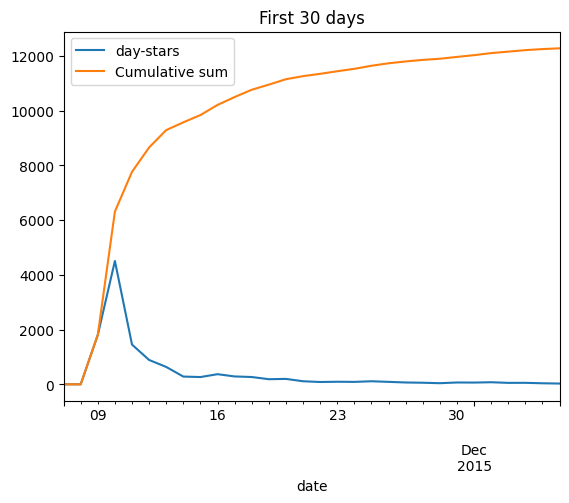
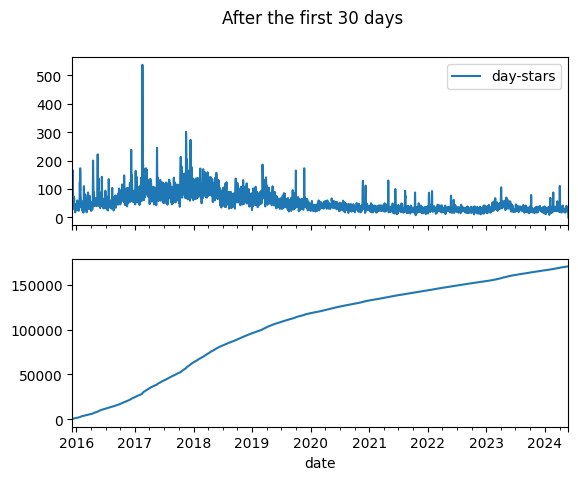
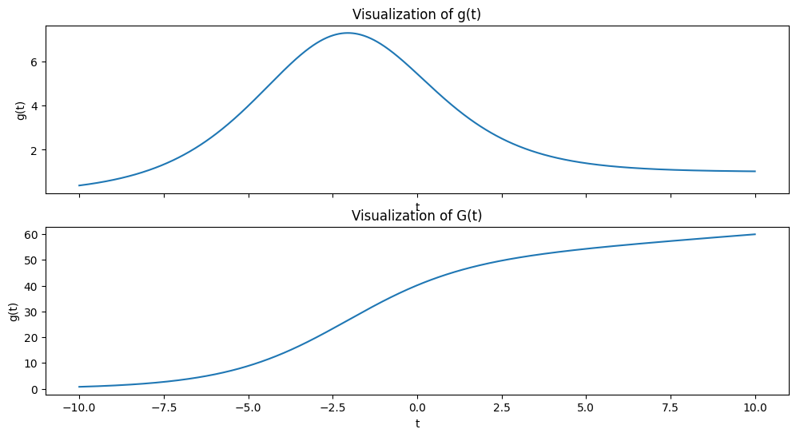
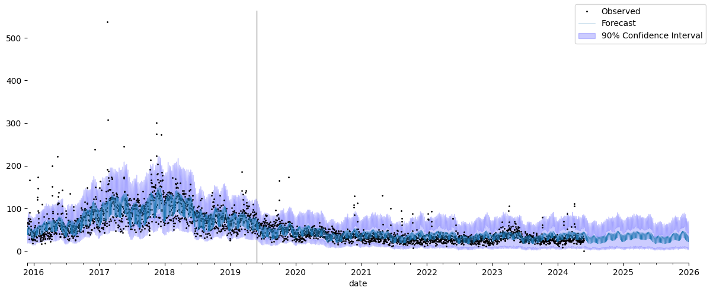

# Custom trend
This page shows how to customize the trend in Prophetverse.
Sometimes, the piecewise linear or logistic behaviour will not fit
your needs, and you may need to define a custom trend
The trends are based on `Effects`, which are defined here as components of
the Generalized Additive Model (GAM) that defines Prophet.
Trend is a special case since it is the **first** effect to be computed, so
every subsequent effect can depend on it.

## Use-case: forecasting product adoption

**Diffusion of innovations** is a theory that seeks to explain how, why, and at what rate new ideas and technology spread through cultures. This theory was formulated by E.M. Rogers in 1962 and is often used to understand the adoption or spread of new products and technologies among different groups of people.

An innovation is something new or significantly improved. This can include products, ideas, or practices that are perceived as new by an individual or other unit of adoption. Diffusion refers to the process by which an innovation is communicated over time among the participants in a social system.

The diffusion of innovations theory applies to a variety of new ideas. Here are a few examples:

## Examples of Processes Following Diffusion of Innovations

1. **Number of new unique users**: The number of new unique users of a product or service can be modeled using the diffusion of innovations theory. This can help businesses forecast their growth and plan for future expansion.

2. **Technology Adoption**: Perhaps the most common application of the theory, technology adoption refers to how new gadgets, software, or platforms spread among users. For instance, the adoption of smartphones followed this diffusion process, starting with innovators and tech enthusiasts before reaching the broader public.

3. **Healthcare Practices**: New medical practices, treatments, or health campaigns spread among medical professionals and the public using the diffusion framework. An example could be the adoption of telemedicine, which has seen increased acceptance over recent years.

4. **Sustainable Practices**: The adoption of renewable energy sources like solar panels or wind turbines often follows the diffusion of innovations model. Innovators begin by testing and using these technologies, which gradually become more mainstream as their advantages and efficiencies are recognized.

5. **Agricultural Techniques**: New farming technologies or methods, such as hydroponics or genetically modified crops, also spread through agricultural communities by following the principles of diffusion of innovations.

## The Bell-Shaped Curve

The diffusion of innovations can be visualized using a bell-shaped curve, often called the "diffusion curve." This curve is crucial for understanding the rate at which new ideas and technologies are adopted in a society. Here's how it aligns with the categories of adopters:

- **Innovators** make up the first small section on the left of the curve. These are the first few who adopt the innovation.
- **Early Adopters** follow next and represent a slightly larger segment as the curve starts to ascend.
- **Early Majority** forms the first large segment of the curve, where it reaches and crosses the mean. Adoption is becoming more common and widespread here.
- **Late Majority** comes next, at the point where the curve starts to descend. This group adopts just as the new idea or technology begins to feel outdated.
- **Laggards** are the last segment, where the curve tails off. Adoption within this group occurs very slowly and often only when necessary.

The bell-shaped curve reflects the cumulative adoption of innovations over time, demonstrating that the speed of adoption typically starts slow, accelerates until it reaches the majority of the potential market, and then slows down as fewer non-adopters remain.

This curve is central to strategic decisions in marketing, product development, and policy-making, helping stakeholders identify when and how to best introduce new ideas or technologies to different segments of society.

## The dataset

As a proxy for diffusion of innovations, we will use the number of stars received by Tensorflow Repository over time. Although this is not a perfect measure of adoption, it can give us an idea of how the popularity of the repository has grown since its inception.

This repository had an initial explosion of stars during the first ~10 days, which we will ignore since the daily granularity is not enough to capture the initial growth (hourly might work). After that, the number of starts grew by following a bell-shaped curve, which we will try to model. This curve might be related to the popularity of deep learning itself.

<div class="admonition note">
    <p class="admonition-title">Note</p>
    <p>This dataset was obtained from https://github.com/emanuelef/daily-stars-explorer. </p>
</div>


```python
import matplotlib.pyplot as plt
import pandas as pd

from prophetverse.datasets.loaders import load_tensorflow_github_stars

y = load_tensorflow_github_stars()

fig, ax = plt.subplots()
# First 30 days
y.iloc[:30].plot.line(ax=ax)
y.iloc[:30].cumsum()["day-stars"].rename("Cumulative sum").plot.line(ax=ax, legend=True)
ax.set_title("First 30 days")
fig.show()

fig, axs = plt.subplots(nrows=2, sharex=True)
y.iloc[30:].plot.line(ax=axs[0])
y.iloc[30:].cumsum()["day-stars"].rename("Cumulative sum").plot.line(ax=axs[1])
# FIgure title
fig.suptitle("After the first 30 days")
fig.show()


```
<p class="cell-output-title jp-RenderedText jp-OutputArea-output">Output: <span class="cell-output-count">[1]</span></p>


    

    


    

    


## Modeling the Diffusion of Innovations

To model this behaviour with Prophetverse, we will use the custom trend feature.

We will define a trend model class that implements the generalized logistic curve,
which accepts assymetric curves. We will also add another premise: a varying capacity, which will allow us to model a linear growth of the total addressable market (TAM) over time.  Let $G(t)$ be the logistic curve defining the acumulated number of stars at time $t$:

$$
\begin{align*}
G(t) &= \frac{C_1(t-t_0) + C_2}{\left(1 + \exp(-\alpha v (t - t_0))\right)^{\frac{1}{v}}} \\
\text{where} & \\
C_2 \in \mathbb{R}_+ &= \text{is the constant capacity term}\\
C_1 \in \mathbb{R}_+ &= \text{is the linear increasing rate of the capacity}\\
t_0 \in \mathbb{R} &= \text{is the time offset term}\\
v \in \mathbb{R}_+ &= \text{determines the shape of the curve} \\
\alpha \in \mathbb{R} &= \text{is the rate}
\end{align*}
$$

 It's derivative is:

$$
 \begin{align*}
 g(t) &= \alpha\left(1 - \frac{G(T)}{C_1(t-t_0) + C_2}\right) G(T)  + \frac{C_1}{C_1(t-t_0) + C_2}G(T)
 \end{align*}
$$

 That curve can be used as trend to model a diffusion process.
 Below, we plot it for a combination of parameters


import matplotlib.pyplot as plt


```python
import numpy as np


def g(t, C1, C2, t0, v, alpha):
    return (C1 * (t - t0) + C2) / ((1 + np.exp(-alpha * v * (t - t0))) ** (1 / v))


def normalized_generalized_logistic(x, A, v, t0):
    return 1 / (1 + np.exp(-A * v * (x - t0))) ** (1 / v)


# Define the generalized logistic function
def generalized_logistic(x, C1, C2, alpha, v, t0):
    return (C1 * x + C2) * normalized_generalized_logistic(x, alpha, v, t0)


def dgeneralized_logistic(x, C1, C2, alpha, v, t0):
    return alpha * (
        1 - (generalized_logistic(x, C1, C2, alpha, v, t0) / (C1 * x + C2)) ** v
    ) * generalized_logistic(
        x, C1, C2, alpha, v, t0
    ) + C1 * normalized_generalized_logistic(
        x, alpha, v, t0
    )


C1 = 1
C2 = 50
t0 = -2
v = 1.2
alpha = 0.5
label = (f"C1={C1:.1f}, C2={C2:.1f}, t0={t0:.1f}, v={v:.1f}, alpha={alpha:.1f}",)

t = np.linspace(-10, 10, 1000)
gt = dgeneralized_logistic(t, C1=C1, C2=C2, t0=t0, v=v, alpha=alpha)

fig, axs = plt.subplots(figsize=(12, 6), nrows=2, sharex=True)
axs[0].plot(
    t,
    gt,
    label=label,
)
axs[0].set_title("Visualization of g(t)")
axs[0].set_xlabel("t")
axs[0].set_ylabel("g(t)")

Gt = generalized_logistic(t, C1=C1, C2=C2, t0=t0, v=v, alpha=alpha)
axs[1].plot(
    t,
    Gt,
    label=label,
)
axs[1].set_title("Visualization of G(t)")
axs[1].set_xlabel("t")
axs[1].set_ylabel("g(t)")

# axs[1].grid(True, alpha=0.3)
fig.show()


```
<p class="cell-output-title jp-RenderedText jp-OutputArea-output">Output: <span class="cell-output-count">[2]</span></p>


    

    


That curve has the bell-shape and the flexiblity to not be symmetric depending on the parameters. Furthermore, it tends to a constant value ($C1$) as time goes to infinity, which represent our knowledge that the size of the "market" of tensorflow/neural networks users starts at a value and grows with time.

## Splitting the dataset

We leave 7 years to forecast, and 1.5 year to train. Note that, without the prior information on the nature of the curve, a model could simply forecast a linear growth of the number of stars, which would be a very poor forecast.


```python
split_at = -int(365 * 5)
y = y.iloc[20:]
y_train, y_test = y.iloc[:split_at], y.iloc[split_at:]


```


```python
fig, axs = plt.subplots(nrows=2, sharex=True, figsize=(12, 6))
ax = axs[0]
ax = y_train["day-stars"].rename("Train").plot.line(legend=True, ax=ax)
y_test["day-stars"].rename("Test").plot.line(ax=ax, alpha=0.2, legend=True)
ax.axvline(y_train.index[-1], color="red", linestyle="--", alpha=0.5, zorder=-1)
ax.set_title("Daily new stars", loc="left")
ax.set_xlabel("")
ax.spines["left"].set_visible(False)
ax.spines["right"].set_visible(False)
ax.spines["top"].set_visible(False)
ax.set_xlim(y.index.min(), y.index.max())
ax.set_ylim(0, 300)

ax = axs[1]
ax = y_train["day-stars"].rename("Train").cumsum().plot.line(legend=True)
(
    y_test["day-stars"].rename("Test").cumsum()
    + y_train["day-stars"].rename("Train").cumsum().max()
).plot.line(ax=ax, alpha=0.2, legend=True)
ax.axvline(y_train.index[-1], color="red", linestyle="--", alpha=0.5, zorder=-1)
ax.set_title("Total stars", loc="left")
ax.set_xlabel("")
ax.spines["left"].set_visible(False)
ax.spines["right"].set_visible(False)
# Superior
ax.spines["top"].set_visible(False)
ax.set_xlim(y.index.min(), y.index.max())

fig.suptitle("Tensorflow Stars")


```
<p class="cell-output-title jp-RenderedText jp-OutputArea-output">Output: <span class="cell-output-count">[4]</span></p>


    Text(0.5, 0.98, 'Tensorflow Stars')


    

    


## Creating the custom trend

To create a custom trend model for use in the Prophetverse library, users can extend the TrendModel abstract base class and implement the required abstract methods. Here’s a step-by-step guide to create a custom trend model, using the GenLogisticTrend class as an example.


### Step 1: Define helper functions

The GenLogisticTrend class will use the following helper functions:


```python
import jax
import jax.numpy as jnp


@jax.jit
def normalized_generalized_logistic(x, A, v, t0):
    return 1 / (1 + jnp.exp(-A * v * (x - t0))) ** (1 / v)


@jax.jit
def dnormalized_generalized_logistic(x, A, v, t0):
    return (
        A
        * (1 - normalized_generalized_logistic(x, A, v, t0) ** v)
        * normalized_generalized_logistic(x, A, v, t0)
    )


# Define the generalized logistic function


@jax.jit
def dgeneralized_logistic(x, K1, K2, A, v, M):
    return dnormalized_generalized_logistic(x, A, v, M) * (
        K1 * x + K2
    ) + K1 * normalized_generalized_logistic(x, A, v, M)


```

### Step 2: Define the Custom Trend Model Class

Create a new class that extends the TrendModel abstract base class. Implement the abstract methods initialize, prepare_input_data, and compute_trend.


```python
import numpyro
from numpyro import distributions as dist

from prophetverse.distributions import GammaReparametrized
from prophetverse.effects import BaseEffect
from prophetverse.effects.trend import TrendEffectMixin
from prophetverse.utils.frame_to_array import convert_index_to_days_since_epoch


class GenLogisticTrend(TrendEffectMixin, BaseEffect):
    """
    Custom trend model based on the Generalized Logistic function.
    """

    def __init__(
        self,
        logistic_capacity_dist=dist.HalfNormal(10),
        logistic_capacity2_dist=dist.HalfNormal(50_000),
        shape_dist=dist.Gamma(1, 1),
        logistic_rate_dist=GammaReparametrized(0.01, 0.01),
        offset_prior=dist.Normal(0, 365 * 2),
    ):

        self.logistic_capacity_dist = logistic_capacity_dist
        self.logistic_capacity2_dist = logistic_capacity2_dist
        self.shape_dist = shape_dist
        self.logistic_rate_dist = logistic_rate_dist
        self.offset_prior = offset_prior

        super().__init__()

    def _fit(self, y: pd.DataFrame, X: pd.DataFrame, scale: float = 1):
        """Initialize the effect.

        Set the prior location for the trend.

        Parameters
        ----------
        y : pd.DataFrame
            The timeseries dataframe

        X : pd.DataFrame
            The DataFrame to initialize the effect.

        scale : float, optional
            The scale of the timeseries. For multivariate timeseries, this is
            a dataframe. For univariate, it is a simple float.
        """
        t = convert_index_to_days_since_epoch(y.index)
        self.t_min_ = t.min()
        t = t - self.t_min_

    def _transform(self, X: pd.DataFrame, fh: pd.PeriodIndex) -> dict:
        """
        Prepare the input data for the piecewise trend model.

        Parameters
        ----------
        X: pd.DataFrame
            The exogenous variables DataFrame.
        fh: pd.Index
            The forecasting horizon as a pandas Index.

        Returns
        -------
        jnp.ndarray
            An array containing the prepared input data.
        """
        t = convert_index_to_days_since_epoch(fh)
        t = t - self.t_min_
        self.offset_prior_loc = len(fh)
        return t

    def _predict(self, data, previous_effects, params):
        """
        Compute the trend based on the Generalized Logistic function.

        Parameters
        ----------
        data: jnp.ndarray
            The changepoint matrix.
        predicted_effects: Dict[str, jnp.ndarray]
            Dictionary of previously computed effects. For the trend, it is an empty
            dict.

        Returns
        -------
        jnp.ndarray
            The computed trend.
        """
        # Alias for clarity
        time = data

        logistic_rate = numpyro.sample("logistic_rate", self.logistic_rate_dist)

        logistic_capacity1 = numpyro.sample(
            "logistic_capacity",
            self.logistic_capacity_dist,
        )

        logistic_capacity2 = numpyro.sample(
            "logistic_capacity2",
            self.logistic_capacity2_dist,
        )

        shape = numpyro.sample("logistic_shape", self.shape_dist)

        offset = numpyro.sample("offset", self.offset_prior)

        trend = dgeneralized_logistic(
            time,
            K1=logistic_capacity1,
            K2=logistic_capacity2,
            A=logistic_rate,
            v=shape,
            M=offset,
        )

        numpyro.deterministic("__trend", trend)

        numpyro.deterministic(
            "capacity", logistic_capacity1 * (time - offset) + logistic_capacity2
        )

        return trend.reshape((-1, 1))


```
<p class="cell-output-title jp-RenderedText jp-OutputArea-output">Output: <span class="cell-output-count">[6]</span></p>

## Fit the model and make predictions


```python

import numpyro
from sktime.transformations.series.fourier import FourierFeatures

from prophetverse.effects import LinearFourierSeasonality
from prophetverse.effects.linear import LinearEffect
from prophetverse.engine import MCMCInferenceEngine
from prophetverse.sktime import Prophetverse
from prophetverse.utils.regex import no_input_columns, starts_with

numpyro.enable_x64()

model = Prophetverse(
    likelihood="negbinomial",
    trend=GenLogisticTrend(),
    exogenous_effects=[
        (
            "seasonality",
            LinearFourierSeasonality(
                sp_list=[7, 365.25],
                fourier_terms_list=[3, 8],
                freq="D",
                prior_scale=0.1,
                effect_mode="multiplicative",
            ),
            no_input_columns,
        ),
    ],
    inference_engine=MCMCInferenceEngine(
        num_samples=500,
        num_warmup=1000,
    ),
    # Avoid normalization of the timeseries by setting
    # scale=1
    scale=1,
    noise_scale=10,
)

numpyro.enable_x64()

model.fit(y_train)


```
<p class="cell-output-title jp-RenderedText jp-OutputArea-output">Output: <span class="cell-output-count">[7]</span></p>


<style>#sk-15b18a31-4c61-4cf5-8d90-5211e1c714d3 {
    /* Definition of color scheme common for light and dark mode */
    --sklearn-color-text: black;
    --sklearn-color-line: gray;
    /* Definition of color scheme for objects */
    --sklearn-color-level-0: #fff5e6;
    --sklearn-color-level-1: #f6e4d2;
    --sklearn-color-level-2: #ffe0b3;
    --sklearn-color-level-3: chocolate;

    /* Specific color for light theme */
    --sklearn-color-text-on-default-background: var(--theme-code-foreground, var(--jp-content-font-color1, black));
    --sklearn-color-background: var(--theme-background, var(--jp-layout-color0, white));
    --sklearn-color-border-box: var(--theme-code-foreground, var(--jp-content-font-color1, black));
    --sklearn-color-icon: #696969;

    @media (prefers-color-scheme: dark) {
      /* Redefinition of color scheme for dark theme */
      --sklearn-color-text-on-default-background: var(--theme-code-foreground, var(--jp-content-font-color1, white));
      --sklearn-color-background: var(--theme-background, var(--jp-layout-color0, #111));
      --sklearn-color-border-box: var(--theme-code-foreground, var(--jp-content-font-color1, white));
      --sklearn-color-icon: #878787;
    }
  }

  #sk-15b18a31-4c61-4cf5-8d90-5211e1c714d3 {
    color: var(--sklearn-color-text);
  }

  #sk-15b18a31-4c61-4cf5-8d90-5211e1c714d3 pre {
    padding: 0;
  }

  #sk-15b18a31-4c61-4cf5-8d90-5211e1c714d3 input.sk-hidden--visually {
    border: 0;
    clip: rect(1px 1px 1px 1px);
    clip: rect(1px, 1px, 1px, 1px);
    height: 1px;
    margin: -1px;
    overflow: hidden;
    padding: 0;
    position: absolute;
    width: 1px;
  }

  #sk-15b18a31-4c61-4cf5-8d90-5211e1c714d3 div.sk-dashed-wrapped {
    border: 1px dashed var(--sklearn-color-line);
    margin: 0 0.4em 0.5em 0.4em;
    box-sizing: border-box;
    padding-bottom: 0.4em;
    background-color: var(--sklearn-color-background);
  }

  #sk-15b18a31-4c61-4cf5-8d90-5211e1c714d3 div.sk-container {
    /* jupyter's `normalize.less` sets `[hidden] { display: none; }`
       but bootstrap.min.css set `[hidden] { display: none !important; }`
       so we also need the `!important` here to be able to override the
       default hidden behavior on the sphinx rendered scikit-learn.org.
       See: https://github.com/scikit-learn/scikit-learn/issues/21755 */
    display: inline-block !important;
    position: relative;
  }

  #sk-15b18a31-4c61-4cf5-8d90-5211e1c714d3 div.sk-text-repr-fallback {
    display: none;
  }

  div.sk-parallel-item,
  div.sk-serial,
  div.sk-item {
    /* draw centered vertical line to link estimators */
    background-image: linear-gradient(var(--sklearn-color-text-on-default-background), var(--sklearn-color-text-on-default-background));
    background-size: 2px 100%;
    background-repeat: no-repeat;
    background-position: center center;
  }

  /* Parallel-specific style estimator block */

  #sk-15b18a31-4c61-4cf5-8d90-5211e1c714d3 div.sk-parallel-item::after {
    content: "";
    width: 100%;
    border-bottom: 2px solid var(--sklearn-color-text-on-default-background);
    flex-grow: 1;
  }

  #sk-15b18a31-4c61-4cf5-8d90-5211e1c714d3 div.sk-parallel {
    display: flex;
    align-items: stretch;
    justify-content: center;
    background-color: var(--sklearn-color-background);
    position: relative;
  }

  #sk-15b18a31-4c61-4cf5-8d90-5211e1c714d3 div.sk-parallel-item {
    display: flex;
    flex-direction: column;
  }

  #sk-15b18a31-4c61-4cf5-8d90-5211e1c714d3 div.sk-parallel-item:first-child::after {
    align-self: flex-end;
    width: 50%;
  }

  #sk-15b18a31-4c61-4cf5-8d90-5211e1c714d3 div.sk-parallel-item:last-child::after {
    align-self: flex-start;
    width: 50%;
  }

  #sk-15b18a31-4c61-4cf5-8d90-5211e1c714d3 div.sk-parallel-item:only-child::after {
    width: 0;
  }

  /* Serial-specific style estimator block */

  #sk-15b18a31-4c61-4cf5-8d90-5211e1c714d3 div.sk-serial {
    display: flex;
    flex-direction: column;
    align-items: center;
    background-color: var(--sklearn-color-background);
    padding-right: 1em;
    padding-left: 1em;
  }


  /* Toggleable style: style used for estimator/Pipeline/ColumnTransformer box that is
  clickable and can be expanded/collapsed.
  - Pipeline and ColumnTransformer use this feature and define the default style
  - Estimators will overwrite some part of the style using the `sk-estimator` class
  */

  /* Pipeline and ColumnTransformer style (default) */

  #sk-15b18a31-4c61-4cf5-8d90-5211e1c714d3 div.sk-toggleable {
    /* Default theme specific background. It is overwritten whether we have a
    specific estimator or a Pipeline/ColumnTransformer */
    background-color: var(--sklearn-color-background);
  }

  /* Toggleable label */
  #sk-15b18a31-4c61-4cf5-8d90-5211e1c714d3 label.sk-toggleable__label {
    cursor: pointer;
    display: block;
    width: 100%;
    margin-bottom: 0;
    padding: 0.5em;
    box-sizing: border-box;
    text-align: center;
  }

  #sk-15b18a31-4c61-4cf5-8d90-5211e1c714d3 label.sk-toggleable__label-arrow:before {
    /* Arrow on the left of the label */
    content: "▸";
    float: left;
    margin-right: 0.25em;
    color: var(--sklearn-color-icon);
  }

  #sk-15b18a31-4c61-4cf5-8d90-5211e1c714d3 label.sk-toggleable__label-arrow:hover:before {
    color: var(--sklearn-color-text);
  }

  /* Toggleable content - dropdown */

  #sk-15b18a31-4c61-4cf5-8d90-5211e1c714d3 div.sk-toggleable__content {
    max-height: 0;
    max-width: 0;
    overflow: hidden;
    text-align: left;
    background-color: var(--sklearn-color-level-0);
  }

  #sk-15b18a31-4c61-4cf5-8d90-5211e1c714d3 div.sk-toggleable__content pre {
    margin: 0.2em;
    border-radius: 0.25em;
    color: var(--sklearn-color-text);
    background-color: var(--sklearn-color-level-0);
  }

  #sk-15b18a31-4c61-4cf5-8d90-5211e1c714d3 input.sk-toggleable__control:checked~div.sk-toggleable__content {
    /* Expand drop-down */
    max-height: 200px;
    max-width: 100%;
    overflow: auto;
  }

  #sk-15b18a31-4c61-4cf5-8d90-5211e1c714d3 input.sk-toggleable__control:checked~label.sk-toggleable__label-arrow:before {
    content: "▾";
  }

  /* Pipeline/ColumnTransformer-specific style */

  #sk-15b18a31-4c61-4cf5-8d90-5211e1c714d3 div.sk-label input.sk-toggleable__control:checked~label.sk-toggleable__label {
    color: var(--sklearn-color-text);
    background-color: var(--sklearn-color-level-2);
  }

  /* Estimator-specific style */

  /* Colorize estimator box */
  #sk-15b18a31-4c61-4cf5-8d90-5211e1c714d3 div.sk-estimator input.sk-toggleable__control:checked~label.sk-toggleable__label {
    /* unfitted */
    background-color: var(--sklearn-color-level-2);
  }

  #sk-15b18a31-4c61-4cf5-8d90-5211e1c714d3 div.sk-label label.sk-toggleable__label,
  #sk-15b18a31-4c61-4cf5-8d90-5211e1c714d3 div.sk-label label {
    /* The background is the default theme color */
    color: var(--sklearn-color-text-on-default-background);
  }

  /* On hover, darken the color of the background */
  #sk-15b18a31-4c61-4cf5-8d90-5211e1c714d3 div.sk-label:hover label.sk-toggleable__label {
    color: var(--sklearn-color-text);
    background-color: var(--sklearn-color-level-2);
  }

  /* Estimator label */

  #sk-15b18a31-4c61-4cf5-8d90-5211e1c714d3 div.sk-label label {
    font-family: monospace;
    font-weight: bold;
    display: inline-block;
    line-height: 1.2em;
  }

  #sk-15b18a31-4c61-4cf5-8d90-5211e1c714d3 div.sk-label-container {
    text-align: center;
  }

  /* Estimator-specific */
  #sk-15b18a31-4c61-4cf5-8d90-5211e1c714d3 div.sk-estimator {
    font-family: monospace;
    border: 1px dotted var(--sklearn-color-border-box);
    border-radius: 0.25em;
    box-sizing: border-box;
    margin-bottom: 0.5em;
    background-color: var(--sklearn-color-level-0);
  }

  /* on hover */
  #sk-15b18a31-4c61-4cf5-8d90-5211e1c714d3 div.sk-estimator:hover {
    background-color: var(--sklearn-color-level-2);
  }

  /* Specification for estimator info */

  .sk-estimator-doc-link,
  a:link.sk-estimator-doc-link,
  a:visited.sk-estimator-doc-link {
    float: right;
    font-size: smaller;
    line-height: 1em;
    font-family: monospace;
    background-color: var(--sklearn-color-background);
    border-radius: 1em;
    height: 1em;
    width: 1em;
    text-decoration: none !important;
    margin-left: 1ex;
    border: var(--sklearn-color-level-1) 1pt solid;
    color: var(--sklearn-color-level-1);
  }

  /* On hover */
  div.sk-estimator:hover .sk-estimator-doc-link:hover,
  .sk-estimator-doc-link:hover,
  div.sk-label-container:hover .sk-estimator-doc-link:hover,
  .sk-estimator-doc-link:hover {
    background-color: var(--sklearn-color-level-3);
    color: var(--sklearn-color-background);
    text-decoration: none;
  }

  /* Span, style for the box shown on hovering the info icon */
  .sk-estimator-doc-link span {
    display: none;
    z-index: 9999;
    position: relative;
    font-weight: normal;
    right: .2ex;
    padding: .5ex;
    margin: .5ex;
    width: min-content;
    min-width: 20ex;
    max-width: 50ex;
    color: var(--sklearn-color-text);
    box-shadow: 2pt 2pt 4pt #999;
    background: var(--sklearn-color-level-0);
    border: .5pt solid var(--sklearn-color-level-3);
  }

  .sk-estimator-doc-link:hover span {
    display: block;
  }

  /* "?"-specific style due to the `<a>` HTML tag */

  #sk-15b18a31-4c61-4cf5-8d90-5211e1c714d3 a.estimator_doc_link {
    float: right;
    font-size: 1rem;
    line-height: 1em;
    font-family: monospace;
    background-color: var(--sklearn-color-background);
    border-radius: 1rem;
    height: 1rem;
    width: 1rem;
    text-decoration: none;
    color: var(--sklearn-color-level-1);
    border: var(--sklearn-color-level-1) 1pt solid;
  }

  /* On hover */
  #sk-15b18a31-4c61-4cf5-8d90-5211e1c714d3 a.estimator_doc_link:hover {
    background-color: var(--sklearn-color-level-3);
    color: var(--sklearn-color-background);
    text-decoration: none;
  }
</style><div id='sk-15b18a31-4c61-4cf5-8d90-5211e1c714d3' class="sk-top-container"><div class="sk-text-repr-fallback"><pre>Prophetverse(exogenous_effects=[(&#x27;seasonality&#x27;,
                                 LinearFourierSeasonality(effect_mode=&#x27;multiplicative&#x27;,
                                                          fourier_terms_list=[3,
                                                                              8],
                                                          freq=&#x27;D&#x27;,
                                                          prior_scale=0.1,
                                                          sp_list=[7, 365.25]),
                                 &#x27;^$&#x27;)],
             inference_engine=MCMCInferenceEngine(num_samples=500,
                                                  num_warmup=1000),
             likelihood=&#x27;negbinomial&#x27;, noise_scale=10, scale=1,
             trend=GenLogisticTrend())</pre><b>Please rerun this cell to show the HTML repr or trust the notebook.</b></div><div class="sk-container" hidden><div class="sk-item sk-dashed-wrapped"><div class='sk-label-container'><div class="sk-label sk-toggleable"><input class="sk-toggleable__control sk-hidden--visually" id=UUID('65313f51-9dca-40fc-837d-af15afdc817f') type="checkbox" ><label for=UUID('65313f51-9dca-40fc-837d-af15afdc817f') class='sk-toggleable__label sk-toggleable__label-arrow'>Prophetverse</label><div class="sk-toggleable__content"><pre>Prophetverse(exogenous_effects=[(&#x27;seasonality&#x27;,
                                 LinearFourierSeasonality(effect_mode=&#x27;multiplicative&#x27;,
                                                          fourier_terms_list=[3,
                                                                              8],
                                                          freq=&#x27;D&#x27;,
                                                          prior_scale=0.1,
                                                          sp_list=[7, 365.25]),
                                 &#x27;^$&#x27;)],
             inference_engine=MCMCInferenceEngine(num_samples=500,
                                                  num_warmup=1000),
             likelihood=&#x27;negbinomial&#x27;, noise_scale=10, scale=1,
             trend=GenLogisticTrend())</pre></div></div></div><div class="sk-parallel"><div class="sk-parallel-item"><div class="sk-item"><div class='sk-label-container'><div class="sk-label sk-toggleable"><label>effects</label></div></div><div class="sk-serial"><div class="sk-item"><div class="sk-serial"><div class='sk-item'><div class="sk-estimator sk-toggleable"><input class="sk-toggleable__control sk-hidden--visually" id=UUID('bf6d3e77-3a81-465d-8b87-76d812b038e3') type="checkbox" ><label for=UUID('bf6d3e77-3a81-465d-8b87-76d812b038e3') class='sk-toggleable__label sk-toggleable__label-arrow'>GenLogisticTrend</label><div class="sk-toggleable__content"><pre>GenLogisticTrend()</pre></div></div></div><div class='sk-item'><div class="sk-estimator sk-toggleable"><input class="sk-toggleable__control sk-hidden--visually" id=UUID('79bfbb3c-dc38-407b-b452-b45548076c19') type="checkbox" ><label for=UUID('79bfbb3c-dc38-407b-b452-b45548076c19') class='sk-toggleable__label sk-toggleable__label-arrow'>LinearFourierSeasonality</label><div class="sk-toggleable__content"><pre>LinearFourierSeasonality(effect_mode=&#x27;multiplicative&#x27;,
                         fourier_terms_list=[3, 8], freq=&#x27;D&#x27;, prior_scale=0.1,
                         sp_list=[7, 365.25])</pre></div></div></div></div></div></div></div></div><div class="sk-parallel-item"><div class="sk-item"><div class='sk-label-container'><div class="sk-label sk-toggleable"><label>inference_engine</label></div></div><div class="sk-serial"><div class='sk-item'><div class="sk-estimator sk-toggleable"><input class="sk-toggleable__control sk-hidden--visually" id=UUID('37310850-241d-4da6-a5c0-149131a9b19e') type="checkbox" ><label for=UUID('37310850-241d-4da6-a5c0-149131a9b19e') class='sk-toggleable__label sk-toggleable__label-arrow'>MCMCInferenceEngine</label><div class="sk-toggleable__content"><pre>MCMCInferenceEngine(num_samples=500, num_warmup=1000)</pre></div></div></div></div></div></div></div></div></div></div>


```python
import matplotlib.pyplot as plt

fh = pd.period_range(y.index.min(), "2026-01-01")
preds = model.predict(fh=fh)
interval = model.predict_interval(
    fh=fh,
    coverage=0.9,
)
display(preds.head())


```
<p class="cell-output-title jp-RenderedText jp-OutputArea-output">Output: <span class="cell-output-count">[8]</span></p>


<div>
<style scoped>
    .dataframe tbody tr th:only-of-type {
        vertical-align: middle;
    }

    .dataframe tbody tr th {
        vertical-align: top;
    }

    .dataframe thead th {
        text-align: right;
    }
</style>
<table border="1" class="dataframe">
  <thead>
    <tr style="text-align: right;">
      <th></th>
      <th>day-stars</th>
    </tr>
  </thead>
  <tbody>
    <tr>
      <th>2015-11-27</th>
      <td>53.167550</td>
    </tr>
    <tr>
      <th>2015-11-28</th>
      <td>38.729958</td>
    </tr>
    <tr>
      <th>2015-11-29</th>
      <td>38.421034</td>
    </tr>
    <tr>
      <th>2015-11-30</th>
      <td>52.242276</td>
    </tr>
    <tr>
      <th>2015-12-01</th>
      <td>54.248416</td>
    </tr>
  </tbody>
</table>
</div>


```python
interval.columns = interval.columns.droplevel([0, 1])
interval.head()


```
<p class="cell-output-title jp-RenderedText jp-OutputArea-output">Output: <span class="cell-output-count">[9]</span></p>


<div>
<style scoped>
    .dataframe tbody tr th:only-of-type {
        vertical-align: middle;
    }

    .dataframe tbody tr th {
        vertical-align: top;
    }

    .dataframe thead th {
        text-align: right;
    }
</style>
<table border="1" class="dataframe">
  <thead>
    <tr style="text-align: right;">
      <th></th>
      <th>lower</th>
      <th>upper</th>
    </tr>
  </thead>
  <tbody>
    <tr>
      <th>2015-11-27</th>
      <td>29.95</td>
      <td>79.00</td>
    </tr>
    <tr>
      <th>2015-11-28</th>
      <td>19.95</td>
      <td>60.00</td>
    </tr>
    <tr>
      <th>2015-11-29</th>
      <td>21.00</td>
      <td>59.05</td>
    </tr>
    <tr>
      <th>2015-11-30</th>
      <td>31.00</td>
      <td>82.00</td>
    </tr>
    <tr>
      <th>2015-12-01</th>
      <td>31.00</td>
      <td>82.00</td>
    </tr>
  </tbody>
</table>
</div>


# Plotting the results


```python
# Just the scatter of y, without lines
fig, ax = plt.subplots(figsize=(12, 5))
ax = (
    y["day-stars"]
    .rename("Observed")
    .plot.line(
        marker="o", linestyle="None", legend=False, markersize=1, color="black", ax=ax
    )
)
ax.axvline(y_train.index.max(), color="black", zorder=-1, alpha=0.4, linewidth=1)
ax.spines["left"].set_visible(False)
ax.spines["right"].set_visible(False)
# Superior
ax.spines["top"].set_visible(False)

preds["day-stars"].rename("Forecast").plot.line(
    ax=ax, alpha=1, linewidth=0.5, legend=False
)

ax.fill_between(
    fh.to_timestamp(),
    interval["lower"],
    interval["upper"],
    color="blue",
    alpha=0.2,
    zorder=-1,
    label="90% Credible Interval",
)
fig.legend()
fig.tight_layout()
fig.show()


```
<p class="cell-output-title jp-RenderedText jp-OutputArea-output">Output: <span class="cell-output-count">[10]</span></p>


    

    


```python
# Forecast samples
yhat_samples = model.predict_samples(fh=fh)
# Samples of all sites (capacity, for example, that we had set as deterministic with numpyro.deterministic)
site_samples = model.predict_component_samples(fh=fh)


```
<p class="cell-output-title jp-RenderedText jp-OutputArea-output">Output: <span class="cell-output-count">[11]</span></p>


```python
# Set number of columns to display to 4 temporarily
pd.set_option("display.max_columns", 4)
yhat_samples.head()


```
<p class="cell-output-title jp-RenderedText jp-OutputArea-output">Output: <span class="cell-output-count">[12]</span></p>


<div>
<style scoped>
    .dataframe tbody tr th:only-of-type {
        vertical-align: middle;
    }

    .dataframe tbody tr th {
        vertical-align: top;
    }

    .dataframe thead th {
        text-align: right;
    }
</style>
<table border="1" class="dataframe">
  <thead>
    <tr style="text-align: right;">
      <th></th>
      <th>0</th>
      <th>1</th>
      <th>...</th>
      <th>498</th>
      <th>499</th>
    </tr>
  </thead>
  <tbody>
    <tr>
      <th>2015-11-27</th>
      <td>56</td>
      <td>68</td>
      <td>...</td>
      <td>94</td>
      <td>58</td>
    </tr>
    <tr>
      <th>2015-11-28</th>
      <td>12</td>
      <td>63</td>
      <td>...</td>
      <td>52</td>
      <td>23</td>
    </tr>
    <tr>
      <th>2015-11-29</th>
      <td>28</td>
      <td>33</td>
      <td>...</td>
      <td>34</td>
      <td>49</td>
    </tr>
    <tr>
      <th>2015-11-30</th>
      <td>54</td>
      <td>59</td>
      <td>...</td>
      <td>56</td>
      <td>49</td>
    </tr>
    <tr>
      <th>2015-12-01</th>
      <td>42</td>
      <td>41</td>
      <td>...</td>
      <td>29</td>
      <td>68</td>
    </tr>
  </tbody>
</table>
<p>5 rows × 500 columns</p>
</div>


```python
# Get quantile 0.25, 0.75 and mean
import functools


def q25(x):
    return np.quantile(x, q=0.25)


def q75(x):
    return np.quantile(x, q=0.75)


site_quantiles = site_samples.groupby(level=[-1]).agg(
    [
        np.mean,
        q25,
        q75,
    ]
)
site_quantiles.head()


```
<p class="cell-output-title jp-RenderedText jp-OutputArea-output">Output: <span class="cell-output-count">[13]</span></p>


<div>
<style scoped>
    .dataframe tbody tr th:only-of-type {
        vertical-align: middle;
    }

    .dataframe tbody tr th {
        vertical-align: top;
    }

    .dataframe thead tr th {
        text-align: left;
    }
</style>
<table border="1" class="dataframe">
  <thead>
    <tr>
      <th></th>
      <th colspan="2" halign="left">mean</th>
      <th>...</th>
      <th colspan="2" halign="left">trend/capacity</th>
    </tr>
    <tr>
      <th></th>
      <th>mean</th>
      <th>q25</th>
      <th>...</th>
      <th>q25</th>
      <th>q75</th>
    </tr>
  </thead>
  <tbody>
    <tr>
      <th>2015-11-27</th>
      <td>53.167550</td>
      <td>51.643131</td>
      <td>...</td>
      <td>42214.150393</td>
      <td>79390.725753</td>
    </tr>
    <tr>
      <th>2015-11-28</th>
      <td>38.729958</td>
      <td>37.471232</td>
      <td>...</td>
      <td>42257.753786</td>
      <td>79417.386110</td>
    </tr>
    <tr>
      <th>2015-11-29</th>
      <td>38.421034</td>
      <td>37.205271</td>
      <td>...</td>
      <td>42301.357178</td>
      <td>79444.046467</td>
    </tr>
    <tr>
      <th>2015-11-30</th>
      <td>52.242276</td>
      <td>50.809756</td>
      <td>...</td>
      <td>42344.960570</td>
      <td>79470.706825</td>
    </tr>
    <tr>
      <th>2015-12-01</th>
      <td>54.248416</td>
      <td>52.783770</td>
      <td>...</td>
      <td>42388.563962</td>
      <td>79497.367182</td>
    </tr>
  </tbody>
</table>
<p>5 rows × 18 columns</p>
</div>


```python
fig, ax = plt.subplots(figsize=(12, 5))

# Plot true value
ax.plot(y.index.to_timestamp(), y.cumsum(), label="Observed")

# Train test split
ax.axvline(y_train.index.max(), color="black", alpha=0.8, zorder=-1, linewidth=1)


# Capacity asymptotic
ax.fill_between(
    fh.to_timestamp(),
    site_quantiles.loc[:, ("trend/capacity", "q25")],
    site_quantiles.loc[:, ("trend/capacity", "q75")],
    color="red",
    alpha=0.1,
    zorder=-1,
    label="Asymptotic capacity",
)
ax.plot(
    fh.to_timestamp(),
    site_quantiles.loc[:, ("trend/capacity", "mean")],
    color="red",
    alpha=0.2,
    linestyle="--",
    zorder=-1,
    linewidth=0.9,
)


# Plot some random samples
idxs = np.random.choice(yhat_samples.columns, 10)

for i, idx in enumerate(idxs):
    kwargs = {}
    if i == 0:
        kwargs["label"] = "MCMC Samples"
    ax.plot(
        fh.to_timestamp(),
        yhat_samples.cumsum().loc[:, idx],
        color="black",
        alpha=0.1,
        linewidth=1,
        **kwargs,
    )

# ax.plot(fh.to_timestamp(), (fh.to_timestamp() - fh.to_timestamp().min()).days * capacity_mean_asymptotic + capacity_mean , color="red", alpha=0.5, linestyle="--")

upper_and_lower_cumsum = (
    yhat_samples.cumsum().quantile([alpha / 2, 1 - alpha / 2], axis=1).T
)
ax.fill_between(
    upper_and_lower_cumsum.index.to_timestamp(),
    upper_and_lower_cumsum.iloc[:, 0],
    upper_and_lower_cumsum.iloc[:, 1],
    alpha=0.5,
)
ax.grid(alpha=0.2)
ax.spines["left"].set_visible(False)
ax.spines["right"].set_visible(False)
# Superior
ax.spines["top"].set_visible(False)

ax.set_xlim(fh.to_timestamp().min(), fh.to_timestamp().max())

# Add samples to legend

fig.legend()
ax.set_title("Total number of stars (forecast)")
fig.show()


```
<p class="cell-output-title jp-RenderedText jp-OutputArea-output">Output: <span class="cell-output-count">[14]</span></p>


    

    

