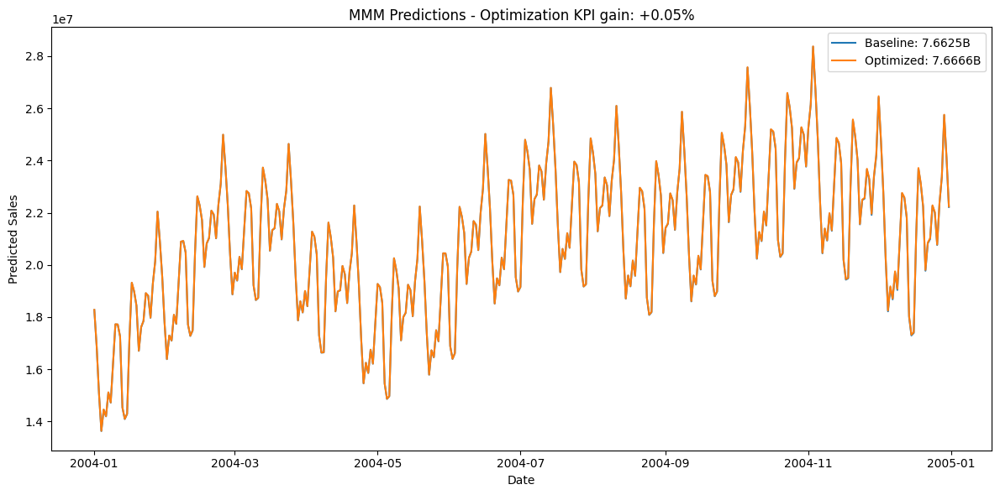
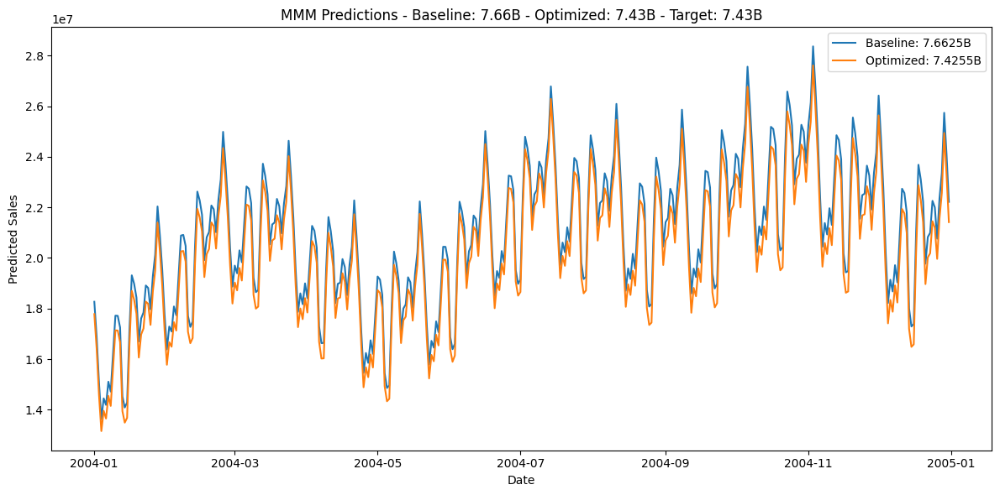

# Budget Optimization

In this tutorial, you’ll learn how to use Prophetverse’s budget-optimization module to:

- **Allocate daily spend across channels** to maximize a key performance indicator (KPI).
- **Minimize total spend** required to achieve a target KPI.

You’ll also see how to switch between two parametrizations without hassle:

- **Daily-spend mode**: Optimize the exact dollar amount for each day and channel.
- **Share-of-budget mode**: Fix your overall spending pattern and optimize only the channel shares.

By the end, you’ll know how to pick the right setup for your campaign goals and make adjustments in seconds.


## 1. Setting Up the Problem

In this example, we will load the same dataset as in the previous tutorial,
and use the complete model, including the calibration with lift tests and
attribution models.


```python
import numpyro

numpyro.enable_x64()

import matplotlib.pyplot as plt
import pandas as pd


```
<p class="cell-output-title jp-RenderedText jp-OutputArea-output">Output: <span class="cell-output-count">[1]</span></p>

### 1.1 Load synthetic data


```python
from prophetverse.datasets._mmm.dataset1 import get_dataset

y, X, lift_tests, true_components, model = get_dataset()


```
<p class="cell-output-title jp-RenderedText jp-OutputArea-output">Output: <span class="cell-output-count">[2]</span></p>

### 1.2 Utility plotting functions


```python
def plot_spend_comparison(
    X_baseline,
    X_optimized,
    channels,
    indexer,
    *,
    baseline_title="Baseline Spend",
    optimized_title="Optimized Spend",
    figsize=(12, 6),
):
    """Plot baseline vs. optimized spend for the specified channels."""
    fig, ax = plt.subplots(1, 2, figsize=figsize)

    X_baseline.loc[indexer, channels].plot(ax=ax[0], title=baseline_title)
    X_optimized.loc[indexer, channels].plot(ax=ax[1], title=optimized_title)

    for a in ax:
        a.set_ylabel("Spend")
        a.set_xlabel("Date")

    plt.tight_layout()
    return fig, ax


def plot_predictions_comparison(
    y_baseline,
    y_optimized,
    *,
    target=None,
    baseline_label="Baseline",
    optimized_label="Optimized",
    ylabel="Predicted Sales",
    figsize=(12, 6),
):
    """Plot baseline vs. optimized KPI predictions, optionally with a target."""
    total_baseline = y_baseline.sum()
    total_optimized = y_optimized.sum()

    plt.figure(figsize=figsize)
    plt.plot(
        y_baseline.index.to_timestamp(),
        y_baseline,
        label=f"{baseline_label}: {total_baseline/1e9:.4f}B",
    )
    plt.plot(
        y_optimized.index.to_timestamp(),
        y_optimized,
        label=f"{optimized_label}: {total_optimized/1e9:.4f}B",
    )

    if target is not None:
        title = (
            f"MMM Predictions - Baseline: {total_baseline/1e9:.2f}B - "
            f"Optimized: {total_optimized/1e9:.2f}B - Target: {target/1e9:.2f}B"
        )
    else:
        title = "MMM Predictions"

    plt.title(title)
    plt.xlabel("Date")
    plt.ylabel(ylabel)
    plt.legend()
    plt.tight_layout()
    return plt.gcf()


```


## 2. Budget Optimization

Once we have our model to predict the KPI, we can use it to optimize our
budget-allocation strategy.

You can use this feature to provide not only a descriptive analysis of the
channels’ contributions, but also a prescriptive analysis of the budget allocation.

The budget-optimization module is designed to be flexible and extensible.
It is composed of three main components:

* **The objective function** – what you want to optimize.
* **The constraints** – e.g. budget caps, channel-share rules, or any custom rule.
* **The parametrization transform** – optionally, how you want to parameterize the problem.

For example, instead of optimizing the daily spend for each channel, you can optimize the share of budget for each channel while keeping the overall spending pattern fixed.


### Maximizing a KPI

The `BudgetOptimizer` class is the main entry point for the budget-optimization module.
It takes these three components as input and uses them to optimize the budget allocation.
During `optimize`, you pass the model, the data, the horizon, and which columns to optimize.

Your data `X` must cover the optimization horizon. The values in `X.loc[horizon, columns]`
are treated as initial guesses.


```python
from prophetverse.experimental.budget_optimization import (
    BudgetOptimizer,
    SharedBudgetConstraint,
    MaximizeKPI,
)

budget_optimizer = BudgetOptimizer(
    objective=MaximizeKPI(),
    constraints=[SharedBudgetConstraint()],
)
budget_optimizer


```
<p class="cell-output-title jp-RenderedText jp-OutputArea-output">Output: <span class="cell-output-count">[4]</span></p>


<style>#sk-afc4b77c-67ac-4f36-a3f8-1d2fd974a53c {color: black;background-color: white;}#sk-afc4b77c-67ac-4f36-a3f8-1d2fd974a53c pre{padding: 0;}#sk-afc4b77c-67ac-4f36-a3f8-1d2fd974a53c div.sk-toggleable {background-color: white;}#sk-afc4b77c-67ac-4f36-a3f8-1d2fd974a53c label.sk-toggleable__label {cursor: pointer;display: block;width: 100%;margin-bottom: 0;padding: 0.3em;box-sizing: border-box;text-align: center;}#sk-afc4b77c-67ac-4f36-a3f8-1d2fd974a53c label.sk-toggleable__label-arrow:before {content: "▸";float: left;margin-right: 0.25em;color: #696969;}#sk-afc4b77c-67ac-4f36-a3f8-1d2fd974a53c label.sk-toggleable__label-arrow:hover:before {color: black;}#sk-afc4b77c-67ac-4f36-a3f8-1d2fd974a53c div.sk-estimator:hover label.sk-toggleable__label-arrow:before {color: black;}#sk-afc4b77c-67ac-4f36-a3f8-1d2fd974a53c div.sk-toggleable__content {max-height: 0;max-width: 0;overflow: hidden;text-align: left;background-color: #f0f8ff;}#sk-afc4b77c-67ac-4f36-a3f8-1d2fd974a53c div.sk-toggleable__content pre {margin: 0.2em;color: black;border-radius: 0.25em;background-color: #f0f8ff;}#sk-afc4b77c-67ac-4f36-a3f8-1d2fd974a53c input.sk-toggleable__control:checked~div.sk-toggleable__content {max-height: 200px;max-width: 100%;overflow: auto;}#sk-afc4b77c-67ac-4f36-a3f8-1d2fd974a53c input.sk-toggleable__control:checked~label.sk-toggleable__label-arrow:before {content: "▾";}#sk-afc4b77c-67ac-4f36-a3f8-1d2fd974a53c div.sk-estimator input.sk-toggleable__control:checked~label.sk-toggleable__label {background-color: #d4ebff;}#sk-afc4b77c-67ac-4f36-a3f8-1d2fd974a53c div.sk-label input.sk-toggleable__control:checked~label.sk-toggleable__label {background-color: #d4ebff;}#sk-afc4b77c-67ac-4f36-a3f8-1d2fd974a53c input.sk-hidden--visually {border: 0;clip: rect(1px 1px 1px 1px);clip: rect(1px, 1px, 1px, 1px);height: 1px;margin: -1px;overflow: hidden;padding: 0;position: absolute;width: 1px;}#sk-afc4b77c-67ac-4f36-a3f8-1d2fd974a53c div.sk-estimator {font-family: monospace;background-color: #f0f8ff;border: 1px dotted black;border-radius: 0.25em;box-sizing: border-box;margin-bottom: 0.5em;}#sk-afc4b77c-67ac-4f36-a3f8-1d2fd974a53c div.sk-estimator:hover {background-color: #d4ebff;}#sk-afc4b77c-67ac-4f36-a3f8-1d2fd974a53c div.sk-parallel-item::after {content: "";width: 100%;border-bottom: 1px solid gray;flex-grow: 1;}#sk-afc4b77c-67ac-4f36-a3f8-1d2fd974a53c div.sk-label:hover label.sk-toggleable__label {background-color: #d4ebff;}#sk-afc4b77c-67ac-4f36-a3f8-1d2fd974a53c div.sk-serial::before {content: "";position: absolute;border-left: 1px solid gray;box-sizing: border-box;top: 2em;bottom: 0;left: 50%;}#sk-afc4b77c-67ac-4f36-a3f8-1d2fd974a53c div.sk-serial {display: flex;flex-direction: column;align-items: center;background-color: white;padding-right: 0.2em;padding-left: 0.2em;}#sk-afc4b77c-67ac-4f36-a3f8-1d2fd974a53c div.sk-item {z-index: 1;}#sk-afc4b77c-67ac-4f36-a3f8-1d2fd974a53c div.sk-parallel {display: flex;align-items: stretch;justify-content: center;background-color: white;}#sk-afc4b77c-67ac-4f36-a3f8-1d2fd974a53c div.sk-parallel::before {content: "";position: absolute;border-left: 1px solid gray;box-sizing: border-box;top: 2em;bottom: 0;left: 50%;}#sk-afc4b77c-67ac-4f36-a3f8-1d2fd974a53c div.sk-parallel-item {display: flex;flex-direction: column;position: relative;background-color: white;}#sk-afc4b77c-67ac-4f36-a3f8-1d2fd974a53c div.sk-parallel-item:first-child::after {align-self: flex-end;width: 50%;}#sk-afc4b77c-67ac-4f36-a3f8-1d2fd974a53c div.sk-parallel-item:last-child::after {align-self: flex-start;width: 50%;}#sk-afc4b77c-67ac-4f36-a3f8-1d2fd974a53c div.sk-parallel-item:only-child::after {width: 0;}#sk-afc4b77c-67ac-4f36-a3f8-1d2fd974a53c div.sk-dashed-wrapped {border: 1px dashed gray;margin: 0 0.4em 0.5em 0.4em;box-sizing: border-box;padding-bottom: 0.4em;background-color: white;position: relative;}#sk-afc4b77c-67ac-4f36-a3f8-1d2fd974a53c div.sk-label label {font-family: monospace;font-weight: bold;background-color: white;display: inline-block;line-height: 1.2em;}#sk-afc4b77c-67ac-4f36-a3f8-1d2fd974a53c div.sk-label-container {position: relative;z-index: 2;text-align: center;}#sk-afc4b77c-67ac-4f36-a3f8-1d2fd974a53c div.sk-container {/* jupyter's `normalize.less` sets `[hidden] { display: none; }` but bootstrap.min.css set `[hidden] { display: none !important; }` so we also need the `!important` here to be able to override the default hidden behavior on the sphinx rendered scikit-learn.org. See: https://github.com/scikit-learn/scikit-learn/issues/21755 */display: inline-block !important;position: relative;}#sk-afc4b77c-67ac-4f36-a3f8-1d2fd974a53c div.sk-text-repr-fallback {display: none;}</style><div id='sk-afc4b77c-67ac-4f36-a3f8-1d2fd974a53c' class="sk-top-container"><div class="sk-text-repr-fallback"><pre>BudgetOptimizer(constraints=[SharedBudgetConstraint()], objective=MaximizeKPI())</pre><b>Please rerun this cell to show the HTML repr or trust the notebook.</b></div><div class="sk-container" hidden><div class="sk-item sk-dashed-wrapped"><div class='sk-label-container'><div class="sk-label sk-toggleable"><input class="sk-toggleable__control sk-hidden--visually" id=UUID('10d17912-60be-4c57-9731-7fdbbcc2f0dc') type="checkbox" ><label for=UUID('10d17912-60be-4c57-9731-7fdbbcc2f0dc') class='sk-toggleable__label sk-toggleable__label-arrow'>BudgetOptimizer</label><div class="sk-toggleable__content"><pre>BudgetOptimizer(constraints=[SharedBudgetConstraint()], objective=MaximizeKPI())</pre></div></div></div><div class="sk-parallel"><div class="sk-parallel-item"><div class="sk-item"><div class="sk-serial"><div class='sk-item'><div class="sk-estimator sk-toggleable"><input class="sk-toggleable__control sk-hidden--visually" id=UUID('10cb0053-8170-40e4-bac7-1bad487f475c') type="checkbox" ><label for=UUID('10cb0053-8170-40e4-bac7-1bad487f475c') class='sk-toggleable__label sk-toggleable__label-arrow'>MaximizeKPI</label><div class="sk-toggleable__content"><pre>MaximizeKPI()</pre></div></div></div></div></div></div></div></div></div></div>


This is our optimization horizon:


```python
horizon = pd.period_range("2004-01-01", "2004-12-31", freq="D")
horizon


```
<p class="cell-output-title jp-RenderedText jp-OutputArea-output">Output: <span class="cell-output-count">[5]</span></p>


    PeriodIndex(['2004-01-01', '2004-01-02', '2004-01-03', '2004-01-04',
                 '2004-01-05', '2004-01-06', '2004-01-07', '2004-01-08',
                 '2004-01-09', '2004-01-10',
                 ...
                 '2004-12-22', '2004-12-23', '2004-12-24', '2004-12-25',
                 '2004-12-26', '2004-12-27', '2004-12-28', '2004-12-29',
                 '2004-12-30', '2004-12-31'],
                dtype='period[D]', length=366)


By default, `BudgetOptimizer` will optimize the daily spend for each channel.
Let's see it in action.


```python
X_opt = budget_optimizer.optimize(
    model=model,
    X=X,
    horizon=horizon,
    columns=["ad_spend_search", "ad_spend_social_media"],
)


```
<p class="cell-output-title jp-RenderedText jp-OutputArea-output">Output: <span class="cell-output-count">[6]</span></p>

#### Baseline vs. optimized spend


```python
plot_spend_comparison(
    X,
    X_opt,
    ["ad_spend_search", "ad_spend_social_media"],
    "2004",
)


```
<p class="cell-output-title jp-RenderedText jp-OutputArea-output">Output: <span class="cell-output-count">[7]</span></p>


    (<Figure size 1200x600 with 2 Axes>,
     array([<Axes: title={'center': 'Baseline Spend'}, xlabel='Date', ylabel='Spend'>,
            <Axes: title={'center': 'Optimized Spend'}, xlabel='Date', ylabel='Spend'>],
           dtype=object))


    

    


```python
# #### Predictions comparison
y_pred_baseline = model.predict(X=X, fh=horizon)
y_pred_opt = model.predict(X=X_opt, fh=horizon)

plot_predictions_comparison(y_pred_baseline, y_pred_opt)
plt.title(
    f"MMM Predictions - Optimization KPI gain: "
    f"+{y_pred_opt.sum()/y_pred_baseline.sum()-1:.2%}"
)
plt.show()


```
<p class="cell-output-title jp-RenderedText jp-OutputArea-output">Output: <span class="cell-output-count">[8]</span></p>


    

    


### Optimizing channel share

Instead of optimizing daily spend, we can optimize the share of budget for each channel.
This is useful when you want to keep the spending pattern fixed (e.g. seasonal bursts)
and usually converges faster because fewer parameters are free.


```python
from prophetverse.experimental.budget_optimization import InvestmentPerChannelTransform

budget_optimizer = BudgetOptimizer(
    objective=MaximizeKPI(),
    constraints=[SharedBudgetConstraint()],
    parametrization_transform=InvestmentPerChannelTransform(),
    options={"disp": True},
)

X_opt = budget_optimizer.optimize(
    model=model,
    X=X,
    horizon=horizon,
    columns=["ad_spend_search", "ad_spend_social_media"],
)


```
<p class="cell-output-title jp-RenderedText jp-OutputArea-output">Output: <span class="cell-output-count">[9]</span></p>

#### Baseline vs. optimized spend


```python
plot_spend_comparison(
    X,
    X_opt,
    ["ad_spend_search", "ad_spend_social_media"],
    horizon,
)


```
<p class="cell-output-title jp-RenderedText jp-OutputArea-output">Output: <span class="cell-output-count">[10]</span></p>


    (<Figure size 1200x600 with 2 Axes>,
     array([<Axes: title={'center': 'Baseline Spend'}, xlabel='Date', ylabel='Spend'>,
            <Axes: title={'center': 'Optimized Spend'}, xlabel='Date', ylabel='Spend'>],
           dtype=object))


    

    


#### Predictions comparison


```python
y_pred_baseline = model.predict(X=X, fh=horizon)
y_pred_opt = model.predict(X=X_opt, fh=horizon)

plot_predictions_comparison(y_pred_baseline, y_pred_opt)
plt.title(
    f"MMM Predictions - Optimization KPI gain: "
    f"+{y_pred_opt.sum()/y_pred_baseline.sum()-1:.2%}"
)
plt.show()


```
<p class="cell-output-title jp-RenderedText jp-OutputArea-output">Output: <span class="cell-output-count">[11]</span></p>


    

    


### Minimizing budget to reach a target


How much should we invest to reach a 30 % increase in 2004?


```python
from prophetverse.experimental.budget_optimization import (
    MinimizeBudget,
    MinimumTargetResponse,
)

target = y.loc["2003"].sum() * 1.30

budget_optimizer = BudgetOptimizer(
    objective=MinimizeBudget(),
    constraints=[MinimumTargetResponse(target_response=target, constraint_type="eq")],
    options={"disp": True},
)

# Guess initial values inside a feasible region
X0 = X.copy()
X_opt = budget_optimizer.optimize(
    model=model,
    X=X0,
    horizon=horizon,
    columns=["ad_spend_search", "ad_spend_social_media"],
)


```
<p class="cell-output-title jp-RenderedText jp-OutputArea-output">Output: <span class="cell-output-count">[12]</span></p>

#### Budget comparison


```python
plot_spend_comparison(
    X0,
    X_opt,
    ["ad_spend_search", "ad_spend_social_media"],
    indexer=horizon,
)


```
<p class="cell-output-title jp-RenderedText jp-OutputArea-output">Output: <span class="cell-output-count">[13]</span></p>


    (<Figure size 1200x600 with 2 Axes>,
     array([<Axes: title={'center': 'Baseline Spend'}, xlabel='Date', ylabel='Spend'>,
            <Axes: title={'center': 'Optimized Spend'}, xlabel='Date', ylabel='Spend'>],
           dtype=object))


    

    


#### Predictions comparison


```python
y_pred_baseline = model.predict(X=X0, fh=horizon)
y_pred_opt = model.predict(X=X_opt, fh=horizon)

plot_predictions_comparison(
    y_pred_baseline,
    y_pred_opt,
    target=target,
)
plt.show()


```
<p class="cell-output-title jp-RenderedText jp-OutputArea-output">Output: <span class="cell-output-count">[14]</span></p>


    

    


### Re-parametrization: optimizing channel share

Here we minimize budget again but let the optimizer search only for each
channel’s share of the total investment instead of day-by-day dollar amounts.


```python
budget_optimizer = BudgetOptimizer(
    objective=MinimizeBudget(),
    constraints=[MinimumTargetResponse(target_response=target, constraint_type="eq")],
    parametrization_transform=InvestmentPerChannelTransform(),
    bounds={"ad_spend_search": (0, 2e9), "ad_spend_social_media": (0, 2e9)},
    options={"disp": True},
)
X_opt = budget_optimizer.optimize(
    model=model,
    X=X0,
    horizon=horizon,
    columns=["ad_spend_search", "ad_spend_social_media"],
)


```
<p class="cell-output-title jp-RenderedText jp-OutputArea-output">Output: <span class="cell-output-count">[15]</span></p>

#### Budget comparison


```python
plot_spend_comparison(
    X0,
    X_opt,
    ["ad_spend_search", "ad_spend_social_media"],
    horizon,
)


```
<p class="cell-output-title jp-RenderedText jp-OutputArea-output">Output: <span class="cell-output-count">[16]</span></p>


    (<Figure size 1200x600 with 2 Axes>,
     array([<Axes: title={'center': 'Baseline Spend'}, xlabel='Date', ylabel='Spend'>,
            <Axes: title={'center': 'Optimized Spend'}, xlabel='Date', ylabel='Spend'>],
           dtype=object))


    

    


Predictions comparison


```python
y_pred_baseline = model.predict(X=X0, fh=horizon)
y_pred_opt = model.predict(X=X_opt, fh=horizon)

plot_predictions_comparison(
    y_pred_baseline,
    y_pred_opt,
    target=target,
)
plt.show()


```
<p class="cell-output-title jp-RenderedText jp-OutputArea-output">Output: <span class="cell-output-count">[17]</span></p>


    

    


## Conclusion

We have seen some of the capabilities of the budget-optimization module.
There are three key components, besides the optimizer itself:

* The objective function
* The constraints
* The parametrization transform

You can also create your own objective functions and constraints, and use them
in the optimizer. Budget optimization lets you and your team bring the company
closer to data-driven decisions.


