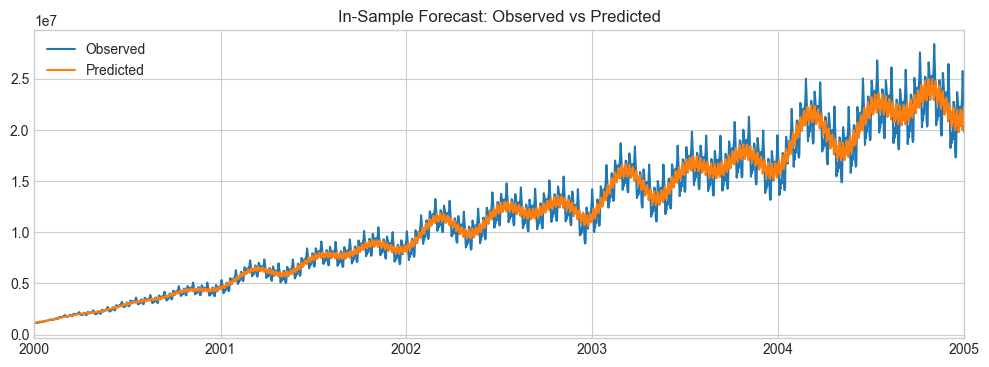
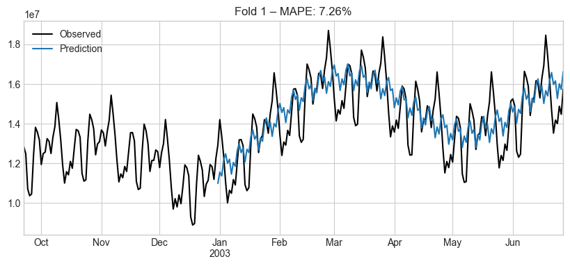
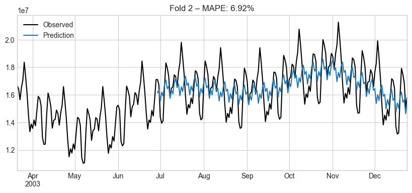
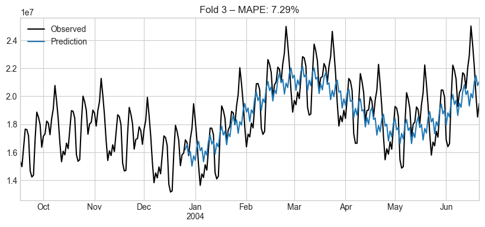
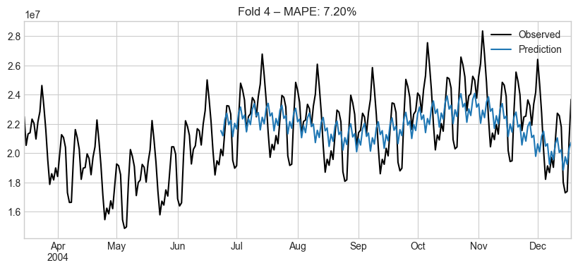
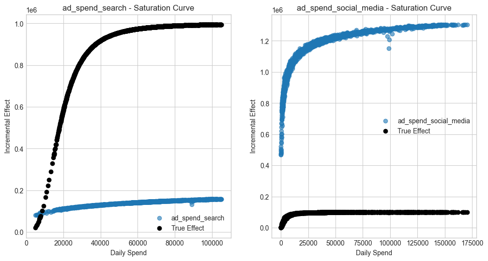
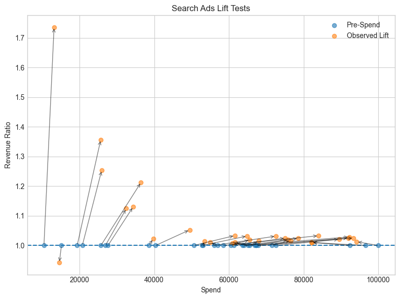
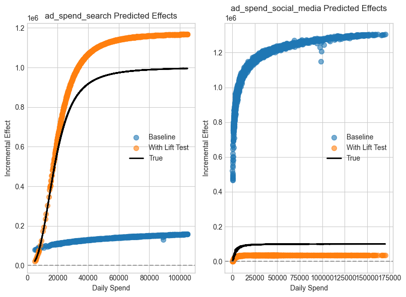
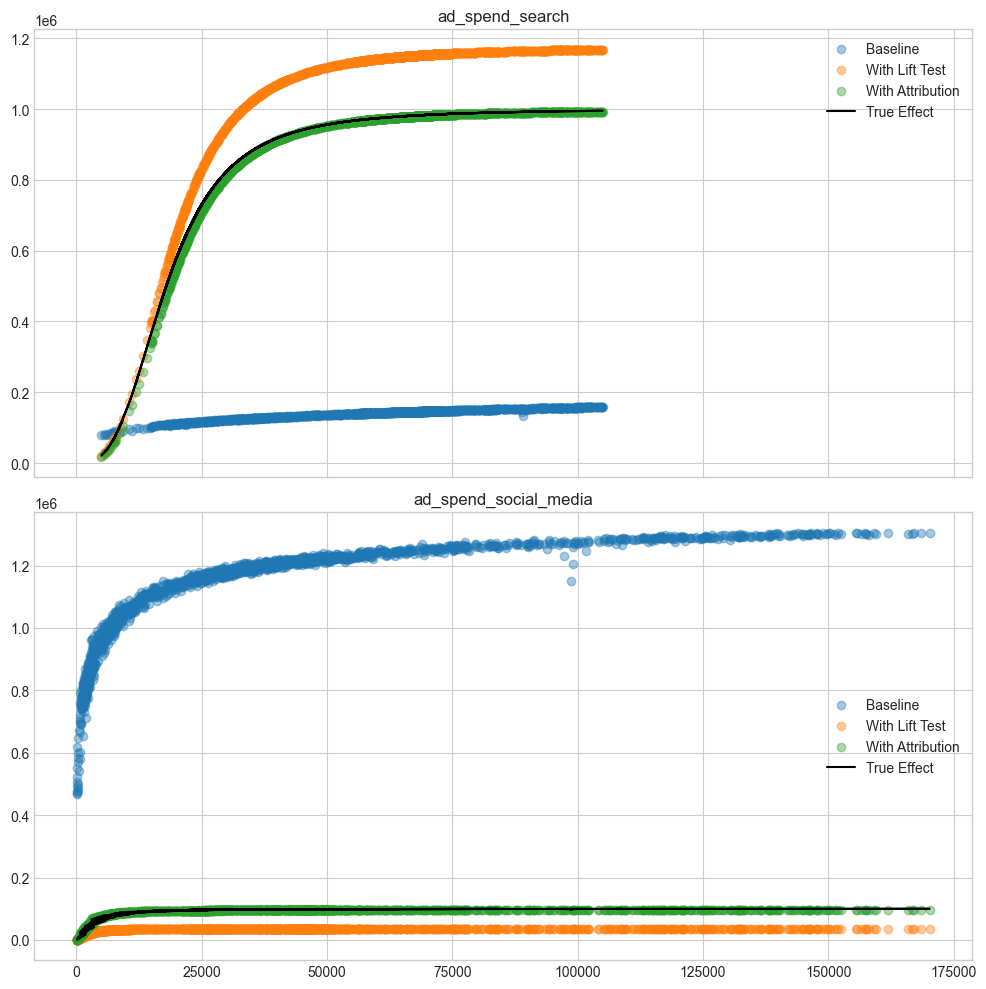

# Prophetverse Marketing Mix Modeling:
## Forecasting, Calibration, and Unified Marketing Measurement

In this tutorial, we walk through the lifecycle of a modern Marketing Mix Model (MMM),
from time-series forecasting to incorporating causal evidence like lift tests and attribution.

You will learn:

1. How to **forecast** revenue using media spend with Adstock and Saturation effects.

2. How to **diagnose model behavior** and evaluate with backtesting.

3. Why **correlated spend channels** confuse effect estimation—and how to fix it.

4. How to **calibrate** your model using **lift tests** and **attribution models** for better ROI measurement.

👉 **Why this matters**: MMMs are foundational for budget allocation. But good predictions are not enough—
we need **credible effect estimates** to make real-world decisions.

Let’s get started!

Setting up some libraries, float64 precision,
and plot style.


```python
import warnings

warnings.filterwarnings("ignore")

import numpy as np
import pandas as pd
import matplotlib.pyplot as plt
import numpyro
import numpyro.distributions as dist

plt.style.use("seaborn-v0_8-whitegrid")
numpyro.enable_x64()  # Necessary for precision in numerical optimization


```


```python
from prophetverse.datasets._mmm.dataset1 import get_dataset

# Load synthetic data
# This lets us compare model output with known “true” components
y, X, lift_tests, true_components, _ = get_dataset()
lift_test1, lift_test2 = lift_tests

print(f"y shape: {y.shape}, X shape: {X.shape}")
X.head()


```
<p class="cell-output-title jp-RenderedText jp-OutputArea-output">Output: <span class="cell-output-count">[2]</span></p>


<div>
<style scoped>
    .dataframe tbody tr th:only-of-type {
        vertical-align: middle;
    }

    .dataframe tbody tr th {
        vertical-align: top;
    }

    .dataframe thead th {
        text-align: right;
    }
</style>
<table border="1" class="dataframe">
  <thead>
    <tr style="text-align: right;">
      <th></th>
      <th>ad_spend_search</th>
      <th>ad_spend_social_media</th>
    </tr>
  </thead>
  <tbody>
    <tr>
      <th>2000-01-01</th>
      <td>89076.191178</td>
      <td>98587.488958</td>
    </tr>
    <tr>
      <th>2000-01-02</th>
      <td>88891.993106</td>
      <td>99066.321168</td>
    </tr>
    <tr>
      <th>2000-01-03</th>
      <td>89784.955064</td>
      <td>97334.106903</td>
    </tr>
    <tr>
      <th>2000-01-04</th>
      <td>89931.220681</td>
      <td>101747.300585</td>
    </tr>
    <tr>
      <th>2000-01-05</th>
      <td>89184.319596</td>
      <td>93825.221809</td>
    </tr>
  </tbody>
</table>
</div>


---
## Part 1: Forecasting with Adstock & Saturation Effects

Here we’ll build a **time-series forecasting model** that includes:

* **Trend** and **seasonality**

* **Lagged media effects** (Adstock)

* **Diminishing returns** (Saturation / Hill curves)

### 🔎 Why this matters:
Raw spend is **not immediately effective**, and it **doesn’t convert linearly**.
Capturing these dynamics is essential to make ROI estimates realistic.

In Prophetverse, we define the model as triplets of:

* **Effect name**: e.g. `ad_spend_search`

* **Effect object**: e.g. `HillEffect()`

* **Input columns**: columns from `X` that should be passed to the effect. We
use `None` when the effect is not directly driven by input columns, and a regex
to query multiple columns when the effect is driven by multiple inputs, e.g.
`"ad_spend_.*"`, `"holidays_*"`.


```python
from prophetverse.effects import (
    PiecewiseLinearTrend,
    LinearFourierSeasonality,
    ChainedEffects,
    GeometricAdstockEffect,
    HillEffect,
)
from prophetverse.sktime import Prophetverse
from prophetverse.engine import MAPInferenceEngine
from prophetverse.engine.optimizer import LBFGSSolver

# Seasonal patterns
yearly = (
    "yearly_seasonality",
    LinearFourierSeasonality(
        freq="D",
        sp_list=[365.25],
        fourier_terms_list=[5],
        prior_scale=0.1,
        effect_mode="multiplicative",
    ),
    None,
)
weekly = (
    "weekly_seasonality",
    LinearFourierSeasonality(
        freq="D",
        sp_list=[7],
        fourier_terms_list=[3],
        prior_scale=0.05,
        effect_mode="multiplicative",
    ),
    None,
)

# Chain Adstock and Saturation for each channel
hill = HillEffect(
    half_max_prior=dist.HalfNormal(1),
    slope_prior=dist.InverseGamma(2, 1),
    max_effect_prior=dist.HalfNormal(1),
    effect_mode="additive",
    input_scale=1e6,
)
chained_search = (
    "ad_spend_search",
    ChainedEffects([("adstock", GeometricAdstockEffect()), ("saturation", hill)]),
    "ad_spend_search",
)
chained_social = (
    "ad_spend_social_media",
    ChainedEffects([("adstock", GeometricAdstockEffect()), ("saturation", hill)]),
    "ad_spend_social_media",
)

```

We are ready to define our Prophetverse model


```python
# Prophetverse model with MAP inference
baseline_model = Prophetverse(
    trend=PiecewiseLinearTrend(changepoint_interval=100),
    exogenous_effects=[yearly, weekly, chained_search, chained_social],
    inference_engine=MAPInferenceEngine(
        num_steps=5000,
        optimizer=LBFGSSolver(memory_size=200, max_linesearch_steps=200),
    ),
)

# Fit and predict in-sample
baseline_model.fit(y=y, X=X)


```
<p class="cell-output-title jp-RenderedText jp-OutputArea-output">Output: <span class="cell-output-count">[4]</span></p>


<style>#sk-dba971c3-9518-4fa9-8685-a9a6f1744f21 {
    /* Definition of color scheme common for light and dark mode */
    --sklearn-color-text: black;
    --sklearn-color-line: gray;
    /* Definition of color scheme for objects */
    --sklearn-color-level-0: #fff5e6;
    --sklearn-color-level-1: #f6e4d2;
    --sklearn-color-level-2: #ffe0b3;
    --sklearn-color-level-3: chocolate;

    /* Specific color for light theme */
    --sklearn-color-text-on-default-background: var(--theme-code-foreground, var(--jp-content-font-color1, black));
    --sklearn-color-background: var(--theme-background, var(--jp-layout-color0, white));
    --sklearn-color-border-box: var(--theme-code-foreground, var(--jp-content-font-color1, black));
    --sklearn-color-icon: #696969;

    @media (prefers-color-scheme: dark) {
      /* Redefinition of color scheme for dark theme */
      --sklearn-color-text-on-default-background: var(--theme-code-foreground, var(--jp-content-font-color1, white));
      --sklearn-color-background: var(--theme-background, var(--jp-layout-color0, #111));
      --sklearn-color-border-box: var(--theme-code-foreground, var(--jp-content-font-color1, white));
      --sklearn-color-icon: #878787;
    }
  }

  #sk-dba971c3-9518-4fa9-8685-a9a6f1744f21 {
    color: var(--sklearn-color-text);
  }

  #sk-dba971c3-9518-4fa9-8685-a9a6f1744f21 pre {
    padding: 0;
  }

  #sk-dba971c3-9518-4fa9-8685-a9a6f1744f21 input.sk-hidden--visually {
    border: 0;
    clip: rect(1px 1px 1px 1px);
    clip: rect(1px, 1px, 1px, 1px);
    height: 1px;
    margin: -1px;
    overflow: hidden;
    padding: 0;
    position: absolute;
    width: 1px;
  }

  #sk-dba971c3-9518-4fa9-8685-a9a6f1744f21 div.sk-dashed-wrapped {
    border: 1px dashed var(--sklearn-color-line);
    margin: 0 0.4em 0.5em 0.4em;
    box-sizing: border-box;
    padding-bottom: 0.4em;
    background-color: var(--sklearn-color-background);
  }

  #sk-dba971c3-9518-4fa9-8685-a9a6f1744f21 div.sk-container {
    /* jupyter's `normalize.less` sets `[hidden] { display: none; }`
       but bootstrap.min.css set `[hidden] { display: none !important; }`
       so we also need the `!important` here to be able to override the
       default hidden behavior on the sphinx rendered scikit-learn.org.
       See: https://github.com/scikit-learn/scikit-learn/issues/21755 */
    display: inline-block !important;
    position: relative;
  }

  #sk-dba971c3-9518-4fa9-8685-a9a6f1744f21 div.sk-text-repr-fallback {
    display: none;
  }

  div.sk-parallel-item,
  div.sk-serial,
  div.sk-item {
    /* draw centered vertical line to link estimators */
    background-image: linear-gradient(var(--sklearn-color-text-on-default-background), var(--sklearn-color-text-on-default-background));
    background-size: 2px 100%;
    background-repeat: no-repeat;
    background-position: center center;
  }

  /* Parallel-specific style estimator block */

  #sk-dba971c3-9518-4fa9-8685-a9a6f1744f21 div.sk-parallel-item::after {
    content: "";
    width: 100%;
    border-bottom: 2px solid var(--sklearn-color-text-on-default-background);
    flex-grow: 1;
  }

  #sk-dba971c3-9518-4fa9-8685-a9a6f1744f21 div.sk-parallel {
    display: flex;
    align-items: stretch;
    justify-content: center;
    background-color: var(--sklearn-color-background);
    position: relative;
  }

  #sk-dba971c3-9518-4fa9-8685-a9a6f1744f21 div.sk-parallel-item {
    display: flex;
    flex-direction: column;
  }

  #sk-dba971c3-9518-4fa9-8685-a9a6f1744f21 div.sk-parallel-item:first-child::after {
    align-self: flex-end;
    width: 50%;
  }

  #sk-dba971c3-9518-4fa9-8685-a9a6f1744f21 div.sk-parallel-item:last-child::after {
    align-self: flex-start;
    width: 50%;
  }

  #sk-dba971c3-9518-4fa9-8685-a9a6f1744f21 div.sk-parallel-item:only-child::after {
    width: 0;
  }

  /* Serial-specific style estimator block */

  #sk-dba971c3-9518-4fa9-8685-a9a6f1744f21 div.sk-serial {
    display: flex;
    flex-direction: column;
    align-items: center;
    background-color: var(--sklearn-color-background);
    padding-right: 1em;
    padding-left: 1em;
  }


  /* Toggleable style: style used for estimator/Pipeline/ColumnTransformer box that is
  clickable and can be expanded/collapsed.
  - Pipeline and ColumnTransformer use this feature and define the default style
  - Estimators will overwrite some part of the style using the `sk-estimator` class
  */

  /* Pipeline and ColumnTransformer style (default) */

  #sk-dba971c3-9518-4fa9-8685-a9a6f1744f21 div.sk-toggleable {
    /* Default theme specific background. It is overwritten whether we have a
    specific estimator or a Pipeline/ColumnTransformer */
    background-color: var(--sklearn-color-background);
  }

  /* Toggleable label */
  #sk-dba971c3-9518-4fa9-8685-a9a6f1744f21 label.sk-toggleable__label {
    cursor: pointer;
    display: block;
    width: 100%;
    margin-bottom: 0;
    padding: 0.5em;
    box-sizing: border-box;
    text-align: center;
  }

  #sk-dba971c3-9518-4fa9-8685-a9a6f1744f21 label.sk-toggleable__label-arrow:before {
    /* Arrow on the left of the label */
    content: "▸";
    float: left;
    margin-right: 0.25em;
    color: var(--sklearn-color-icon);
  }

  #sk-dba971c3-9518-4fa9-8685-a9a6f1744f21 label.sk-toggleable__label-arrow:hover:before {
    color: var(--sklearn-color-text);
  }

  /* Toggleable content - dropdown */

  #sk-dba971c3-9518-4fa9-8685-a9a6f1744f21 div.sk-toggleable__content {
    max-height: 0;
    max-width: 0;
    overflow: hidden;
    text-align: left;
    background-color: var(--sklearn-color-level-0);
  }

  #sk-dba971c3-9518-4fa9-8685-a9a6f1744f21 div.sk-toggleable__content pre {
    margin: 0.2em;
    border-radius: 0.25em;
    color: var(--sklearn-color-text);
    background-color: var(--sklearn-color-level-0);
  }

  #sk-dba971c3-9518-4fa9-8685-a9a6f1744f21 input.sk-toggleable__control:checked~div.sk-toggleable__content {
    /* Expand drop-down */
    max-height: 200px;
    max-width: 100%;
    overflow: auto;
  }

  #sk-dba971c3-9518-4fa9-8685-a9a6f1744f21 input.sk-toggleable__control:checked~label.sk-toggleable__label-arrow:before {
    content: "▾";
  }

  /* Pipeline/ColumnTransformer-specific style */

  #sk-dba971c3-9518-4fa9-8685-a9a6f1744f21 div.sk-label input.sk-toggleable__control:checked~label.sk-toggleable__label {
    color: var(--sklearn-color-text);
    background-color: var(--sklearn-color-level-2);
  }

  /* Estimator-specific style */

  /* Colorize estimator box */
  #sk-dba971c3-9518-4fa9-8685-a9a6f1744f21 div.sk-estimator input.sk-toggleable__control:checked~label.sk-toggleable__label {
    /* unfitted */
    background-color: var(--sklearn-color-level-2);
  }

  #sk-dba971c3-9518-4fa9-8685-a9a6f1744f21 div.sk-label label.sk-toggleable__label,
  #sk-dba971c3-9518-4fa9-8685-a9a6f1744f21 div.sk-label label {
    /* The background is the default theme color */
    color: var(--sklearn-color-text-on-default-background);
  }

  /* On hover, darken the color of the background */
  #sk-dba971c3-9518-4fa9-8685-a9a6f1744f21 div.sk-label:hover label.sk-toggleable__label {
    color: var(--sklearn-color-text);
    background-color: var(--sklearn-color-level-2);
  }

  /* Estimator label */

  #sk-dba971c3-9518-4fa9-8685-a9a6f1744f21 div.sk-label label {
    font-family: monospace;
    font-weight: bold;
    display: inline-block;
    line-height: 1.2em;
  }

  #sk-dba971c3-9518-4fa9-8685-a9a6f1744f21 div.sk-label-container {
    text-align: center;
  }

  /* Estimator-specific */
  #sk-dba971c3-9518-4fa9-8685-a9a6f1744f21 div.sk-estimator {
    font-family: monospace;
    border: 1px dotted var(--sklearn-color-border-box);
    border-radius: 0.25em;
    box-sizing: border-box;
    margin-bottom: 0.5em;
    background-color: var(--sklearn-color-level-0);
  }

  /* on hover */
  #sk-dba971c3-9518-4fa9-8685-a9a6f1744f21 div.sk-estimator:hover {
    background-color: var(--sklearn-color-level-2);
  }

  /* Specification for estimator info */

  .sk-estimator-doc-link,
  a:link.sk-estimator-doc-link,
  a:visited.sk-estimator-doc-link {
    float: right;
    font-size: smaller;
    line-height: 1em;
    font-family: monospace;
    background-color: var(--sklearn-color-background);
    border-radius: 1em;
    height: 1em;
    width: 1em;
    text-decoration: none !important;
    margin-left: 1ex;
    border: var(--sklearn-color-level-1) 1pt solid;
    color: var(--sklearn-color-level-1);
  }

  /* On hover */
  div.sk-estimator:hover .sk-estimator-doc-link:hover,
  .sk-estimator-doc-link:hover,
  div.sk-label-container:hover .sk-estimator-doc-link:hover,
  .sk-estimator-doc-link:hover {
    background-color: var(--sklearn-color-level-3);
    color: var(--sklearn-color-background);
    text-decoration: none;
  }

  /* Span, style for the box shown on hovering the info icon */
  .sk-estimator-doc-link span {
    display: none;
    z-index: 9999;
    position: relative;
    font-weight: normal;
    right: .2ex;
    padding: .5ex;
    margin: .5ex;
    width: min-content;
    min-width: 20ex;
    max-width: 50ex;
    color: var(--sklearn-color-text);
    box-shadow: 2pt 2pt 4pt #999;
    background: var(--sklearn-color-level-0);
    border: .5pt solid var(--sklearn-color-level-3);
  }

  .sk-estimator-doc-link:hover span {
    display: block;
  }

  /* "?"-specific style due to the `<a>` HTML tag */

  #sk-dba971c3-9518-4fa9-8685-a9a6f1744f21 a.estimator_doc_link {
    float: right;
    font-size: 1rem;
    line-height: 1em;
    font-family: monospace;
    background-color: var(--sklearn-color-background);
    border-radius: 1rem;
    height: 1rem;
    width: 1rem;
    text-decoration: none;
    color: var(--sklearn-color-level-1);
    border: var(--sklearn-color-level-1) 1pt solid;
  }

  /* On hover */
  #sk-dba971c3-9518-4fa9-8685-a9a6f1744f21 a.estimator_doc_link:hover {
    background-color: var(--sklearn-color-level-3);
    color: var(--sklearn-color-background);
    text-decoration: none;
  }
</style><div id='sk-dba971c3-9518-4fa9-8685-a9a6f1744f21' class="sk-top-container"><div class="sk-text-repr-fallback"><pre>Prophetverse(exogenous_effects=[(&#x27;yearly_seasonality&#x27;,
                                 LinearFourierSeasonality(effect_mode=&#x27;multiplicative&#x27;,
                                                          fourier_terms_list=[5],
                                                          freq=&#x27;D&#x27;,
                                                          prior_scale=0.1,
                                                          sp_list=[365.25]),
                                 None),
                                (&#x27;weekly_seasonality&#x27;,
                                 LinearFourierSeasonality(effect_mode=&#x27;multiplicative&#x27;,
                                                          fourier_terms_list=[3],
                                                          freq=&#x27;D&#x27;,
                                                          prior_scale=0.05,
                                                          sp_list=[7]),
                                 None),
                                (&#x27;ad_spend_search&#x27;,
                                 Chained...
                                                                   max_effect_prior=&lt;numpyro.distributions.continuous.HalfNormal object at 0x315cee290 with batch shape () and event shape ()&gt;,
                                                                   slope_prior=&lt;numpyro.distributions.continuous.InverseGamma object at 0x31ab02090 with batch shape () and event shape ()&gt;))]),
                                 &#x27;ad_spend_social_media&#x27;)],
             inference_engine=MAPInferenceEngine(num_steps=5000,
                                                 optimizer=LBFGSSolver(max_linesearch_steps=200,
                                                                       memory_size=200)),
             trend=PiecewiseLinearTrend(changepoint_interval=100))</pre><b>Please rerun this cell to show the HTML repr or trust the notebook.</b></div><div class="sk-container" hidden><div class="sk-item sk-dashed-wrapped"><div class='sk-label-container'><div class="sk-label sk-toggleable"><input class="sk-toggleable__control sk-hidden--visually" id=UUID('cbff3261-724e-4cd1-bc91-08ca77890c2d') type="checkbox" ><label for=UUID('cbff3261-724e-4cd1-bc91-08ca77890c2d') class='sk-toggleable__label sk-toggleable__label-arrow'>Prophetverse</label><div class="sk-toggleable__content"><pre>Prophetverse(exogenous_effects=[(&#x27;yearly_seasonality&#x27;,
                                 LinearFourierSeasonality(effect_mode=&#x27;multiplicative&#x27;,
                                                          fourier_terms_list=[5],
                                                          freq=&#x27;D&#x27;,
                                                          prior_scale=0.1,
                                                          sp_list=[365.25]),
                                 None),
                                (&#x27;weekly_seasonality&#x27;,
                                 LinearFourierSeasonality(effect_mode=&#x27;multiplicative&#x27;,
                                                          fourier_terms_list=[3],
                                                          freq=&#x27;D&#x27;,
                                                          prior_scale=0.05,
                                                          sp_list=[7]),
                                 None),
                                (&#x27;ad_spend_search&#x27;,
                                 Chained...
                                                                   max_effect_prior=&lt;numpyro.distributions.continuous.HalfNormal object at 0x315cee290 with batch shape () and event shape ()&gt;,
                                                                   slope_prior=&lt;numpyro.distributions.continuous.InverseGamma object at 0x31ab02090 with batch shape () and event shape ()&gt;))]),
                                 &#x27;ad_spend_social_media&#x27;)],
             inference_engine=MAPInferenceEngine(num_steps=5000,
                                                 optimizer=LBFGSSolver(max_linesearch_steps=200,
                                                                       memory_size=200)),
             trend=PiecewiseLinearTrend(changepoint_interval=100))</pre></div></div></div><div class="sk-parallel"><div class="sk-parallel-item"><div class="sk-item"><div class='sk-label-container'><div class="sk-label sk-toggleable"><label>effects</label></div></div><div class="sk-serial"><div class="sk-item"><div class="sk-serial"><div class='sk-item'><div class="sk-estimator sk-toggleable"><input class="sk-toggleable__control sk-hidden--visually" id=UUID('6bc7670f-5f1e-44cf-b0a6-ef7c49fe2e03') type="checkbox" ><label for=UUID('6bc7670f-5f1e-44cf-b0a6-ef7c49fe2e03') class='sk-toggleable__label sk-toggleable__label-arrow'>PiecewiseLinearTrend</label><div class="sk-toggleable__content"><pre>PiecewiseLinearTrend(changepoint_interval=100)</pre></div></div></div><div class='sk-item'><div class="sk-estimator sk-toggleable"><input class="sk-toggleable__control sk-hidden--visually" id=UUID('67a8bfaf-9f5d-4eba-ac70-3a8fedf997d8') type="checkbox" ><label for=UUID('67a8bfaf-9f5d-4eba-ac70-3a8fedf997d8') class='sk-toggleable__label sk-toggleable__label-arrow'>LinearFourierSeasonality</label><div class="sk-toggleable__content"><pre>LinearFourierSeasonality(effect_mode=&#x27;multiplicative&#x27;, fourier_terms_list=[5],
                         freq=&#x27;D&#x27;, prior_scale=0.1, sp_list=[365.25])</pre></div></div></div><div class='sk-item'><div class="sk-estimator sk-toggleable"><input class="sk-toggleable__control sk-hidden--visually" id=UUID('065567ed-e8e9-44db-a89d-ffbb58c1ec5b') type="checkbox" ><label for=UUID('065567ed-e8e9-44db-a89d-ffbb58c1ec5b') class='sk-toggleable__label sk-toggleable__label-arrow'>LinearFourierSeasonality</label><div class="sk-toggleable__content"><pre>LinearFourierSeasonality(effect_mode=&#x27;multiplicative&#x27;, fourier_terms_list=[3],
                         freq=&#x27;D&#x27;, prior_scale=0.05, sp_list=[7])</pre></div></div></div><div class="sk-item"><div class='sk-label-container'><div class="sk-label sk-toggleable"><input class="sk-toggleable__control sk-hidden--visually" id=UUID('093d4b57-1ec4-423b-a119-572fcd83e1d4') type="checkbox" ><label for=UUID('093d4b57-1ec4-423b-a119-572fcd83e1d4') class='sk-toggleable__label sk-toggleable__label-arrow'>ad_spend_search</label><div class="sk-toggleable__content"><pre>ChainedEffects(steps=[(&#x27;adstock&#x27;, GeometricAdstockEffect()),
                      (&#x27;saturation&#x27;,
                       HillEffect(effect_mode=&#x27;additive&#x27;,
                                  half_max_prior=&lt;numpyro.distributions.continuous.HalfNormal object at 0x31a3992d0 with batch shape () and event shape ()&gt;,
                                  input_scale=1000000.0,
                                  max_effect_prior=&lt;numpyro.distributions.continuous.HalfNormal object at 0x315cee290 with batch shape () and event shape ()&gt;,
                                  slope_prior=&lt;numpyro.distributions.continuous.InverseGamma object at 0x31ab02090 with batch shape () and event shape ()&gt;))])</pre></div></div></div><div class="sk-serial"><div class='sk-item'><div class="sk-estimator sk-toggleable"><input class="sk-toggleable__control sk-hidden--visually" id=UUID('62a7e753-23d9-4273-992c-c9bc1e20a2b3') type="checkbox" ><label for=UUID('62a7e753-23d9-4273-992c-c9bc1e20a2b3') class='sk-toggleable__label sk-toggleable__label-arrow'>GeometricAdstockEffect</label><div class="sk-toggleable__content"><pre>GeometricAdstockEffect()</pre></div></div></div><div class='sk-item'><div class="sk-estimator sk-toggleable"><input class="sk-toggleable__control sk-hidden--visually" id=UUID('87bc156b-7218-42f0-9998-94ac5436f915') type="checkbox" ><label for=UUID('87bc156b-7218-42f0-9998-94ac5436f915') class='sk-toggleable__label sk-toggleable__label-arrow'>HillEffect</label><div class="sk-toggleable__content"><pre>HillEffect(effect_mode=&#x27;additive&#x27;,
           half_max_prior=&lt;numpyro.distributions.continuous.HalfNormal object at 0x31a3992d0 with batch shape () and event shape ()&gt;,
           input_scale=1000000.0,
           max_effect_prior=&lt;numpyro.distributions.continuous.HalfNormal object at 0x315cee290 with batch shape () and event shape ()&gt;,
           slope_prior=&lt;numpyro.distributions.continuous.InverseGamma object at 0x31ab02090 with batch shape () and event shape ()&gt;)</pre></div></div></div></div></div><div class="sk-item"><div class='sk-label-container'><div class="sk-label sk-toggleable"><input class="sk-toggleable__control sk-hidden--visually" id=UUID('ebea26f1-61a8-4743-8594-7e3e77e8eaaf') type="checkbox" ><label for=UUID('ebea26f1-61a8-4743-8594-7e3e77e8eaaf') class='sk-toggleable__label sk-toggleable__label-arrow'>ad_spend_social_media</label><div class="sk-toggleable__content"><pre>ChainedEffects(steps=[(&#x27;adstock&#x27;, GeometricAdstockEffect()),
                      (&#x27;saturation&#x27;,
                       HillEffect(effect_mode=&#x27;additive&#x27;,
                                  half_max_prior=&lt;numpyro.distributions.continuous.HalfNormal object at 0x31a3992d0 with batch shape () and event shape ()&gt;,
                                  input_scale=1000000.0,
                                  max_effect_prior=&lt;numpyro.distributions.continuous.HalfNormal object at 0x315cee290 with batch shape () and event shape ()&gt;,
                                  slope_prior=&lt;numpyro.distributions.continuous.InverseGamma object at 0x31ab02090 with batch shape () and event shape ()&gt;))])</pre></div></div></div><div class="sk-serial"><div class='sk-item'><div class="sk-estimator sk-toggleable"><input class="sk-toggleable__control sk-hidden--visually" id=UUID('ab133b4c-623c-4d1a-83b5-1d1c790000ad') type="checkbox" ><label for=UUID('ab133b4c-623c-4d1a-83b5-1d1c790000ad') class='sk-toggleable__label sk-toggleable__label-arrow'>GeometricAdstockEffect</label><div class="sk-toggleable__content"><pre>GeometricAdstockEffect()</pre></div></div></div><div class='sk-item'><div class="sk-estimator sk-toggleable"><input class="sk-toggleable__control sk-hidden--visually" id=UUID('b6737d1e-1e6e-438d-9ace-567d13981b8c') type="checkbox" ><label for=UUID('b6737d1e-1e6e-438d-9ace-567d13981b8c') class='sk-toggleable__label sk-toggleable__label-arrow'>HillEffect</label><div class="sk-toggleable__content"><pre>HillEffect(effect_mode=&#x27;additive&#x27;,
           half_max_prior=&lt;numpyro.distributions.continuous.HalfNormal object at 0x31a3992d0 with batch shape () and event shape ()&gt;,
           input_scale=1000000.0,
           max_effect_prior=&lt;numpyro.distributions.continuous.HalfNormal object at 0x315cee290 with batch shape () and event shape ()&gt;,
           slope_prior=&lt;numpyro.distributions.continuous.InverseGamma object at 0x31ab02090 with batch shape () and event shape ()&gt;)</pre></div></div></div></div></div></div></div></div></div></div><div class="sk-parallel-item"><div class="sk-item"><div class='sk-label-container'><div class="sk-label sk-toggleable"><label>inference_engine</label></div></div><div class="sk-serial"><div class='sk-item'><div class="sk-estimator sk-toggleable"><input class="sk-toggleable__control sk-hidden--visually" id=UUID('2cf76c95-5f90-404c-b40b-b741be13924e') type="checkbox" ><label for=UUID('2cf76c95-5f90-404c-b40b-b741be13924e') class='sk-toggleable__label sk-toggleable__label-arrow'>MAPInferenceEngine</label><div class="sk-toggleable__content"><pre>MAPInferenceEngine(num_steps=5000,
                   optimizer=LBFGSSolver(max_linesearch_steps=200,
                                         memory_size=200))</pre></div></div></div></div></div></div></div></div></div></div>


```python
y_pred = baseline_model.predict(X=X, fh=X.index)

# Plot results
plt.figure(figsize=(12, 4))
y.plot(label="Observed")
y_pred.plot(label="Predicted")
plt.title("In-Sample Forecast: Observed vs Predicted")
plt.legend()
plt.show()


```
<p class="cell-output-title jp-RenderedText jp-OutputArea-output">Output: <span class="cell-output-count">[5]</span></p>


    

    


### 1.1 Component-Level Diagnostics

Use `.predict_components()` to inspect **decomposed effects**:

* Trend and seasonality

* Channel-specific effects

👉 **Tip**: This lets you debug which parts of your model are contributing (or not).


```python
y_pred_components = baseline_model.predict_components(X=X, fh=X.index)
y_pred_components.head()


```
<p class="cell-output-title jp-RenderedText jp-OutputArea-output">Output: <span class="cell-output-count">[6]</span></p>


<div>
<style scoped>
    .dataframe tbody tr th:only-of-type {
        vertical-align: middle;
    }

    .dataframe tbody tr th {
        vertical-align: top;
    }

    .dataframe thead th {
        text-align: right;
    }
</style>
<table border="1" class="dataframe">
  <thead>
    <tr style="text-align: right;">
      <th></th>
      <th>ad_spend_search</th>
      <th>ad_spend_social_media</th>
      <th>mean</th>
      <th>obs</th>
      <th>trend</th>
      <th>weekly_seasonality</th>
      <th>yearly_seasonality</th>
    </tr>
  </thead>
  <tbody>
    <tr>
      <th>2000-01-01</th>
      <td>131520.111924</td>
      <td>1.150603e+06</td>
      <td>1.015148e+06</td>
      <td>1.053109e+06</td>
      <td>-286813.831445</td>
      <td>-12560.154761</td>
      <td>32398.696204</td>
    </tr>
    <tr>
      <th>2000-01-02</th>
      <td>143803.965722</td>
      <td>1.206190e+06</td>
      <td>1.102543e+06</td>
      <td>1.030596e+06</td>
      <td>-277749.525722</td>
      <td>-526.316360</td>
      <td>30825.164277</td>
    </tr>
    <tr>
      <th>2000-01-03</th>
      <td>148871.258969</td>
      <td>1.230351e+06</td>
      <td>1.136278e+06</td>
      <td>1.193281e+06</td>
      <td>-268685.219998</td>
      <td>-3484.000211</td>
      <td>29224.289349</td>
    </tr>
    <tr>
      <th>2000-01-04</th>
      <td>151241.204338</td>
      <td>1.245422e+06</td>
      <td>1.177322e+06</td>
      <td>1.126865e+06</td>
      <td>-259620.914275</td>
      <td>12676.912163</td>
      <td>27603.382378</td>
    </tr>
    <tr>
      <th>2000-01-05</th>
      <td>152278.861893</td>
      <td>1.252928e+06</td>
      <td>1.182174e+06</td>
      <td>1.172105e+06</td>
      <td>-250556.608552</td>
      <td>1554.128384</td>
      <td>25969.748353</td>
    </tr>
  </tbody>
</table>
</div>


```python
fig, axs = plt.subplots(4, 1, figsize=(12, 12), sharex=True)
for i, name in enumerate(
    ["trend", "yearly_seasonality", "ad_spend_search", "ad_spend_social_media"]
):
    true_components[name].plot(ax=axs[i], label="True", color="black")
    y_pred_components[name].plot(ax=axs[i], label="Estimated")
    axs[i].set_title(name)
    axs[i].legend()
plt.tight_layout()
plt.show()


```
<p class="cell-output-title jp-RenderedText jp-OutputArea-output">Output: <span class="cell-output-count">[7]</span></p>


    

    


### 1.2 Backtesting with Cross-Validation

We use rolling-window CV to assess out-of-sample accuracy using **MAPE**.

🧠 **Caution**: Low error ≠ correct attribution. But high error often indicates a bad model.


```python
from sktime.split import ExpandingWindowSplitter
from sktime.performance_metrics.forecasting import MeanAbsolutePercentageError
from sktime.forecasting.model_evaluation import evaluate

metric = MeanAbsolutePercentageError()
cv = ExpandingWindowSplitter(
    initial_window=365 * 3, step_length=180, fh=list(range(1, 180))
)
cv_results = evaluate(
    forecaster=baseline_model,
    y=y,
    X=X,
    cv=cv,
    scoring=metric,
    return_data=True,
)

cv_results["test_MeanAbsolutePercentageError"].mean()


```
<p class="cell-output-title jp-RenderedText jp-OutputArea-output">Output: <span class="cell-output-count">[8]</span></p>


    np.float64(0.07168488379870389)


```python
for idx, row in cv_results.iterrows():
    plt.figure(figsize=(10, 4))
    pd.concat([row["y_train"].iloc[-100:], row["y_test"]]).plot(
        label="Observed", color="black"
    )
    row["y_pred"].plot(label="Prediction")
    plt.title(f"Fold {idx+1} – MAPE: {row['test_MeanAbsolutePercentageError']:.2%}")
    plt.legend()
    plt.show()
    if idx > 3:
        break


```
<p class="cell-output-title jp-RenderedText jp-OutputArea-output">Output: <span class="cell-output-count">[9]</span></p>


    

    


    

    


    

    


    

    


### 1.3 Saturation Curves

These curves show **diminishing marginal effect** as spend increases.

🔍 **Insight**: This shape helps guide budget allocation decisions (e.g. where additional spend will have little return).

Note how the model captures a saturation effect, but it is still far
from the correct shape.

This is why, in many situations, you will need calibration to
correct the model's behavior. This is what we will do in the next
section.


```python

fig, axs = plt.subplots(figsize=(12, 6), nrows=1, ncols=2)
for ax, channel in zip(axs, ["ad_spend_search", "ad_spend_social_media"]):

    ax.scatter(X[channel], y_pred_components[channel], alpha=0.6, label=channel)
    ax.scatter(X[channel], true_components[channel], color="black", label="True Effect")
    ax.set(
        xlabel="Daily Spend",
        ylabel="Incremental Effect",
        title=channel + " - Saturation Curve",
    )
    ax.legend()
fig.show()


```
<p class="cell-output-title jp-RenderedText jp-OutputArea-output">Output: <span class="cell-output-count">[10]</span></p>


    

    


---
## Part 2: Calibration with Causal Evidence

Time-series alone **cannot disentangle** correlated channels.
We integrate **lift tests** (local experiments) and **attribution models** (high-resolution signal) to correct this.


```python
lift_test1


```
<p class="cell-output-title jp-RenderedText jp-OutputArea-output">Output: <span class="cell-output-count">[11]</span></p>


<div>
<style scoped>
    .dataframe tbody tr th:only-of-type {
        vertical-align: middle;
    }

    .dataframe tbody tr th {
        vertical-align: top;
    }

    .dataframe thead th {
        text-align: right;
    }
</style>
<table border="1" class="dataframe">
  <thead>
    <tr style="text-align: right;">
      <th></th>
      <th>lift</th>
      <th>x_start</th>
      <th>x_end</th>
    </tr>
  </thead>
  <tbody>
    <tr>
      <th>2004-10-06</th>
      <td>1.052582</td>
      <td>40341.767154</td>
      <td>49484.088269</td>
    </tr>
    <tr>
      <th>2004-02-04</th>
      <td>1.032892</td>
      <td>58495.653884</td>
      <td>84002.024994</td>
    </tr>
    <tr>
      <th>2000-11-06</th>
      <td>1.016679</td>
      <td>71531.092985</td>
      <td>76531.908954</td>
    </tr>
    <tr>
      <th>2003-05-16</th>
      <td>1.124607</td>
      <td>26907.284427</td>
      <td>32512.144296</td>
    </tr>
    <tr>
      <th>2000-11-08</th>
      <td>1.020869</td>
      <td>72599.750597</td>
      <td>89604.382819</td>
    </tr>
    <tr>
      <th>2004-03-07</th>
      <td>1.031745</td>
      <td>52757.679186</td>
      <td>64868.518216</td>
    </tr>
    <tr>
      <th>2000-05-07</th>
      <td>1.012662</td>
      <td>99996.136061</td>
      <td>94223.267215</td>
    </tr>
    <tr>
      <th>2001-02-19</th>
      <td>1.010134</td>
      <td>65093.431461</td>
      <td>61643.297561</td>
    </tr>
    <tr>
      <th>2002-04-02</th>
      <td>1.025119</td>
      <td>61348.678757</td>
      <td>75097.513522</td>
    </tr>
    <tr>
      <th>2002-12-05</th>
      <td>0.941962</td>
      <td>15130.845106</td>
      <td>14559.409409</td>
    </tr>
    <tr>
      <th>2002-07-17</th>
      <td>1.033300</td>
      <td>50602.621004</td>
      <td>61561.222390</td>
    </tr>
    <tr>
      <th>2004-04-27</th>
      <td>1.028811</td>
      <td>63706.416166</td>
      <td>92286.506107</td>
    </tr>
    <tr>
      <th>2000-07-17</th>
      <td>1.010703</td>
      <td>92339.710079</td>
      <td>82120.888097</td>
    </tr>
    <tr>
      <th>2002-12-12</th>
      <td>1.736021</td>
      <td>10447.017057</td>
      <td>13154.365751</td>
    </tr>
    <tr>
      <th>2000-04-21</th>
      <td>1.009817</td>
      <td>96608.570357</td>
      <td>82236.408066</td>
    </tr>
    <tr>
      <th>2004-08-14</th>
      <td>1.010487</td>
      <td>56934.883132</td>
      <td>55014.981073</td>
    </tr>
    <tr>
      <th>2003-05-27</th>
      <td>1.253717</td>
      <td>20725.849866</td>
      <td>25917.050369</td>
    </tr>
    <tr>
      <th>2003-07-14</th>
      <td>1.212511</td>
      <td>25704.179569</td>
      <td>36440.566373</td>
    </tr>
    <tr>
      <th>2001-02-01</th>
      <td>1.019457</td>
      <td>67352.193243</td>
      <td>75884.561853</td>
    </tr>
    <tr>
      <th>2003-11-23</th>
      <td>1.031476</td>
      <td>55990.598602</td>
      <td>72568.532869</td>
    </tr>
    <tr>
      <th>2001-10-26</th>
      <td>1.025174</td>
      <td>67906.685182</td>
      <td>93399.577025</td>
    </tr>
    <tr>
      <th>2004-01-06</th>
      <td>1.019301</td>
      <td>60549.085047</td>
      <td>65612.128260</td>
    </tr>
    <tr>
      <th>2004-07-17</th>
      <td>1.025315</td>
      <td>67354.435955</td>
      <td>92061.937569</td>
    </tr>
    <tr>
      <th>2002-10-21</th>
      <td>1.356352</td>
      <td>19342.497501</td>
      <td>25654.928003</td>
    </tr>
    <tr>
      <th>2001-09-17</th>
      <td>1.007672</td>
      <td>66940.425562</td>
      <td>60975.537748</td>
    </tr>
    <tr>
      <th>2004-11-30</th>
      <td>1.130302</td>
      <td>27602.264625</td>
      <td>34344.815009</td>
    </tr>
    <tr>
      <th>2004-12-26</th>
      <td>1.022175</td>
      <td>38511.161989</td>
      <td>39737.886356</td>
    </tr>
    <tr>
      <th>2001-09-20</th>
      <td>1.023819</td>
      <td>64080.310879</td>
      <td>78594.396432</td>
    </tr>
    <tr>
      <th>2002-05-16</th>
      <td>1.015904</td>
      <td>65554.939615</td>
      <td>67996.877272</td>
    </tr>
    <tr>
      <th>2003-10-31</th>
      <td>1.014672</td>
      <td>53044.156616</td>
      <td>53463.620520</td>
    </tr>
  </tbody>
</table>
</div>


### 2.1 Visualizing Lift Tests

Each experiment records: pre-spend (`x_start`), post-spend (`x_end`), and measured `lift`.
These give us **causal “ground truth” deltas**.


```python
fig, ax = plt.subplots(figsize=(8, 6))
ax.scatter(lift_test1["x_start"], [1] * len(lift_test1), label="Pre-Spend", alpha=0.6)
ax.scatter(lift_test1["x_end"], lift_test1["lift"], label="Observed Lift", alpha=0.6)
for _, row in lift_test1.iterrows():
    ax.annotate(
        "",
        xy=(row["x_end"], row["lift"]),
        xytext=(row["x_start"], 1),
        arrowprops=dict(arrowstyle="->", alpha=0.5),
    )
ax.axhline(1, linestyle="--")
ax.set(title="Search Ads Lift Tests", xlabel="Spend", ylabel="Revenue Ratio")
ax.legend()
plt.tight_layout()
plt.show()


```
<p class="cell-output-title jp-RenderedText jp-OutputArea-output">Output: <span class="cell-output-count">[12]</span></p>


    

    


### 2.2 Improve Estimates via LiftExperimentLikelihood

This adds a new **likelihood term** that makes the model match lift observations.

🔁 **Still Bayesian**: It incorporates test variance and model uncertainty.

Since we use `sktime` interface, we have access to `get_params()` and `set_params(**kwargs)` methods.
This allows us to **easily swap** effects and likelihoods.
When we define our model, the effect's name become a key in the model's
`get_params()` dictionary. We can use this to set the effect's parameters
directly.


```python
from prophetverse.effects.lift_likelihood import LiftExperimentLikelihood

model_lift = baseline_model.clone()
model_lift.set_params(
    ad_spend_search=LiftExperimentLikelihood(
        effect=baseline_model.get_params()["ad_spend_search"],
        lift_test_results=lift_test1,
        prior_scale=0.01,
    ),
    ad_spend_social_media=LiftExperimentLikelihood(
        effect=baseline_model.get_params()["ad_spend_social_media"],
        lift_test_results=lift_test2,
        prior_scale=0.01,
    ),
)
model_lift.fit(y=y, X=X)


```
<p class="cell-output-title jp-RenderedText jp-OutputArea-output">Output: <span class="cell-output-count">[13]</span></p>


<style>#sk-164be762-2a09-48b1-950f-abec7d4dd5cb {
    /* Definition of color scheme common for light and dark mode */
    --sklearn-color-text: black;
    --sklearn-color-line: gray;
    /* Definition of color scheme for objects */
    --sklearn-color-level-0: #fff5e6;
    --sklearn-color-level-1: #f6e4d2;
    --sklearn-color-level-2: #ffe0b3;
    --sklearn-color-level-3: chocolate;

    /* Specific color for light theme */
    --sklearn-color-text-on-default-background: var(--theme-code-foreground, var(--jp-content-font-color1, black));
    --sklearn-color-background: var(--theme-background, var(--jp-layout-color0, white));
    --sklearn-color-border-box: var(--theme-code-foreground, var(--jp-content-font-color1, black));
    --sklearn-color-icon: #696969;

    @media (prefers-color-scheme: dark) {
      /* Redefinition of color scheme for dark theme */
      --sklearn-color-text-on-default-background: var(--theme-code-foreground, var(--jp-content-font-color1, white));
      --sklearn-color-background: var(--theme-background, var(--jp-layout-color0, #111));
      --sklearn-color-border-box: var(--theme-code-foreground, var(--jp-content-font-color1, white));
      --sklearn-color-icon: #878787;
    }
  }

  #sk-164be762-2a09-48b1-950f-abec7d4dd5cb {
    color: var(--sklearn-color-text);
  }

  #sk-164be762-2a09-48b1-950f-abec7d4dd5cb pre {
    padding: 0;
  }

  #sk-164be762-2a09-48b1-950f-abec7d4dd5cb input.sk-hidden--visually {
    border: 0;
    clip: rect(1px 1px 1px 1px);
    clip: rect(1px, 1px, 1px, 1px);
    height: 1px;
    margin: -1px;
    overflow: hidden;
    padding: 0;
    position: absolute;
    width: 1px;
  }

  #sk-164be762-2a09-48b1-950f-abec7d4dd5cb div.sk-dashed-wrapped {
    border: 1px dashed var(--sklearn-color-line);
    margin: 0 0.4em 0.5em 0.4em;
    box-sizing: border-box;
    padding-bottom: 0.4em;
    background-color: var(--sklearn-color-background);
  }

  #sk-164be762-2a09-48b1-950f-abec7d4dd5cb div.sk-container {
    /* jupyter's `normalize.less` sets `[hidden] { display: none; }`
       but bootstrap.min.css set `[hidden] { display: none !important; }`
       so we also need the `!important` here to be able to override the
       default hidden behavior on the sphinx rendered scikit-learn.org.
       See: https://github.com/scikit-learn/scikit-learn/issues/21755 */
    display: inline-block !important;
    position: relative;
  }

  #sk-164be762-2a09-48b1-950f-abec7d4dd5cb div.sk-text-repr-fallback {
    display: none;
  }

  div.sk-parallel-item,
  div.sk-serial,
  div.sk-item {
    /* draw centered vertical line to link estimators */
    background-image: linear-gradient(var(--sklearn-color-text-on-default-background), var(--sklearn-color-text-on-default-background));
    background-size: 2px 100%;
    background-repeat: no-repeat;
    background-position: center center;
  }

  /* Parallel-specific style estimator block */

  #sk-164be762-2a09-48b1-950f-abec7d4dd5cb div.sk-parallel-item::after {
    content: "";
    width: 100%;
    border-bottom: 2px solid var(--sklearn-color-text-on-default-background);
    flex-grow: 1;
  }

  #sk-164be762-2a09-48b1-950f-abec7d4dd5cb div.sk-parallel {
    display: flex;
    align-items: stretch;
    justify-content: center;
    background-color: var(--sklearn-color-background);
    position: relative;
  }

  #sk-164be762-2a09-48b1-950f-abec7d4dd5cb div.sk-parallel-item {
    display: flex;
    flex-direction: column;
  }

  #sk-164be762-2a09-48b1-950f-abec7d4dd5cb div.sk-parallel-item:first-child::after {
    align-self: flex-end;
    width: 50%;
  }

  #sk-164be762-2a09-48b1-950f-abec7d4dd5cb div.sk-parallel-item:last-child::after {
    align-self: flex-start;
    width: 50%;
  }

  #sk-164be762-2a09-48b1-950f-abec7d4dd5cb div.sk-parallel-item:only-child::after {
    width: 0;
  }

  /* Serial-specific style estimator block */

  #sk-164be762-2a09-48b1-950f-abec7d4dd5cb div.sk-serial {
    display: flex;
    flex-direction: column;
    align-items: center;
    background-color: var(--sklearn-color-background);
    padding-right: 1em;
    padding-left: 1em;
  }


  /* Toggleable style: style used for estimator/Pipeline/ColumnTransformer box that is
  clickable and can be expanded/collapsed.
  - Pipeline and ColumnTransformer use this feature and define the default style
  - Estimators will overwrite some part of the style using the `sk-estimator` class
  */

  /* Pipeline and ColumnTransformer style (default) */

  #sk-164be762-2a09-48b1-950f-abec7d4dd5cb div.sk-toggleable {
    /* Default theme specific background. It is overwritten whether we have a
    specific estimator or a Pipeline/ColumnTransformer */
    background-color: var(--sklearn-color-background);
  }

  /* Toggleable label */
  #sk-164be762-2a09-48b1-950f-abec7d4dd5cb label.sk-toggleable__label {
    cursor: pointer;
    display: block;
    width: 100%;
    margin-bottom: 0;
    padding: 0.5em;
    box-sizing: border-box;
    text-align: center;
  }

  #sk-164be762-2a09-48b1-950f-abec7d4dd5cb label.sk-toggleable__label-arrow:before {
    /* Arrow on the left of the label */
    content: "▸";
    float: left;
    margin-right: 0.25em;
    color: var(--sklearn-color-icon);
  }

  #sk-164be762-2a09-48b1-950f-abec7d4dd5cb label.sk-toggleable__label-arrow:hover:before {
    color: var(--sklearn-color-text);
  }

  /* Toggleable content - dropdown */

  #sk-164be762-2a09-48b1-950f-abec7d4dd5cb div.sk-toggleable__content {
    max-height: 0;
    max-width: 0;
    overflow: hidden;
    text-align: left;
    background-color: var(--sklearn-color-level-0);
  }

  #sk-164be762-2a09-48b1-950f-abec7d4dd5cb div.sk-toggleable__content pre {
    margin: 0.2em;
    border-radius: 0.25em;
    color: var(--sklearn-color-text);
    background-color: var(--sklearn-color-level-0);
  }

  #sk-164be762-2a09-48b1-950f-abec7d4dd5cb input.sk-toggleable__control:checked~div.sk-toggleable__content {
    /* Expand drop-down */
    max-height: 200px;
    max-width: 100%;
    overflow: auto;
  }

  #sk-164be762-2a09-48b1-950f-abec7d4dd5cb input.sk-toggleable__control:checked~label.sk-toggleable__label-arrow:before {
    content: "▾";
  }

  /* Pipeline/ColumnTransformer-specific style */

  #sk-164be762-2a09-48b1-950f-abec7d4dd5cb div.sk-label input.sk-toggleable__control:checked~label.sk-toggleable__label {
    color: var(--sklearn-color-text);
    background-color: var(--sklearn-color-level-2);
  }

  /* Estimator-specific style */

  /* Colorize estimator box */
  #sk-164be762-2a09-48b1-950f-abec7d4dd5cb div.sk-estimator input.sk-toggleable__control:checked~label.sk-toggleable__label {
    /* unfitted */
    background-color: var(--sklearn-color-level-2);
  }

  #sk-164be762-2a09-48b1-950f-abec7d4dd5cb div.sk-label label.sk-toggleable__label,
  #sk-164be762-2a09-48b1-950f-abec7d4dd5cb div.sk-label label {
    /* The background is the default theme color */
    color: var(--sklearn-color-text-on-default-background);
  }

  /* On hover, darken the color of the background */
  #sk-164be762-2a09-48b1-950f-abec7d4dd5cb div.sk-label:hover label.sk-toggleable__label {
    color: var(--sklearn-color-text);
    background-color: var(--sklearn-color-level-2);
  }

  /* Estimator label */

  #sk-164be762-2a09-48b1-950f-abec7d4dd5cb div.sk-label label {
    font-family: monospace;
    font-weight: bold;
    display: inline-block;
    line-height: 1.2em;
  }

  #sk-164be762-2a09-48b1-950f-abec7d4dd5cb div.sk-label-container {
    text-align: center;
  }

  /* Estimator-specific */
  #sk-164be762-2a09-48b1-950f-abec7d4dd5cb div.sk-estimator {
    font-family: monospace;
    border: 1px dotted var(--sklearn-color-border-box);
    border-radius: 0.25em;
    box-sizing: border-box;
    margin-bottom: 0.5em;
    background-color: var(--sklearn-color-level-0);
  }

  /* on hover */
  #sk-164be762-2a09-48b1-950f-abec7d4dd5cb div.sk-estimator:hover {
    background-color: var(--sklearn-color-level-2);
  }

  /* Specification for estimator info */

  .sk-estimator-doc-link,
  a:link.sk-estimator-doc-link,
  a:visited.sk-estimator-doc-link {
    float: right;
    font-size: smaller;
    line-height: 1em;
    font-family: monospace;
    background-color: var(--sklearn-color-background);
    border-radius: 1em;
    height: 1em;
    width: 1em;
    text-decoration: none !important;
    margin-left: 1ex;
    border: var(--sklearn-color-level-1) 1pt solid;
    color: var(--sklearn-color-level-1);
  }

  /* On hover */
  div.sk-estimator:hover .sk-estimator-doc-link:hover,
  .sk-estimator-doc-link:hover,
  div.sk-label-container:hover .sk-estimator-doc-link:hover,
  .sk-estimator-doc-link:hover {
    background-color: var(--sklearn-color-level-3);
    color: var(--sklearn-color-background);
    text-decoration: none;
  }

  /* Span, style for the box shown on hovering the info icon */
  .sk-estimator-doc-link span {
    display: none;
    z-index: 9999;
    position: relative;
    font-weight: normal;
    right: .2ex;
    padding: .5ex;
    margin: .5ex;
    width: min-content;
    min-width: 20ex;
    max-width: 50ex;
    color: var(--sklearn-color-text);
    box-shadow: 2pt 2pt 4pt #999;
    background: var(--sklearn-color-level-0);
    border: .5pt solid var(--sklearn-color-level-3);
  }

  .sk-estimator-doc-link:hover span {
    display: block;
  }

  /* "?"-specific style due to the `<a>` HTML tag */

  #sk-164be762-2a09-48b1-950f-abec7d4dd5cb a.estimator_doc_link {
    float: right;
    font-size: 1rem;
    line-height: 1em;
    font-family: monospace;
    background-color: var(--sklearn-color-background);
    border-radius: 1rem;
    height: 1rem;
    width: 1rem;
    text-decoration: none;
    color: var(--sklearn-color-level-1);
    border: var(--sklearn-color-level-1) 1pt solid;
  }

  /* On hover */
  #sk-164be762-2a09-48b1-950f-abec7d4dd5cb a.estimator_doc_link:hover {
    background-color: var(--sklearn-color-level-3);
    color: var(--sklearn-color-background);
    text-decoration: none;
  }
</style><div id='sk-164be762-2a09-48b1-950f-abec7d4dd5cb' class="sk-top-container"><div class="sk-text-repr-fallback"><pre>Prophetverse(exogenous_effects=[(&#x27;yearly_seasonality&#x27;,
                                 LinearFourierSeasonality(effect_mode=&#x27;multiplicative&#x27;,
                                                          fourier_terms_list=[5],
                                                          freq=&#x27;D&#x27;,
                                                          prior_scale=0.1,
                                                          sp_list=[365.25]),
                                 None),
                                (&#x27;weekly_seasonality&#x27;,
                                 LinearFourierSeasonality(effect_mode=&#x27;multiplicative&#x27;,
                                                          fourier_terms_list=[3],
                                                          freq=&#x27;D&#x27;,
                                                          prior_scale=0.05,
                                                          sp_list=[7]),
                                 None),
                                (&#x27;ad_spend_search&#x27;,
                                 LiftExp...
2002-01-29  0.989574   39214.672134   56545.763983
2001-05-19  0.985555   46499.449093   40163.797819
2002-11-15  1.200436    1451.982807    1752.828046
2001-08-11  0.984737   64502.380804   62625.006901,
                                                          prior_scale=0.01),
                                 &#x27;ad_spend_social_media&#x27;)],
             inference_engine=MAPInferenceEngine(num_steps=5000,
                                                 optimizer=LBFGSSolver(max_linesearch_steps=200,
                                                                       memory_size=200)),
             trend=PiecewiseLinearTrend(changepoint_interval=100))</pre><b>Please rerun this cell to show the HTML repr or trust the notebook.</b></div><div class="sk-container" hidden><div class="sk-item sk-dashed-wrapped"><div class='sk-label-container'><div class="sk-label sk-toggleable"><input class="sk-toggleable__control sk-hidden--visually" id=UUID('914817a1-f55d-4e4c-ac71-6406a41b75bb') type="checkbox" ><label for=UUID('914817a1-f55d-4e4c-ac71-6406a41b75bb') class='sk-toggleable__label sk-toggleable__label-arrow'>Prophetverse</label><div class="sk-toggleable__content"><pre>Prophetverse(exogenous_effects=[(&#x27;yearly_seasonality&#x27;,
                                 LinearFourierSeasonality(effect_mode=&#x27;multiplicative&#x27;,
                                                          fourier_terms_list=[5],
                                                          freq=&#x27;D&#x27;,
                                                          prior_scale=0.1,
                                                          sp_list=[365.25]),
                                 None),
                                (&#x27;weekly_seasonality&#x27;,
                                 LinearFourierSeasonality(effect_mode=&#x27;multiplicative&#x27;,
                                                          fourier_terms_list=[3],
                                                          freq=&#x27;D&#x27;,
                                                          prior_scale=0.05,
                                                          sp_list=[7]),
                                 None),
                                (&#x27;ad_spend_search&#x27;,
                                 LiftExp...
2002-01-29  0.989574   39214.672134   56545.763983
2001-05-19  0.985555   46499.449093   40163.797819
2002-11-15  1.200436    1451.982807    1752.828046
2001-08-11  0.984737   64502.380804   62625.006901,
                                                          prior_scale=0.01),
                                 &#x27;ad_spend_social_media&#x27;)],
             inference_engine=MAPInferenceEngine(num_steps=5000,
                                                 optimizer=LBFGSSolver(max_linesearch_steps=200,
                                                                       memory_size=200)),
             trend=PiecewiseLinearTrend(changepoint_interval=100))</pre></div></div></div><div class="sk-parallel"><div class="sk-parallel-item"><div class="sk-item"><div class='sk-label-container'><div class="sk-label sk-toggleable"><label>effects</label></div></div><div class="sk-serial"><div class="sk-item"><div class="sk-serial"><div class='sk-item'><div class="sk-estimator sk-toggleable"><input class="sk-toggleable__control sk-hidden--visually" id=UUID('b4c88c72-3814-4f1e-8da1-26e313c21a44') type="checkbox" ><label for=UUID('b4c88c72-3814-4f1e-8da1-26e313c21a44') class='sk-toggleable__label sk-toggleable__label-arrow'>PiecewiseLinearTrend</label><div class="sk-toggleable__content"><pre>PiecewiseLinearTrend(changepoint_interval=100)</pre></div></div></div><div class='sk-item'><div class="sk-estimator sk-toggleable"><input class="sk-toggleable__control sk-hidden--visually" id=UUID('2c01efef-8eaf-475c-a81e-e123951b1786') type="checkbox" ><label for=UUID('2c01efef-8eaf-475c-a81e-e123951b1786') class='sk-toggleable__label sk-toggleable__label-arrow'>LinearFourierSeasonality</label><div class="sk-toggleable__content"><pre>LinearFourierSeasonality(effect_mode=&#x27;multiplicative&#x27;, fourier_terms_list=[5],
                         freq=&#x27;D&#x27;, prior_scale=0.1, sp_list=[365.25])</pre></div></div></div><div class='sk-item'><div class="sk-estimator sk-toggleable"><input class="sk-toggleable__control sk-hidden--visually" id=UUID('3e7a2339-d8e3-4a98-a16c-cdeb67838531') type="checkbox" ><label for=UUID('3e7a2339-d8e3-4a98-a16c-cdeb67838531') class='sk-toggleable__label sk-toggleable__label-arrow'>LinearFourierSeasonality</label><div class="sk-toggleable__content"><pre>LinearFourierSeasonality(effect_mode=&#x27;multiplicative&#x27;, fourier_terms_list=[3],
                         freq=&#x27;D&#x27;, prior_scale=0.05, sp_list=[7])</pre></div></div></div><div class="sk-item sk-dashed-wrapped"><div class='sk-label-container'><div class="sk-label sk-toggleable"><input class="sk-toggleable__control sk-hidden--visually" id=UUID('370a598a-086a-4d88-a1cd-7a1eee42851e') type="checkbox" ><label for=UUID('370a598a-086a-4d88-a1cd-7a1eee42851e') class='sk-toggleable__label sk-toggleable__label-arrow'>ad_spend_search</label><div class="sk-toggleable__content"><pre>LiftExperimentLikelihood(effect=ChainedEffects(steps=[(&#x27;adstock&#x27;,
                                                       GeometricAdstockEffect()),
                                                      (&#x27;saturation&#x27;,
                                                       HillEffect(effect_mode=&#x27;additive&#x27;,
                                                                  half_max_prior=&lt;numpyro.distributions.continuous.HalfNormal object at 0x31a3992d0 with batch shape () and event shape ()&gt;,
                                                                  input_scale=1000000.0,
                                                                  max_effect_prior=&lt;numpyro.distributions.continuous.HalfNormal object at 0x315cee2...
2004-07-17  1.025315  67354.435955  92061.937569
2002-10-21  1.356352  19342.497501  25654.928003
2001-09-17  1.007672  66940.425562  60975.537748
2004-11-30  1.130302  27602.264625  34344.815009
2004-12-26  1.022175  38511.161989  39737.886356
2001-09-20  1.023819  64080.310879  78594.396432
2002-05-16  1.015904  65554.939615  67996.877272
2003-10-31  1.014672  53044.156616  53463.620520,
                         prior_scale=0.01)</pre></div></div></div><div class="sk-parallel"><div class="sk-parallel-item"><div class="sk-item"><div class='sk-label-container'><div class="sk-label sk-toggleable"><input class="sk-toggleable__control sk-hidden--visually" id=UUID('8d7a5e7c-088e-4eb8-b30e-b0deb74af7a5') type="checkbox" ><label for=UUID('8d7a5e7c-088e-4eb8-b30e-b0deb74af7a5') class='sk-toggleable__label sk-toggleable__label-arrow'>effect: ChainedEffects</label><div class="sk-toggleable__content"><pre>ChainedEffects(steps=[(&#x27;adstock&#x27;, GeometricAdstockEffect()),
                      (&#x27;saturation&#x27;,
                       HillEffect(effect_mode=&#x27;additive&#x27;,
                                  half_max_prior=&lt;numpyro.distributions.continuous.HalfNormal object at 0x31a3992d0 with batch shape () and event shape ()&gt;,
                                  input_scale=1000000.0,
                                  max_effect_prior=&lt;numpyro.distributions.continuous.HalfNormal object at 0x315cee290 with batch shape () and event shape ()&gt;,
                                  slope_prior=&lt;numpyro.distributions.continuous.InverseGamma object at 0x31ab02090 with batch shape () and event shape ()&gt;))])</pre></div></div></div><div class="sk-serial"><div class="sk-item"><div class="sk-serial"><div class='sk-item'><div class="sk-estimator sk-toggleable"><input class="sk-toggleable__control sk-hidden--visually" id=UUID('37bb5564-3aee-474a-86c2-6f28667f4a10') type="checkbox" ><label for=UUID('37bb5564-3aee-474a-86c2-6f28667f4a10') class='sk-toggleable__label sk-toggleable__label-arrow'>GeometricAdstockEffect</label><div class="sk-toggleable__content"><pre>GeometricAdstockEffect()</pre></div></div></div><div class='sk-item'><div class="sk-estimator sk-toggleable"><input class="sk-toggleable__control sk-hidden--visually" id=UUID('62dd01b6-ac3b-4df3-91fb-cdeac898fb8a') type="checkbox" ><label for=UUID('62dd01b6-ac3b-4df3-91fb-cdeac898fb8a') class='sk-toggleable__label sk-toggleable__label-arrow'>HillEffect</label><div class="sk-toggleable__content"><pre>HillEffect(effect_mode=&#x27;additive&#x27;,
           half_max_prior=&lt;numpyro.distributions.continuous.HalfNormal object at 0x31a3992d0 with batch shape () and event shape ()&gt;,
           input_scale=1000000.0,
           max_effect_prior=&lt;numpyro.distributions.continuous.HalfNormal object at 0x315cee290 with batch shape () and event shape ()&gt;,
           slope_prior=&lt;numpyro.distributions.continuous.InverseGamma object at 0x31ab02090 with batch shape () and event shape ()&gt;)</pre></div></div></div></div></div></div></div></div></div></div><div class="sk-item sk-dashed-wrapped"><div class='sk-label-container'><div class="sk-label sk-toggleable"><input class="sk-toggleable__control sk-hidden--visually" id=UUID('d93d6603-206f-425a-945e-dfcc75a1fb73') type="checkbox" ><label for=UUID('d93d6603-206f-425a-945e-dfcc75a1fb73') class='sk-toggleable__label sk-toggleable__label-arrow'>ad_spend_social_media</label><div class="sk-toggleable__content"><pre>LiftExperimentLikelihood(effect=ChainedEffects(steps=[(&#x27;adstock&#x27;,
                                                       GeometricAdstockEffect()),
                                                      (&#x27;saturation&#x27;,
                                                       HillEffect(effect_mode=&#x27;additive&#x27;,
                                                                  half_max_prior=&lt;numpyro.distributions.continuous.HalfNormal object at 0x31a3992d0 with batch shape () and event shape ()&gt;,
                                                                  input_scale=1000000.0,
                                                                  max_effect_prior=&lt;numpyro.distributions.continuous.HalfNormal object at 0x315cee2...
2004-03-12  0.993162   23495.675246   24478.491907
2001-10-29  0.984360   44379.074948   37313.349224
2002-05-30  0.989024   27726.620636   31907.853065
2003-01-02  1.010906    1773.725603    1554.825745
2002-01-29  0.989574   39214.672134   56545.763983
2001-05-19  0.985555   46499.449093   40163.797819
2002-11-15  1.200436    1451.982807    1752.828046
2001-08-11  0.984737   64502.380804   62625.006901,
                         prior_scale=0.01)</pre></div></div></div><div class="sk-parallel"><div class="sk-parallel-item"><div class="sk-item"><div class='sk-label-container'><div class="sk-label sk-toggleable"><input class="sk-toggleable__control sk-hidden--visually" id=UUID('35c495f8-37b4-4f8e-974a-1a8ebaf7e17b') type="checkbox" ><label for=UUID('35c495f8-37b4-4f8e-974a-1a8ebaf7e17b') class='sk-toggleable__label sk-toggleable__label-arrow'>effect: ChainedEffects</label><div class="sk-toggleable__content"><pre>ChainedEffects(steps=[(&#x27;adstock&#x27;, GeometricAdstockEffect()),
                      (&#x27;saturation&#x27;,
                       HillEffect(effect_mode=&#x27;additive&#x27;,
                                  half_max_prior=&lt;numpyro.distributions.continuous.HalfNormal object at 0x31a3992d0 with batch shape () and event shape ()&gt;,
                                  input_scale=1000000.0,
                                  max_effect_prior=&lt;numpyro.distributions.continuous.HalfNormal object at 0x315cee290 with batch shape () and event shape ()&gt;,
                                  slope_prior=&lt;numpyro.distributions.continuous.InverseGamma object at 0x31ab02090 with batch shape () and event shape ()&gt;))])</pre></div></div></div><div class="sk-serial"><div class="sk-item"><div class="sk-serial"><div class='sk-item'><div class="sk-estimator sk-toggleable"><input class="sk-toggleable__control sk-hidden--visually" id=UUID('798cfafa-0d94-48fd-8b14-115675fc1e6e') type="checkbox" ><label for=UUID('798cfafa-0d94-48fd-8b14-115675fc1e6e') class='sk-toggleable__label sk-toggleable__label-arrow'>GeometricAdstockEffect</label><div class="sk-toggleable__content"><pre>GeometricAdstockEffect()</pre></div></div></div><div class='sk-item'><div class="sk-estimator sk-toggleable"><input class="sk-toggleable__control sk-hidden--visually" id=UUID('91cb6df6-b1d4-4f87-9900-112d28b5e567') type="checkbox" ><label for=UUID('91cb6df6-b1d4-4f87-9900-112d28b5e567') class='sk-toggleable__label sk-toggleable__label-arrow'>HillEffect</label><div class="sk-toggleable__content"><pre>HillEffect(effect_mode=&#x27;additive&#x27;,
           half_max_prior=&lt;numpyro.distributions.continuous.HalfNormal object at 0x31a3992d0 with batch shape () and event shape ()&gt;,
           input_scale=1000000.0,
           max_effect_prior=&lt;numpyro.distributions.continuous.HalfNormal object at 0x315cee290 with batch shape () and event shape ()&gt;,
           slope_prior=&lt;numpyro.distributions.continuous.InverseGamma object at 0x31ab02090 with batch shape () and event shape ()&gt;)</pre></div></div></div></div></div></div></div></div></div></div></div></div></div></div></div><div class="sk-parallel-item"><div class="sk-item"><div class='sk-label-container'><div class="sk-label sk-toggleable"><label>inference_engine</label></div></div><div class="sk-serial"><div class='sk-item'><div class="sk-estimator sk-toggleable"><input class="sk-toggleable__control sk-hidden--visually" id=UUID('16a083c5-a994-4591-9a9d-84493e9573d2') type="checkbox" ><label for=UUID('16a083c5-a994-4591-9a9d-84493e9573d2') class='sk-toggleable__label sk-toggleable__label-arrow'>MAPInferenceEngine</label><div class="sk-toggleable__content"><pre>MAPInferenceEngine(num_steps=5000,
                   optimizer=LBFGSSolver(max_linesearch_steps=200,
                                         memory_size=200))</pre></div></div></div></div></div></div></div></div></div></div>


```python
components_lift = model_lift.predict_components(X=X, fh=X.index)
components_lift.head()


```
<p class="cell-output-title jp-RenderedText jp-OutputArea-output">Output: <span class="cell-output-count">[14]</span></p>


<div>
<style scoped>
    .dataframe tbody tr th:only-of-type {
        vertical-align: middle;
    }

    .dataframe tbody tr th {
        vertical-align: top;
    }

    .dataframe thead th {
        text-align: right;
    }
</style>
<table border="1" class="dataframe">
  <thead>
    <tr style="text-align: right;">
      <th></th>
      <th>ad_spend_search</th>
      <th>ad_spend_social_media</th>
      <th>mean</th>
      <th>obs</th>
      <th>trend</th>
      <th>weekly_seasonality</th>
      <th>yearly_seasonality</th>
    </tr>
  </thead>
  <tbody>
    <tr>
      <th>2000-01-01</th>
      <td>1.162689e+06</td>
      <td>35705.242566</td>
      <td>1.101109e+06</td>
      <td>1.139029e+06</td>
      <td>-104452.881522</td>
      <td>-4534.357116</td>
      <td>11702.518169</td>
    </tr>
    <tr>
      <th>2000-01-02</th>
      <td>1.163530e+06</td>
      <td>35786.143107</td>
      <td>1.115020e+06</td>
      <td>1.043151e+06</td>
      <td>-94557.682380</td>
      <td>-164.487497</td>
      <td>10426.187964</td>
    </tr>
    <tr>
      <th>2000-01-03</th>
      <td>1.163845e+06</td>
      <td>35803.215672</td>
      <td>1.123059e+06</td>
      <td>1.180000e+06</td>
      <td>-84662.483239</td>
      <td>-1092.249544</td>
      <td>9165.351790</td>
    </tr>
    <tr>
      <th>2000-01-04</th>
      <td>1.163901e+06</td>
      <td>35812.314845</td>
      <td>1.136486e+06</td>
      <td>1.086083e+06</td>
      <td>-74767.284097</td>
      <td>3612.584111</td>
      <td>7927.087023</td>
    </tr>
    <tr>
      <th>2000-01-05</th>
      <td>1.163661e+06</td>
      <td>35810.765437</td>
      <td>1.141719e+06</td>
      <td>1.131661e+06</td>
      <td>-64872.084955</td>
      <td>401.225818</td>
      <td>6718.395100</td>
    </tr>
  </tbody>
</table>
</div>


```python

# Compare predicted effects with updated styling
fig, axs = plt.subplots(figsize=(8, 6), ncols=2)
for ax, channel in zip(axs, ["ad_spend_search", "ad_spend_social_media"]):

    ax.scatter(
        X[channel],
        y_pred_components[channel],
        label="Baseline",
        alpha=0.6,
        s=50,
    )
    ax.scatter(
        X[channel],
        components_lift[channel],
        label="With Lift Test",
        alpha=0.6,
        s=50,
    )
    ax.plot(
        X[channel],
        true_components[channel],
        label="True",
        color="black",
        linewidth=2,
    )
    ax.set(
        title=f"{channel} Predicted Effects",
        xlabel="Daily Spend",
        ylabel="Incremental Effect",
    )
    ax.axhline(0, linestyle="--", color="gray", alpha=0.7)
    ax.legend()
plt.tight_layout()
plt.show()


```
<p class="cell-output-title jp-RenderedText jp-OutputArea-output">Output: <span class="cell-output-count">[15]</span></p>


    

    


Much better, right? And it was implemented with a really modular and flexible code.
You could wrap any effect with `LiftExperimentLikelihood` to add lift test data to
guide its behaviour.


### 2.3 Add Attribution Signals with ExactLikelihood

Attribution models can provide **daily signals**. If available, you can
incorporate them by adding another likelihood term via `ExactLikelihood`.

We create a synthetic attribution signal by multiplying the true effect with a
random noise factor.


```python
from prophetverse.effects import ExactLikelihood

rng = np.random.default_rng(42)
attr_search = true_components[["ad_spend_search"]] * rng.normal(
    1, 0.1, size=(len(y), 1)
)
attr_social = true_components[["ad_spend_social_media"]] * rng.normal(
    1, 0.1, size=(len(y), 1)
)
attr_social.head()


```
<p class="cell-output-title jp-RenderedText jp-OutputArea-output">Output: <span class="cell-output-count">[16]</span></p>


<div>
<style scoped>
    .dataframe tbody tr th:only-of-type {
        vertical-align: middle;
    }

    .dataframe tbody tr th {
        vertical-align: top;
    }

    .dataframe thead th {
        text-align: right;
    }
</style>
<table border="1" class="dataframe">
  <thead>
    <tr style="text-align: right;">
      <th></th>
      <th>ad_spend_social_media</th>
    </tr>
  </thead>
  <tbody>
    <tr>
      <th>2000-01-01</th>
      <td>88305.141575</td>
    </tr>
    <tr>
      <th>2000-01-02</th>
      <td>96298.364313</td>
    </tr>
    <tr>
      <th>2000-01-03</th>
      <td>106375.410968</td>
    </tr>
    <tr>
      <th>2000-01-04</th>
      <td>99764.344046</td>
    </tr>
    <tr>
      <th>2000-01-05</th>
      <td>88181.843186</td>
    </tr>
  </tbody>
</table>
</div>


```python

model_umm = model_lift.clone()
model_umm.set_params(
    exogenous_effects=model_lift.get_params()["exogenous_effects"]
    + [
        (
            "attribution_search",
            ExactLikelihood("ad_spend_search", attr_search, 0.01),
            None,
        ),
        (
            "attribution_social_media",
            ExactLikelihood("ad_spend_social_media", attr_social, 0.01),
            None,
        ),
    ]
)
model_umm.fit(y=y, X=X)


```
<p class="cell-output-title jp-RenderedText jp-OutputArea-output">Output: <span class="cell-output-count">[17]</span></p>


<style>#sk-28e0555f-5a2f-4a4c-97ca-7859739ab67d {
    /* Definition of color scheme common for light and dark mode */
    --sklearn-color-text: black;
    --sklearn-color-line: gray;
    /* Definition of color scheme for objects */
    --sklearn-color-level-0: #fff5e6;
    --sklearn-color-level-1: #f6e4d2;
    --sklearn-color-level-2: #ffe0b3;
    --sklearn-color-level-3: chocolate;

    /* Specific color for light theme */
    --sklearn-color-text-on-default-background: var(--theme-code-foreground, var(--jp-content-font-color1, black));
    --sklearn-color-background: var(--theme-background, var(--jp-layout-color0, white));
    --sklearn-color-border-box: var(--theme-code-foreground, var(--jp-content-font-color1, black));
    --sklearn-color-icon: #696969;

    @media (prefers-color-scheme: dark) {
      /* Redefinition of color scheme for dark theme */
      --sklearn-color-text-on-default-background: var(--theme-code-foreground, var(--jp-content-font-color1, white));
      --sklearn-color-background: var(--theme-background, var(--jp-layout-color0, #111));
      --sklearn-color-border-box: var(--theme-code-foreground, var(--jp-content-font-color1, white));
      --sklearn-color-icon: #878787;
    }
  }

  #sk-28e0555f-5a2f-4a4c-97ca-7859739ab67d {
    color: var(--sklearn-color-text);
  }

  #sk-28e0555f-5a2f-4a4c-97ca-7859739ab67d pre {
    padding: 0;
  }

  #sk-28e0555f-5a2f-4a4c-97ca-7859739ab67d input.sk-hidden--visually {
    border: 0;
    clip: rect(1px 1px 1px 1px);
    clip: rect(1px, 1px, 1px, 1px);
    height: 1px;
    margin: -1px;
    overflow: hidden;
    padding: 0;
    position: absolute;
    width: 1px;
  }

  #sk-28e0555f-5a2f-4a4c-97ca-7859739ab67d div.sk-dashed-wrapped {
    border: 1px dashed var(--sklearn-color-line);
    margin: 0 0.4em 0.5em 0.4em;
    box-sizing: border-box;
    padding-bottom: 0.4em;
    background-color: var(--sklearn-color-background);
  }

  #sk-28e0555f-5a2f-4a4c-97ca-7859739ab67d div.sk-container {
    /* jupyter's `normalize.less` sets `[hidden] { display: none; }`
       but bootstrap.min.css set `[hidden] { display: none !important; }`
       so we also need the `!important` here to be able to override the
       default hidden behavior on the sphinx rendered scikit-learn.org.
       See: https://github.com/scikit-learn/scikit-learn/issues/21755 */
    display: inline-block !important;
    position: relative;
  }

  #sk-28e0555f-5a2f-4a4c-97ca-7859739ab67d div.sk-text-repr-fallback {
    display: none;
  }

  div.sk-parallel-item,
  div.sk-serial,
  div.sk-item {
    /* draw centered vertical line to link estimators */
    background-image: linear-gradient(var(--sklearn-color-text-on-default-background), var(--sklearn-color-text-on-default-background));
    background-size: 2px 100%;
    background-repeat: no-repeat;
    background-position: center center;
  }

  /* Parallel-specific style estimator block */

  #sk-28e0555f-5a2f-4a4c-97ca-7859739ab67d div.sk-parallel-item::after {
    content: "";
    width: 100%;
    border-bottom: 2px solid var(--sklearn-color-text-on-default-background);
    flex-grow: 1;
  }

  #sk-28e0555f-5a2f-4a4c-97ca-7859739ab67d div.sk-parallel {
    display: flex;
    align-items: stretch;
    justify-content: center;
    background-color: var(--sklearn-color-background);
    position: relative;
  }

  #sk-28e0555f-5a2f-4a4c-97ca-7859739ab67d div.sk-parallel-item {
    display: flex;
    flex-direction: column;
  }

  #sk-28e0555f-5a2f-4a4c-97ca-7859739ab67d div.sk-parallel-item:first-child::after {
    align-self: flex-end;
    width: 50%;
  }

  #sk-28e0555f-5a2f-4a4c-97ca-7859739ab67d div.sk-parallel-item:last-child::after {
    align-self: flex-start;
    width: 50%;
  }

  #sk-28e0555f-5a2f-4a4c-97ca-7859739ab67d div.sk-parallel-item:only-child::after {
    width: 0;
  }

  /* Serial-specific style estimator block */

  #sk-28e0555f-5a2f-4a4c-97ca-7859739ab67d div.sk-serial {
    display: flex;
    flex-direction: column;
    align-items: center;
    background-color: var(--sklearn-color-background);
    padding-right: 1em;
    padding-left: 1em;
  }


  /* Toggleable style: style used for estimator/Pipeline/ColumnTransformer box that is
  clickable and can be expanded/collapsed.
  - Pipeline and ColumnTransformer use this feature and define the default style
  - Estimators will overwrite some part of the style using the `sk-estimator` class
  */

  /* Pipeline and ColumnTransformer style (default) */

  #sk-28e0555f-5a2f-4a4c-97ca-7859739ab67d div.sk-toggleable {
    /* Default theme specific background. It is overwritten whether we have a
    specific estimator or a Pipeline/ColumnTransformer */
    background-color: var(--sklearn-color-background);
  }

  /* Toggleable label */
  #sk-28e0555f-5a2f-4a4c-97ca-7859739ab67d label.sk-toggleable__label {
    cursor: pointer;
    display: block;
    width: 100%;
    margin-bottom: 0;
    padding: 0.5em;
    box-sizing: border-box;
    text-align: center;
  }

  #sk-28e0555f-5a2f-4a4c-97ca-7859739ab67d label.sk-toggleable__label-arrow:before {
    /* Arrow on the left of the label */
    content: "▸";
    float: left;
    margin-right: 0.25em;
    color: var(--sklearn-color-icon);
  }

  #sk-28e0555f-5a2f-4a4c-97ca-7859739ab67d label.sk-toggleable__label-arrow:hover:before {
    color: var(--sklearn-color-text);
  }

  /* Toggleable content - dropdown */

  #sk-28e0555f-5a2f-4a4c-97ca-7859739ab67d div.sk-toggleable__content {
    max-height: 0;
    max-width: 0;
    overflow: hidden;
    text-align: left;
    background-color: var(--sklearn-color-level-0);
  }

  #sk-28e0555f-5a2f-4a4c-97ca-7859739ab67d div.sk-toggleable__content pre {
    margin: 0.2em;
    border-radius: 0.25em;
    color: var(--sklearn-color-text);
    background-color: var(--sklearn-color-level-0);
  }

  #sk-28e0555f-5a2f-4a4c-97ca-7859739ab67d input.sk-toggleable__control:checked~div.sk-toggleable__content {
    /* Expand drop-down */
    max-height: 200px;
    max-width: 100%;
    overflow: auto;
  }

  #sk-28e0555f-5a2f-4a4c-97ca-7859739ab67d input.sk-toggleable__control:checked~label.sk-toggleable__label-arrow:before {
    content: "▾";
  }

  /* Pipeline/ColumnTransformer-specific style */

  #sk-28e0555f-5a2f-4a4c-97ca-7859739ab67d div.sk-label input.sk-toggleable__control:checked~label.sk-toggleable__label {
    color: var(--sklearn-color-text);
    background-color: var(--sklearn-color-level-2);
  }

  /* Estimator-specific style */

  /* Colorize estimator box */
  #sk-28e0555f-5a2f-4a4c-97ca-7859739ab67d div.sk-estimator input.sk-toggleable__control:checked~label.sk-toggleable__label {
    /* unfitted */
    background-color: var(--sklearn-color-level-2);
  }

  #sk-28e0555f-5a2f-4a4c-97ca-7859739ab67d div.sk-label label.sk-toggleable__label,
  #sk-28e0555f-5a2f-4a4c-97ca-7859739ab67d div.sk-label label {
    /* The background is the default theme color */
    color: var(--sklearn-color-text-on-default-background);
  }

  /* On hover, darken the color of the background */
  #sk-28e0555f-5a2f-4a4c-97ca-7859739ab67d div.sk-label:hover label.sk-toggleable__label {
    color: var(--sklearn-color-text);
    background-color: var(--sklearn-color-level-2);
  }

  /* Estimator label */

  #sk-28e0555f-5a2f-4a4c-97ca-7859739ab67d div.sk-label label {
    font-family: monospace;
    font-weight: bold;
    display: inline-block;
    line-height: 1.2em;
  }

  #sk-28e0555f-5a2f-4a4c-97ca-7859739ab67d div.sk-label-container {
    text-align: center;
  }

  /* Estimator-specific */
  #sk-28e0555f-5a2f-4a4c-97ca-7859739ab67d div.sk-estimator {
    font-family: monospace;
    border: 1px dotted var(--sklearn-color-border-box);
    border-radius: 0.25em;
    box-sizing: border-box;
    margin-bottom: 0.5em;
    background-color: var(--sklearn-color-level-0);
  }

  /* on hover */
  #sk-28e0555f-5a2f-4a4c-97ca-7859739ab67d div.sk-estimator:hover {
    background-color: var(--sklearn-color-level-2);
  }

  /* Specification for estimator info */

  .sk-estimator-doc-link,
  a:link.sk-estimator-doc-link,
  a:visited.sk-estimator-doc-link {
    float: right;
    font-size: smaller;
    line-height: 1em;
    font-family: monospace;
    background-color: var(--sklearn-color-background);
    border-radius: 1em;
    height: 1em;
    width: 1em;
    text-decoration: none !important;
    margin-left: 1ex;
    border: var(--sklearn-color-level-1) 1pt solid;
    color: var(--sklearn-color-level-1);
  }

  /* On hover */
  div.sk-estimator:hover .sk-estimator-doc-link:hover,
  .sk-estimator-doc-link:hover,
  div.sk-label-container:hover .sk-estimator-doc-link:hover,
  .sk-estimator-doc-link:hover {
    background-color: var(--sklearn-color-level-3);
    color: var(--sklearn-color-background);
    text-decoration: none;
  }

  /* Span, style for the box shown on hovering the info icon */
  .sk-estimator-doc-link span {
    display: none;
    z-index: 9999;
    position: relative;
    font-weight: normal;
    right: .2ex;
    padding: .5ex;
    margin: .5ex;
    width: min-content;
    min-width: 20ex;
    max-width: 50ex;
    color: var(--sklearn-color-text);
    box-shadow: 2pt 2pt 4pt #999;
    background: var(--sklearn-color-level-0);
    border: .5pt solid var(--sklearn-color-level-3);
  }

  .sk-estimator-doc-link:hover span {
    display: block;
  }

  /* "?"-specific style due to the `<a>` HTML tag */

  #sk-28e0555f-5a2f-4a4c-97ca-7859739ab67d a.estimator_doc_link {
    float: right;
    font-size: 1rem;
    line-height: 1em;
    font-family: monospace;
    background-color: var(--sklearn-color-background);
    border-radius: 1rem;
    height: 1rem;
    width: 1rem;
    text-decoration: none;
    color: var(--sklearn-color-level-1);
    border: var(--sklearn-color-level-1) 1pt solid;
  }

  /* On hover */
  #sk-28e0555f-5a2f-4a4c-97ca-7859739ab67d a.estimator_doc_link:hover {
    background-color: var(--sklearn-color-level-3);
    color: var(--sklearn-color-background);
    text-decoration: none;
  }
</style><div id='sk-28e0555f-5a2f-4a4c-97ca-7859739ab67d' class="sk-top-container"><div class="sk-text-repr-fallback"><pre>Prophetverse(exogenous_effects=[(&#x27;yearly_seasonality&#x27;,
                                 LinearFourierSeasonality(effect_mode=&#x27;multiplicative&#x27;,
                                                          fourier_terms_list=[5],
                                                          freq=&#x27;D&#x27;,
                                                          prior_scale=0.1,
                                                          sp_list=[365.25]),
                                 None),
                                (&#x27;weekly_seasonality&#x27;,
                                 LinearFourierSeasonality(effect_mode=&#x27;multiplicative&#x27;,
                                                          fourier_terms_list=[3],
                                                          freq=&#x27;D&#x27;,
                                                          prior_scale=0.05,
                                                          sp_list=[7]),
                                 None),
                                (&#x27;ad_spend_search&#x27;,
                                 LiftExp...
2000-01-04           99764.344046
2000-01-05           88181.843186
...                           ...
2004-12-28           81379.372321
2004-12-29           87020.551262
2004-12-30           85365.036257
2004-12-31           83767.855979
2005-01-01           81874.950642

[1828 rows x 1 columns]),
                                 None)],
             inference_engine=MAPInferenceEngine(num_steps=5000,
                                                 optimizer=LBFGSSolver(max_linesearch_steps=200,
                                                                       memory_size=200)),
             trend=PiecewiseLinearTrend(changepoint_interval=100))</pre><b>Please rerun this cell to show the HTML repr or trust the notebook.</b></div><div class="sk-container" hidden><div class="sk-item sk-dashed-wrapped"><div class='sk-label-container'><div class="sk-label sk-toggleable"><input class="sk-toggleable__control sk-hidden--visually" id=UUID('d1484c80-ab4d-46e6-b352-146ef92ff285') type="checkbox" ><label for=UUID('d1484c80-ab4d-46e6-b352-146ef92ff285') class='sk-toggleable__label sk-toggleable__label-arrow'>Prophetverse</label><div class="sk-toggleable__content"><pre>Prophetverse(exogenous_effects=[(&#x27;yearly_seasonality&#x27;,
                                 LinearFourierSeasonality(effect_mode=&#x27;multiplicative&#x27;,
                                                          fourier_terms_list=[5],
                                                          freq=&#x27;D&#x27;,
                                                          prior_scale=0.1,
                                                          sp_list=[365.25]),
                                 None),
                                (&#x27;weekly_seasonality&#x27;,
                                 LinearFourierSeasonality(effect_mode=&#x27;multiplicative&#x27;,
                                                          fourier_terms_list=[3],
                                                          freq=&#x27;D&#x27;,
                                                          prior_scale=0.05,
                                                          sp_list=[7]),
                                 None),
                                (&#x27;ad_spend_search&#x27;,
                                 LiftExp...
2000-01-04           99764.344046
2000-01-05           88181.843186
...                           ...
2004-12-28           81379.372321
2004-12-29           87020.551262
2004-12-30           85365.036257
2004-12-31           83767.855979
2005-01-01           81874.950642

[1828 rows x 1 columns]),
                                 None)],
             inference_engine=MAPInferenceEngine(num_steps=5000,
                                                 optimizer=LBFGSSolver(max_linesearch_steps=200,
                                                                       memory_size=200)),
             trend=PiecewiseLinearTrend(changepoint_interval=100))</pre></div></div></div><div class="sk-parallel"><div class="sk-parallel-item"><div class="sk-item"><div class='sk-label-container'><div class="sk-label sk-toggleable"><label>effects</label></div></div><div class="sk-serial"><div class="sk-item"><div class="sk-serial"><div class='sk-item'><div class="sk-estimator sk-toggleable"><input class="sk-toggleable__control sk-hidden--visually" id=UUID('83cb3771-e354-469f-90ec-9caa60bb3346') type="checkbox" ><label for=UUID('83cb3771-e354-469f-90ec-9caa60bb3346') class='sk-toggleable__label sk-toggleable__label-arrow'>PiecewiseLinearTrend</label><div class="sk-toggleable__content"><pre>PiecewiseLinearTrend(changepoint_interval=100)</pre></div></div></div><div class='sk-item'><div class="sk-estimator sk-toggleable"><input class="sk-toggleable__control sk-hidden--visually" id=UUID('b455f6e9-432d-4a57-ba0c-490697c236c5') type="checkbox" ><label for=UUID('b455f6e9-432d-4a57-ba0c-490697c236c5') class='sk-toggleable__label sk-toggleable__label-arrow'>LinearFourierSeasonality</label><div class="sk-toggleable__content"><pre>LinearFourierSeasonality(effect_mode=&#x27;multiplicative&#x27;, fourier_terms_list=[5],
                         freq=&#x27;D&#x27;, prior_scale=0.1, sp_list=[365.25])</pre></div></div></div><div class='sk-item'><div class="sk-estimator sk-toggleable"><input class="sk-toggleable__control sk-hidden--visually" id=UUID('af6d8727-1ce1-4bea-acc7-4187ef55ede3') type="checkbox" ><label for=UUID('af6d8727-1ce1-4bea-acc7-4187ef55ede3') class='sk-toggleable__label sk-toggleable__label-arrow'>LinearFourierSeasonality</label><div class="sk-toggleable__content"><pre>LinearFourierSeasonality(effect_mode=&#x27;multiplicative&#x27;, fourier_terms_list=[3],
                         freq=&#x27;D&#x27;, prior_scale=0.05, sp_list=[7])</pre></div></div></div><div class="sk-item sk-dashed-wrapped"><div class='sk-label-container'><div class="sk-label sk-toggleable"><input class="sk-toggleable__control sk-hidden--visually" id=UUID('b2586caf-2475-4fc0-bada-5f1416cb81c1') type="checkbox" ><label for=UUID('b2586caf-2475-4fc0-bada-5f1416cb81c1') class='sk-toggleable__label sk-toggleable__label-arrow'>ad_spend_search</label><div class="sk-toggleable__content"><pre>LiftExperimentLikelihood(effect=ChainedEffects(steps=[(&#x27;adstock&#x27;,
                                                       GeometricAdstockEffect()),
                                                      (&#x27;saturation&#x27;,
                                                       HillEffect(effect_mode=&#x27;additive&#x27;,
                                                                  half_max_prior=&lt;numpyro.distributions.continuous.HalfNormal object at 0x31a3992d0 with batch shape () and event shape ()&gt;,
                                                                  input_scale=1000000.0,
                                                                  max_effect_prior=&lt;numpyro.distributions.continuous.HalfNormal object at 0x315cee2...
2004-07-17  1.025315  67354.435955  92061.937569
2002-10-21  1.356352  19342.497501  25654.928003
2001-09-17  1.007672  66940.425562  60975.537748
2004-11-30  1.130302  27602.264625  34344.815009
2004-12-26  1.022175  38511.161989  39737.886356
2001-09-20  1.023819  64080.310879  78594.396432
2002-05-16  1.015904  65554.939615  67996.877272
2003-10-31  1.014672  53044.156616  53463.620520,
                         prior_scale=0.01)</pre></div></div></div><div class="sk-parallel"><div class="sk-parallel-item"><div class="sk-item"><div class='sk-label-container'><div class="sk-label sk-toggleable"><input class="sk-toggleable__control sk-hidden--visually" id=UUID('6d790a6f-a7ba-4938-935a-965d06a0cb73') type="checkbox" ><label for=UUID('6d790a6f-a7ba-4938-935a-965d06a0cb73') class='sk-toggleable__label sk-toggleable__label-arrow'>effect: ChainedEffects</label><div class="sk-toggleable__content"><pre>ChainedEffects(steps=[(&#x27;adstock&#x27;, GeometricAdstockEffect()),
                      (&#x27;saturation&#x27;,
                       HillEffect(effect_mode=&#x27;additive&#x27;,
                                  half_max_prior=&lt;numpyro.distributions.continuous.HalfNormal object at 0x31a3992d0 with batch shape () and event shape ()&gt;,
                                  input_scale=1000000.0,
                                  max_effect_prior=&lt;numpyro.distributions.continuous.HalfNormal object at 0x315cee290 with batch shape () and event shape ()&gt;,
                                  slope_prior=&lt;numpyro.distributions.continuous.InverseGamma object at 0x31ab02090 with batch shape () and event shape ()&gt;))])</pre></div></div></div><div class="sk-serial"><div class="sk-item"><div class="sk-serial"><div class='sk-item'><div class="sk-estimator sk-toggleable"><input class="sk-toggleable__control sk-hidden--visually" id=UUID('f3506bc2-25d5-4e84-a318-d0b6d3414d8d') type="checkbox" ><label for=UUID('f3506bc2-25d5-4e84-a318-d0b6d3414d8d') class='sk-toggleable__label sk-toggleable__label-arrow'>GeometricAdstockEffect</label><div class="sk-toggleable__content"><pre>GeometricAdstockEffect()</pre></div></div></div><div class='sk-item'><div class="sk-estimator sk-toggleable"><input class="sk-toggleable__control sk-hidden--visually" id=UUID('de4ce821-2d4e-417a-aa55-7141866c420c') type="checkbox" ><label for=UUID('de4ce821-2d4e-417a-aa55-7141866c420c') class='sk-toggleable__label sk-toggleable__label-arrow'>HillEffect</label><div class="sk-toggleable__content"><pre>HillEffect(effect_mode=&#x27;additive&#x27;,
           half_max_prior=&lt;numpyro.distributions.continuous.HalfNormal object at 0x31a3992d0 with batch shape () and event shape ()&gt;,
           input_scale=1000000.0,
           max_effect_prior=&lt;numpyro.distributions.continuous.HalfNormal object at 0x315cee290 with batch shape () and event shape ()&gt;,
           slope_prior=&lt;numpyro.distributions.continuous.InverseGamma object at 0x31ab02090 with batch shape () and event shape ()&gt;)</pre></div></div></div></div></div></div></div></div></div></div><div class="sk-item sk-dashed-wrapped"><div class='sk-label-container'><div class="sk-label sk-toggleable"><input class="sk-toggleable__control sk-hidden--visually" id=UUID('3f1b8264-3f51-4952-9110-603340131ca8') type="checkbox" ><label for=UUID('3f1b8264-3f51-4952-9110-603340131ca8') class='sk-toggleable__label sk-toggleable__label-arrow'>ad_spend_social_media</label><div class="sk-toggleable__content"><pre>LiftExperimentLikelihood(effect=ChainedEffects(steps=[(&#x27;adstock&#x27;,
                                                       GeometricAdstockEffect()),
                                                      (&#x27;saturation&#x27;,
                                                       HillEffect(effect_mode=&#x27;additive&#x27;,
                                                                  half_max_prior=&lt;numpyro.distributions.continuous.HalfNormal object at 0x31a3992d0 with batch shape () and event shape ()&gt;,
                                                                  input_scale=1000000.0,
                                                                  max_effect_prior=&lt;numpyro.distributions.continuous.HalfNormal object at 0x315cee2...
2004-03-12  0.993162   23495.675246   24478.491907
2001-10-29  0.984360   44379.074948   37313.349224
2002-05-30  0.989024   27726.620636   31907.853065
2003-01-02  1.010906    1773.725603    1554.825745
2002-01-29  0.989574   39214.672134   56545.763983
2001-05-19  0.985555   46499.449093   40163.797819
2002-11-15  1.200436    1451.982807    1752.828046
2001-08-11  0.984737   64502.380804   62625.006901,
                         prior_scale=0.01)</pre></div></div></div><div class="sk-parallel"><div class="sk-parallel-item"><div class="sk-item"><div class='sk-label-container'><div class="sk-label sk-toggleable"><input class="sk-toggleable__control sk-hidden--visually" id=UUID('9893b202-5bfa-4333-90c1-59791000e40b') type="checkbox" ><label for=UUID('9893b202-5bfa-4333-90c1-59791000e40b') class='sk-toggleable__label sk-toggleable__label-arrow'>effect: ChainedEffects</label><div class="sk-toggleable__content"><pre>ChainedEffects(steps=[(&#x27;adstock&#x27;, GeometricAdstockEffect()),
                      (&#x27;saturation&#x27;,
                       HillEffect(effect_mode=&#x27;additive&#x27;,
                                  half_max_prior=&lt;numpyro.distributions.continuous.HalfNormal object at 0x31a3992d0 with batch shape () and event shape ()&gt;,
                                  input_scale=1000000.0,
                                  max_effect_prior=&lt;numpyro.distributions.continuous.HalfNormal object at 0x315cee290 with batch shape () and event shape ()&gt;,
                                  slope_prior=&lt;numpyro.distributions.continuous.InverseGamma object at 0x31ab02090 with batch shape () and event shape ()&gt;))])</pre></div></div></div><div class="sk-serial"><div class="sk-item"><div class="sk-serial"><div class='sk-item'><div class="sk-estimator sk-toggleable"><input class="sk-toggleable__control sk-hidden--visually" id=UUID('17ad865f-eef9-48c7-ae51-70c2f707e94c') type="checkbox" ><label for=UUID('17ad865f-eef9-48c7-ae51-70c2f707e94c') class='sk-toggleable__label sk-toggleable__label-arrow'>GeometricAdstockEffect</label><div class="sk-toggleable__content"><pre>GeometricAdstockEffect()</pre></div></div></div><div class='sk-item'><div class="sk-estimator sk-toggleable"><input class="sk-toggleable__control sk-hidden--visually" id=UUID('c7504f37-e958-428c-a598-affdb87b196f') type="checkbox" ><label for=UUID('c7504f37-e958-428c-a598-affdb87b196f') class='sk-toggleable__label sk-toggleable__label-arrow'>HillEffect</label><div class="sk-toggleable__content"><pre>HillEffect(effect_mode=&#x27;additive&#x27;,
           half_max_prior=&lt;numpyro.distributions.continuous.HalfNormal object at 0x31a3992d0 with batch shape () and event shape ()&gt;,
           input_scale=1000000.0,
           max_effect_prior=&lt;numpyro.distributions.continuous.HalfNormal object at 0x315cee290 with batch shape () and event shape ()&gt;,
           slope_prior=&lt;numpyro.distributions.continuous.InverseGamma object at 0x31ab02090 with batch shape () and event shape ()&gt;)</pre></div></div></div></div></div></div></div></div></div></div><div class='sk-item'><div class="sk-estimator sk-toggleable"><input class="sk-toggleable__control sk-hidden--visually" id=UUID('a313cc01-cb8d-4a35-a908-5e1fdc2d5d45') type="checkbox" ><label for=UUID('a313cc01-cb8d-4a35-a908-5e1fdc2d5d45') class='sk-toggleable__label sk-toggleable__label-arrow'>ExactLikelihood</label><div class="sk-toggleable__content"><pre>ExactLikelihood(effect_name=&#x27;ad_spend_search&#x27;, prior_scale=0.01,
                reference_df=            ad_spend_search
2000-01-01     1.022147e+06
2000-01-02     8.887188e+05
2000-01-03     1.066563e+06
2000-01-04     1.085466e+06
2000-01-05     7.984178e+05
...                     ...
2004-12-28     9.790619e+05
2004-12-29     8.292320e+05
2004-12-30     9.590487e+05
2004-12-31     9.845138e+05
2005-01-01     1.054480e+06

[1828 rows x 1 columns])</pre></div></div></div><div class='sk-item'><div class="sk-estimator sk-toggleable"><input class="sk-toggleable__control sk-hidden--visually" id=UUID('760e0ca6-7ab7-4901-b3fc-03ddf71a4e25') type="checkbox" ><label for=UUID('760e0ca6-7ab7-4901-b3fc-03ddf71a4e25') class='sk-toggleable__label sk-toggleable__label-arrow'>ExactLikelihood</label><div class="sk-toggleable__content"><pre>ExactLikelihood(effect_name=&#x27;ad_spend_social_media&#x27;, prior_scale=0.01,
                reference_df=            ad_spend_social_media
2000-01-01           88305.141575
2000-01-02           96298.364313
2000-01-03          106375.410968
2000-01-04           99764.344046
2000-01-05           88181.843186
...                           ...
2004-12-28           81379.372321
2004-12-29           87020.551262
2004-12-30           85365.036257
2004-12-31           83767.855979
2005-01-01           81874.950642

[1828 rows x 1 columns])</pre></div></div></div></div></div></div></div></div><div class="sk-parallel-item"><div class="sk-item"><div class='sk-label-container'><div class="sk-label sk-toggleable"><label>inference_engine</label></div></div><div class="sk-serial"><div class='sk-item'><div class="sk-estimator sk-toggleable"><input class="sk-toggleable__control sk-hidden--visually" id=UUID('9e52b8e2-d826-4048-8b25-5b48102ee257') type="checkbox" ><label for=UUID('9e52b8e2-d826-4048-8b25-5b48102ee257') class='sk-toggleable__label sk-toggleable__label-arrow'>MAPInferenceEngine</label><div class="sk-toggleable__content"><pre>MAPInferenceEngine(num_steps=5000,
                   optimizer=LBFGSSolver(max_linesearch_steps=200,
                                         memory_size=200))</pre></div></div></div></div></div></div></div></div></div></div>


```python
components_umm = model_umm.predict_components(X=X, fh=X.index)

# Compare all 3 models
fig, axs = plt.subplots(2, 1, figsize=(10, 10), sharex=True)
for ax, channel in zip(axs, ["ad_spend_search", "ad_spend_social_media"]):
    ax.scatter(X[channel], y_pred_components[channel], label="Baseline", alpha=0.4)
    ax.scatter(X[channel], components_lift[channel], label="With Lift Test", alpha=0.4)
    ax.scatter(X[channel], components_umm[channel], label="With Attribution", alpha=0.4)
    ax.plot(X[channel], true_components[channel], label="True Effect", color="black")
    ax.set_title(channel)
    ax.legend()
plt.tight_layout()
plt.show()


```
<p class="cell-output-title jp-RenderedText jp-OutputArea-output">Output: <span class="cell-output-count">[18]</span></p>


    

    


Even better! And, due to sktime-like interface, wrapping and adding new
effects is easy.

## Final Thoughts: Toward Unified Marketing Measurement

✅ **What we learned**:

1. Adstock + saturation are essential to capture media dynamics.

2. Good predictions ≠ good attribution.

3. Causal data like lift tests can **correct** misattribution.

4. Attribution signals add further constraints.

🛠️ **Use this when**:

* Channels are correlated → Use lift tests.

* You have granular model output → Add attribution likelihoods.

* Everytime you have access to such data.

🧪 **Model selection tip**:
Always validate **causal logic**, not just fit quality. A sharp-looking forecast might hide very bad ROI conclusions.

With Prophetverse, you can **combine observational, experimental, and model-based signals** into one coherent MMM+UMM pipeline.


