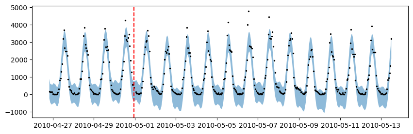

# Forecasting count data

Many timeseries are composed of counts, which are non-negative integers. For example, the number of cars that pass through a toll booth in a given hour, the number of people who visit a website in a given day, or the number of sales of a product. The original Prophet model struggles to handle this type of data, as it assumes that the data is continuous and normally distributed. In this tutorial, we will show you how to use the `prophetverse` library to model count data, with a prophet-like model that uses Negative Binomial likelihood.


```python
# Disable warnings
import warnings

warnings.simplefilter(action="ignore")
import matplotlib.pyplot as plt
import numpy as np
import pandas as pd
from numpyro import distributions as dist
from sktime.forecasting.compose import ForecastingPipeline
from sktime.transformations.series.fourier import FourierFeatures

from prophetverse.datasets.loaders import load_pedestrian_count


```

## Import dataset

We use a dataset `Melbourne Pedestrian Counts` from [forecastingdata](forecastingdata.com), which contains the hourly pedestrian counts in Melbourne, Australia, from a set of sensors located in different parts of the city.


```python

y = load_pedestrian_count()

# We take only one time series for simplicity
y = y.loc["T2"]

split_index = 24 * 365
y_train, y_test = y.iloc[:split_index], y.iloc[split_index + 1 : split_index * 2 + 1]


```


Let's plot a section of the time series to see how it looks like:


```python
display(y_train.head())
y_train.iloc[: 24 * 21].plot(figsize=(10, 3), marker="o", color="black", legend=True)
plt.show()


```
<p class="cell-output-title jp-RenderedText jp-OutputArea-output">Output: <span class="cell-output-count">[3]</span></p>


<div>
<style scoped>
    .dataframe tbody tr th:only-of-type {
        vertical-align: middle;
    }

    .dataframe tbody tr th {
        vertical-align: top;
    }

    .dataframe thead th {
        text-align: right;
    }
</style>
<table border="1" class="dataframe">
  <thead>
    <tr style="text-align: right;">
      <th></th>
      <th>pedestrian_count</th>
    </tr>
    <tr>
      <th>timestamp</th>
      <th></th>
    </tr>
  </thead>
  <tbody>
    <tr>
      <th>2009-05-01 00:00</th>
      <td>52.0</td>
    </tr>
    <tr>
      <th>2009-05-01 01:00</th>
      <td>34.0</td>
    </tr>
    <tr>
      <th>2009-05-01 02:00</th>
      <td>19.0</td>
    </tr>
    <tr>
      <th>2009-05-01 03:00</th>
      <td>14.0</td>
    </tr>
    <tr>
      <th>2009-05-01 04:00</th>
      <td>15.0</td>
    </tr>
  </tbody>
</table>
</div>


    

    


The full dataset is actually large, and plotting it all at once does not
help a lot. Either way, let's plot the full dataset to see how it looks like:


```python
ax = y_train["pedestrian_count"].rename("Train").plot(figsize=(20, 7))
y_test["pedestrian_count"].rename("Test").plot(ax=ax)
ax.legend()
plt.show()


```
<p class="cell-output-title jp-RenderedText jp-OutputArea-output">Output: <span class="cell-output-count">[4]</span></p>


    

    


## Fitting models

The series has some clear patterns: a daily seasonality, a weekly seasonality, and
a yearly seasonality. It also has many zeros, and a model assuming normal
distributed observations would not be able to capture this.

First, let's fit and forecast with the standard prophet,
then see how the negative binomial model performs.

## Prophet with normal likelihood
In this case, we will see how the model will output non-sensical negative values.
The probabilistic intervals, mainly, will output values much lower than the support
of the timeseries.


```python
from prophetverse.effects.fourier import LinearFourierSeasonality
from prophetverse.effects.trend import FlatTrend
from prophetverse.engine import MAPInferenceEngine

from prophetverse.sktime import Prophetverse
from prophetverse.utils.regex import no_input_columns

# Here we set the prior for the seasonality effect
# And the coefficients for it
exogenous_effects = [
    (
        "seasonality",
        LinearFourierSeasonality(
            sp_list=[24, 24 * 7, 24 * 365.5],
            fourier_terms_list=[2, 2, 10],
            freq="H",
            prior_scale=0.5,
            effect_mode="multiplicative",
        ),
        no_input_columns,
    ),
]

model = Prophetverse(
    trend=FlatTrend(),
    exogenous_effects=exogenous_effects,
    inference_engine=MAPInferenceEngine(),
)
model.fit(y=y_train)


```
<p class="cell-output-title jp-RenderedText jp-OutputArea-output">Output: <span class="cell-output-count">[5]</span></p>


<style>#sk-b3afddad-b262-405c-8f85-8ae2ef95c4a6 {
    /* Definition of color scheme common for light and dark mode */
    --sklearn-color-text: black;
    --sklearn-color-line: gray;
    /* Definition of color scheme for objects */
    --sklearn-color-level-0: #fff5e6;
    --sklearn-color-level-1: #f6e4d2;
    --sklearn-color-level-2: #ffe0b3;
    --sklearn-color-level-3: chocolate;

    /* Specific color for light theme */
    --sklearn-color-text-on-default-background: var(--theme-code-foreground, var(--jp-content-font-color1, black));
    --sklearn-color-background: var(--theme-background, var(--jp-layout-color0, white));
    --sklearn-color-border-box: var(--theme-code-foreground, var(--jp-content-font-color1, black));
    --sklearn-color-icon: #696969;

    @media (prefers-color-scheme: dark) {
      /* Redefinition of color scheme for dark theme */
      --sklearn-color-text-on-default-background: var(--theme-code-foreground, var(--jp-content-font-color1, white));
      --sklearn-color-background: var(--theme-background, var(--jp-layout-color0, #111));
      --sklearn-color-border-box: var(--theme-code-foreground, var(--jp-content-font-color1, white));
      --sklearn-color-icon: #878787;
    }
  }

  #sk-b3afddad-b262-405c-8f85-8ae2ef95c4a6 {
    color: var(--sklearn-color-text);
  }

  #sk-b3afddad-b262-405c-8f85-8ae2ef95c4a6 pre {
    padding: 0;
  }

  #sk-b3afddad-b262-405c-8f85-8ae2ef95c4a6 input.sk-hidden--visually {
    border: 0;
    clip: rect(1px 1px 1px 1px);
    clip: rect(1px, 1px, 1px, 1px);
    height: 1px;
    margin: -1px;
    overflow: hidden;
    padding: 0;
    position: absolute;
    width: 1px;
  }

  #sk-b3afddad-b262-405c-8f85-8ae2ef95c4a6 div.sk-dashed-wrapped {
    border: 1px dashed var(--sklearn-color-line);
    margin: 0 0.4em 0.5em 0.4em;
    box-sizing: border-box;
    padding-bottom: 0.4em;
    background-color: var(--sklearn-color-background);
  }

  #sk-b3afddad-b262-405c-8f85-8ae2ef95c4a6 div.sk-container {
    /* jupyter's `normalize.less` sets `[hidden] { display: none; }`
       but bootstrap.min.css set `[hidden] { display: none !important; }`
       so we also need the `!important` here to be able to override the
       default hidden behavior on the sphinx rendered scikit-learn.org.
       See: https://github.com/scikit-learn/scikit-learn/issues/21755 */
    display: inline-block !important;
    position: relative;
  }

  #sk-b3afddad-b262-405c-8f85-8ae2ef95c4a6 div.sk-text-repr-fallback {
    display: none;
  }

  div.sk-parallel-item,
  div.sk-serial,
  div.sk-item {
    /* draw centered vertical line to link estimators */
    background-image: linear-gradient(var(--sklearn-color-text-on-default-background), var(--sklearn-color-text-on-default-background));
    background-size: 2px 100%;
    background-repeat: no-repeat;
    background-position: center center;
  }

  /* Parallel-specific style estimator block */

  #sk-b3afddad-b262-405c-8f85-8ae2ef95c4a6 div.sk-parallel-item::after {
    content: "";
    width: 100%;
    border-bottom: 2px solid var(--sklearn-color-text-on-default-background);
    flex-grow: 1;
  }

  #sk-b3afddad-b262-405c-8f85-8ae2ef95c4a6 div.sk-parallel {
    display: flex;
    align-items: stretch;
    justify-content: center;
    background-color: var(--sklearn-color-background);
    position: relative;
  }

  #sk-b3afddad-b262-405c-8f85-8ae2ef95c4a6 div.sk-parallel-item {
    display: flex;
    flex-direction: column;
  }

  #sk-b3afddad-b262-405c-8f85-8ae2ef95c4a6 div.sk-parallel-item:first-child::after {
    align-self: flex-end;
    width: 50%;
  }

  #sk-b3afddad-b262-405c-8f85-8ae2ef95c4a6 div.sk-parallel-item:last-child::after {
    align-self: flex-start;
    width: 50%;
  }

  #sk-b3afddad-b262-405c-8f85-8ae2ef95c4a6 div.sk-parallel-item:only-child::after {
    width: 0;
  }

  /* Serial-specific style estimator block */

  #sk-b3afddad-b262-405c-8f85-8ae2ef95c4a6 div.sk-serial {
    display: flex;
    flex-direction: column;
    align-items: center;
    background-color: var(--sklearn-color-background);
    padding-right: 1em;
    padding-left: 1em;
  }


  /* Toggleable style: style used for estimator/Pipeline/ColumnTransformer box that is
  clickable and can be expanded/collapsed.
  - Pipeline and ColumnTransformer use this feature and define the default style
  - Estimators will overwrite some part of the style using the `sk-estimator` class
  */

  /* Pipeline and ColumnTransformer style (default) */

  #sk-b3afddad-b262-405c-8f85-8ae2ef95c4a6 div.sk-toggleable {
    /* Default theme specific background. It is overwritten whether we have a
    specific estimator or a Pipeline/ColumnTransformer */
    background-color: var(--sklearn-color-background);
  }

  /* Toggleable label */
  #sk-b3afddad-b262-405c-8f85-8ae2ef95c4a6 label.sk-toggleable__label {
    cursor: pointer;
    display: block;
    width: 100%;
    margin-bottom: 0;
    padding: 0.5em;
    box-sizing: border-box;
    text-align: center;
  }

  #sk-b3afddad-b262-405c-8f85-8ae2ef95c4a6 label.sk-toggleable__label-arrow:before {
    /* Arrow on the left of the label */
    content: "▸";
    float: left;
    margin-right: 0.25em;
    color: var(--sklearn-color-icon);
  }

  #sk-b3afddad-b262-405c-8f85-8ae2ef95c4a6 label.sk-toggleable__label-arrow:hover:before {
    color: var(--sklearn-color-text);
  }

  /* Toggleable content - dropdown */

  #sk-b3afddad-b262-405c-8f85-8ae2ef95c4a6 div.sk-toggleable__content {
    max-height: 0;
    max-width: 0;
    overflow: hidden;
    text-align: left;
    background-color: var(--sklearn-color-level-0);
  }

  #sk-b3afddad-b262-405c-8f85-8ae2ef95c4a6 div.sk-toggleable__content pre {
    margin: 0.2em;
    border-radius: 0.25em;
    color: var(--sklearn-color-text);
    background-color: var(--sklearn-color-level-0);
  }

  #sk-b3afddad-b262-405c-8f85-8ae2ef95c4a6 input.sk-toggleable__control:checked~div.sk-toggleable__content {
    /* Expand drop-down */
    max-height: 200px;
    max-width: 100%;
    overflow: auto;
  }

  #sk-b3afddad-b262-405c-8f85-8ae2ef95c4a6 input.sk-toggleable__control:checked~label.sk-toggleable__label-arrow:before {
    content: "▾";
  }

  /* Pipeline/ColumnTransformer-specific style */

  #sk-b3afddad-b262-405c-8f85-8ae2ef95c4a6 div.sk-label input.sk-toggleable__control:checked~label.sk-toggleable__label {
    color: var(--sklearn-color-text);
    background-color: var(--sklearn-color-level-2);
  }

  /* Estimator-specific style */

  /* Colorize estimator box */
  #sk-b3afddad-b262-405c-8f85-8ae2ef95c4a6 div.sk-estimator input.sk-toggleable__control:checked~label.sk-toggleable__label {
    /* unfitted */
    background-color: var(--sklearn-color-level-2);
  }

  #sk-b3afddad-b262-405c-8f85-8ae2ef95c4a6 div.sk-label label.sk-toggleable__label,
  #sk-b3afddad-b262-405c-8f85-8ae2ef95c4a6 div.sk-label label {
    /* The background is the default theme color */
    color: var(--sklearn-color-text-on-default-background);
  }

  /* On hover, darken the color of the background */
  #sk-b3afddad-b262-405c-8f85-8ae2ef95c4a6 div.sk-label:hover label.sk-toggleable__label {
    color: var(--sklearn-color-text);
    background-color: var(--sklearn-color-level-2);
  }

  /* Estimator label */

  #sk-b3afddad-b262-405c-8f85-8ae2ef95c4a6 div.sk-label label {
    font-family: monospace;
    font-weight: bold;
    display: inline-block;
    line-height: 1.2em;
  }

  #sk-b3afddad-b262-405c-8f85-8ae2ef95c4a6 div.sk-label-container {
    text-align: center;
  }

  /* Estimator-specific */
  #sk-b3afddad-b262-405c-8f85-8ae2ef95c4a6 div.sk-estimator {
    font-family: monospace;
    border: 1px dotted var(--sklearn-color-border-box);
    border-radius: 0.25em;
    box-sizing: border-box;
    margin-bottom: 0.5em;
    background-color: var(--sklearn-color-level-0);
  }

  /* on hover */
  #sk-b3afddad-b262-405c-8f85-8ae2ef95c4a6 div.sk-estimator:hover {
    background-color: var(--sklearn-color-level-2);
  }

  /* Specification for estimator info */

  .sk-estimator-doc-link,
  a:link.sk-estimator-doc-link,
  a:visited.sk-estimator-doc-link {
    float: right;
    font-size: smaller;
    line-height: 1em;
    font-family: monospace;
    background-color: var(--sklearn-color-background);
    border-radius: 1em;
    height: 1em;
    width: 1em;
    text-decoration: none !important;
    margin-left: 1ex;
    border: var(--sklearn-color-level-1) 1pt solid;
    color: var(--sklearn-color-level-1);
  }

  /* On hover */
  div.sk-estimator:hover .sk-estimator-doc-link:hover,
  .sk-estimator-doc-link:hover,
  div.sk-label-container:hover .sk-estimator-doc-link:hover,
  .sk-estimator-doc-link:hover {
    background-color: var(--sklearn-color-level-3);
    color: var(--sklearn-color-background);
    text-decoration: none;
  }

  /* Span, style for the box shown on hovering the info icon */
  .sk-estimator-doc-link span {
    display: none;
    z-index: 9999;
    position: relative;
    font-weight: normal;
    right: .2ex;
    padding: .5ex;
    margin: .5ex;
    width: min-content;
    min-width: 20ex;
    max-width: 50ex;
    color: var(--sklearn-color-text);
    box-shadow: 2pt 2pt 4pt #999;
    background: var(--sklearn-color-level-0);
    border: .5pt solid var(--sklearn-color-level-3);
  }

  .sk-estimator-doc-link:hover span {
    display: block;
  }

  /* "?"-specific style due to the `<a>` HTML tag */

  #sk-b3afddad-b262-405c-8f85-8ae2ef95c4a6 a.estimator_doc_link {
    float: right;
    font-size: 1rem;
    line-height: 1em;
    font-family: monospace;
    background-color: var(--sklearn-color-background);
    border-radius: 1rem;
    height: 1rem;
    width: 1rem;
    text-decoration: none;
    color: var(--sklearn-color-level-1);
    border: var(--sklearn-color-level-1) 1pt solid;
  }

  /* On hover */
  #sk-b3afddad-b262-405c-8f85-8ae2ef95c4a6 a.estimator_doc_link:hover {
    background-color: var(--sklearn-color-level-3);
    color: var(--sklearn-color-background);
    text-decoration: none;
  }
</style><div id='sk-b3afddad-b262-405c-8f85-8ae2ef95c4a6' class="sk-top-container"><div class="sk-text-repr-fallback"><pre>Prophetverse(exogenous_effects=[(&#x27;seasonality&#x27;,
                                 LinearFourierSeasonality(effect_mode=&#x27;multiplicative&#x27;,
                                                          fourier_terms_list=[2,
                                                                              2,
                                                                              10],
                                                          freq=&#x27;H&#x27;,
                                                          prior_scale=0.5,
                                                          sp_list=[24, 168,
                                                                   8772.0]),
                                 &#x27;^$&#x27;)],
             inference_engine=MAPInferenceEngine(), trend=FlatTrend())</pre><b>Please rerun this cell to show the HTML repr or trust the notebook.</b></div><div class="sk-container" hidden><div class="sk-item sk-dashed-wrapped"><div class='sk-label-container'><div class="sk-label sk-toggleable"><input class="sk-toggleable__control sk-hidden--visually" id=UUID('037b86f6-60e6-43f1-820a-b6d02b73a2bd') type="checkbox" ><label for=UUID('037b86f6-60e6-43f1-820a-b6d02b73a2bd') class='sk-toggleable__label sk-toggleable__label-arrow'>Prophetverse</label><div class="sk-toggleable__content"><pre>Prophetverse(exogenous_effects=[(&#x27;seasonality&#x27;,
                                 LinearFourierSeasonality(effect_mode=&#x27;multiplicative&#x27;,
                                                          fourier_terms_list=[2,
                                                                              2,
                                                                              10],
                                                          freq=&#x27;H&#x27;,
                                                          prior_scale=0.5,
                                                          sp_list=[24, 168,
                                                                   8772.0]),
                                 &#x27;^$&#x27;)],
             inference_engine=MAPInferenceEngine(), trend=FlatTrend())</pre></div></div></div><div class="sk-parallel"><div class="sk-parallel-item"><div class="sk-item"><div class='sk-label-container'><div class="sk-label sk-toggleable"><label>effects</label></div></div><div class="sk-serial"><div class="sk-item"><div class="sk-serial"><div class='sk-item'><div class="sk-estimator sk-toggleable"><input class="sk-toggleable__control sk-hidden--visually" id=UUID('a3d9167a-0db1-4480-a6c3-5be19ada9f51') type="checkbox" ><label for=UUID('a3d9167a-0db1-4480-a6c3-5be19ada9f51') class='sk-toggleable__label sk-toggleable__label-arrow'>FlatTrend</label><div class="sk-toggleable__content"><pre>FlatTrend()</pre></div></div></div><div class='sk-item'><div class="sk-estimator sk-toggleable"><input class="sk-toggleable__control sk-hidden--visually" id=UUID('83f25253-22f0-46ec-9a09-5a51184700ae') type="checkbox" ><label for=UUID('83f25253-22f0-46ec-9a09-5a51184700ae') class='sk-toggleable__label sk-toggleable__label-arrow'>LinearFourierSeasonality</label><div class="sk-toggleable__content"><pre>LinearFourierSeasonality(effect_mode=&#x27;multiplicative&#x27;,
                         fourier_terms_list=[2, 2, 10], freq=&#x27;H&#x27;,
                         prior_scale=0.5, sp_list=[24, 168, 8772.0])</pre></div></div></div></div></div></div></div></div><div class="sk-parallel-item"><div class="sk-item"><div class='sk-label-container'><div class="sk-label sk-toggleable"><label>inference_engine</label></div></div><div class="sk-serial"><div class='sk-item'><div class="sk-estimator sk-toggleable"><input class="sk-toggleable__control sk-hidden--visually" id=UUID('36b39357-5735-42ae-b670-d8baa8a0825b') type="checkbox" ><label for=UUID('36b39357-5735-42ae-b670-d8baa8a0825b') class='sk-toggleable__label sk-toggleable__label-arrow'>MAPInferenceEngine</label><div class="sk-toggleable__content"><pre>MAPInferenceEngine()</pre></div></div></div></div></div></div></div></div></div></div>


### Forecasting with the normal model
Below we see the negative predictions, which is clear a limitation of this
gaussian likelihood for this kind of data.


```python
forecast_horizon = y_train.index[-100:].union(y_test.index[:300])
fig, ax = plt.subplots(figsize=(10, 3))
preds_normal = model.predict(fh=forecast_horizon)
preds_normal["pedestrian_count"].rename("Normal model").plot.line(
    ax=ax, legend=False, color="tab:blue"
)
ax.scatter(y_train.index, y_train, marker="o", color="k", s=2, alpha=0.5, label="Train")
ax.scatter(
    y_test.index, y_test, marker="o", color="green", s=2, alpha=0.5, label="Test"
)
ax.set_title("Prophet with normal likelihood")
ax.legend()
fig.show()


```
<p class="cell-output-title jp-RenderedText jp-OutputArea-output">Output: <span class="cell-output-count">[6]</span></p>


    

    


```python
quantiles = model.predict_quantiles(fh=forecast_horizon, alpha=[0.1, 0.9])
fig, ax = plt.subplots(figsize=(10, 3))
# Plot area between quantiles
ax.fill_between(
    quantiles.index.to_timestamp(),
    quantiles.iloc[:, 0],
    quantiles.iloc[:, -1],
    alpha=0.5,
)
ax.scatter(
    forecast_horizon.to_timestamp(),
    y.loc[forecast_horizon],
    marker="o",
    color="k",
    s=2,
    alpha=1,
)
ax.axvline(y_train.index[-1].to_timestamp(), color="r", linestyle="--")
fig.show()


```
<p class="cell-output-title jp-RenderedText jp-OutputArea-output">Output: <span class="cell-output-count">[7]</span></p>


    

    


## Prophet with negative binomial likelihood

The negative binomial likehood has support on the non-negative integers, which makes
it perfect for count data. We change the likelihood of the model, and fit it again.


```python
model.set_params(likelihood="negbinomial")
model.fit(y=y_train)


```
<p class="cell-output-title jp-RenderedText jp-OutputArea-output">Output: <span class="cell-output-count">[8]</span></p>


<style>#sk-05b3eaac-e270-4a4e-b4e4-1d2e781a61af {
    /* Definition of color scheme common for light and dark mode */
    --sklearn-color-text: black;
    --sklearn-color-line: gray;
    /* Definition of color scheme for objects */
    --sklearn-color-level-0: #fff5e6;
    --sklearn-color-level-1: #f6e4d2;
    --sklearn-color-level-2: #ffe0b3;
    --sklearn-color-level-3: chocolate;

    /* Specific color for light theme */
    --sklearn-color-text-on-default-background: var(--theme-code-foreground, var(--jp-content-font-color1, black));
    --sklearn-color-background: var(--theme-background, var(--jp-layout-color0, white));
    --sklearn-color-border-box: var(--theme-code-foreground, var(--jp-content-font-color1, black));
    --sklearn-color-icon: #696969;

    @media (prefers-color-scheme: dark) {
      /* Redefinition of color scheme for dark theme */
      --sklearn-color-text-on-default-background: var(--theme-code-foreground, var(--jp-content-font-color1, white));
      --sklearn-color-background: var(--theme-background, var(--jp-layout-color0, #111));
      --sklearn-color-border-box: var(--theme-code-foreground, var(--jp-content-font-color1, white));
      --sklearn-color-icon: #878787;
    }
  }

  #sk-05b3eaac-e270-4a4e-b4e4-1d2e781a61af {
    color: var(--sklearn-color-text);
  }

  #sk-05b3eaac-e270-4a4e-b4e4-1d2e781a61af pre {
    padding: 0;
  }

  #sk-05b3eaac-e270-4a4e-b4e4-1d2e781a61af input.sk-hidden--visually {
    border: 0;
    clip: rect(1px 1px 1px 1px);
    clip: rect(1px, 1px, 1px, 1px);
    height: 1px;
    margin: -1px;
    overflow: hidden;
    padding: 0;
    position: absolute;
    width: 1px;
  }

  #sk-05b3eaac-e270-4a4e-b4e4-1d2e781a61af div.sk-dashed-wrapped {
    border: 1px dashed var(--sklearn-color-line);
    margin: 0 0.4em 0.5em 0.4em;
    box-sizing: border-box;
    padding-bottom: 0.4em;
    background-color: var(--sklearn-color-background);
  }

  #sk-05b3eaac-e270-4a4e-b4e4-1d2e781a61af div.sk-container {
    /* jupyter's `normalize.less` sets `[hidden] { display: none; }`
       but bootstrap.min.css set `[hidden] { display: none !important; }`
       so we also need the `!important` here to be able to override the
       default hidden behavior on the sphinx rendered scikit-learn.org.
       See: https://github.com/scikit-learn/scikit-learn/issues/21755 */
    display: inline-block !important;
    position: relative;
  }

  #sk-05b3eaac-e270-4a4e-b4e4-1d2e781a61af div.sk-text-repr-fallback {
    display: none;
  }

  div.sk-parallel-item,
  div.sk-serial,
  div.sk-item {
    /* draw centered vertical line to link estimators */
    background-image: linear-gradient(var(--sklearn-color-text-on-default-background), var(--sklearn-color-text-on-default-background));
    background-size: 2px 100%;
    background-repeat: no-repeat;
    background-position: center center;
  }

  /* Parallel-specific style estimator block */

  #sk-05b3eaac-e270-4a4e-b4e4-1d2e781a61af div.sk-parallel-item::after {
    content: "";
    width: 100%;
    border-bottom: 2px solid var(--sklearn-color-text-on-default-background);
    flex-grow: 1;
  }

  #sk-05b3eaac-e270-4a4e-b4e4-1d2e781a61af div.sk-parallel {
    display: flex;
    align-items: stretch;
    justify-content: center;
    background-color: var(--sklearn-color-background);
    position: relative;
  }

  #sk-05b3eaac-e270-4a4e-b4e4-1d2e781a61af div.sk-parallel-item {
    display: flex;
    flex-direction: column;
  }

  #sk-05b3eaac-e270-4a4e-b4e4-1d2e781a61af div.sk-parallel-item:first-child::after {
    align-self: flex-end;
    width: 50%;
  }

  #sk-05b3eaac-e270-4a4e-b4e4-1d2e781a61af div.sk-parallel-item:last-child::after {
    align-self: flex-start;
    width: 50%;
  }

  #sk-05b3eaac-e270-4a4e-b4e4-1d2e781a61af div.sk-parallel-item:only-child::after {
    width: 0;
  }

  /* Serial-specific style estimator block */

  #sk-05b3eaac-e270-4a4e-b4e4-1d2e781a61af div.sk-serial {
    display: flex;
    flex-direction: column;
    align-items: center;
    background-color: var(--sklearn-color-background);
    padding-right: 1em;
    padding-left: 1em;
  }


  /* Toggleable style: style used for estimator/Pipeline/ColumnTransformer box that is
  clickable and can be expanded/collapsed.
  - Pipeline and ColumnTransformer use this feature and define the default style
  - Estimators will overwrite some part of the style using the `sk-estimator` class
  */

  /* Pipeline and ColumnTransformer style (default) */

  #sk-05b3eaac-e270-4a4e-b4e4-1d2e781a61af div.sk-toggleable {
    /* Default theme specific background. It is overwritten whether we have a
    specific estimator or a Pipeline/ColumnTransformer */
    background-color: var(--sklearn-color-background);
  }

  /* Toggleable label */
  #sk-05b3eaac-e270-4a4e-b4e4-1d2e781a61af label.sk-toggleable__label {
    cursor: pointer;
    display: block;
    width: 100%;
    margin-bottom: 0;
    padding: 0.5em;
    box-sizing: border-box;
    text-align: center;
  }

  #sk-05b3eaac-e270-4a4e-b4e4-1d2e781a61af label.sk-toggleable__label-arrow:before {
    /* Arrow on the left of the label */
    content: "▸";
    float: left;
    margin-right: 0.25em;
    color: var(--sklearn-color-icon);
  }

  #sk-05b3eaac-e270-4a4e-b4e4-1d2e781a61af label.sk-toggleable__label-arrow:hover:before {
    color: var(--sklearn-color-text);
  }

  /* Toggleable content - dropdown */

  #sk-05b3eaac-e270-4a4e-b4e4-1d2e781a61af div.sk-toggleable__content {
    max-height: 0;
    max-width: 0;
    overflow: hidden;
    text-align: left;
    background-color: var(--sklearn-color-level-0);
  }

  #sk-05b3eaac-e270-4a4e-b4e4-1d2e781a61af div.sk-toggleable__content pre {
    margin: 0.2em;
    border-radius: 0.25em;
    color: var(--sklearn-color-text);
    background-color: var(--sklearn-color-level-0);
  }

  #sk-05b3eaac-e270-4a4e-b4e4-1d2e781a61af input.sk-toggleable__control:checked~div.sk-toggleable__content {
    /* Expand drop-down */
    max-height: 200px;
    max-width: 100%;
    overflow: auto;
  }

  #sk-05b3eaac-e270-4a4e-b4e4-1d2e781a61af input.sk-toggleable__control:checked~label.sk-toggleable__label-arrow:before {
    content: "▾";
  }

  /* Pipeline/ColumnTransformer-specific style */

  #sk-05b3eaac-e270-4a4e-b4e4-1d2e781a61af div.sk-label input.sk-toggleable__control:checked~label.sk-toggleable__label {
    color: var(--sklearn-color-text);
    background-color: var(--sklearn-color-level-2);
  }

  /* Estimator-specific style */

  /* Colorize estimator box */
  #sk-05b3eaac-e270-4a4e-b4e4-1d2e781a61af div.sk-estimator input.sk-toggleable__control:checked~label.sk-toggleable__label {
    /* unfitted */
    background-color: var(--sklearn-color-level-2);
  }

  #sk-05b3eaac-e270-4a4e-b4e4-1d2e781a61af div.sk-label label.sk-toggleable__label,
  #sk-05b3eaac-e270-4a4e-b4e4-1d2e781a61af div.sk-label label {
    /* The background is the default theme color */
    color: var(--sklearn-color-text-on-default-background);
  }

  /* On hover, darken the color of the background */
  #sk-05b3eaac-e270-4a4e-b4e4-1d2e781a61af div.sk-label:hover label.sk-toggleable__label {
    color: var(--sklearn-color-text);
    background-color: var(--sklearn-color-level-2);
  }

  /* Estimator label */

  #sk-05b3eaac-e270-4a4e-b4e4-1d2e781a61af div.sk-label label {
    font-family: monospace;
    font-weight: bold;
    display: inline-block;
    line-height: 1.2em;
  }

  #sk-05b3eaac-e270-4a4e-b4e4-1d2e781a61af div.sk-label-container {
    text-align: center;
  }

  /* Estimator-specific */
  #sk-05b3eaac-e270-4a4e-b4e4-1d2e781a61af div.sk-estimator {
    font-family: monospace;
    border: 1px dotted var(--sklearn-color-border-box);
    border-radius: 0.25em;
    box-sizing: border-box;
    margin-bottom: 0.5em;
    background-color: var(--sklearn-color-level-0);
  }

  /* on hover */
  #sk-05b3eaac-e270-4a4e-b4e4-1d2e781a61af div.sk-estimator:hover {
    background-color: var(--sklearn-color-level-2);
  }

  /* Specification for estimator info */

  .sk-estimator-doc-link,
  a:link.sk-estimator-doc-link,
  a:visited.sk-estimator-doc-link {
    float: right;
    font-size: smaller;
    line-height: 1em;
    font-family: monospace;
    background-color: var(--sklearn-color-background);
    border-radius: 1em;
    height: 1em;
    width: 1em;
    text-decoration: none !important;
    margin-left: 1ex;
    border: var(--sklearn-color-level-1) 1pt solid;
    color: var(--sklearn-color-level-1);
  }

  /* On hover */
  div.sk-estimator:hover .sk-estimator-doc-link:hover,
  .sk-estimator-doc-link:hover,
  div.sk-label-container:hover .sk-estimator-doc-link:hover,
  .sk-estimator-doc-link:hover {
    background-color: var(--sklearn-color-level-3);
    color: var(--sklearn-color-background);
    text-decoration: none;
  }

  /* Span, style for the box shown on hovering the info icon */
  .sk-estimator-doc-link span {
    display: none;
    z-index: 9999;
    position: relative;
    font-weight: normal;
    right: .2ex;
    padding: .5ex;
    margin: .5ex;
    width: min-content;
    min-width: 20ex;
    max-width: 50ex;
    color: var(--sklearn-color-text);
    box-shadow: 2pt 2pt 4pt #999;
    background: var(--sklearn-color-level-0);
    border: .5pt solid var(--sklearn-color-level-3);
  }

  .sk-estimator-doc-link:hover span {
    display: block;
  }

  /* "?"-specific style due to the `<a>` HTML tag */

  #sk-05b3eaac-e270-4a4e-b4e4-1d2e781a61af a.estimator_doc_link {
    float: right;
    font-size: 1rem;
    line-height: 1em;
    font-family: monospace;
    background-color: var(--sklearn-color-background);
    border-radius: 1rem;
    height: 1rem;
    width: 1rem;
    text-decoration: none;
    color: var(--sklearn-color-level-1);
    border: var(--sklearn-color-level-1) 1pt solid;
  }

  /* On hover */
  #sk-05b3eaac-e270-4a4e-b4e4-1d2e781a61af a.estimator_doc_link:hover {
    background-color: var(--sklearn-color-level-3);
    color: var(--sklearn-color-background);
    text-decoration: none;
  }
</style><div id='sk-05b3eaac-e270-4a4e-b4e4-1d2e781a61af' class="sk-top-container"><div class="sk-text-repr-fallback"><pre>Prophetverse(exogenous_effects=[(&#x27;seasonality&#x27;,
                                 LinearFourierSeasonality(effect_mode=&#x27;multiplicative&#x27;,
                                                          fourier_terms_list=[2,
                                                                              2,
                                                                              10],
                                                          freq=&#x27;H&#x27;,
                                                          prior_scale=0.5,
                                                          sp_list=[24, 168,
                                                                   8772.0]),
                                 &#x27;^$&#x27;)],
             inference_engine=MAPInferenceEngine(), likelihood=&#x27;negbinomial&#x27;,
             trend=FlatTrend())</pre><b>Please rerun this cell to show the HTML repr or trust the notebook.</b></div><div class="sk-container" hidden><div class="sk-item sk-dashed-wrapped"><div class='sk-label-container'><div class="sk-label sk-toggleable"><input class="sk-toggleable__control sk-hidden--visually" id=UUID('a6130809-0cea-48df-81e7-14f8e6210d69') type="checkbox" ><label for=UUID('a6130809-0cea-48df-81e7-14f8e6210d69') class='sk-toggleable__label sk-toggleable__label-arrow'>Prophetverse</label><div class="sk-toggleable__content"><pre>Prophetverse(exogenous_effects=[(&#x27;seasonality&#x27;,
                                 LinearFourierSeasonality(effect_mode=&#x27;multiplicative&#x27;,
                                                          fourier_terms_list=[2,
                                                                              2,
                                                                              10],
                                                          freq=&#x27;H&#x27;,
                                                          prior_scale=0.5,
                                                          sp_list=[24, 168,
                                                                   8772.0]),
                                 &#x27;^$&#x27;)],
             inference_engine=MAPInferenceEngine(), likelihood=&#x27;negbinomial&#x27;,
             trend=FlatTrend())</pre></div></div></div><div class="sk-parallel"><div class="sk-parallel-item"><div class="sk-item"><div class='sk-label-container'><div class="sk-label sk-toggleable"><label>effects</label></div></div><div class="sk-serial"><div class="sk-item"><div class="sk-serial"><div class='sk-item'><div class="sk-estimator sk-toggleable"><input class="sk-toggleable__control sk-hidden--visually" id=UUID('735de3e0-4b0b-4f79-9c46-b5ec7d045234') type="checkbox" ><label for=UUID('735de3e0-4b0b-4f79-9c46-b5ec7d045234') class='sk-toggleable__label sk-toggleable__label-arrow'>FlatTrend</label><div class="sk-toggleable__content"><pre>FlatTrend()</pre></div></div></div><div class='sk-item'><div class="sk-estimator sk-toggleable"><input class="sk-toggleable__control sk-hidden--visually" id=UUID('12062775-0c4e-4b63-a0b9-1a3f6b642823') type="checkbox" ><label for=UUID('12062775-0c4e-4b63-a0b9-1a3f6b642823') class='sk-toggleable__label sk-toggleable__label-arrow'>LinearFourierSeasonality</label><div class="sk-toggleable__content"><pre>LinearFourierSeasonality(effect_mode=&#x27;multiplicative&#x27;,
                         fourier_terms_list=[2, 2, 10], freq=&#x27;H&#x27;,
                         prior_scale=0.5, sp_list=[24, 168, 8772.0])</pre></div></div></div></div></div></div></div></div><div class="sk-parallel-item"><div class="sk-item"><div class='sk-label-container'><div class="sk-label sk-toggleable"><label>inference_engine</label></div></div><div class="sk-serial"><div class='sk-item'><div class="sk-estimator sk-toggleable"><input class="sk-toggleable__control sk-hidden--visually" id=UUID('a75b03d4-a373-4efc-bdb8-33702643bfec') type="checkbox" ><label for=UUID('a75b03d4-a373-4efc-bdb8-33702643bfec') class='sk-toggleable__label sk-toggleable__label-arrow'>MAPInferenceEngine</label><div class="sk-toggleable__content"><pre>MAPInferenceEngine()</pre></div></div></div></div></div></div></div></div></div></div>


### Forecasting with the negative binomial model


```python
fig, ax = plt.subplots(figsize=(10, 3))
preds_negbin = model.predict(fh=forecast_horizon)
preds_negbin["pedestrian_count"].rename("Neg. Binomial model").plot.line(
    ax=ax, legend=False, color="tab:purple"
)
ax.scatter(y_train.index, y_train, marker="o", color="k", s=2, alpha=0.5, label="Train")
ax.scatter(
    y_test.index, y_test, marker="o", color="green", s=2, alpha=0.5, label="Test"
)
ax.set_title("Prophet with Negative Binomial likelihood")
ax.legend()
fig.show()


```
<p class="cell-output-title jp-RenderedText jp-OutputArea-output">Output: <span class="cell-output-count">[9]</span></p>


    

    


```python
quantiles = model.predict_quantiles(fh=forecast_horizon, alpha=[0.1, 0.9])
fig, ax = plt.subplots(figsize=(10, 3))
# Plot area between quantiles
ax.fill_between(
    quantiles.index.to_timestamp(),
    quantiles.iloc[:, 0],
    quantiles.iloc[:, -1],
    alpha=0.5,
)
ax.scatter(
    forecast_horizon.to_timestamp(),
    y.loc[forecast_horizon],
    marker="o",
    color="k",
    s=2,
    alpha=1,
)
ax.axvline(y_train.index[-1].to_timestamp(), color="r", linestyle="--")
fig.show()


```
<p class="cell-output-title jp-RenderedText jp-OutputArea-output">Output: <span class="cell-output-count">[10]</span></p>


    

    


## Comparing both forecasts side by side

To make our point clear, we plot both forecasts side by side. Isn't it nice to have
forecasts that make sense? :smile:


```python
fig, ax = plt.subplots(figsize=(9, 5))
preds_negbin["pedestrian_count"].rename("Neg. Binomial model").plot.line(
    ax=ax, legend=False, color="tab:purple"
)
preds_normal["pedestrian_count"].rename("Normal model").plot.line(
    ax=ax, legend=False, color="tab:blue"
)
ax.scatter(y_train.index, y_train, marker="o", color="k", s=6, alpha=0.5, label="Train")
ax.scatter(
    y_test.index, y_test, marker="o", color="green", s=6, alpha=0.5, label="Test"
)
ax.set_title("Forecasting pedestrian counts")
# Remove xlabel
ax.set_xlabel("")
ax.axvline(
    y_train.index[-1].to_timestamp(),
    color="black",
    linestyle="--",
    alpha=0.3,
    zorder=-1,
)
fig.legend(loc="center", ncol=4, bbox_to_anchor=(0.5, 0.8))
fig.tight_layout()
fig.show()


```
<p class="cell-output-title jp-RenderedText jp-OutputArea-output">Output: <span class="cell-output-count">[11]</span></p>


    

    

