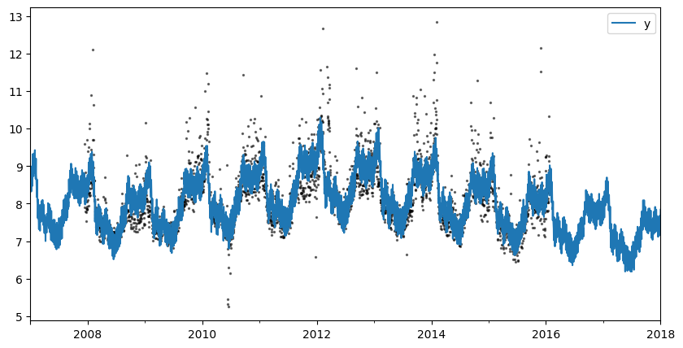
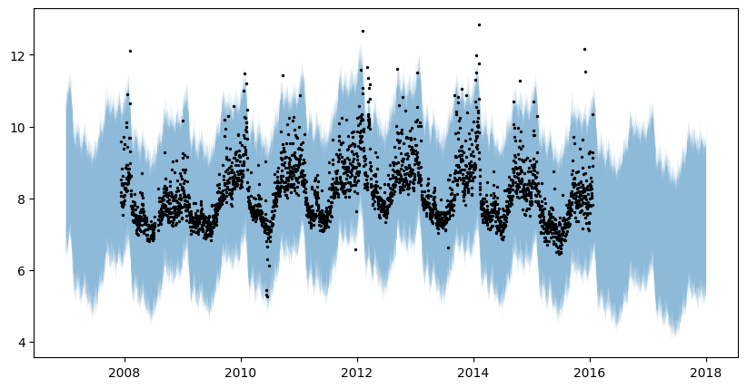
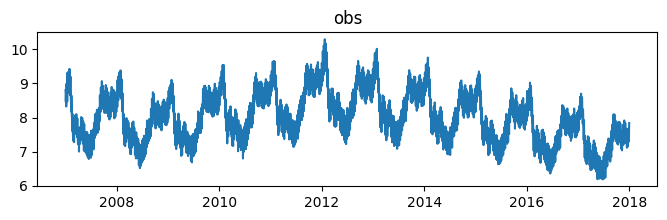
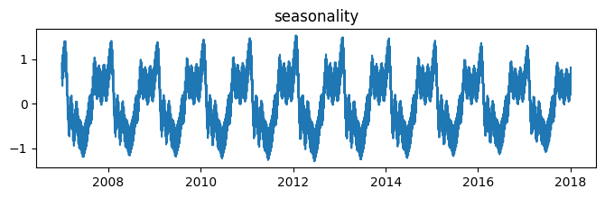
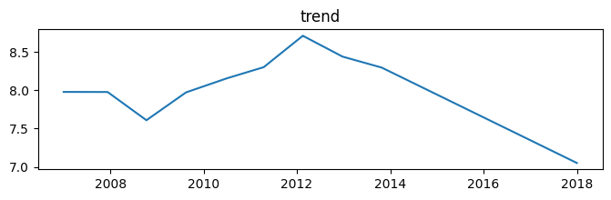
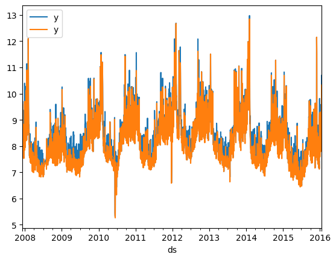
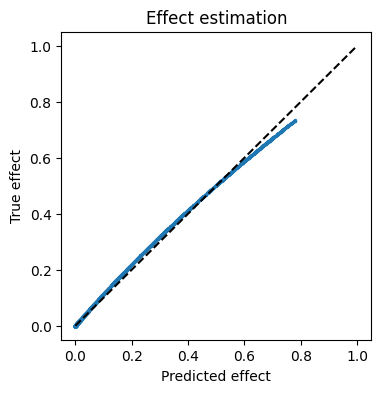
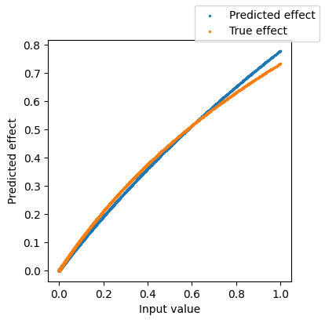

# Basic univariate forecasting


```python
import matplotlib.pyplot as plt
import numpy as np
import pandas as pd
from numpyro import distributions as dist


```

# Import dataset

We import a dataset from Prophet's original repository. We then put it into sktime-friendly format, where the index is a `pd.PeriodIndex` and the colums are the time series.


```python
df = pd.read_csv(
    "https://raw.githubusercontent.com/facebook/prophet/main/examples/example_wp_log_peyton_manning.csv"
)
df["ds"] = pd.to_datetime(df["ds"]).dt.to_period("D")
y = df.set_index("ds")
display(y.head())


```
<p class="cell-output-title">Output</p>


<div>
<style scoped>
    .dataframe tbody tr th:only-of-type {
        vertical-align: middle;
    }

    .dataframe tbody tr th {
        vertical-align: top;
    }

    .dataframe thead th {
        text-align: right;
    }
</style>
<table border="1" class="dataframe">
  <thead>
    <tr style="text-align: right;">
      <th></th>
      <th>y</th>
    </tr>
    <tr>
      <th>ds</th>
      <th></th>
    </tr>
  </thead>
  <tbody>
    <tr>
      <th>2007-12-10</th>
      <td>9.590761</td>
    </tr>
    <tr>
      <th>2007-12-11</th>
      <td>8.519590</td>
    </tr>
    <tr>
      <th>2007-12-12</th>
      <td>8.183677</td>
    </tr>
    <tr>
      <th>2007-12-13</th>
      <td>8.072467</td>
    </tr>
    <tr>
      <th>2007-12-14</th>
      <td>7.893572</td>
    </tr>
  </tbody>
</table>
</div>


# Fit model

Here, we fit the univariate Prophet. The `exogenous_effects` parameter let us specify different relations between exogenous variables and the time series. If we do not specify `exogenous_effects`, all variables in X are assumed to be linearly related to the time series.

This argument is a list of tuples of the form `(effect_name, effect, regex_to_filter_relevant_columns)`, where `effect_name` is a string and `effect` is an instance of a subclass of `prophetverse.effects.BaseEffect`. The regex is used to filter the columns of X that are relevant for the effect, but can also be `None` (or its alias `prophetverse.utils.no_input_columns`) if no input in `X` is needed for the effect. For example, the seasonality effect already implemented in `prophetverse.effects` module does not need any input in `X`, so we can use `prophetverse.utils.no_input_columns` as the regex.


```python
from prophetverse.effects.fourier import LinearFourierSeasonality
from prophetverse.effects.linear import LinearEffect
from prophetverse.sktime import Prophetverse
from prophetverse.sktime.seasonality import seasonal_transformer
from prophetverse.utils import no_input_columns


model = Prophetverse(
    trend="linear",
    changepoint_interval=300,
    changepoint_prior_scale=0.0001,
    exogenous_effects=[
        (
            "seasonality",
            LinearFourierSeasonality(
                freq="D",
                sp_list=[7, 365.25],
                fourier_terms_list=[3, 10],
                prior_scale=0.1,
                effect_mode="multiplicative",
            ),
            no_input_columns,
        ),
    ],
    noise_scale=0.05,
    optimizer_steps=20000,
    optimizer_name="Adam",
    optimizer_kwargs={"step_size": 0.0001},
    inference_method="map",
)
model.fit(y=y)


```
<p class="cell-output-title">Output</p>


<style>#sk-d9abbbcb-539e-4607-ad9e-95ac3ec5ad6c {
    /* Definition of color scheme common for light and dark mode */
    --sklearn-color-text: black;
    --sklearn-color-line: gray;
    /* Definition of color scheme for objects */
    --sklearn-color-level-0: #fff5e6;
    --sklearn-color-level-1: #f6e4d2;
    --sklearn-color-level-2: #ffe0b3;
    --sklearn-color-level-3: chocolate;

    /* Specific color for light theme */
    --sklearn-color-text-on-default-background: var(--theme-code-foreground, var(--jp-content-font-color1, black));
    --sklearn-color-background: var(--theme-background, var(--jp-layout-color0, white));
    --sklearn-color-border-box: var(--theme-code-foreground, var(--jp-content-font-color1, black));
    --sklearn-color-icon: #696969;

    @media (prefers-color-scheme: dark) {
      /* Redefinition of color scheme for dark theme */
      --sklearn-color-text-on-default-background: var(--theme-code-foreground, var(--jp-content-font-color1, white));
      --sklearn-color-background: var(--theme-background, var(--jp-layout-color0, #111));
      --sklearn-color-border-box: var(--theme-code-foreground, var(--jp-content-font-color1, white));
      --sklearn-color-icon: #878787;
    }
  }

  #sk-d9abbbcb-539e-4607-ad9e-95ac3ec5ad6c {
    color: var(--sklearn-color-text);
  }

  #sk-d9abbbcb-539e-4607-ad9e-95ac3ec5ad6c pre {
    padding: 0;
  }

  #sk-d9abbbcb-539e-4607-ad9e-95ac3ec5ad6c input.sk-hidden--visually {
    border: 0;
    clip: rect(1px 1px 1px 1px);
    clip: rect(1px, 1px, 1px, 1px);
    height: 1px;
    margin: -1px;
    overflow: hidden;
    padding: 0;
    position: absolute;
    width: 1px;
  }

  #sk-d9abbbcb-539e-4607-ad9e-95ac3ec5ad6c div.sk-dashed-wrapped {
    border: 1px dashed var(--sklearn-color-line);
    margin: 0 0.4em 0.5em 0.4em;
    box-sizing: border-box;
    padding-bottom: 0.4em;
    background-color: var(--sklearn-color-background);
  }

  #sk-d9abbbcb-539e-4607-ad9e-95ac3ec5ad6c div.sk-container {
    /* jupyter's `normalize.less` sets `[hidden] { display: none; }`
       but bootstrap.min.css set `[hidden] { display: none !important; }`
       so we also need the `!important` here to be able to override the
       default hidden behavior on the sphinx rendered scikit-learn.org.
       See: https://github.com/scikit-learn/scikit-learn/issues/21755 */
    display: inline-block !important;
    position: relative;
  }

  #sk-d9abbbcb-539e-4607-ad9e-95ac3ec5ad6c div.sk-text-repr-fallback {
    display: none;
  }

  div.sk-parallel-item,
  div.sk-serial,
  div.sk-item {
    /* draw centered vertical line to link estimators */
    background-image: linear-gradient(var(--sklearn-color-text-on-default-background), var(--sklearn-color-text-on-default-background));
    background-size: 2px 100%;
    background-repeat: no-repeat;
    background-position: center center;
  }

  /* Parallel-specific style estimator block */

  #sk-d9abbbcb-539e-4607-ad9e-95ac3ec5ad6c div.sk-parallel-item::after {
    content: "";
    width: 100%;
    border-bottom: 2px solid var(--sklearn-color-text-on-default-background);
    flex-grow: 1;
  }

  #sk-d9abbbcb-539e-4607-ad9e-95ac3ec5ad6c div.sk-parallel {
    display: flex;
    align-items: stretch;
    justify-content: center;
    background-color: var(--sklearn-color-background);
    position: relative;
  }

  #sk-d9abbbcb-539e-4607-ad9e-95ac3ec5ad6c div.sk-parallel-item {
    display: flex;
    flex-direction: column;
  }

  #sk-d9abbbcb-539e-4607-ad9e-95ac3ec5ad6c div.sk-parallel-item:first-child::after {
    align-self: flex-end;
    width: 50%;
  }

  #sk-d9abbbcb-539e-4607-ad9e-95ac3ec5ad6c div.sk-parallel-item:last-child::after {
    align-self: flex-start;
    width: 50%;
  }

  #sk-d9abbbcb-539e-4607-ad9e-95ac3ec5ad6c div.sk-parallel-item:only-child::after {
    width: 0;
  }

  /* Serial-specific style estimator block */

  #sk-d9abbbcb-539e-4607-ad9e-95ac3ec5ad6c div.sk-serial {
    display: flex;
    flex-direction: column;
    align-items: center;
    background-color: var(--sklearn-color-background);
    padding-right: 1em;
    padding-left: 1em;
  }


  /* Toggleable style: style used for estimator/Pipeline/ColumnTransformer box that is
  clickable and can be expanded/collapsed.
  - Pipeline and ColumnTransformer use this feature and define the default style
  - Estimators will overwrite some part of the style using the `sk-estimator` class
  */

  /* Pipeline and ColumnTransformer style (default) */

  #sk-d9abbbcb-539e-4607-ad9e-95ac3ec5ad6c div.sk-toggleable {
    /* Default theme specific background. It is overwritten whether we have a
    specific estimator or a Pipeline/ColumnTransformer */
    background-color: var(--sklearn-color-background);
  }

  /* Toggleable label */
  #sk-d9abbbcb-539e-4607-ad9e-95ac3ec5ad6c label.sk-toggleable__label {
    cursor: pointer;
    display: block;
    width: 100%;
    margin-bottom: 0;
    padding: 0.5em;
    box-sizing: border-box;
    text-align: center;
  }

  #sk-d9abbbcb-539e-4607-ad9e-95ac3ec5ad6c label.sk-toggleable__label-arrow:before {
    /* Arrow on the left of the label */
    content: "▸";
    float: left;
    margin-right: 0.25em;
    color: var(--sklearn-color-icon);
  }

  #sk-d9abbbcb-539e-4607-ad9e-95ac3ec5ad6c label.sk-toggleable__label-arrow:hover:before {
    color: var(--sklearn-color-text);
  }

  /* Toggleable content - dropdown */

  #sk-d9abbbcb-539e-4607-ad9e-95ac3ec5ad6c div.sk-toggleable__content {
    max-height: 0;
    max-width: 0;
    overflow: hidden;
    text-align: left;
    background-color: var(--sklearn-color-level-0);
  }

  #sk-d9abbbcb-539e-4607-ad9e-95ac3ec5ad6c div.sk-toggleable__content pre {
    margin: 0.2em;
    border-radius: 0.25em;
    color: var(--sklearn-color-text);
    background-color: var(--sklearn-color-level-0);
  }

  #sk-d9abbbcb-539e-4607-ad9e-95ac3ec5ad6c input.sk-toggleable__control:checked~div.sk-toggleable__content {
    /* Expand drop-down */
    max-height: 200px;
    max-width: 100%;
    overflow: auto;
  }

  #sk-d9abbbcb-539e-4607-ad9e-95ac3ec5ad6c input.sk-toggleable__control:checked~label.sk-toggleable__label-arrow:before {
    content: "▾";
  }

  /* Pipeline/ColumnTransformer-specific style */

  #sk-d9abbbcb-539e-4607-ad9e-95ac3ec5ad6c div.sk-label input.sk-toggleable__control:checked~label.sk-toggleable__label {
    color: var(--sklearn-color-text);
    background-color: var(--sklearn-color-level-2);
  }

  /* Estimator-specific style */

  /* Colorize estimator box */
  #sk-d9abbbcb-539e-4607-ad9e-95ac3ec5ad6c div.sk-estimator input.sk-toggleable__control:checked~label.sk-toggleable__label {
    /* unfitted */
    background-color: var(--sklearn-color-level-2);
  }

  #sk-d9abbbcb-539e-4607-ad9e-95ac3ec5ad6c div.sk-label label.sk-toggleable__label,
  #sk-d9abbbcb-539e-4607-ad9e-95ac3ec5ad6c div.sk-label label {
    /* The background is the default theme color */
    color: var(--sklearn-color-text-on-default-background);
  }

  /* On hover, darken the color of the background */
  #sk-d9abbbcb-539e-4607-ad9e-95ac3ec5ad6c div.sk-label:hover label.sk-toggleable__label {
    color: var(--sklearn-color-text);
    background-color: var(--sklearn-color-level-2);
  }

  /* Estimator label */

  #sk-d9abbbcb-539e-4607-ad9e-95ac3ec5ad6c div.sk-label label {
    font-family: monospace;
    font-weight: bold;
    display: inline-block;
    line-height: 1.2em;
  }

  #sk-d9abbbcb-539e-4607-ad9e-95ac3ec5ad6c div.sk-label-container {
    text-align: center;
  }

  /* Estimator-specific */
  #sk-d9abbbcb-539e-4607-ad9e-95ac3ec5ad6c div.sk-estimator {
    font-family: monospace;
    border: 1px dotted var(--sklearn-color-border-box);
    border-radius: 0.25em;
    box-sizing: border-box;
    margin-bottom: 0.5em;
    background-color: var(--sklearn-color-level-0);
  }

  /* on hover */
  #sk-d9abbbcb-539e-4607-ad9e-95ac3ec5ad6c div.sk-estimator:hover {
    background-color: var(--sklearn-color-level-2);
  }

  /* Specification for estimator info */

  .sk-estimator-doc-link,
  a:link.sk-estimator-doc-link,
  a:visited.sk-estimator-doc-link {
    float: right;
    font-size: smaller;
    line-height: 1em;
    font-family: monospace;
    background-color: var(--sklearn-color-background);
    border-radius: 1em;
    height: 1em;
    width: 1em;
    text-decoration: none !important;
    margin-left: 1ex;
    border: var(--sklearn-color-level-1) 1pt solid;
    color: var(--sklearn-color-level-1);
  }

  /* On hover */
  div.sk-estimator:hover .sk-estimator-doc-link:hover,
  .sk-estimator-doc-link:hover,
  div.sk-label-container:hover .sk-estimator-doc-link:hover,
  .sk-estimator-doc-link:hover {
    background-color: var(--sklearn-color-level-3);
    color: var(--sklearn-color-background);
    text-decoration: none;
  }

  /* Span, style for the box shown on hovering the info icon */
  .sk-estimator-doc-link span {
    display: none;
    z-index: 9999;
    position: relative;
    font-weight: normal;
    right: .2ex;
    padding: .5ex;
    margin: .5ex;
    width: min-content;
    min-width: 20ex;
    max-width: 50ex;
    color: var(--sklearn-color-text);
    box-shadow: 2pt 2pt 4pt #999;
    background: var(--sklearn-color-level-0);
    border: .5pt solid var(--sklearn-color-level-3);
  }

  .sk-estimator-doc-link:hover span {
    display: block;
  }

  /* "?"-specific style due to the `<a>` HTML tag */

  #sk-d9abbbcb-539e-4607-ad9e-95ac3ec5ad6c a.estimator_doc_link {
    float: right;
    font-size: 1rem;
    line-height: 1em;
    font-family: monospace;
    background-color: var(--sklearn-color-background);
    border-radius: 1rem;
    height: 1rem;
    width: 1rem;
    text-decoration: none;
    color: var(--sklearn-color-level-1);
    border: var(--sklearn-color-level-1) 1pt solid;
  }

  /* On hover */
  #sk-d9abbbcb-539e-4607-ad9e-95ac3ec5ad6c a.estimator_doc_link:hover {
    background-color: var(--sklearn-color-level-3);
    color: var(--sklearn-color-background);
    text-decoration: none;
  }
</style><div id='sk-d9abbbcb-539e-4607-ad9e-95ac3ec5ad6c' class="sk-top-container"><div class="sk-text-repr-fallback"><pre>Prophetverse(changepoint_interval=300, changepoint_prior_scale=0.0001,
             exogenous_effects=[(&#x27;seasonality&#x27;,
                                 LinearFourierSeasonality(effect_mode=&#x27;multiplicative&#x27;,
                                                          fourier_terms_list=[3,
                                                                              10],
                                                          freq=&#x27;D&#x27;,
                                                          prior_scale=0.1,
                                                          sp_list=[7, 365.25]),
                                 &#x27;^$&#x27;)],
             optimizer_kwargs={&#x27;step_size&#x27;: 0.0001}, optimizer_steps=20000)</pre><b>Please rerun this cell to show the HTML repr or trust the notebook.</b></div><div class="sk-container" hidden><div class='sk-item'><div class="sk-estimator sk-toggleable"><input class="sk-toggleable__control sk-hidden--visually" id=UUID('45267362-5dbf-4d15-b679-8f8d16993ee2') type="checkbox" checked><label for=UUID('45267362-5dbf-4d15-b679-8f8d16993ee2') class='sk-toggleable__label sk-toggleable__label-arrow'>Prophetverse</label><div class="sk-toggleable__content"><pre>Prophetverse(changepoint_interval=300, changepoint_prior_scale=0.0001,
             exogenous_effects=[(&#x27;seasonality&#x27;,
                                 LinearFourierSeasonality(effect_mode=&#x27;multiplicative&#x27;,
                                                          fourier_terms_list=[3,
                                                                              10],
                                                          freq=&#x27;D&#x27;,
                                                          prior_scale=0.1,
                                                          sp_list=[7, 365.25]),
                                 &#x27;^$&#x27;)],
             optimizer_kwargs={&#x27;step_size&#x27;: 0.0001}, optimizer_steps=20000)</pre></div></div></div></div></div>


## Forecasting


```python
forecast_horizon = pd.period_range("2007-01-01", "2018-01-01", freq="D")
fig, ax = plt.subplots(figsize=(10, 5))
preds = model.predict(fh=forecast_horizon)
preds.plot.line(ax=ax)
ax.scatter(y.index, y, marker="o", color="k", s=2, alpha=0.5)


```
<p class="cell-output-title">Output</p>


    <matplotlib.collections.PathCollection at 0x31f313810>


    

    


```python
quantiles = model.predict_quantiles(fh=forecast_horizon, alpha=[0.1, 0.9])
fig, ax = plt.subplots(figsize=(10, 5))
# Plot area between quantiles
ax.fill_between(
    quantiles.index.to_timestamp(),
    quantiles.iloc[:, 0],
    quantiles.iloc[:, -1],
    alpha=0.5,
)
ax.scatter(y.index, y, marker="o", color="k", s=2, alpha=1)


```
<p class="cell-output-title">Output</p>


    <matplotlib.collections.PathCollection at 0x318a82b50>


    

    


```python
sites = model.predict_all_sites(fh=forecast_horizon)
for column in sites.columns:
    fig, ax = plt.subplots(figsize=(8, 2))
    ax.plot(sites.index.to_timestamp(), sites[column], label=column)
    ax.set_title(column)
    fig.show()


```
<p class="cell-output-title">Output</p>


    

    


    

    


    

    


# ## Non-linear effects
#
# Let's create a synthetic exogenous variable with a logarithmic impact on the series. To estimate this variable's effect, we will pass a custom `prophetverse.effects.LogEffect` to the `exogenous_effects` parameter.


```python
y2 = y.copy()
# Set numpy seed
np.random.seed(0)

# Create random input
X = pd.DataFrame(
    np.abs(np.random.rand(len(y2), 1)) ** 4,
    index=y2.index,
    columns=["exog"],
)
true_exog_effect = np.log(1.5 * X["exog"].values.reshape((-1, 1)) + 1) * 0.8
y2 = y + true_exog_effect
ax = y2.plot.line()
y.plot.line(ax=ax)

import numpyro


```
<p class="cell-output-title">Output</p>


    

    


```python
from prophetverse.effects.log import LogEffect
from prophetverse.utils.regex import starts_with

exogenous_effects = [
    (
        "seasonality",
        LinearFourierSeasonality(
            freq="D",
            sp_list=[7, 365.25],
            fourier_terms_list=[3, 10],
            prior_scale=0.1,
            effect_mode="multiplicative",
        ),
        no_input_columns,
    ),
    (
        "exog",
        LogEffect(
            rate_prior=dist.Gamma(2, 1),
            scale_prior=dist.Gamma(2, 1),
            effect_mode="additive",
        ),
        starts_with("exog"),
    ),
]

model = Prophetverse(
    trend="linear",
    changepoint_interval=300,
    changepoint_prior_scale=0.0001,
    exogenous_effects=exogenous_effects,
    noise_scale=0.05,
    optimizer_steps=50000,
    optimizer_name="Adam",
    optimizer_kwargs={"step_size": 0.0001},
    inference_method="map",
)
model.fit(y=y2, X=X)


```
<p class="cell-output-title">Output</p>


<style>#sk-66e81024-7a7f-4a52-a4ca-3344bc1359e1 {
    /* Definition of color scheme common for light and dark mode */
    --sklearn-color-text: black;
    --sklearn-color-line: gray;
    /* Definition of color scheme for objects */
    --sklearn-color-level-0: #fff5e6;
    --sklearn-color-level-1: #f6e4d2;
    --sklearn-color-level-2: #ffe0b3;
    --sklearn-color-level-3: chocolate;

    /* Specific color for light theme */
    --sklearn-color-text-on-default-background: var(--theme-code-foreground, var(--jp-content-font-color1, black));
    --sklearn-color-background: var(--theme-background, var(--jp-layout-color0, white));
    --sklearn-color-border-box: var(--theme-code-foreground, var(--jp-content-font-color1, black));
    --sklearn-color-icon: #696969;

    @media (prefers-color-scheme: dark) {
      /* Redefinition of color scheme for dark theme */
      --sklearn-color-text-on-default-background: var(--theme-code-foreground, var(--jp-content-font-color1, white));
      --sklearn-color-background: var(--theme-background, var(--jp-layout-color0, #111));
      --sklearn-color-border-box: var(--theme-code-foreground, var(--jp-content-font-color1, white));
      --sklearn-color-icon: #878787;
    }
  }

  #sk-66e81024-7a7f-4a52-a4ca-3344bc1359e1 {
    color: var(--sklearn-color-text);
  }

  #sk-66e81024-7a7f-4a52-a4ca-3344bc1359e1 pre {
    padding: 0;
  }

  #sk-66e81024-7a7f-4a52-a4ca-3344bc1359e1 input.sk-hidden--visually {
    border: 0;
    clip: rect(1px 1px 1px 1px);
    clip: rect(1px, 1px, 1px, 1px);
    height: 1px;
    margin: -1px;
    overflow: hidden;
    padding: 0;
    position: absolute;
    width: 1px;
  }

  #sk-66e81024-7a7f-4a52-a4ca-3344bc1359e1 div.sk-dashed-wrapped {
    border: 1px dashed var(--sklearn-color-line);
    margin: 0 0.4em 0.5em 0.4em;
    box-sizing: border-box;
    padding-bottom: 0.4em;
    background-color: var(--sklearn-color-background);
  }

  #sk-66e81024-7a7f-4a52-a4ca-3344bc1359e1 div.sk-container {
    /* jupyter's `normalize.less` sets `[hidden] { display: none; }`
       but bootstrap.min.css set `[hidden] { display: none !important; }`
       so we also need the `!important` here to be able to override the
       default hidden behavior on the sphinx rendered scikit-learn.org.
       See: https://github.com/scikit-learn/scikit-learn/issues/21755 */
    display: inline-block !important;
    position: relative;
  }

  #sk-66e81024-7a7f-4a52-a4ca-3344bc1359e1 div.sk-text-repr-fallback {
    display: none;
  }

  div.sk-parallel-item,
  div.sk-serial,
  div.sk-item {
    /* draw centered vertical line to link estimators */
    background-image: linear-gradient(var(--sklearn-color-text-on-default-background), var(--sklearn-color-text-on-default-background));
    background-size: 2px 100%;
    background-repeat: no-repeat;
    background-position: center center;
  }

  /* Parallel-specific style estimator block */

  #sk-66e81024-7a7f-4a52-a4ca-3344bc1359e1 div.sk-parallel-item::after {
    content: "";
    width: 100%;
    border-bottom: 2px solid var(--sklearn-color-text-on-default-background);
    flex-grow: 1;
  }

  #sk-66e81024-7a7f-4a52-a4ca-3344bc1359e1 div.sk-parallel {
    display: flex;
    align-items: stretch;
    justify-content: center;
    background-color: var(--sklearn-color-background);
    position: relative;
  }

  #sk-66e81024-7a7f-4a52-a4ca-3344bc1359e1 div.sk-parallel-item {
    display: flex;
    flex-direction: column;
  }

  #sk-66e81024-7a7f-4a52-a4ca-3344bc1359e1 div.sk-parallel-item:first-child::after {
    align-self: flex-end;
    width: 50%;
  }

  #sk-66e81024-7a7f-4a52-a4ca-3344bc1359e1 div.sk-parallel-item:last-child::after {
    align-self: flex-start;
    width: 50%;
  }

  #sk-66e81024-7a7f-4a52-a4ca-3344bc1359e1 div.sk-parallel-item:only-child::after {
    width: 0;
  }

  /* Serial-specific style estimator block */

  #sk-66e81024-7a7f-4a52-a4ca-3344bc1359e1 div.sk-serial {
    display: flex;
    flex-direction: column;
    align-items: center;
    background-color: var(--sklearn-color-background);
    padding-right: 1em;
    padding-left: 1em;
  }


  /* Toggleable style: style used for estimator/Pipeline/ColumnTransformer box that is
  clickable and can be expanded/collapsed.
  - Pipeline and ColumnTransformer use this feature and define the default style
  - Estimators will overwrite some part of the style using the `sk-estimator` class
  */

  /* Pipeline and ColumnTransformer style (default) */

  #sk-66e81024-7a7f-4a52-a4ca-3344bc1359e1 div.sk-toggleable {
    /* Default theme specific background. It is overwritten whether we have a
    specific estimator or a Pipeline/ColumnTransformer */
    background-color: var(--sklearn-color-background);
  }

  /* Toggleable label */
  #sk-66e81024-7a7f-4a52-a4ca-3344bc1359e1 label.sk-toggleable__label {
    cursor: pointer;
    display: block;
    width: 100%;
    margin-bottom: 0;
    padding: 0.5em;
    box-sizing: border-box;
    text-align: center;
  }

  #sk-66e81024-7a7f-4a52-a4ca-3344bc1359e1 label.sk-toggleable__label-arrow:before {
    /* Arrow on the left of the label */
    content: "▸";
    float: left;
    margin-right: 0.25em;
    color: var(--sklearn-color-icon);
  }

  #sk-66e81024-7a7f-4a52-a4ca-3344bc1359e1 label.sk-toggleable__label-arrow:hover:before {
    color: var(--sklearn-color-text);
  }

  /* Toggleable content - dropdown */

  #sk-66e81024-7a7f-4a52-a4ca-3344bc1359e1 div.sk-toggleable__content {
    max-height: 0;
    max-width: 0;
    overflow: hidden;
    text-align: left;
    background-color: var(--sklearn-color-level-0);
  }

  #sk-66e81024-7a7f-4a52-a4ca-3344bc1359e1 div.sk-toggleable__content pre {
    margin: 0.2em;
    border-radius: 0.25em;
    color: var(--sklearn-color-text);
    background-color: var(--sklearn-color-level-0);
  }

  #sk-66e81024-7a7f-4a52-a4ca-3344bc1359e1 input.sk-toggleable__control:checked~div.sk-toggleable__content {
    /* Expand drop-down */
    max-height: 200px;
    max-width: 100%;
    overflow: auto;
  }

  #sk-66e81024-7a7f-4a52-a4ca-3344bc1359e1 input.sk-toggleable__control:checked~label.sk-toggleable__label-arrow:before {
    content: "▾";
  }

  /* Pipeline/ColumnTransformer-specific style */

  #sk-66e81024-7a7f-4a52-a4ca-3344bc1359e1 div.sk-label input.sk-toggleable__control:checked~label.sk-toggleable__label {
    color: var(--sklearn-color-text);
    background-color: var(--sklearn-color-level-2);
  }

  /* Estimator-specific style */

  /* Colorize estimator box */
  #sk-66e81024-7a7f-4a52-a4ca-3344bc1359e1 div.sk-estimator input.sk-toggleable__control:checked~label.sk-toggleable__label {
    /* unfitted */
    background-color: var(--sklearn-color-level-2);
  }

  #sk-66e81024-7a7f-4a52-a4ca-3344bc1359e1 div.sk-label label.sk-toggleable__label,
  #sk-66e81024-7a7f-4a52-a4ca-3344bc1359e1 div.sk-label label {
    /* The background is the default theme color */
    color: var(--sklearn-color-text-on-default-background);
  }

  /* On hover, darken the color of the background */
  #sk-66e81024-7a7f-4a52-a4ca-3344bc1359e1 div.sk-label:hover label.sk-toggleable__label {
    color: var(--sklearn-color-text);
    background-color: var(--sklearn-color-level-2);
  }

  /* Estimator label */

  #sk-66e81024-7a7f-4a52-a4ca-3344bc1359e1 div.sk-label label {
    font-family: monospace;
    font-weight: bold;
    display: inline-block;
    line-height: 1.2em;
  }

  #sk-66e81024-7a7f-4a52-a4ca-3344bc1359e1 div.sk-label-container {
    text-align: center;
  }

  /* Estimator-specific */
  #sk-66e81024-7a7f-4a52-a4ca-3344bc1359e1 div.sk-estimator {
    font-family: monospace;
    border: 1px dotted var(--sklearn-color-border-box);
    border-radius: 0.25em;
    box-sizing: border-box;
    margin-bottom: 0.5em;
    background-color: var(--sklearn-color-level-0);
  }

  /* on hover */
  #sk-66e81024-7a7f-4a52-a4ca-3344bc1359e1 div.sk-estimator:hover {
    background-color: var(--sklearn-color-level-2);
  }

  /* Specification for estimator info */

  .sk-estimator-doc-link,
  a:link.sk-estimator-doc-link,
  a:visited.sk-estimator-doc-link {
    float: right;
    font-size: smaller;
    line-height: 1em;
    font-family: monospace;
    background-color: var(--sklearn-color-background);
    border-radius: 1em;
    height: 1em;
    width: 1em;
    text-decoration: none !important;
    margin-left: 1ex;
    border: var(--sklearn-color-level-1) 1pt solid;
    color: var(--sklearn-color-level-1);
  }

  /* On hover */
  div.sk-estimator:hover .sk-estimator-doc-link:hover,
  .sk-estimator-doc-link:hover,
  div.sk-label-container:hover .sk-estimator-doc-link:hover,
  .sk-estimator-doc-link:hover {
    background-color: var(--sklearn-color-level-3);
    color: var(--sklearn-color-background);
    text-decoration: none;
  }

  /* Span, style for the box shown on hovering the info icon */
  .sk-estimator-doc-link span {
    display: none;
    z-index: 9999;
    position: relative;
    font-weight: normal;
    right: .2ex;
    padding: .5ex;
    margin: .5ex;
    width: min-content;
    min-width: 20ex;
    max-width: 50ex;
    color: var(--sklearn-color-text);
    box-shadow: 2pt 2pt 4pt #999;
    background: var(--sklearn-color-level-0);
    border: .5pt solid var(--sklearn-color-level-3);
  }

  .sk-estimator-doc-link:hover span {
    display: block;
  }

  /* "?"-specific style due to the `<a>` HTML tag */

  #sk-66e81024-7a7f-4a52-a4ca-3344bc1359e1 a.estimator_doc_link {
    float: right;
    font-size: 1rem;
    line-height: 1em;
    font-family: monospace;
    background-color: var(--sklearn-color-background);
    border-radius: 1rem;
    height: 1rem;
    width: 1rem;
    text-decoration: none;
    color: var(--sklearn-color-level-1);
    border: var(--sklearn-color-level-1) 1pt solid;
  }

  /* On hover */
  #sk-66e81024-7a7f-4a52-a4ca-3344bc1359e1 a.estimator_doc_link:hover {
    background-color: var(--sklearn-color-level-3);
    color: var(--sklearn-color-background);
    text-decoration: none;
  }
</style><div id='sk-66e81024-7a7f-4a52-a4ca-3344bc1359e1' class="sk-top-container"><div class="sk-text-repr-fallback"><pre>Prophetverse(changepoint_interval=300, changepoint_prior_scale=0.0001,
             exogenous_effects=[(&#x27;seasonality&#x27;,
                                 LinearFourierSeasonality(effect_mode=&#x27;multiplicative&#x27;,
                                                          fourier_terms_list=[3,
                                                                              10],
                                                          freq=&#x27;D&#x27;,
                                                          prior_scale=0.1,
                                                          sp_list=[7, 365.25]),
                                 &#x27;^$&#x27;),
                                (&#x27;exog&#x27;,
                                 LogEffect(effect_mode=&#x27;additive&#x27;,
                                           rate_prior=&lt;numpyro.distributions.continuous.Gamma object at 0x31f426a50&gt;,
                                           scale_prior=&lt;numpyro.distributions.continuous.Gamma object at 0x31f406d50&gt;),
                                 &#x27;^(?:exog)&#x27;)],
             optimizer_kwargs={&#x27;step_size&#x27;: 0.0001}, optimizer_steps=50000)</pre><b>Please rerun this cell to show the HTML repr or trust the notebook.</b></div><div class="sk-container" hidden><div class='sk-item'><div class="sk-estimator sk-toggleable"><input class="sk-toggleable__control sk-hidden--visually" id=UUID('872aa277-dfe4-413a-841d-20110a902992') type="checkbox" checked><label for=UUID('872aa277-dfe4-413a-841d-20110a902992') class='sk-toggleable__label sk-toggleable__label-arrow'>Prophetverse</label><div class="sk-toggleable__content"><pre>Prophetverse(changepoint_interval=300, changepoint_prior_scale=0.0001,
             exogenous_effects=[(&#x27;seasonality&#x27;,
                                 LinearFourierSeasonality(effect_mode=&#x27;multiplicative&#x27;,
                                                          fourier_terms_list=[3,
                                                                              10],
                                                          freq=&#x27;D&#x27;,
                                                          prior_scale=0.1,
                                                          sp_list=[7, 365.25]),
                                 &#x27;^$&#x27;),
                                (&#x27;exog&#x27;,
                                 LogEffect(effect_mode=&#x27;additive&#x27;,
                                           rate_prior=&lt;numpyro.distributions.continuous.Gamma object at 0x31f426a50&gt;,
                                           scale_prior=&lt;numpyro.distributions.continuous.Gamma object at 0x31f406d50&gt;),
                                 &#x27;^(?:exog)&#x27;)],
             optimizer_kwargs={&#x27;step_size&#x27;: 0.0001}, optimizer_steps=50000)</pre></div></div></div></div></div>


```python
sites = model.predict_all_sites(fh=X.index, X=X)

fig, ax = plt.subplots(figsize=(4, 4))

ax.scatter(sites["exog"], true_exog_effect, s=2)
# 45 degree line
ax.plot([0, 1], [0, 1], "k--")
ax.set_xlabel("Predicted effect")
ax.set_ylabel("True effect")
ax.set_title("Effect estimation")
fig.show()


```
<p class="cell-output-title">Output</p>


    

    


```python
{
    k: v
    for k, v in model.inference_engine_.posterior_samples_.items()
    if k.startswith("exog")
}


```
<p class="cell-output-title">Output</p>


    {'exog/log_scale': Array(0.11737938, dtype=float32),
     'exog/log_rate': Array(0.6672227, dtype=float32),
     'exog': Array([[0.00689824],
            [0.01888601],
            [0.00990812],
            ...,
            [0.02715866],
            [0.01309106],
            [0.05308494]], dtype=float32)}


```python
fig, ax = plt.subplots(figsize=(4, 4))

ax.scatter(X["exog"], sites["exog"], s=2, label="Predicted effect")
ax.scatter(X["exog"], true_exog_effect, s=2, label="True effect")
ax.set_xlabel("Input value")
ax.set_ylabel("Predicted effect")
fig.legend()
fig.show()

```
<p class="cell-output-title">Output</p>


    

    

