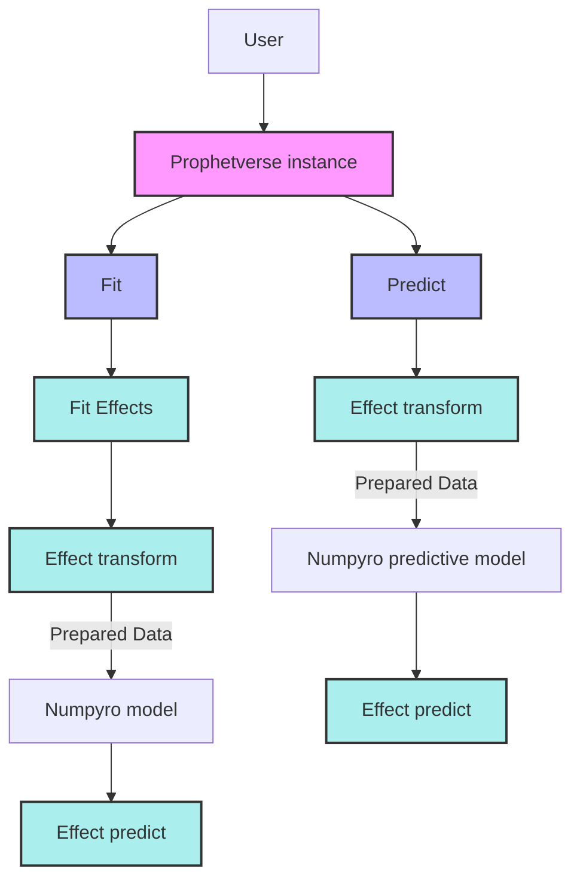

# Customizing exogenous effects

The exogenous effect API allows you to create custom exogenous components for the Prophetverse model. This is useful when we want to model specific patterns or relationships between the exogenous variables and the target variable. For example, enforcing a positive effect of a variable on the mean, or modeling a non-linear relationship.

If you have read the [theory section](https://prophetverse.com/the-theory/), by effect we mean each function $f_i$. You can implement those custom
functions by subclassing the `BaseEffect` class, and then use them in the `Prophetverse` model. Some effects are already implemented in the library, and you can find them in the `prophetverse.effects` module.

When creating a model instance, effects can be specified through `exogenous_effects` parameter of the `Prophetverse` model. This parameter is a list of tuples of three values: the name, the effect object, and a regex to filter
columns related to that effect. The regex is what defines $x_i$ in the previous section. The `prophetverse.utils.regex` module provides some useful functions to create regex patterns for common use cases, include `starts_with`, `ends_with`, `contains`, and `no_input_columns`.

For example:

```python
from prophetverse.sktime import Prophetverse
from prophetverse.effects import LinearFourierSeasonality, HillEffect
from prophetverse.utils.regex import starts_with, no_input_columns


exogenous_effects = [
    
    (
        "seasonality", # The name of the effect
        LinearFourierSeasonality( # The object
                freq="D",
                sp_list=[7, 365.25],
                fourier_terms_list=[3, 10],
                prior_scale=0.1,
                effect_mode="multiplicative",
            ),
        no_input_columns, # The regex 
    ),
    (
        "exog", 
        HillEffect(effect_mode="additive"),
        starts_with("exog")
    )
]

model = Prophetverse(exogenous_effects=exogenous_effects)

```

The effects can be any object that implements the `BaseEffect` interface, and you can
create your own effects by subclassing `BaseEffect` and implementing `_fit`, `_transform` and
`_predict` methods.

* `_fit` (optional): This method is called during fit() of the forecasting  and should be used to initialize any necessary parameters or data structures.
It receives the exogenous variables dataframe X, the series `y`, and the scale factor `scale` that was used to scale the timeseries.

* `_transform` (optional): This method receives the exogenous variables dataframe, and should return an object containing the data needed for the effect. This object will be passed to the predict method as `data`. By default the columns of the dataframe that match the regex pattern are selected, and the result is converted to a `jnp.ndarray`.

* `_predict` (mandatory): This method receives the output of `_transform` and all previously computed effects. It should return the effect values as a `jnp.ndarray`



## Example

### Log Effect

The `BaseAdditiveOrMultiplicativeEffect` provides an init argument `effect_mode` that allows you to specify if the effect is additive or multiplicative. Let's take as an example the `LogEffect`:


```python
#prophetverse/effects/log.py

from typing import Dict, Optional

import jax.numpy as jnp
import numpyro
from numpyro import distributions as dist
from numpyro.distributions import Distribution

from prophetverse.effects.base import (
    EFFECT_APPLICATION_TYPE,
    BaseAdditiveOrMultiplicativeEffect,
)

__all__ = ["LogEffect"]


class LogEffect(BaseAdditiveOrMultiplicativeEffect):
    """Represents a log effect as effect = scale * log(rate * data + 1).

    Parameters
    ----------
    scale_prior : Optional[Distribution], optional
        The prior distribution for the scale parameter., by default Gamma
    rate_prior : Optional[Distribution], optional
        The prior distribution for the rate parameter., by default Gamma
    effect_mode : effects_application, optional
        Either "additive" or "multiplicative", by default "multiplicative"
    """

    def __init__(
        self,
        effect_mode: EFFECT_APPLICATION_TYPE = "multiplicative",
        scale_prior: Optional[Distribution] = None,
        rate_prior: Optional[Distribution] = None,
    ):
        self.scale_prior = scale_prior or dist.Gamma(1, 1)
        self.rate_prior = rate_prior or dist.Gamma(1, 1)
        super().__init__(effect_mode=effect_mode)

    def _predict(  # type: ignore[override]
        self,
        data: jnp.ndarray,
        predicted_effects: Optional[Dict[str, jnp.ndarray]] = None,
    ) -> jnp.ndarray:
        """Apply and return the effect values.

        Parameters
        ----------
        data : Any
            Data obtained from the transformed method.

        predicted_effects : Dict[str, jnp.ndarray], optional
            A dictionary containing the predicted effects, by default None.

        Returns
        -------
        jnp.ndarray
            An array with shape (T,1) for univariate timeseries, or (N, T, 1) for
            multivariate timeseries, where T is the number of timepoints and N is the
            number of series.
        """
        scale = numpyro.sample("log_scale", self.scale_prior)
        rate = numpyro.sample("log_rate", self.rate_prior)
        effect = scale * jnp.log(jnp.clip(rate * data + 1, 1e-8, None))

        return effect

```


The `_fit` and `_transform` methods are not implemented, and the default behaviour is
preserved (the columns of the dataframe that match the regex pattern are selected, and the result is converted to a `jnp.ndarray` with key "data"). 


### Composition of effects

We can go further and create a custom effect that __adds a likelihood term to the model__.
The `LiftExperimentLikelihood` tackles the use case of having a lift experiment, and
wanting to incorporate it to guide the exogenous effect. The likelihood term is added
in the `_predict` method, and the observed lift preprocessed in `_transform` method.
The attribute `input_feature_column_names` is also overriden to return the input feature
columns of the inner effect.

```python


"""Composition of effects (Effects that wrap other effects)."""

from typing import Any, Dict, List

import jax.numpy as jnp
import numpyro
import numpyro.distributions as dist
import pandas as pd

from prophetverse.utils.frame_to_array import series_to_tensor_or_array

from .base import BaseEffect

__all__ = ["LiftExperimentLikelihood"]


class LiftExperimentLikelihood(BaseEffect):
    """Wrap an effect and applies a normal likelihood to its output.

    This class uses an input as a reference for the effect, and applies a normal
    likelihood to the output of the effect.

    Parameters
    ----------
    effect : BaseEffect
        The effect to wrap.
    lift_test_results : pd.DataFrame
        A dataframe with the lift test results. Should be in sktime format, and must
        have the same index as the input data.
    prior_scale : float
        The scale of the prior distribution for the likelihood.
    """

    _tags = {"requires_X": False, "capability:panel": False}

    def __init__(
        self,
        effect: BaseEffect,
        lift_test_results: pd.DataFrame,
        prior_scale: float,
    ):

        self.effect = effect
        self.lift_test_results = lift_test_results
        self.prior_scale = prior_scale

        assert self.prior_scale > 0, "prior_scale must be greater than 0"

        super().__init__()

    def fit(self, y: pd.DataFrame, X: pd.DataFrame, scale: float = 1):
        """Initialize the effect.

        This method is called during `fit()` of the forecasting model.
        It receives the Exogenous variables DataFrame and should be used to initialize
        any necessary parameters or data structures, such as detecting the columns that
        match the regex pattern.


        Parameters
        ----------
        y : pd.DataFrame
            The timeseries dataframe

        X : pd.DataFrame
            The DataFrame to initialize the effect.

        scale : float, optional
            The scale of the timeseries. For multivariate timeseries, this is
            a dataframe. For univariate, it is a simple float.

        Returns
        -------
        None
        """
        self.effect.fit(X=X, y=y, scale=scale)
        self.timeseries_scale = scale
        super().fit(X=X, y=y, scale=scale)

    def _transform(self, X: pd.DataFrame, fh: pd.Index) -> Dict[str, Any]:
        """Prepare input data to be passed to numpyro model.

        Returns a dictionary with the data for the lift and for the inner effect.

        Parameters
        ----------
        X : pd.DataFrame
            The input DataFrame containing the exogenous variables for the training
            time indexes, if passed during fit, or for the forecasting time indexes, if
            passed during predict.

        fh : pd.Index
            The forecasting horizon as a pandas Index.

        Returns
        -------
        Dict[str, Any]
            Dictionary with data for the lift and for the inner effect
        """
        data_dict = {}
        data_dict["inner_effect_data"] = self.effect._transform(X, fh=fh)

        X_lift = self.lift_test_results.reindex(fh, fill_value=jnp.nan)
        lift_array = series_to_tensor_or_array(X_lift)
        data_dict["observed_lift"] = lift_array / self.timeseries_scale
        data_dict["obs_mask"] = ~jnp.isnan(data_dict["observed_lift"])

        return data_dict

    def _predict(
        self, data: Dict, predicted_effects: Dict[str, jnp.ndarray]
    ) -> jnp.ndarray:
        """Apply and return the effect values.

        Parameters
        ----------
        data : Any
            Data obtained from the transformed method.

        predicted_effects : Dict[str, jnp.ndarray], optional
            A dictionary containing the predicted effects, by default None.

        Returns
        -------
        jnp.ndarray
            An array with shape (T,1) for univariate timeseries.
        """
        observed_lift = data["observed_lift"]
        obs_mask = data["obs_mask"]

        x = self.effect.predict(
            data=data["inner_effect_data"], predicted_effects=predicted_effects
        )

        numpyro.sample(
            "lift_experiment",
            dist.Normal(x, self.prior_scale),
            obs=observed_lift,
            obs_mask=obs_mask,
        )

        return x

    @property
    def input_feature_column_names(self) -> List[str]:
        """Return the input feature columns names."""
        return self.effect._input_feature_column_names

```

To see more, check the [custom effect example](examples/custom-effect.ipynb).
