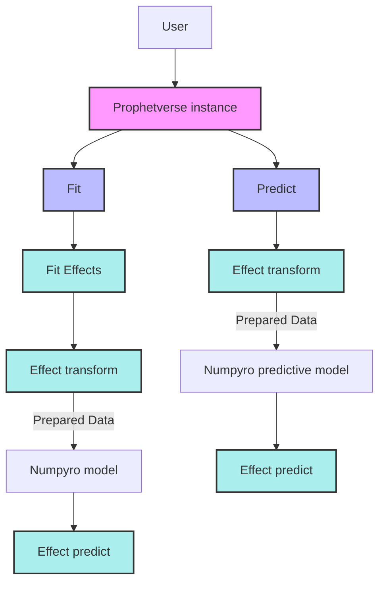

# Customizing exogenous effects

The exogenous effect API allows you to create custom exogenous components for the Prophetverse model. This is useful when you want to model specific patterns or relationships between the exogenous variables and the target variable. For example, enforcing a positive effect of a variable on the mean, or modeling a non-linear relationship.

Effects can be specified through `exogenous_effects` parameter of the `Prophetverse` model. This parameter is a list of tuples of three values: the name, the effect object, and a regex to filter
columns related to that effect. The `prophetverse.utils.regex` module provides some useful functions to create regex patterns for common use cases, include `starts_with`, `ends_with`, `contains`, and `no_input_columns`.

For example:

```python
from prophetverse.sktime import Prophetverse
from prophetverse.effects import LinearFourierSeasonality, HillEffect
from prophetverse.utils.regex import starts_with, no_input_columns


exogenous_effects = [
    
    (
        "seasonality", # The name of the effect
        LinearFourierSeasonality( # The object
                freq="D",
                sp_list=[7, 365.25],
                fourier_terms_list=[3, 10],
                prior_scale=0.1,
                effect_mode="multiplicative",
            ),
        no_input_columns, # The regex 
    ),
    (
        "exog", 
        HillEffect(effect_mode="additive"),
        starts_with("exog")
    )
]

model = Prophetverse(exogenous_effects=exogenous_effects)

```

The effects can be any object that implements the `BaseEffect` interface, and you can
create your own effects by subclassing `BaseEffect` and implementing `_fit`, `_transform` and
`_predict` methods.

* `_fit` (optional): This method is called during fit() of the forecasting. It receives the exogenous variables dataframe, and should be used to initialize any necessary parameters or data structures.

* `_transform` (optional): This method receives the exogenous variables dataframe, and should return a dictionary containing the data needed for the effect. Those data will be passed to the prdict method as named arguments. By default the columns of the dataframe that match the regex pattern are selected, and the result is converted to a `jnp.ndarray` with key "data"

* `_predict` (mandatory): This method receives the trend values as a jnp.ndarray, and the data needed for the effect as named arguments. It should return the effect values as a `jnp.ndarray`



The `BaseAdditiveOrMultiplicativeEffect` provides an init argument `effect_mode` that allows you to specify if the effect is additive or multiplicative. Let's take as an example the `LogEffect`:


```python
from typing import Optional

import jax.numpy as jnp
import numpyro
from numpyro import distributions as dist
from numpyro.distributions import Distribution

from prophetverse.effects.base import (
    EFFECT_APPLICATION_TYPE,
    BaseAdditiveOrMultiplicativeEffect,
)

class LogEffect(BaseAdditiveOrMultiplicativeEffect):
    """Represents a log effect as effect = scale * log(rate * data + 1).

    Parameters
    ----------
    scale_prior : Optional[Distribution], optional
        The prior distribution for the scale parameter., by default Gamma
    rate_prior : Optional[Distribution], optional
        The prior distribution for the rate parameter., by default Gamma
    effect_mode : effects_application, optional
        Either "additive" or "multiplicative", by default "multiplicative"
    """

    def __init__(
        self,
        effect_mode: EFFECT_APPLICATION_TYPE = "multiplicative",
        scale_prior: Optional[Distribution] = None,
        rate_prior: Optional[Distribution] = None,
    ):
        self.scale_prior = scale_prior or dist.Gamma(1, 1)
        self.rate_prior = rate_prior or dist.Gamma(1, 1)
        super().__init__(effect_mode=effect_mode)

    def _predict(  # type: ignore[override]
        self, trend: jnp.ndarray, **kwargs
    ) -> jnp.ndarray:
        """Compute the effect using the log transformation.

        Parameters
        ----------
        trend : jnp.ndarray
            The trend component.
        data : jnp.ndarray
            The input data.

        Returns
        -------
        jnp.ndarray
            The computed effect based on the given trend and data.
        """
        data: jnp.ndarray = kwargs.pop("data")

        scale = numpyro.sample("log_scale", self.scale_prior)
        rate = numpyro.sample("log_rate", self.rate_prior)
        effect = scale * jnp.log(jnp.clip(rate * data + 1, 1e-8, None))

        return effect

```


The `_fit` and `_transform` methods are not implemented, and the default behaviour is
preserved (the columns of the dataframe that match the regex pattern are selected, and the result is converted to a `jnp.ndarray` with key "data"). 


We can go further and create a custom effect that __adds a likelihood term to the model__.
The `LiftExperimentLikelihood` tackles the use case of having a lift experiment, and
wanting to incorporate it to guide the exogenous effect. The likelihood term is added
in the `_predict` method, and the observed lift preprocessed in `_transform` method.


```python


class LiftExperimentLikelihood(BaseEffect):
    """Wrap an effect and applies a normal likelihood to its output.

    This class uses an input as a reference for the effect, and applies a normal
    likelihood to the output of the effect.

    Parameters
    ----------
    effect : BaseEffect
        The effect to wrap.
    lift_test_results : pd.DataFrame
        A dataframe with the lift test results. Should be in sktime format, and must
        have the same index as the input data.
    prior_scale : float
        The scale of the prior distribution for the likelihood.
    """

    _tags = {"skip_predict_if_no_match": False, "supports_multivariate": False}

    def __init__(
        self,
        effect: BaseEffect,
        lift_test_results: pd.DataFrame,
        prior_scale: float,
    ):

        self.effect = effect
        self.lift_test_results = lift_test_results
        self.prior_scale = prior_scale

        assert self.prior_scale > 0, "prior_scale must be greater than 0"

        super().__init__()

    def fit(self, X: pd.DataFrame, scale: float = 1):
        """Initialize this effect and its wrapped effect.

        Parameters
        ----------
        X : DataFrame
            Dataframe of exogenous data.
        scale : float
            The scale of the timeseries. This is used to normalize the lift effect.
        """
        self.effect.fit(X)
        self.timeseries_scale = scale
        super().fit(X)

    def _transform(self, X: pd.DataFrame, stage: Stage = Stage.TRAIN) -> Dict[str, Any]:
        """Prepare the input data for the effect, and the custom likelihood.

        Parameters
        ----------
        X : pd.DataFrame
            The input data with exogenous variables.
        stage : Stage, optional
            which stage is being executed, by default Stage.TRAIN.
            Used to determine if the likelihood should be applied.

        Returns
        -------
        Dict[str, Any]
            The dictionary of data passed to _predict and the likelihood.
        """
        data_dict = self.effect._transform(X, stage)

        if stage == Stage.PREDICT:
            data_dict["observed_lift"] = None
            data_dict["obs_mask"] = None
            return data_dict

        X_lift = self.lift_test_results.loc[X.index]
        lift_array = series_to_tensor_or_array(X_lift)
        data_dict["observed_lift"] = lift_array / self.timeseries_scale
        data_dict["obs_mask"] = ~jnp.isnan(data_dict["observed_lift"])

        return data_dict

    def _predict(
        self,
        trend: jnp.ndarray,
        **kwargs,
    ) -> jnp.ndarray:
        """Apply the effect and the custom likelihood.

        Parameters
        ----------
        trend : jnp.ndarray
            The trend component.
        observed_lift : jnp.ndarray
            The observed lift to apply the likelihood to.

        Returns
        -------
        jnp.ndarray
            The effect applied to the input data.
        """
        observed_lift = kwargs.pop("observed_lift")
        obs_mask = kwargs.pop("obs_mask")

        x = self.effect.predict(trend, **kwargs)

        numpyro.sample(
            "lift_experiment",
            dist.Normal(x, self.prior_scale),
            obs=observed_lift,
            obs_mask=obs_mask,
        )

        return x

    @property
    def input_feature_column_names(self) -> List[str]:
        """Return the input feature columns names."""
        return self.effect._input_feature_column_names
```