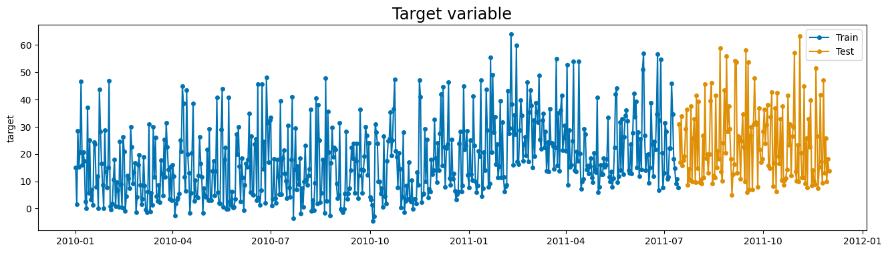
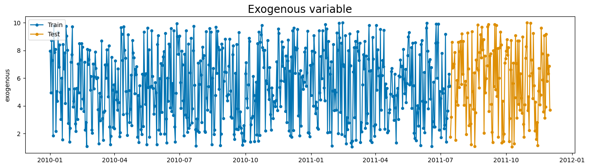
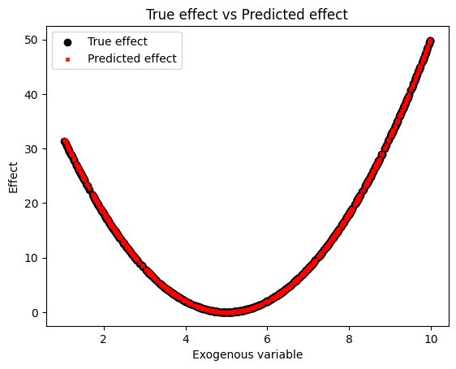

# Customizing exogenous effects
This section explains how to create custom exogenous effects in Prophetverse.
We will start by explaining what is an exogenous effect, and then we will show
a practical example where we create an effect that uses a squared function to
model the relationship between the exogenous variable and the target variable.

## The effects API

The exogenous effect API allows you to create custom exogenous components for the
Prophetverse model. This is useful when we want to model specific patterns or
relationships between the exogenous variables and the target variable. For example,
enforcing a positive effect of a variable on the mean, or modeling a non-linear
relationship.

If you have read the [theory section](https://prophetverse.com/the-theory/),
by effect we mean each function $f_i$. You can implement those custom
functions by subclassing the `BaseEffect` class, and then use them in the
`Prophetverse` model. Some effects are already implemented in the library,
and you can find them in the `prophetverse.effects` module.

When creating a model instance, effects can be specified through `exogenous_effects`
parameter of the `Prophetverse` model. This parameter is a list of tuples of three
values: the name, the effect object, and a regex to filter
columns related to that effect. The regex is what defines $x_i$ in the previous section.
The `prophetverse.utils.regex` module provides some useful functions to create
regex patterns for common use cases, include `starts_with`, `ends_with`, `contains`,
and `no_input_columns`.

Consider the example below, where we create a model with a linear seasonality effect
and a custom effect that uses the feature `channel1_investment` as input and transforms
it with a [hill curve](https://en.wikipedia.org/wiki/Hill_equation_(biochemistry)),
which is a common curve for capturing diminishing returns.


```python
from prophetverse.effects import HillEffect, LinearFourierSeasonality
from prophetverse.sktime import Prophetverse
from prophetverse.utils.regex import exact, no_input_columns, starts_with

exogenous_effects = [
    (
        "seasonality",  # The name of the effect
        LinearFourierSeasonality(  # The object
            freq="D",
            sp_list=[7, 365.25],
            fourier_terms_list=[3, 10],
            prior_scale=0.1,
            effect_mode="multiplicative",
        ),
        no_input_columns,  # The regex
    ),
    (
        "channel1_investment_incremental", # The name of the effect
        HillEffect(
            effect_mode="additive"
            ),
        exact("channel1_investment"), # Column in dataframe
    ),
]

model = Prophetverse(exogenous_effects=exogenous_effects)


```


Creating such models in Prophetverse is like creating buildings from lego blocks.
You define how you model should work, and then you can leverage all the interface to
carry out the forecasting and inference tasks.

## Creating a custom effect

The effects can be any object that implements the `BaseEffect` interface, and you can
create your own effects by subclassing `BaseEffect` and implementing `_fit`,
`_transform` and `_predict` methods.

* `_fit` (optional): This method is called during fit() of the forecasting  and should
be used to initialize any necessary parameters or data structures.
It receives the exogenous variables dataframe X, the series `y`, and the scale factor
`scale` that was used to scale the timeseries.

* `_transform` (optional): This method receives the exogenous variables dataframe,
and should return an object containing the data needed for the effect. This object
will be passed to the predict method as `data`. By default the columns of the
dataframe that match the regex pattern are selected, and the result is converted to
a `jnp.ndarray`.

* `_predict` (mandatory): This method receives the output of `_transform` and all
previously computed effects. It should return the effect values as a `jnp.ndarray`

In many cases, the `_fit` and `_transform` steps are not needed to be implemented,
since the default behaviour may be the desired one. In the example below, we implement
a really simple `SquaredEffect` class, which leverages the default behaviour of the
`BaseEffect` class.

### Squared Effect class

The `SquaredEffect` class receives two
hyperparameters: the prior distribution for the scale parameter, and the prior
distribution for the offset parameter. If no prior is provided, it uses a
`Gamma(1, 1)` for the scale and a `Normal(0, 1)` for the offset. Note that here
we already see an interesting feature of Prophetverse: by adopting a Gamma Prior,
we force the effect to be positive. Any other prior with positive support would
work as well. If no such constraint is needed, we can use a `Normal(0, 1)` prior or
any other distribution with support in the real line.


```python


from typing import Dict, Optional

import jax.numpy as jnp
import numpyro
from numpyro import distributions as dist
from numpyro.distributions import Distribution

from prophetverse.effects.base import BaseEffect


class SquaredEffect(BaseEffect):
    """Represents a squared effect as effect = scale * (data - offset)^2.

    Parameters
    ----------
    scale_prior : Optional[Distribution], optional
        The prior distribution for the scale parameter., by default Gamma
    offset_prior : Optional[Distribution], optional
        The prior distribution for the rate parameter., by default Normal(0, 1)
    """

    def __init__(
        self,
        scale_prior: Optional[Distribution] = None,
        offset_prior : Optional[Distribution] = None,
    ):
        self.scale_prior = scale_prior or dist.Gamma(1, 1)
        self.offset_prior = offset_prior or dist.Normal(0, 1)
        super().__init__()

    def _predict(  # type: ignore[override]
        self,
        data: jnp.ndarray,
        predicted_effects: Optional[Dict[str, jnp.ndarray]] = None,
    ) -> jnp.ndarray:
        """Apply and return the effect values.

        Parameters
        ----------
        data : Any
            Data obtained from the transformed method.

        predicted_effects : Dict[str, jnp.ndarray], optional
            A dictionary containing the predicted effects, by default None.

        Returns
        -------
        jnp.ndarray
            An array with shape (T,1) for univariate timeseries, or (N, T, 1) for
            multivariate timeseries, where T is the number of timepoints and N is the
            number of series.
        """
        scale = numpyro.sample("log_scale", self.scale_prior)
        offset = numpyro.sample("offset", self.offset_prior)
        effect = scale * (data - offset) ** 2

        return effect


```


The `_fit` and `_transform` methods are not implemented, and the default behaviour is
preserved (the columns of the dataframe that match the regex pattern are selected,
and the result is converted to a `jnp.ndarray` with key "data").

## Practical example

The example below is, of course, a toy example, but I hope it illustrates the
process of creating a custom effect.
We load a synthetic dataset with a squared relationship between the exogenous
variable and the target variable, and then we fit a model with the `SquaredEffect`.
The true relationship is 2 * (x - 5) ** 2, and we will see if the model is able to
recover it.

### Loading the series


```python
import matplotlib.pyplot as plt
from sktime.split import temporal_train_test_split
from sktime.utils.plotting import plot_series

from prophetverse.datasets import load_synthetic_squared_exogenous

y, X = load_synthetic_squared_exogenous()
y_train, y_test, X_train, X_test = temporal_train_test_split(
    y,
    X,
    test_size=0.2,
)

display(y.head())
display(X.head())


fig, ax = plot_series(
    y_train, y_test, labels=["Train", "Test"], title="Target variable"
)
fig.show()
fig, ax = plot_series(
    X_train, X_test, labels=["Train", "Test"], title="Exogenous variable"
)
fig.show()


```
<p class="cell-output-title jp-RenderedText jp-OutputArea-output">Output: <span class="cell-output-count">[3]</span></p>


<div>
<style scoped>
    .dataframe tbody tr th:only-of-type {
        vertical-align: middle;
    }

    .dataframe tbody tr th {
        vertical-align: top;
    }

    .dataframe thead th {
        text-align: right;
    }
</style>
<table border="1" class="dataframe">
  <thead>
    <tr style="text-align: right;">
      <th></th>
      <th>target</th>
    </tr>
    <tr>
      <th>time</th>
      <th></th>
    </tr>
  </thead>
  <tbody>
    <tr>
      <th>2010-01-01</th>
      <td>-0.511580</td>
    </tr>
    <tr>
      <th>2010-01-02</th>
      <td>41.634559</td>
    </tr>
    <tr>
      <th>2010-01-03</th>
      <td>11.708982</td>
    </tr>
    <tr>
      <th>2010-01-04</th>
      <td>3.135654</td>
    </tr>
    <tr>
      <th>2010-01-05</th>
      <td>15.558547</td>
    </tr>
  </tbody>
</table>
</div>


<div>
<style scoped>
    .dataframe tbody tr th:only-of-type {
        vertical-align: middle;
    }

    .dataframe tbody tr th {
        vertical-align: top;
    }

    .dataframe thead th {
        text-align: right;
    }
</style>
<table border="1" class="dataframe">
  <thead>
    <tr style="text-align: right;">
      <th></th>
      <th>exogenous</th>
    </tr>
    <tr>
      <th>time</th>
      <th></th>
    </tr>
  </thead>
  <tbody>
    <tr>
      <th>2010-01-01</th>
      <td>4.370861</td>
    </tr>
    <tr>
      <th>2010-01-02</th>
      <td>9.556429</td>
    </tr>
    <tr>
      <th>2010-01-03</th>
      <td>7.587945</td>
    </tr>
    <tr>
      <th>2010-01-04</th>
      <td>6.387926</td>
    </tr>
    <tr>
      <th>2010-01-05</th>
      <td>2.404168</td>
    </tr>
  </tbody>
</table>
</div>


    

    


    

    


#### Creating the model


```python

from prophetverse.effects.trend import PiecewiseLinearTrend
from prophetverse.engine import MAPInferenceEngine
from prophetverse.engine.optimizer import AdamOptimizer, BFGSOptimizer
from prophetverse.sktime import Prophetverse
from prophetverse.utils.regex import exact

model = (
    Prophetverse()
    >> PiecewiseLinearTrend(
        changepoint_interval=100,
        changepoint_prior_scale=.1,
        changepoint_range=-100,
        
    )
    >> MAPInferenceEngine(num_steps=50_000)
) >> (
    "exog_effect",
    SquaredEffect(
        scale_prior=dist.Normal(0, 10),
        offset_prior=dist.Normal(0, 10),
    ),
    exact("exogenous"),
)
model

```
<p class="cell-output-title jp-RenderedText jp-OutputArea-output">Output: <span class="cell-output-count">[4]</span></p>


<style>#sk-c3662db1-7d28-4dfe-8440-d23e3687c64f {
    /* Definition of color scheme common for light and dark mode */
    --sklearn-color-text: black;
    --sklearn-color-line: gray;
    /* Definition of color scheme for objects */
    --sklearn-color-level-0: #fff5e6;
    --sklearn-color-level-1: #f6e4d2;
    --sklearn-color-level-2: #ffe0b3;
    --sklearn-color-level-3: chocolate;

    /* Specific color for light theme */
    --sklearn-color-text-on-default-background: var(--theme-code-foreground, var(--jp-content-font-color1, black));
    --sklearn-color-background: var(--theme-background, var(--jp-layout-color0, white));
    --sklearn-color-border-box: var(--theme-code-foreground, var(--jp-content-font-color1, black));
    --sklearn-color-icon: #696969;

    @media (prefers-color-scheme: dark) {
      /* Redefinition of color scheme for dark theme */
      --sklearn-color-text-on-default-background: var(--theme-code-foreground, var(--jp-content-font-color1, white));
      --sklearn-color-background: var(--theme-background, var(--jp-layout-color0, #111));
      --sklearn-color-border-box: var(--theme-code-foreground, var(--jp-content-font-color1, white));
      --sklearn-color-icon: #878787;
    }
  }

  #sk-c3662db1-7d28-4dfe-8440-d23e3687c64f {
    color: var(--sklearn-color-text);
  }

  #sk-c3662db1-7d28-4dfe-8440-d23e3687c64f pre {
    padding: 0;
  }

  #sk-c3662db1-7d28-4dfe-8440-d23e3687c64f input.sk-hidden--visually {
    border: 0;
    clip: rect(1px 1px 1px 1px);
    clip: rect(1px, 1px, 1px, 1px);
    height: 1px;
    margin: -1px;
    overflow: hidden;
    padding: 0;
    position: absolute;
    width: 1px;
  }

  #sk-c3662db1-7d28-4dfe-8440-d23e3687c64f div.sk-dashed-wrapped {
    border: 1px dashed var(--sklearn-color-line);
    margin: 0 0.4em 0.5em 0.4em;
    box-sizing: border-box;
    padding-bottom: 0.4em;
    background-color: var(--sklearn-color-background);
  }

  #sk-c3662db1-7d28-4dfe-8440-d23e3687c64f div.sk-container {
    /* jupyter's `normalize.less` sets `[hidden] { display: none; }`
       but bootstrap.min.css set `[hidden] { display: none !important; }`
       so we also need the `!important` here to be able to override the
       default hidden behavior on the sphinx rendered scikit-learn.org.
       See: https://github.com/scikit-learn/scikit-learn/issues/21755 */
    display: inline-block !important;
    position: relative;
  }

  #sk-c3662db1-7d28-4dfe-8440-d23e3687c64f div.sk-text-repr-fallback {
    display: none;
  }

  div.sk-parallel-item,
  div.sk-serial,
  div.sk-item {
    /* draw centered vertical line to link estimators */
    background-image: linear-gradient(var(--sklearn-color-text-on-default-background), var(--sklearn-color-text-on-default-background));
    background-size: 2px 100%;
    background-repeat: no-repeat;
    background-position: center center;
  }

  /* Parallel-specific style estimator block */

  #sk-c3662db1-7d28-4dfe-8440-d23e3687c64f div.sk-parallel-item::after {
    content: "";
    width: 100%;
    border-bottom: 2px solid var(--sklearn-color-text-on-default-background);
    flex-grow: 1;
  }

  #sk-c3662db1-7d28-4dfe-8440-d23e3687c64f div.sk-parallel {
    display: flex;
    align-items: stretch;
    justify-content: center;
    background-color: var(--sklearn-color-background);
    position: relative;
  }

  #sk-c3662db1-7d28-4dfe-8440-d23e3687c64f div.sk-parallel-item {
    display: flex;
    flex-direction: column;
  }

  #sk-c3662db1-7d28-4dfe-8440-d23e3687c64f div.sk-parallel-item:first-child::after {
    align-self: flex-end;
    width: 50%;
  }

  #sk-c3662db1-7d28-4dfe-8440-d23e3687c64f div.sk-parallel-item:last-child::after {
    align-self: flex-start;
    width: 50%;
  }

  #sk-c3662db1-7d28-4dfe-8440-d23e3687c64f div.sk-parallel-item:only-child::after {
    width: 0;
  }

  /* Serial-specific style estimator block */

  #sk-c3662db1-7d28-4dfe-8440-d23e3687c64f div.sk-serial {
    display: flex;
    flex-direction: column;
    align-items: center;
    background-color: var(--sklearn-color-background);
    padding-right: 1em;
    padding-left: 1em;
  }


  /* Toggleable style: style used for estimator/Pipeline/ColumnTransformer box that is
  clickable and can be expanded/collapsed.
  - Pipeline and ColumnTransformer use this feature and define the default style
  - Estimators will overwrite some part of the style using the `sk-estimator` class
  */

  /* Pipeline and ColumnTransformer style (default) */

  #sk-c3662db1-7d28-4dfe-8440-d23e3687c64f div.sk-toggleable {
    /* Default theme specific background. It is overwritten whether we have a
    specific estimator or a Pipeline/ColumnTransformer */
    background-color: var(--sklearn-color-background);
  }

  /* Toggleable label */
  #sk-c3662db1-7d28-4dfe-8440-d23e3687c64f label.sk-toggleable__label {
    cursor: pointer;
    display: block;
    width: 100%;
    margin-bottom: 0;
    padding: 0.5em;
    box-sizing: border-box;
    text-align: center;
  }

  #sk-c3662db1-7d28-4dfe-8440-d23e3687c64f label.sk-toggleable__label-arrow:before {
    /* Arrow on the left of the label */
    content: "▸";
    float: left;
    margin-right: 0.25em;
    color: var(--sklearn-color-icon);
  }

  #sk-c3662db1-7d28-4dfe-8440-d23e3687c64f label.sk-toggleable__label-arrow:hover:before {
    color: var(--sklearn-color-text);
  }

  /* Toggleable content - dropdown */

  #sk-c3662db1-7d28-4dfe-8440-d23e3687c64f div.sk-toggleable__content {
    max-height: 0;
    max-width: 0;
    overflow: hidden;
    text-align: left;
    background-color: var(--sklearn-color-level-0);
  }

  #sk-c3662db1-7d28-4dfe-8440-d23e3687c64f div.sk-toggleable__content pre {
    margin: 0.2em;
    border-radius: 0.25em;
    color: var(--sklearn-color-text);
    background-color: var(--sklearn-color-level-0);
  }

  #sk-c3662db1-7d28-4dfe-8440-d23e3687c64f input.sk-toggleable__control:checked~div.sk-toggleable__content {
    /* Expand drop-down */
    max-height: 200px;
    max-width: 100%;
    overflow: auto;
  }

  #sk-c3662db1-7d28-4dfe-8440-d23e3687c64f input.sk-toggleable__control:checked~label.sk-toggleable__label-arrow:before {
    content: "▾";
  }

  /* Pipeline/ColumnTransformer-specific style */

  #sk-c3662db1-7d28-4dfe-8440-d23e3687c64f div.sk-label input.sk-toggleable__control:checked~label.sk-toggleable__label {
    color: var(--sklearn-color-text);
    background-color: var(--sklearn-color-level-2);
  }

  /* Estimator-specific style */

  /* Colorize estimator box */
  #sk-c3662db1-7d28-4dfe-8440-d23e3687c64f div.sk-estimator input.sk-toggleable__control:checked~label.sk-toggleable__label {
    /* unfitted */
    background-color: var(--sklearn-color-level-2);
  }

  #sk-c3662db1-7d28-4dfe-8440-d23e3687c64f div.sk-label label.sk-toggleable__label,
  #sk-c3662db1-7d28-4dfe-8440-d23e3687c64f div.sk-label label {
    /* The background is the default theme color */
    color: var(--sklearn-color-text-on-default-background);
  }

  /* On hover, darken the color of the background */
  #sk-c3662db1-7d28-4dfe-8440-d23e3687c64f div.sk-label:hover label.sk-toggleable__label {
    color: var(--sklearn-color-text);
    background-color: var(--sklearn-color-level-2);
  }

  /* Estimator label */

  #sk-c3662db1-7d28-4dfe-8440-d23e3687c64f div.sk-label label {
    font-family: monospace;
    font-weight: bold;
    display: inline-block;
    line-height: 1.2em;
  }

  #sk-c3662db1-7d28-4dfe-8440-d23e3687c64f div.sk-label-container {
    text-align: center;
  }

  /* Estimator-specific */
  #sk-c3662db1-7d28-4dfe-8440-d23e3687c64f div.sk-estimator {
    font-family: monospace;
    border: 1px dotted var(--sklearn-color-border-box);
    border-radius: 0.25em;
    box-sizing: border-box;
    margin-bottom: 0.5em;
    background-color: var(--sklearn-color-level-0);
  }

  /* on hover */
  #sk-c3662db1-7d28-4dfe-8440-d23e3687c64f div.sk-estimator:hover {
    background-color: var(--sklearn-color-level-2);
  }

  /* Specification for estimator info */

  .sk-estimator-doc-link,
  a:link.sk-estimator-doc-link,
  a:visited.sk-estimator-doc-link {
    float: right;
    font-size: smaller;
    line-height: 1em;
    font-family: monospace;
    background-color: var(--sklearn-color-background);
    border-radius: 1em;
    height: 1em;
    width: 1em;
    text-decoration: none !important;
    margin-left: 1ex;
    border: var(--sklearn-color-level-1) 1pt solid;
    color: var(--sklearn-color-level-1);
  }

  /* On hover */
  div.sk-estimator:hover .sk-estimator-doc-link:hover,
  .sk-estimator-doc-link:hover,
  div.sk-label-container:hover .sk-estimator-doc-link:hover,
  .sk-estimator-doc-link:hover {
    background-color: var(--sklearn-color-level-3);
    color: var(--sklearn-color-background);
    text-decoration: none;
  }

  /* Span, style for the box shown on hovering the info icon */
  .sk-estimator-doc-link span {
    display: none;
    z-index: 9999;
    position: relative;
    font-weight: normal;
    right: .2ex;
    padding: .5ex;
    margin: .5ex;
    width: min-content;
    min-width: 20ex;
    max-width: 50ex;
    color: var(--sklearn-color-text);
    box-shadow: 2pt 2pt 4pt #999;
    background: var(--sklearn-color-level-0);
    border: .5pt solid var(--sklearn-color-level-3);
  }

  .sk-estimator-doc-link:hover span {
    display: block;
  }

  /* "?"-specific style due to the `<a>` HTML tag */

  #sk-c3662db1-7d28-4dfe-8440-d23e3687c64f a.estimator_doc_link {
    float: right;
    font-size: 1rem;
    line-height: 1em;
    font-family: monospace;
    background-color: var(--sklearn-color-background);
    border-radius: 1rem;
    height: 1rem;
    width: 1rem;
    text-decoration: none;
    color: var(--sklearn-color-level-1);
    border: var(--sklearn-color-level-1) 1pt solid;
  }

  /* On hover */
  #sk-c3662db1-7d28-4dfe-8440-d23e3687c64f a.estimator_doc_link:hover {
    background-color: var(--sklearn-color-level-3);
    color: var(--sklearn-color-background);
    text-decoration: none;
  }
</style><div id='sk-c3662db1-7d28-4dfe-8440-d23e3687c64f' class="sk-top-container"><div class="sk-text-repr-fallback"><pre>Prophetverse(exogenous_effects=[(&#x27;exog_effect&#x27;,
                                 SquaredEffect(offset_prior=&lt;numpyro.distributions.continuous.Normal object at 0x163dd1910&gt;,
                                               scale_prior=&lt;numpyro.distributions.continuous.Normal object at 0x163d95ad0&gt;),
                                 &#x27;^exogenous$&#x27;)],
             inference_engine=MAPInferenceEngine(num_steps=50000),
             trend=PiecewiseLinearTrend(changepoint_interval=100,
                                        changepoint_prior_scale=0.1,
                                        changepoint_range=-100))</pre><b>Please rerun this cell to show the HTML repr or trust the notebook.</b></div><div class="sk-container" hidden><div class="sk-item sk-dashed-wrapped"><div class='sk-label-container'><div class="sk-label sk-toggleable"><input class="sk-toggleable__control sk-hidden--visually" id=UUID('6bb64194-be2b-42c1-acc8-4b617aed3c8b') type="checkbox" ><label for=UUID('6bb64194-be2b-42c1-acc8-4b617aed3c8b') class='sk-toggleable__label sk-toggleable__label-arrow'>Prophetverse</label><div class="sk-toggleable__content"><pre>Prophetverse(exogenous_effects=[(&#x27;exog_effect&#x27;,
                                 SquaredEffect(offset_prior=&lt;numpyro.distributions.continuous.Normal object at 0x163dd1910&gt;,
                                               scale_prior=&lt;numpyro.distributions.continuous.Normal object at 0x163d95ad0&gt;),
                                 &#x27;^exogenous$&#x27;)],
             inference_engine=MAPInferenceEngine(num_steps=50000),
             trend=PiecewiseLinearTrend(changepoint_interval=100,
                                        changepoint_prior_scale=0.1,
                                        changepoint_range=-100))</pre></div></div></div><div class="sk-parallel"><div class="sk-parallel-item"><div class="sk-item"><div class='sk-label-container'><div class="sk-label sk-toggleable"><input class="sk-toggleable__control sk-hidden--visually" id=UUID('256e56e0-31e9-4ede-b00b-3747f69dd199') type="checkbox" ><label for=UUID('256e56e0-31e9-4ede-b00b-3747f69dd199') class='sk-toggleable__label sk-toggleable__label-arrow'>trend: PiecewiseLinearTrend</label><div class="sk-toggleable__content"><pre>PiecewiseLinearTrend(changepoint_interval=100, changepoint_prior_scale=0.1,
                     changepoint_range=-100)</pre></div></div></div><div class="sk-serial"><div class='sk-item'><div class="sk-estimator sk-toggleable"><input class="sk-toggleable__control sk-hidden--visually" id=UUID('972722df-00a7-4504-a977-d1d2d2fa2b97') type="checkbox" ><label for=UUID('972722df-00a7-4504-a977-d1d2d2fa2b97') class='sk-toggleable__label sk-toggleable__label-arrow'>PiecewiseLinearTrend</label><div class="sk-toggleable__content"><pre>PiecewiseLinearTrend(changepoint_interval=100, changepoint_prior_scale=0.1,
                     changepoint_range=-100)</pre></div></div></div></div></div></div></div></div></div></div>


To fit and plot, we use always the same interface, from `sktime` library.


```python
model.fit(y=y_train, X=X_train)
y_pred = model.predict(fh=y_test.index, X=X)
y_pred.head()

```
<p class="cell-output-title jp-RenderedText jp-OutputArea-output">Output: <span class="cell-output-count">[5]</span></p>


<div>
<style scoped>
    .dataframe tbody tr th:only-of-type {
        vertical-align: middle;
    }

    .dataframe tbody tr th {
        vertical-align: top;
    }

    .dataframe thead th {
        text-align: right;
    }
</style>
<table border="1" class="dataframe">
  <thead>
    <tr style="text-align: right;">
      <th></th>
      <th>target</th>
    </tr>
  </thead>
  <tbody>
    <tr>
      <th>2011-07-15</th>
      <td>21.782337</td>
    </tr>
    <tr>
      <th>2011-07-16</th>
      <td>19.701607</td>
    </tr>
    <tr>
      <th>2011-07-17</th>
      <td>26.434742</td>
    </tr>
    <tr>
      <th>2011-07-18</th>
      <td>41.059937</td>
    </tr>
    <tr>
      <th>2011-07-19</th>
      <td>12.419967</td>
    </tr>
  </tbody>
</table>
</div>


```python
plot_series(y, y_pred, labels=["True", "Predicted"], title="True vs Predicted")
plt.show()


```
<p class="cell-output-title jp-RenderedText jp-OutputArea-output">Output: <span class="cell-output-count">[6]</span></p>


    

    


#### Recovering the predicted effect and components

This library adds extra methods to the sktime interface, such as `predict_components`,
which behaves similarly to `predict`, but returns the components of the forecast as
components of the output.

The name of the effect in the output dataframe is equal to the one we have passed
as first item in the tuple when creating the model. In this case, the name is
"exog_effect".


```python

components = model.predict_components(fh=y.index, X=X)
components.head()


```
<p class="cell-output-title jp-RenderedText jp-OutputArea-output">Output: <span class="cell-output-count">[7]</span></p>


<div>
<style scoped>
    .dataframe tbody tr th:only-of-type {
        vertical-align: middle;
    }

    .dataframe tbody tr th {
        vertical-align: top;
    }

    .dataframe thead th {
        text-align: right;
    }
</style>
<table border="1" class="dataframe">
  <thead>
    <tr style="text-align: right;">
      <th></th>
      <th>exog_effect</th>
      <th>mean</th>
      <th>obs</th>
      <th>trend</th>
    </tr>
  </thead>
  <tbody>
    <tr>
      <th>2010-01-01</th>
      <td>0.814534</td>
      <td>0.975764</td>
      <td>0.930191</td>
      <td>0.161231</td>
    </tr>
    <tr>
      <th>2010-01-02</th>
      <td>41.405857</td>
      <td>41.578205</td>
      <td>41.576435</td>
      <td>0.172360</td>
    </tr>
    <tr>
      <th>2010-01-03</th>
      <td>13.318528</td>
      <td>13.502026</td>
      <td>13.603917</td>
      <td>0.183490</td>
    </tr>
    <tr>
      <th>2010-01-04</th>
      <td>3.808372</td>
      <td>4.002995</td>
      <td>4.021019</td>
      <td>0.194620</td>
    </tr>
    <tr>
      <th>2010-01-05</th>
      <td>13.581171</td>
      <td>13.786910</td>
      <td>13.910775</td>
      <td>0.205750</td>
    </tr>
  </tbody>
</table>
</div>


Now, let's compare it with the true effect. We will plot the true effect and the
predicted effect in the same plot.


```python
fig, ax = plt.subplots()
ax.scatter(X["exogenous"], 2 * (X["exogenous"] - 5) ** 2,
           color="black", label="True effect")
ax.scatter(X["exogenous"], components["exog_effect"],
           marker="x", color="red",
           s=10, label="Predicted effect")
ax.set(xlabel="Exogenous variable",
       ylabel="Effect",
       title="True effect vs Predicted effect")
ax.legend()
fig.show()

```
<p class="cell-output-title jp-RenderedText jp-OutputArea-output">Output: <span class="cell-output-count">[8]</span></p>


    

    

