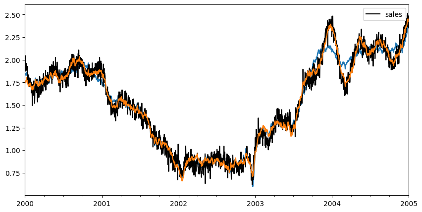

# Lift test
In this example, we will show how you can leverage lift tests executed in the past to improve the detection of the effect of an intervention.
This example is inspired by the one in [PyMC-Marketing documentation](https://www.pymc-marketing.io/en/stable/notebooks/mmm/mmm_lift_test.html).

## Get data from simulated dataset
In this exercise, we will load  a synthetic dataset
composed of a target timeseries (sales, for example) and
two exogenous variables (investment1 and investment2).
The two variables are highly correlated.

From this dataset, we also obtain the results of a lift test.


```python
import matplotlib.pyplot as plt

from prophetverse.datasets._mmm.lifttest import get_dataset

y, X, lift_test, true_effect, model = get_dataset()


```
<p class="cell-output-title jp-RenderedText jp-OutputArea-output">Output: <span class="cell-output-count">[1]</span></p>


    

    


```python

fig, ax = plt.subplots(figsize=(10, 15), nrows=3, sharex=True)
y.plot.line(ax=ax[0])
ax[0].set_title("Sales")
X.plot.line(alpha=0.9, ax=ax[1])
ax[1].set_title("Exogenous variables")
true_effect.plot.line(ax=ax[2])
ax[2].set_title("True effect of investment1 and investment2")
fig.show()


```
<p class="cell-output-title jp-RenderedText jp-OutputArea-output">Output: <span class="cell-output-count">[2]</span></p>


    

    


The lift test dataframe looks like below, with the information
of how a delta in the exogenous variable (investment1 and investment2)
affects the target variable (sales). Note that the lift test
is assigned to dates, since the effect of the intervention can
vary with time.


```python

lift_test1, lift_test2 = lift_test
lift_test1


```
<p class="cell-output-title jp-RenderedText jp-OutputArea-output">Output: <span class="cell-output-count">[3]</span></p>


<div>
<style scoped>
    .dataframe tbody tr th:only-of-type {
        vertical-align: middle;
    }

    .dataframe tbody tr th {
        vertical-align: top;
    }

    .dataframe thead th {
        text-align: right;
    }
</style>
<table border="1" class="dataframe">
  <thead>
    <tr style="text-align: right;">
      <th></th>
      <th>lift</th>
      <th>x_start</th>
      <th>x_end</th>
    </tr>
  </thead>
  <tbody>
    <tr>
      <th>2000-10-25</th>
      <td>0.153197</td>
      <td>0.727573</td>
      <td>0.110823</td>
    </tr>
    <tr>
      <th>2001-05-04</th>
      <td>0.026069</td>
      <td>0.734700</td>
      <td>0.386165</td>
    </tr>
    <tr>
      <th>2000-10-05</th>
      <td>0.106792</td>
      <td>0.823932</td>
      <td>0.159322</td>
    </tr>
    <tr>
      <th>2002-03-06</th>
      <td>0.018927</td>
      <td>0.634787</td>
      <td>0.406046</td>
    </tr>
    <tr>
      <th>2002-06-11</th>
      <td>0.014647</td>
      <td>0.613452</td>
      <td>0.431412</td>
    </tr>
    <tr>
      <th>2000-12-27</th>
      <td>0.163153</td>
      <td>0.735653</td>
      <td>0.103977</td>
    </tr>
    <tr>
      <th>2000-09-06</th>
      <td>0.014425</td>
      <td>0.868366</td>
      <td>0.538854</td>
    </tr>
    <tr>
      <th>2002-04-24</th>
      <td>0.079895</td>
      <td>0.547882</td>
      <td>0.179940</td>
    </tr>
    <tr>
      <th>2002-12-09</th>
      <td>0.166648</td>
      <td>0.151073</td>
      <td>0.051690</td>
    </tr>
    <tr>
      <th>2003-11-10</th>
      <td>0.061573</td>
      <td>0.554193</td>
      <td>0.214952</td>
    </tr>
  </tbody>
</table>
</div>


## Creating the model
We create the model to estimate the effect of the exogenous variables.
Since this is an exercise, we use the effects that are the ground truth.
However, we will see that even with a correct specification, the correlated
exogenous variables can lead to bad estimates.


```python
import numpyro.distributions as dist

from prophetverse.effects import (HillEffect, LinearEffect,
                                  LinearFourierSeasonality)
from prophetverse.effects.trend import PiecewiseLinearTrend
from prophetverse.engine import MAPInferenceEngine
from prophetverse.engine.optimizer import LBFGSSolver
from prophetverse.sktime import Prophetverse
from prophetverse.utils.regex import exact, no_input_columns

model = Prophetverse(
    trend=PiecewiseLinearTrend(
        changepoint_interval=100,
        changepoint_prior_scale=0.001,
        changepoint_range=-100,
    ),
    exogenous_effects=[
        (
            "seasonality",
            LinearFourierSeasonality(
                freq="D",
                sp_list=[365.25],
                fourier_terms_list=[3],
                prior_scale=0.1,
                effect_mode="multiplicative",
            ),
            no_input_columns,
        ),
        (
            "investment1",
            HillEffect(
                half_max_prior=dist.HalfNormal(0.2),
                slope_prior=dist.Gamma(2, 1),
                max_effect_prior=dist.HalfNormal(1.5),
                effect_mode="additive",
            ),
            exact("investment1"),
        ),
        (
            "investment2",
            LinearEffect(
                prior=dist.HalfNormal(0.5),
                effect_mode="additive",
            ),
            exact("investment2"),
        ),
    ],
    inference_engine=MAPInferenceEngine(
        num_steps=1000, optimizer=LBFGSSolver(memory_size=100, max_linesearch_steps=100)
    ),
)

model.fit(y=y, X=X)
components = model.predict_components(fh=X.index, X=X)


```
<p class="cell-output-title jp-RenderedText jp-OutputArea-output">Output: <span class="cell-output-count">[4]</span></p>


```python

fig, ax = plt.subplots(figsize=(10, 5))
y.plot.line(ax=ax, color="black", label="Sales")
components["obs"].to_frame("Forecast").plot.line(ax=ax)
fig.show()


```
<p class="cell-output-title jp-RenderedText jp-OutputArea-output">Output: <span class="cell-output-count">[5]</span></p>


    

    


```python

fig, axs = plt.subplots(figsize=(10, 10), nrows=2, sharex=True)

ax = axs[0]

ax.scatter(X["investment1"], 
           components["investment1"],
           label="Inferred effect")
ax.scatter(X["investment1"], 
           true_effect["investment1"],
            label="True effect", color="black")
ax.set_title("Investment1")
ax.legend()

ax = axs[1]
ax.scatter(X["investment2"], components["investment2"])
ax.scatter(X["investment2"], true_effect["investment2"], color="black")
ax.set_title("Investment2")

fig.show()


```
<p class="cell-output-title jp-RenderedText jp-OutputArea-output">Output: <span class="cell-output-count">[6]</span></p>


    

    


## Using lift test to improve the estimation
We will use the lift test to improve the estimation of the effect of the exogenous variables.
We wrap the original effects of `investment1` and `investment2` in a `LiftExperimentLikelihood` effect.
This effect will use the lift test data to add a new likelihood term to the model.

### Creating the effects


```python

from prophetverse.effects.lift_likelihood import LiftExperimentLikelihood

lift_experiment_effect1 = LiftExperimentLikelihood(
       effect=model.get_params()["investment1"],
        lift_test_results=lift_test1,
        prior_scale=1e-2,
        likelihood_scale=1,
)

lift_experiment_effect2 = LiftExperimentLikelihood(
    effect=model.get_params()["investment2"],
    lift_test_results=lift_test2,
    prior_scale=1e-2,
    likelihood_scale=1,
)


```

### Fitting the new model


```python
new_model = model.clone()
new_model.set_params(
    investment1=lift_experiment_effect1,
    investment2=lift_experiment_effect2,
)
new_model.fit(y=y, X=X)


```
<p class="cell-output-title jp-RenderedText jp-OutputArea-output">Output: <span class="cell-output-count">[8]</span></p>


<style>#sk-447328ab-f9ef-4630-86c2-6f42aa21f4c7 {
    /* Definition of color scheme common for light and dark mode */
    --sklearn-color-text: black;
    --sklearn-color-line: gray;
    /* Definition of color scheme for objects */
    --sklearn-color-level-0: #fff5e6;
    --sklearn-color-level-1: #f6e4d2;
    --sklearn-color-level-2: #ffe0b3;
    --sklearn-color-level-3: chocolate;

    /* Specific color for light theme */
    --sklearn-color-text-on-default-background: var(--theme-code-foreground, var(--jp-content-font-color1, black));
    --sklearn-color-background: var(--theme-background, var(--jp-layout-color0, white));
    --sklearn-color-border-box: var(--theme-code-foreground, var(--jp-content-font-color1, black));
    --sklearn-color-icon: #696969;

    @media (prefers-color-scheme: dark) {
      /* Redefinition of color scheme for dark theme */
      --sklearn-color-text-on-default-background: var(--theme-code-foreground, var(--jp-content-font-color1, white));
      --sklearn-color-background: var(--theme-background, var(--jp-layout-color0, #111));
      --sklearn-color-border-box: var(--theme-code-foreground, var(--jp-content-font-color1, white));
      --sklearn-color-icon: #878787;
    }
  }

  #sk-447328ab-f9ef-4630-86c2-6f42aa21f4c7 {
    color: var(--sklearn-color-text);
  }

  #sk-447328ab-f9ef-4630-86c2-6f42aa21f4c7 pre {
    padding: 0;
  }

  #sk-447328ab-f9ef-4630-86c2-6f42aa21f4c7 input.sk-hidden--visually {
    border: 0;
    clip: rect(1px 1px 1px 1px);
    clip: rect(1px, 1px, 1px, 1px);
    height: 1px;
    margin: -1px;
    overflow: hidden;
    padding: 0;
    position: absolute;
    width: 1px;
  }

  #sk-447328ab-f9ef-4630-86c2-6f42aa21f4c7 div.sk-dashed-wrapped {
    border: 1px dashed var(--sklearn-color-line);
    margin: 0 0.4em 0.5em 0.4em;
    box-sizing: border-box;
    padding-bottom: 0.4em;
    background-color: var(--sklearn-color-background);
  }

  #sk-447328ab-f9ef-4630-86c2-6f42aa21f4c7 div.sk-container {
    /* jupyter's `normalize.less` sets `[hidden] { display: none; }`
       but bootstrap.min.css set `[hidden] { display: none !important; }`
       so we also need the `!important` here to be able to override the
       default hidden behavior on the sphinx rendered scikit-learn.org.
       See: https://github.com/scikit-learn/scikit-learn/issues/21755 */
    display: inline-block !important;
    position: relative;
  }

  #sk-447328ab-f9ef-4630-86c2-6f42aa21f4c7 div.sk-text-repr-fallback {
    display: none;
  }

  div.sk-parallel-item,
  div.sk-serial,
  div.sk-item {
    /* draw centered vertical line to link estimators */
    background-image: linear-gradient(var(--sklearn-color-text-on-default-background), var(--sklearn-color-text-on-default-background));
    background-size: 2px 100%;
    background-repeat: no-repeat;
    background-position: center center;
  }

  /* Parallel-specific style estimator block */

  #sk-447328ab-f9ef-4630-86c2-6f42aa21f4c7 div.sk-parallel-item::after {
    content: "";
    width: 100%;
    border-bottom: 2px solid var(--sklearn-color-text-on-default-background);
    flex-grow: 1;
  }

  #sk-447328ab-f9ef-4630-86c2-6f42aa21f4c7 div.sk-parallel {
    display: flex;
    align-items: stretch;
    justify-content: center;
    background-color: var(--sklearn-color-background);
    position: relative;
  }

  #sk-447328ab-f9ef-4630-86c2-6f42aa21f4c7 div.sk-parallel-item {
    display: flex;
    flex-direction: column;
  }

  #sk-447328ab-f9ef-4630-86c2-6f42aa21f4c7 div.sk-parallel-item:first-child::after {
    align-self: flex-end;
    width: 50%;
  }

  #sk-447328ab-f9ef-4630-86c2-6f42aa21f4c7 div.sk-parallel-item:last-child::after {
    align-self: flex-start;
    width: 50%;
  }

  #sk-447328ab-f9ef-4630-86c2-6f42aa21f4c7 div.sk-parallel-item:only-child::after {
    width: 0;
  }

  /* Serial-specific style estimator block */

  #sk-447328ab-f9ef-4630-86c2-6f42aa21f4c7 div.sk-serial {
    display: flex;
    flex-direction: column;
    align-items: center;
    background-color: var(--sklearn-color-background);
    padding-right: 1em;
    padding-left: 1em;
  }


  /* Toggleable style: style used for estimator/Pipeline/ColumnTransformer box that is
  clickable and can be expanded/collapsed.
  - Pipeline and ColumnTransformer use this feature and define the default style
  - Estimators will overwrite some part of the style using the `sk-estimator` class
  */

  /* Pipeline and ColumnTransformer style (default) */

  #sk-447328ab-f9ef-4630-86c2-6f42aa21f4c7 div.sk-toggleable {
    /* Default theme specific background. It is overwritten whether we have a
    specific estimator or a Pipeline/ColumnTransformer */
    background-color: var(--sklearn-color-background);
  }

  /* Toggleable label */
  #sk-447328ab-f9ef-4630-86c2-6f42aa21f4c7 label.sk-toggleable__label {
    cursor: pointer;
    display: block;
    width: 100%;
    margin-bottom: 0;
    padding: 0.5em;
    box-sizing: border-box;
    text-align: center;
  }

  #sk-447328ab-f9ef-4630-86c2-6f42aa21f4c7 label.sk-toggleable__label-arrow:before {
    /* Arrow on the left of the label */
    content: "▸";
    float: left;
    margin-right: 0.25em;
    color: var(--sklearn-color-icon);
  }

  #sk-447328ab-f9ef-4630-86c2-6f42aa21f4c7 label.sk-toggleable__label-arrow:hover:before {
    color: var(--sklearn-color-text);
  }

  /* Toggleable content - dropdown */

  #sk-447328ab-f9ef-4630-86c2-6f42aa21f4c7 div.sk-toggleable__content {
    max-height: 0;
    max-width: 0;
    overflow: hidden;
    text-align: left;
    background-color: var(--sklearn-color-level-0);
  }

  #sk-447328ab-f9ef-4630-86c2-6f42aa21f4c7 div.sk-toggleable__content pre {
    margin: 0.2em;
    border-radius: 0.25em;
    color: var(--sklearn-color-text);
    background-color: var(--sklearn-color-level-0);
  }

  #sk-447328ab-f9ef-4630-86c2-6f42aa21f4c7 input.sk-toggleable__control:checked~div.sk-toggleable__content {
    /* Expand drop-down */
    max-height: 200px;
    max-width: 100%;
    overflow: auto;
  }

  #sk-447328ab-f9ef-4630-86c2-6f42aa21f4c7 input.sk-toggleable__control:checked~label.sk-toggleable__label-arrow:before {
    content: "▾";
  }

  /* Pipeline/ColumnTransformer-specific style */

  #sk-447328ab-f9ef-4630-86c2-6f42aa21f4c7 div.sk-label input.sk-toggleable__control:checked~label.sk-toggleable__label {
    color: var(--sklearn-color-text);
    background-color: var(--sklearn-color-level-2);
  }

  /* Estimator-specific style */

  /* Colorize estimator box */
  #sk-447328ab-f9ef-4630-86c2-6f42aa21f4c7 div.sk-estimator input.sk-toggleable__control:checked~label.sk-toggleable__label {
    /* unfitted */
    background-color: var(--sklearn-color-level-2);
  }

  #sk-447328ab-f9ef-4630-86c2-6f42aa21f4c7 div.sk-label label.sk-toggleable__label,
  #sk-447328ab-f9ef-4630-86c2-6f42aa21f4c7 div.sk-label label {
    /* The background is the default theme color */
    color: var(--sklearn-color-text-on-default-background);
  }

  /* On hover, darken the color of the background */
  #sk-447328ab-f9ef-4630-86c2-6f42aa21f4c7 div.sk-label:hover label.sk-toggleable__label {
    color: var(--sklearn-color-text);
    background-color: var(--sklearn-color-level-2);
  }

  /* Estimator label */

  #sk-447328ab-f9ef-4630-86c2-6f42aa21f4c7 div.sk-label label {
    font-family: monospace;
    font-weight: bold;
    display: inline-block;
    line-height: 1.2em;
  }

  #sk-447328ab-f9ef-4630-86c2-6f42aa21f4c7 div.sk-label-container {
    text-align: center;
  }

  /* Estimator-specific */
  #sk-447328ab-f9ef-4630-86c2-6f42aa21f4c7 div.sk-estimator {
    font-family: monospace;
    border: 1px dotted var(--sklearn-color-border-box);
    border-radius: 0.25em;
    box-sizing: border-box;
    margin-bottom: 0.5em;
    background-color: var(--sklearn-color-level-0);
  }

  /* on hover */
  #sk-447328ab-f9ef-4630-86c2-6f42aa21f4c7 div.sk-estimator:hover {
    background-color: var(--sklearn-color-level-2);
  }

  /* Specification for estimator info */

  .sk-estimator-doc-link,
  a:link.sk-estimator-doc-link,
  a:visited.sk-estimator-doc-link {
    float: right;
    font-size: smaller;
    line-height: 1em;
    font-family: monospace;
    background-color: var(--sklearn-color-background);
    border-radius: 1em;
    height: 1em;
    width: 1em;
    text-decoration: none !important;
    margin-left: 1ex;
    border: var(--sklearn-color-level-1) 1pt solid;
    color: var(--sklearn-color-level-1);
  }

  /* On hover */
  div.sk-estimator:hover .sk-estimator-doc-link:hover,
  .sk-estimator-doc-link:hover,
  div.sk-label-container:hover .sk-estimator-doc-link:hover,
  .sk-estimator-doc-link:hover {
    background-color: var(--sklearn-color-level-3);
    color: var(--sklearn-color-background);
    text-decoration: none;
  }

  /* Span, style for the box shown on hovering the info icon */
  .sk-estimator-doc-link span {
    display: none;
    z-index: 9999;
    position: relative;
    font-weight: normal;
    right: .2ex;
    padding: .5ex;
    margin: .5ex;
    width: min-content;
    min-width: 20ex;
    max-width: 50ex;
    color: var(--sklearn-color-text);
    box-shadow: 2pt 2pt 4pt #999;
    background: var(--sklearn-color-level-0);
    border: .5pt solid var(--sklearn-color-level-3);
  }

  .sk-estimator-doc-link:hover span {
    display: block;
  }

  /* "?"-specific style due to the `<a>` HTML tag */

  #sk-447328ab-f9ef-4630-86c2-6f42aa21f4c7 a.estimator_doc_link {
    float: right;
    font-size: 1rem;
    line-height: 1em;
    font-family: monospace;
    background-color: var(--sklearn-color-background);
    border-radius: 1rem;
    height: 1rem;
    width: 1rem;
    text-decoration: none;
    color: var(--sklearn-color-level-1);
    border: var(--sklearn-color-level-1) 1pt solid;
  }

  /* On hover */
  #sk-447328ab-f9ef-4630-86c2-6f42aa21f4c7 a.estimator_doc_link:hover {
    background-color: var(--sklearn-color-level-3);
    color: var(--sklearn-color-background);
    text-decoration: none;
  }
</style><div id='sk-447328ab-f9ef-4630-86c2-6f42aa21f4c7' class="sk-top-container"><div class="sk-text-repr-fallback"><pre>Prophetverse(exogenous_effects=[(&#x27;seasonality&#x27;,
                                 LinearFourierSeasonality(effect_mode=&#x27;multiplicative&#x27;,
                                                          fourier_terms_list=[3],
                                                          freq=&#x27;D&#x27;,
                                                          prior_scale=0.1,
                                                          sp_list=[365.25]),
                                 &#x27;^$&#x27;),
                                (&#x27;investment1&#x27;,
                                 LiftExperimentLikelihood(effect=HillEffect(effect_mode=&#x27;additive&#x27;,
                                                                            half_max_prior=&lt;numpyro.distributions.continuous.HalfNormal object at 0x31da99cd0&gt;,
                                                                            max_effect_prior...
2002-04-24  0.155792  0.656459  0.466476
2002-12-09  0.047018  0.240272  0.182935
2003-11-10  0.446803  0.672043  0.127181,
                                                          prior_scale=0.01),
                                 &#x27;^investment2$&#x27;)],
             inference_engine=MAPInferenceEngine(num_steps=1000,
                                                 optimizer=LBFGSSolver(max_linesearch_steps=100,
                                                                       memory_size=100)),
             trend=PiecewiseLinearTrend(changepoint_interval=100,
                                        changepoint_prior_scale=0.001,
                                        changepoint_range=-100))</pre><b>Please rerun this cell to show the HTML repr or trust the notebook.</b></div><div class="sk-container" hidden><div class="sk-item sk-dashed-wrapped"><div class='sk-label-container'><div class="sk-label sk-toggleable"><input class="sk-toggleable__control sk-hidden--visually" id=UUID('c4dd95b5-6926-455a-81d6-5a50e820bbc3') type="checkbox" ><label for=UUID('c4dd95b5-6926-455a-81d6-5a50e820bbc3') class='sk-toggleable__label sk-toggleable__label-arrow'>Prophetverse</label><div class="sk-toggleable__content"><pre>Prophetverse(exogenous_effects=[(&#x27;seasonality&#x27;,
                                 LinearFourierSeasonality(effect_mode=&#x27;multiplicative&#x27;,
                                                          fourier_terms_list=[3],
                                                          freq=&#x27;D&#x27;,
                                                          prior_scale=0.1,
                                                          sp_list=[365.25]),
                                 &#x27;^$&#x27;),
                                (&#x27;investment1&#x27;,
                                 LiftExperimentLikelihood(effect=HillEffect(effect_mode=&#x27;additive&#x27;,
                                                                            half_max_prior=&lt;numpyro.distributions.continuous.HalfNormal object at 0x31da99cd0&gt;,
                                                                            max_effect_prior...
2002-04-24  0.155792  0.656459  0.466476
2002-12-09  0.047018  0.240272  0.182935
2003-11-10  0.446803  0.672043  0.127181,
                                                          prior_scale=0.01),
                                 &#x27;^investment2$&#x27;)],
             inference_engine=MAPInferenceEngine(num_steps=1000,
                                                 optimizer=LBFGSSolver(max_linesearch_steps=100,
                                                                       memory_size=100)),
             trend=PiecewiseLinearTrend(changepoint_interval=100,
                                        changepoint_prior_scale=0.001,
                                        changepoint_range=-100))</pre></div></div></div><div class="sk-parallel"><div class="sk-parallel-item"><div class="sk-item"><div class='sk-label-container'><div class="sk-label sk-toggleable"><input class="sk-toggleable__control sk-hidden--visually" id=UUID('7a621d02-1a2a-47b0-a17d-2367754b3584') type="checkbox" ><label for=UUID('7a621d02-1a2a-47b0-a17d-2367754b3584') class='sk-toggleable__label sk-toggleable__label-arrow'>trend: PiecewiseLinearTrend</label><div class="sk-toggleable__content"><pre>PiecewiseLinearTrend(changepoint_interval=100, changepoint_prior_scale=0.001,
                     changepoint_range=-100)</pre></div></div></div><div class="sk-serial"><div class='sk-item'><div class="sk-estimator sk-toggleable"><input class="sk-toggleable__control sk-hidden--visually" id=UUID('9f52cf30-8722-4f57-8eb5-0703963d46a2') type="checkbox" ><label for=UUID('9f52cf30-8722-4f57-8eb5-0703963d46a2') class='sk-toggleable__label sk-toggleable__label-arrow'>PiecewiseLinearTrend</label><div class="sk-toggleable__content"><pre>PiecewiseLinearTrend(changepoint_interval=100, changepoint_prior_scale=0.001,
                     changepoint_range=-100)</pre></div></div></div></div></div></div></div></div></div></div>


```python
new_components = new_model.predict_components(fh=X.index, X=X)


```


```python

fig, ax = plt.subplots(figsize=(10, 5))
components["obs"].plot.line(ax=ax)
y.plot.line(ax=ax, color="black")
new_components["obs"].plot.line(ax=ax)


```
<p class="cell-output-title jp-RenderedText jp-OutputArea-output">Output: <span class="cell-output-count">[10]</span></p>


    <Axes: >


    

    


```python
fig, axs = plt.subplots(figsize=(10, 10), nrows=2, sharex=True)

ax = axs[0]

ax.scatter(X["investment1"], 
           components["investment1"],
           label="Previous inferred effect", alpha=0.5)
ax.scatter(X["investment1"], 
           new_components["investment1"],
           label="New inferred effect", alpha=0.5)
ax.scatter(X["investment1"], 
           true_effect["investment1"],
           label="True effect", color="black")
ax.set_title("Investment1")
ax.legend()

ax = axs[1]
ax.scatter(X["investment2"], 
           components["investment2"],
           label="Previous inferred effect", alpha=0.5)
ax.scatter(X["investment2"], 
           new_components["investment2"],
           label="New inferred effect", alpha=0.5)
ax.scatter(X["investment2"], 
           true_effect["investment2"],
           color="black", label="True effect")
ax.set_title("Investment2")
ax.legend()
fig.show()


```
<p class="cell-output-title jp-RenderedText jp-OutputArea-output">Output: <span class="cell-output-count">[11]</span></p>


    

    


## Conclusion

In this example, we showed how you can use lift tests to improve the estimation of the effect of exogenous variables.
The highlights are the following:

- We used a synthetic dataset with two exogenous variables that are highly correlated.
- We showed that even with a correct specification of the model, the correlated exogenous variables can lead to bad estimates.
- We then used the lift test to improve the estimation of the effect of the exogenous variables.
- We wrapped the original effects in a `LiftExperimentLikelihood` effect that uses the lift test data to add a new likelihood term to the model.


