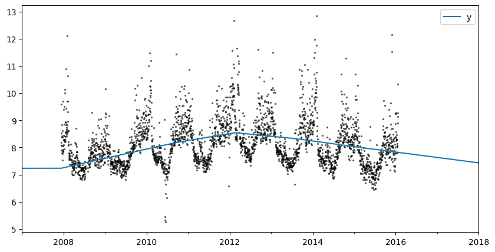
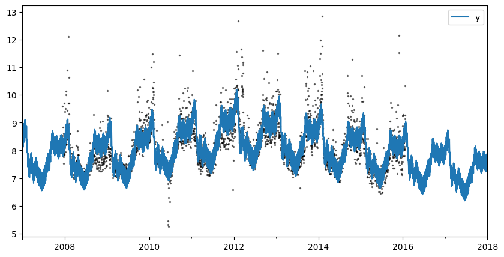
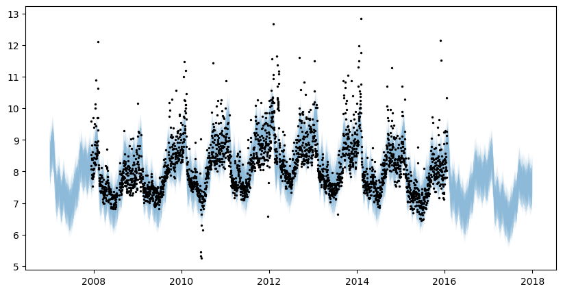
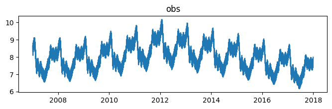
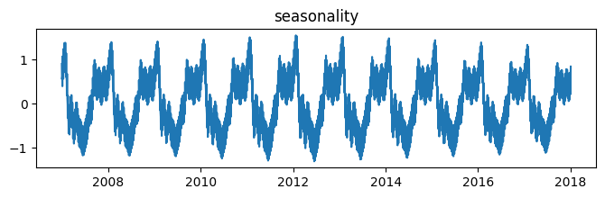
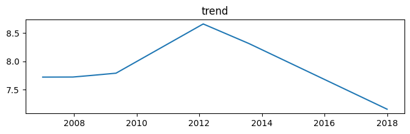
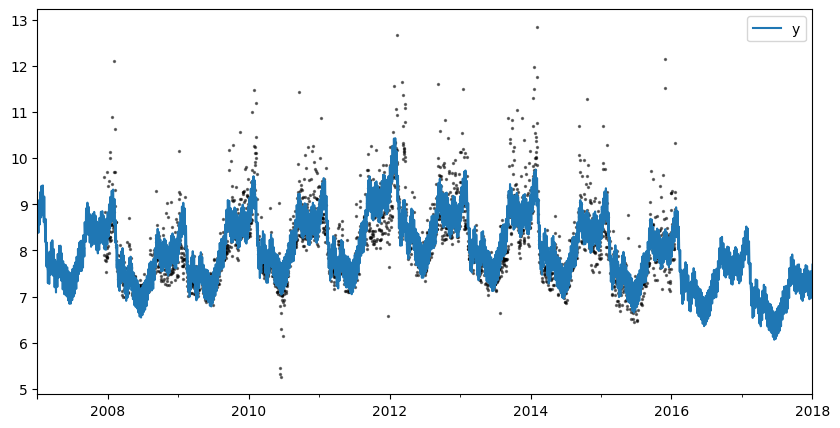

# Basic univariate forecasting
This example shows how to use Prophetverse to perform univariate forecasting
with a time series dataset, using sktime-style interface

Because of this compatibility, you can benefit from all the features of sktime, such
as hierarchical reconciliation, ensemble models, pipelines, etc. There are two main
methods to use Prophetverse with sktime:

* `fit(y, X=None)`:  This method is used to fit the model. It takes as input
a time series `y` and an optional exogenous variable `X`. The `y` time series must be
a `pd.Series` or a `pd.DataFrame`. The `X` variable must be a `pd.DataFrame` or `None`.

* `predict(fh, X=None)`: This method is used to make predictions. It takes as input a
forecast horizon `fh` and an optional exogenous variable `X`. The `fh` forecast horizon
can be a relative or an absolute forecast horizon. The `X` variable must be a
`pd.DataFrame` or `None`, according to the `X` variable used in the `fit` method.

Later in this example, we will also show additional methods to make predictions, such as
`predict_quantiles` and `predict_components`.


```python
import matplotlib.pyplot as plt
import numpy as np
import pandas as pd
from numpyro import distributions as dist


```

## Import dataset

We import a dataset from Prophet's original repository. We then put it into sktime-friendly format, where the index is a `pd.PeriodIndex` and the colums are the time series.


```python
from prophetverse.datasets.loaders import load_peyton_manning

y = load_peyton_manning()
display(y.head())


```
<p class="cell-output-title jp-RenderedText jp-OutputArea-output">Output: <span class="cell-output-count">[3]</span></p>


<div>
<style scoped>
    .dataframe tbody tr th:only-of-type {
        vertical-align: middle;
    }

    .dataframe tbody tr th {
        vertical-align: top;
    }

    .dataframe thead th {
        text-align: right;
    }
</style>
<table border="1" class="dataframe">
  <thead>
    <tr style="text-align: right;">
      <th></th>
      <th>y</th>
    </tr>
    <tr>
      <th>ds</th>
      <th></th>
    </tr>
  </thead>
  <tbody>
    <tr>
      <th>2007-12-10</th>
      <td>9.590761</td>
    </tr>
    <tr>
      <th>2007-12-11</th>
      <td>8.519590</td>
    </tr>
    <tr>
      <th>2007-12-12</th>
      <td>8.183677</td>
    </tr>
    <tr>
      <th>2007-12-13</th>
      <td>8.072467</td>
    </tr>
    <tr>
      <th>2007-12-14</th>
      <td>7.893572</td>
    </tr>
  </tbody>
</table>
</div>


The full dataset looks like this:


```python
y.plot.line(figsize=(12,6))
plt.show()


```
<p class="cell-output-title jp-RenderedText jp-OutputArea-output">Output: <span class="cell-output-count">[4]</span></p>


    

    


## Fit model
Here, we will show how you can fit a simple model with Prophetverse.
We first fit a model without seasonal components, and then fit a full model.
We also show how easy it is to switch between Maximum A Posteriori (MAP) inference
and Markov Chain Monte Carlo (MCMC).

### No seasonality


```python
from prophetverse.effects.trend import PiecewiseLinearTrend
from prophetverse.engine import MAPInferenceEngine
from prophetverse.engine.optimizer import AdamOptimizer, BFGSOptimizer
from prophetverse.sktime import Prophetverse
from prophetverse.utils import no_input_columns

optimizer = AdamOptimizer(step_size=1e-3)
optimizer = BFGSOptimizer(learning_rate=1e-7)
model = Prophetverse(
    trend=PiecewiseLinearTrend(
        changepoint_interval=500,
        changepoint_prior_scale=0.00001,
        changepoint_range=-250,
    ),
    inference_engine=MAPInferenceEngine(
        optimizer=optimizer,
        num_steps=1000,
    ),
)
model.fit(y=y)


```
<p class="cell-output-title jp-RenderedText jp-OutputArea-output">Output: <span class="cell-output-count">[5]</span></p>


<style>#sk-6130e1d5-63f7-4e05-86d4-5f0f9775c9f6 {
    /* Definition of color scheme common for light and dark mode */
    --sklearn-color-text: black;
    --sklearn-color-line: gray;
    /* Definition of color scheme for objects */
    --sklearn-color-level-0: #fff5e6;
    --sklearn-color-level-1: #f6e4d2;
    --sklearn-color-level-2: #ffe0b3;
    --sklearn-color-level-3: chocolate;

    /* Specific color for light theme */
    --sklearn-color-text-on-default-background: var(--theme-code-foreground, var(--jp-content-font-color1, black));
    --sklearn-color-background: var(--theme-background, var(--jp-layout-color0, white));
    --sklearn-color-border-box: var(--theme-code-foreground, var(--jp-content-font-color1, black));
    --sklearn-color-icon: #696969;

    @media (prefers-color-scheme: dark) {
      /* Redefinition of color scheme for dark theme */
      --sklearn-color-text-on-default-background: var(--theme-code-foreground, var(--jp-content-font-color1, white));
      --sklearn-color-background: var(--theme-background, var(--jp-layout-color0, #111));
      --sklearn-color-border-box: var(--theme-code-foreground, var(--jp-content-font-color1, white));
      --sklearn-color-icon: #878787;
    }
  }

  #sk-6130e1d5-63f7-4e05-86d4-5f0f9775c9f6 {
    color: var(--sklearn-color-text);
  }

  #sk-6130e1d5-63f7-4e05-86d4-5f0f9775c9f6 pre {
    padding: 0;
  }

  #sk-6130e1d5-63f7-4e05-86d4-5f0f9775c9f6 input.sk-hidden--visually {
    border: 0;
    clip: rect(1px 1px 1px 1px);
    clip: rect(1px, 1px, 1px, 1px);
    height: 1px;
    margin: -1px;
    overflow: hidden;
    padding: 0;
    position: absolute;
    width: 1px;
  }

  #sk-6130e1d5-63f7-4e05-86d4-5f0f9775c9f6 div.sk-dashed-wrapped {
    border: 1px dashed var(--sklearn-color-line);
    margin: 0 0.4em 0.5em 0.4em;
    box-sizing: border-box;
    padding-bottom: 0.4em;
    background-color: var(--sklearn-color-background);
  }

  #sk-6130e1d5-63f7-4e05-86d4-5f0f9775c9f6 div.sk-container {
    /* jupyter's `normalize.less` sets `[hidden] { display: none; }`
       but bootstrap.min.css set `[hidden] { display: none !important; }`
       so we also need the `!important` here to be able to override the
       default hidden behavior on the sphinx rendered scikit-learn.org.
       See: https://github.com/scikit-learn/scikit-learn/issues/21755 */
    display: inline-block !important;
    position: relative;
  }

  #sk-6130e1d5-63f7-4e05-86d4-5f0f9775c9f6 div.sk-text-repr-fallback {
    display: none;
  }

  div.sk-parallel-item,
  div.sk-serial,
  div.sk-item {
    /* draw centered vertical line to link estimators */
    background-image: linear-gradient(var(--sklearn-color-text-on-default-background), var(--sklearn-color-text-on-default-background));
    background-size: 2px 100%;
    background-repeat: no-repeat;
    background-position: center center;
  }

  /* Parallel-specific style estimator block */

  #sk-6130e1d5-63f7-4e05-86d4-5f0f9775c9f6 div.sk-parallel-item::after {
    content: "";
    width: 100%;
    border-bottom: 2px solid var(--sklearn-color-text-on-default-background);
    flex-grow: 1;
  }

  #sk-6130e1d5-63f7-4e05-86d4-5f0f9775c9f6 div.sk-parallel {
    display: flex;
    align-items: stretch;
    justify-content: center;
    background-color: var(--sklearn-color-background);
    position: relative;
  }

  #sk-6130e1d5-63f7-4e05-86d4-5f0f9775c9f6 div.sk-parallel-item {
    display: flex;
    flex-direction: column;
  }

  #sk-6130e1d5-63f7-4e05-86d4-5f0f9775c9f6 div.sk-parallel-item:first-child::after {
    align-self: flex-end;
    width: 50%;
  }

  #sk-6130e1d5-63f7-4e05-86d4-5f0f9775c9f6 div.sk-parallel-item:last-child::after {
    align-self: flex-start;
    width: 50%;
  }

  #sk-6130e1d5-63f7-4e05-86d4-5f0f9775c9f6 div.sk-parallel-item:only-child::after {
    width: 0;
  }

  /* Serial-specific style estimator block */

  #sk-6130e1d5-63f7-4e05-86d4-5f0f9775c9f6 div.sk-serial {
    display: flex;
    flex-direction: column;
    align-items: center;
    background-color: var(--sklearn-color-background);
    padding-right: 1em;
    padding-left: 1em;
  }


  /* Toggleable style: style used for estimator/Pipeline/ColumnTransformer box that is
  clickable and can be expanded/collapsed.
  - Pipeline and ColumnTransformer use this feature and define the default style
  - Estimators will overwrite some part of the style using the `sk-estimator` class
  */

  /* Pipeline and ColumnTransformer style (default) */

  #sk-6130e1d5-63f7-4e05-86d4-5f0f9775c9f6 div.sk-toggleable {
    /* Default theme specific background. It is overwritten whether we have a
    specific estimator or a Pipeline/ColumnTransformer */
    background-color: var(--sklearn-color-background);
  }

  /* Toggleable label */
  #sk-6130e1d5-63f7-4e05-86d4-5f0f9775c9f6 label.sk-toggleable__label {
    cursor: pointer;
    display: block;
    width: 100%;
    margin-bottom: 0;
    padding: 0.5em;
    box-sizing: border-box;
    text-align: center;
  }

  #sk-6130e1d5-63f7-4e05-86d4-5f0f9775c9f6 label.sk-toggleable__label-arrow:before {
    /* Arrow on the left of the label */
    content: "▸";
    float: left;
    margin-right: 0.25em;
    color: var(--sklearn-color-icon);
  }

  #sk-6130e1d5-63f7-4e05-86d4-5f0f9775c9f6 label.sk-toggleable__label-arrow:hover:before {
    color: var(--sklearn-color-text);
  }

  /* Toggleable content - dropdown */

  #sk-6130e1d5-63f7-4e05-86d4-5f0f9775c9f6 div.sk-toggleable__content {
    max-height: 0;
    max-width: 0;
    overflow: hidden;
    text-align: left;
    background-color: var(--sklearn-color-level-0);
  }

  #sk-6130e1d5-63f7-4e05-86d4-5f0f9775c9f6 div.sk-toggleable__content pre {
    margin: 0.2em;
    border-radius: 0.25em;
    color: var(--sklearn-color-text);
    background-color: var(--sklearn-color-level-0);
  }

  #sk-6130e1d5-63f7-4e05-86d4-5f0f9775c9f6 input.sk-toggleable__control:checked~div.sk-toggleable__content {
    /* Expand drop-down */
    max-height: 200px;
    max-width: 100%;
    overflow: auto;
  }

  #sk-6130e1d5-63f7-4e05-86d4-5f0f9775c9f6 input.sk-toggleable__control:checked~label.sk-toggleable__label-arrow:before {
    content: "▾";
  }

  /* Pipeline/ColumnTransformer-specific style */

  #sk-6130e1d5-63f7-4e05-86d4-5f0f9775c9f6 div.sk-label input.sk-toggleable__control:checked~label.sk-toggleable__label {
    color: var(--sklearn-color-text);
    background-color: var(--sklearn-color-level-2);
  }

  /* Estimator-specific style */

  /* Colorize estimator box */
  #sk-6130e1d5-63f7-4e05-86d4-5f0f9775c9f6 div.sk-estimator input.sk-toggleable__control:checked~label.sk-toggleable__label {
    /* unfitted */
    background-color: var(--sklearn-color-level-2);
  }

  #sk-6130e1d5-63f7-4e05-86d4-5f0f9775c9f6 div.sk-label label.sk-toggleable__label,
  #sk-6130e1d5-63f7-4e05-86d4-5f0f9775c9f6 div.sk-label label {
    /* The background is the default theme color */
    color: var(--sklearn-color-text-on-default-background);
  }

  /* On hover, darken the color of the background */
  #sk-6130e1d5-63f7-4e05-86d4-5f0f9775c9f6 div.sk-label:hover label.sk-toggleable__label {
    color: var(--sklearn-color-text);
    background-color: var(--sklearn-color-level-2);
  }

  /* Estimator label */

  #sk-6130e1d5-63f7-4e05-86d4-5f0f9775c9f6 div.sk-label label {
    font-family: monospace;
    font-weight: bold;
    display: inline-block;
    line-height: 1.2em;
  }

  #sk-6130e1d5-63f7-4e05-86d4-5f0f9775c9f6 div.sk-label-container {
    text-align: center;
  }

  /* Estimator-specific */
  #sk-6130e1d5-63f7-4e05-86d4-5f0f9775c9f6 div.sk-estimator {
    font-family: monospace;
    border: 1px dotted var(--sklearn-color-border-box);
    border-radius: 0.25em;
    box-sizing: border-box;
    margin-bottom: 0.5em;
    background-color: var(--sklearn-color-level-0);
  }

  /* on hover */
  #sk-6130e1d5-63f7-4e05-86d4-5f0f9775c9f6 div.sk-estimator:hover {
    background-color: var(--sklearn-color-level-2);
  }

  /* Specification for estimator info */

  .sk-estimator-doc-link,
  a:link.sk-estimator-doc-link,
  a:visited.sk-estimator-doc-link {
    float: right;
    font-size: smaller;
    line-height: 1em;
    font-family: monospace;
    background-color: var(--sklearn-color-background);
    border-radius: 1em;
    height: 1em;
    width: 1em;
    text-decoration: none !important;
    margin-left: 1ex;
    border: var(--sklearn-color-level-1) 1pt solid;
    color: var(--sklearn-color-level-1);
  }

  /* On hover */
  div.sk-estimator:hover .sk-estimator-doc-link:hover,
  .sk-estimator-doc-link:hover,
  div.sk-label-container:hover .sk-estimator-doc-link:hover,
  .sk-estimator-doc-link:hover {
    background-color: var(--sklearn-color-level-3);
    color: var(--sklearn-color-background);
    text-decoration: none;
  }

  /* Span, style for the box shown on hovering the info icon */
  .sk-estimator-doc-link span {
    display: none;
    z-index: 9999;
    position: relative;
    font-weight: normal;
    right: .2ex;
    padding: .5ex;
    margin: .5ex;
    width: min-content;
    min-width: 20ex;
    max-width: 50ex;
    color: var(--sklearn-color-text);
    box-shadow: 2pt 2pt 4pt #999;
    background: var(--sklearn-color-level-0);
    border: .5pt solid var(--sklearn-color-level-3);
  }

  .sk-estimator-doc-link:hover span {
    display: block;
  }

  /* "?"-specific style due to the `<a>` HTML tag */

  #sk-6130e1d5-63f7-4e05-86d4-5f0f9775c9f6 a.estimator_doc_link {
    float: right;
    font-size: 1rem;
    line-height: 1em;
    font-family: monospace;
    background-color: var(--sklearn-color-background);
    border-radius: 1rem;
    height: 1rem;
    width: 1rem;
    text-decoration: none;
    color: var(--sklearn-color-level-1);
    border: var(--sklearn-color-level-1) 1pt solid;
  }

  /* On hover */
  #sk-6130e1d5-63f7-4e05-86d4-5f0f9775c9f6 a.estimator_doc_link:hover {
    background-color: var(--sklearn-color-level-3);
    color: var(--sklearn-color-background);
    text-decoration: none;
  }
</style><div id='sk-6130e1d5-63f7-4e05-86d4-5f0f9775c9f6' class="sk-top-container"><div class="sk-text-repr-fallback"><pre>Prophetverse(inference_engine=MAPInferenceEngine(num_steps=1000,
                                                 optimizer=BFGSOptimizer(learning_rate=1e-07)),
             trend=PiecewiseLinearTrend(changepoint_interval=500,
                                        changepoint_prior_scale=1e-05,
                                        changepoint_range=-250))</pre><b>Please rerun this cell to show the HTML repr or trust the notebook.</b></div><div class="sk-container" hidden><div class="sk-item sk-dashed-wrapped"><div class='sk-label-container'><div class="sk-label sk-toggleable"><input class="sk-toggleable__control sk-hidden--visually" id=UUID('2d3a9747-1b2a-44a2-9d76-baca721d483e') type="checkbox" ><label for=UUID('2d3a9747-1b2a-44a2-9d76-baca721d483e') class='sk-toggleable__label sk-toggleable__label-arrow'>Prophetverse</label><div class="sk-toggleable__content"><pre>Prophetverse(inference_engine=MAPInferenceEngine(num_steps=1000,
                                                 optimizer=BFGSOptimizer(learning_rate=1e-07)),
             trend=PiecewiseLinearTrend(changepoint_interval=500,
                                        changepoint_prior_scale=1e-05,
                                        changepoint_range=-250))</pre></div></div></div><div class="sk-parallel"><div class="sk-parallel-item"><div class="sk-item"><div class='sk-label-container'><div class="sk-label sk-toggleable"><input class="sk-toggleable__control sk-hidden--visually" id=UUID('1640ce26-b9b1-426a-83da-8c0f9634fc4c') type="checkbox" ><label for=UUID('1640ce26-b9b1-426a-83da-8c0f9634fc4c') class='sk-toggleable__label sk-toggleable__label-arrow'>trend: PiecewiseLinearTrend</label><div class="sk-toggleable__content"><pre>PiecewiseLinearTrend(changepoint_interval=500, changepoint_prior_scale=1e-05,
                     changepoint_range=-250)</pre></div></div></div><div class="sk-serial"><div class='sk-item'><div class="sk-estimator sk-toggleable"><input class="sk-toggleable__control sk-hidden--visually" id=UUID('76d4eaaa-5315-4d66-8e6b-c2035ff1e12b') type="checkbox" ><label for=UUID('76d4eaaa-5315-4d66-8e6b-c2035ff1e12b') class='sk-toggleable__label sk-toggleable__label-arrow'>PiecewiseLinearTrend</label><div class="sk-toggleable__content"><pre>PiecewiseLinearTrend(changepoint_interval=500, changepoint_prior_scale=1e-05,
                     changepoint_range=-250)</pre></div></div></div></div></div></div></div></div></div></div>


```python
forecast_horizon = pd.period_range("2007-01-01", "2018-01-01", freq="D")
fig, ax = plt.subplots(figsize=(10, 5))
preds = model.predict(fh=forecast_horizon)
preds.plot.line(ax=ax)
ax.scatter(y.index, y, marker="o", color="k", s=2, alpha=0.5)


```
<p class="cell-output-title jp-RenderedText jp-OutputArea-output">Output: <span class="cell-output-count">[6]</span></p>


    <matplotlib.collections.PathCollection at 0x17561add0>


    

    


### With seasonality
Here, we fit the univariate Prophet and pass an exogenous effect as hyperparameter.
The `exogenous_effects` parameter let us add new components to the model and control
the relationship between exogenous variables and the target variable.
In this case, the `LinearFourierSeasonality` effect creates sinusoidal and cosine
terms to model the seasonality of the time series, which are then multiplied by
linear coefficients and added to the model.

This argument is a list of tuples of the form `(effect_name, effect, regex_to_filter_relevant_columns)`,
where `effect_name` is a string and `effect` is an instance of a subclass of
`prophetverse.effects.BaseEffect`. The regex is used to filter the columns of X
that are relevant for the effect, but can also be `None`
(or its alias `prophetverse.utils.no_input_columns`) if no input in `X` is needed
for the effect. For example, the seasonality effect already implemented in
`prophetverse.effects` module does not need any input in `X`, so we can use
`prophetverse.utils.no_input_columns` as the regex.


```python
from prophetverse.effects.fourier import LinearFourierSeasonality
from prophetverse.utils import no_input_columns

model = Prophetverse(
    trend=PiecewiseLinearTrend(
        changepoint_interval=500,
        changepoint_prior_scale=0.00001,
        changepoint_range=-500,
    ),
    exogenous_effects=[
        (
            "seasonality",
            LinearFourierSeasonality(
                freq="D",
                sp_list=[7, 365.25],
                fourier_terms_list=[3, 10],
                prior_scale=0.1,
                effect_mode="multiplicative",
            ),
            no_input_columns,
        ),
    ],
    inference_engine=MAPInferenceEngine(
        optimizer=optimizer,
        num_steps=1000,
    ),
)
model.fit(y=y)


```
<p class="cell-output-title jp-RenderedText jp-OutputArea-output">Output: <span class="cell-output-count">[7]</span></p>


<style>#sk-64e1c666-6e6b-4486-b22d-011d09d4cd6e {
    /* Definition of color scheme common for light and dark mode */
    --sklearn-color-text: black;
    --sklearn-color-line: gray;
    /* Definition of color scheme for objects */
    --sklearn-color-level-0: #fff5e6;
    --sklearn-color-level-1: #f6e4d2;
    --sklearn-color-level-2: #ffe0b3;
    --sklearn-color-level-3: chocolate;

    /* Specific color for light theme */
    --sklearn-color-text-on-default-background: var(--theme-code-foreground, var(--jp-content-font-color1, black));
    --sklearn-color-background: var(--theme-background, var(--jp-layout-color0, white));
    --sklearn-color-border-box: var(--theme-code-foreground, var(--jp-content-font-color1, black));
    --sklearn-color-icon: #696969;

    @media (prefers-color-scheme: dark) {
      /* Redefinition of color scheme for dark theme */
      --sklearn-color-text-on-default-background: var(--theme-code-foreground, var(--jp-content-font-color1, white));
      --sklearn-color-background: var(--theme-background, var(--jp-layout-color0, #111));
      --sklearn-color-border-box: var(--theme-code-foreground, var(--jp-content-font-color1, white));
      --sklearn-color-icon: #878787;
    }
  }

  #sk-64e1c666-6e6b-4486-b22d-011d09d4cd6e {
    color: var(--sklearn-color-text);
  }

  #sk-64e1c666-6e6b-4486-b22d-011d09d4cd6e pre {
    padding: 0;
  }

  #sk-64e1c666-6e6b-4486-b22d-011d09d4cd6e input.sk-hidden--visually {
    border: 0;
    clip: rect(1px 1px 1px 1px);
    clip: rect(1px, 1px, 1px, 1px);
    height: 1px;
    margin: -1px;
    overflow: hidden;
    padding: 0;
    position: absolute;
    width: 1px;
  }

  #sk-64e1c666-6e6b-4486-b22d-011d09d4cd6e div.sk-dashed-wrapped {
    border: 1px dashed var(--sklearn-color-line);
    margin: 0 0.4em 0.5em 0.4em;
    box-sizing: border-box;
    padding-bottom: 0.4em;
    background-color: var(--sklearn-color-background);
  }

  #sk-64e1c666-6e6b-4486-b22d-011d09d4cd6e div.sk-container {
    /* jupyter's `normalize.less` sets `[hidden] { display: none; }`
       but bootstrap.min.css set `[hidden] { display: none !important; }`
       so we also need the `!important` here to be able to override the
       default hidden behavior on the sphinx rendered scikit-learn.org.
       See: https://github.com/scikit-learn/scikit-learn/issues/21755 */
    display: inline-block !important;
    position: relative;
  }

  #sk-64e1c666-6e6b-4486-b22d-011d09d4cd6e div.sk-text-repr-fallback {
    display: none;
  }

  div.sk-parallel-item,
  div.sk-serial,
  div.sk-item {
    /* draw centered vertical line to link estimators */
    background-image: linear-gradient(var(--sklearn-color-text-on-default-background), var(--sklearn-color-text-on-default-background));
    background-size: 2px 100%;
    background-repeat: no-repeat;
    background-position: center center;
  }

  /* Parallel-specific style estimator block */

  #sk-64e1c666-6e6b-4486-b22d-011d09d4cd6e div.sk-parallel-item::after {
    content: "";
    width: 100%;
    border-bottom: 2px solid var(--sklearn-color-text-on-default-background);
    flex-grow: 1;
  }

  #sk-64e1c666-6e6b-4486-b22d-011d09d4cd6e div.sk-parallel {
    display: flex;
    align-items: stretch;
    justify-content: center;
    background-color: var(--sklearn-color-background);
    position: relative;
  }

  #sk-64e1c666-6e6b-4486-b22d-011d09d4cd6e div.sk-parallel-item {
    display: flex;
    flex-direction: column;
  }

  #sk-64e1c666-6e6b-4486-b22d-011d09d4cd6e div.sk-parallel-item:first-child::after {
    align-self: flex-end;
    width: 50%;
  }

  #sk-64e1c666-6e6b-4486-b22d-011d09d4cd6e div.sk-parallel-item:last-child::after {
    align-self: flex-start;
    width: 50%;
  }

  #sk-64e1c666-6e6b-4486-b22d-011d09d4cd6e div.sk-parallel-item:only-child::after {
    width: 0;
  }

  /* Serial-specific style estimator block */

  #sk-64e1c666-6e6b-4486-b22d-011d09d4cd6e div.sk-serial {
    display: flex;
    flex-direction: column;
    align-items: center;
    background-color: var(--sklearn-color-background);
    padding-right: 1em;
    padding-left: 1em;
  }


  /* Toggleable style: style used for estimator/Pipeline/ColumnTransformer box that is
  clickable and can be expanded/collapsed.
  - Pipeline and ColumnTransformer use this feature and define the default style
  - Estimators will overwrite some part of the style using the `sk-estimator` class
  */

  /* Pipeline and ColumnTransformer style (default) */

  #sk-64e1c666-6e6b-4486-b22d-011d09d4cd6e div.sk-toggleable {
    /* Default theme specific background. It is overwritten whether we have a
    specific estimator or a Pipeline/ColumnTransformer */
    background-color: var(--sklearn-color-background);
  }

  /* Toggleable label */
  #sk-64e1c666-6e6b-4486-b22d-011d09d4cd6e label.sk-toggleable__label {
    cursor: pointer;
    display: block;
    width: 100%;
    margin-bottom: 0;
    padding: 0.5em;
    box-sizing: border-box;
    text-align: center;
  }

  #sk-64e1c666-6e6b-4486-b22d-011d09d4cd6e label.sk-toggleable__label-arrow:before {
    /* Arrow on the left of the label */
    content: "▸";
    float: left;
    margin-right: 0.25em;
    color: var(--sklearn-color-icon);
  }

  #sk-64e1c666-6e6b-4486-b22d-011d09d4cd6e label.sk-toggleable__label-arrow:hover:before {
    color: var(--sklearn-color-text);
  }

  /* Toggleable content - dropdown */

  #sk-64e1c666-6e6b-4486-b22d-011d09d4cd6e div.sk-toggleable__content {
    max-height: 0;
    max-width: 0;
    overflow: hidden;
    text-align: left;
    background-color: var(--sklearn-color-level-0);
  }

  #sk-64e1c666-6e6b-4486-b22d-011d09d4cd6e div.sk-toggleable__content pre {
    margin: 0.2em;
    border-radius: 0.25em;
    color: var(--sklearn-color-text);
    background-color: var(--sklearn-color-level-0);
  }

  #sk-64e1c666-6e6b-4486-b22d-011d09d4cd6e input.sk-toggleable__control:checked~div.sk-toggleable__content {
    /* Expand drop-down */
    max-height: 200px;
    max-width: 100%;
    overflow: auto;
  }

  #sk-64e1c666-6e6b-4486-b22d-011d09d4cd6e input.sk-toggleable__control:checked~label.sk-toggleable__label-arrow:before {
    content: "▾";
  }

  /* Pipeline/ColumnTransformer-specific style */

  #sk-64e1c666-6e6b-4486-b22d-011d09d4cd6e div.sk-label input.sk-toggleable__control:checked~label.sk-toggleable__label {
    color: var(--sklearn-color-text);
    background-color: var(--sklearn-color-level-2);
  }

  /* Estimator-specific style */

  /* Colorize estimator box */
  #sk-64e1c666-6e6b-4486-b22d-011d09d4cd6e div.sk-estimator input.sk-toggleable__control:checked~label.sk-toggleable__label {
    /* unfitted */
    background-color: var(--sklearn-color-level-2);
  }

  #sk-64e1c666-6e6b-4486-b22d-011d09d4cd6e div.sk-label label.sk-toggleable__label,
  #sk-64e1c666-6e6b-4486-b22d-011d09d4cd6e div.sk-label label {
    /* The background is the default theme color */
    color: var(--sklearn-color-text-on-default-background);
  }

  /* On hover, darken the color of the background */
  #sk-64e1c666-6e6b-4486-b22d-011d09d4cd6e div.sk-label:hover label.sk-toggleable__label {
    color: var(--sklearn-color-text);
    background-color: var(--sklearn-color-level-2);
  }

  /* Estimator label */

  #sk-64e1c666-6e6b-4486-b22d-011d09d4cd6e div.sk-label label {
    font-family: monospace;
    font-weight: bold;
    display: inline-block;
    line-height: 1.2em;
  }

  #sk-64e1c666-6e6b-4486-b22d-011d09d4cd6e div.sk-label-container {
    text-align: center;
  }

  /* Estimator-specific */
  #sk-64e1c666-6e6b-4486-b22d-011d09d4cd6e div.sk-estimator {
    font-family: monospace;
    border: 1px dotted var(--sklearn-color-border-box);
    border-radius: 0.25em;
    box-sizing: border-box;
    margin-bottom: 0.5em;
    background-color: var(--sklearn-color-level-0);
  }

  /* on hover */
  #sk-64e1c666-6e6b-4486-b22d-011d09d4cd6e div.sk-estimator:hover {
    background-color: var(--sklearn-color-level-2);
  }

  /* Specification for estimator info */

  .sk-estimator-doc-link,
  a:link.sk-estimator-doc-link,
  a:visited.sk-estimator-doc-link {
    float: right;
    font-size: smaller;
    line-height: 1em;
    font-family: monospace;
    background-color: var(--sklearn-color-background);
    border-radius: 1em;
    height: 1em;
    width: 1em;
    text-decoration: none !important;
    margin-left: 1ex;
    border: var(--sklearn-color-level-1) 1pt solid;
    color: var(--sklearn-color-level-1);
  }

  /* On hover */
  div.sk-estimator:hover .sk-estimator-doc-link:hover,
  .sk-estimator-doc-link:hover,
  div.sk-label-container:hover .sk-estimator-doc-link:hover,
  .sk-estimator-doc-link:hover {
    background-color: var(--sklearn-color-level-3);
    color: var(--sklearn-color-background);
    text-decoration: none;
  }

  /* Span, style for the box shown on hovering the info icon */
  .sk-estimator-doc-link span {
    display: none;
    z-index: 9999;
    position: relative;
    font-weight: normal;
    right: .2ex;
    padding: .5ex;
    margin: .5ex;
    width: min-content;
    min-width: 20ex;
    max-width: 50ex;
    color: var(--sklearn-color-text);
    box-shadow: 2pt 2pt 4pt #999;
    background: var(--sklearn-color-level-0);
    border: .5pt solid var(--sklearn-color-level-3);
  }

  .sk-estimator-doc-link:hover span {
    display: block;
  }

  /* "?"-specific style due to the `<a>` HTML tag */

  #sk-64e1c666-6e6b-4486-b22d-011d09d4cd6e a.estimator_doc_link {
    float: right;
    font-size: 1rem;
    line-height: 1em;
    font-family: monospace;
    background-color: var(--sklearn-color-background);
    border-radius: 1rem;
    height: 1rem;
    width: 1rem;
    text-decoration: none;
    color: var(--sklearn-color-level-1);
    border: var(--sklearn-color-level-1) 1pt solid;
  }

  /* On hover */
  #sk-64e1c666-6e6b-4486-b22d-011d09d4cd6e a.estimator_doc_link:hover {
    background-color: var(--sklearn-color-level-3);
    color: var(--sklearn-color-background);
    text-decoration: none;
  }
</style><div id='sk-64e1c666-6e6b-4486-b22d-011d09d4cd6e' class="sk-top-container"><div class="sk-text-repr-fallback"><pre>Prophetverse(exogenous_effects=[(&#x27;seasonality&#x27;,
                                 LinearFourierSeasonality(effect_mode=&#x27;multiplicative&#x27;,
                                                          fourier_terms_list=[3,
                                                                              10],
                                                          freq=&#x27;D&#x27;,
                                                          prior_scale=0.1,
                                                          sp_list=[7, 365.25]),
                                 &#x27;^$&#x27;)],
             inference_engine=MAPInferenceEngine(num_steps=1000,
                                                 optimizer=BFGSOptimizer(learning_rate=1e-07)),
             trend=PiecewiseLinearTrend(changepoint_interval=500,
                                        changepoint_prior_scale=1e-05,
                                        changepoint_range=-500))</pre><b>Please rerun this cell to show the HTML repr or trust the notebook.</b></div><div class="sk-container" hidden><div class="sk-item sk-dashed-wrapped"><div class='sk-label-container'><div class="sk-label sk-toggleable"><input class="sk-toggleable__control sk-hidden--visually" id=UUID('f638835f-dcb2-49b8-9868-44b75a7f4013') type="checkbox" ><label for=UUID('f638835f-dcb2-49b8-9868-44b75a7f4013') class='sk-toggleable__label sk-toggleable__label-arrow'>Prophetverse</label><div class="sk-toggleable__content"><pre>Prophetverse(exogenous_effects=[(&#x27;seasonality&#x27;,
                                 LinearFourierSeasonality(effect_mode=&#x27;multiplicative&#x27;,
                                                          fourier_terms_list=[3,
                                                                              10],
                                                          freq=&#x27;D&#x27;,
                                                          prior_scale=0.1,
                                                          sp_list=[7, 365.25]),
                                 &#x27;^$&#x27;)],
             inference_engine=MAPInferenceEngine(num_steps=1000,
                                                 optimizer=BFGSOptimizer(learning_rate=1e-07)),
             trend=PiecewiseLinearTrend(changepoint_interval=500,
                                        changepoint_prior_scale=1e-05,
                                        changepoint_range=-500))</pre></div></div></div><div class="sk-parallel"><div class="sk-parallel-item"><div class="sk-item"><div class='sk-label-container'><div class="sk-label sk-toggleable"><input class="sk-toggleable__control sk-hidden--visually" id=UUID('d71c0d6a-da9d-44bc-80b6-229f7e8b0147') type="checkbox" ><label for=UUID('d71c0d6a-da9d-44bc-80b6-229f7e8b0147') class='sk-toggleable__label sk-toggleable__label-arrow'>trend: PiecewiseLinearTrend</label><div class="sk-toggleable__content"><pre>PiecewiseLinearTrend(changepoint_interval=500, changepoint_prior_scale=1e-05,
                     changepoint_range=-500)</pre></div></div></div><div class="sk-serial"><div class='sk-item'><div class="sk-estimator sk-toggleable"><input class="sk-toggleable__control sk-hidden--visually" id=UUID('a6c51e32-c01e-4cfd-a59f-893a49b0c149') type="checkbox" ><label for=UUID('a6c51e32-c01e-4cfd-a59f-893a49b0c149') class='sk-toggleable__label sk-toggleable__label-arrow'>PiecewiseLinearTrend</label><div class="sk-toggleable__content"><pre>PiecewiseLinearTrend(changepoint_interval=500, changepoint_prior_scale=1e-05,
                     changepoint_range=-500)</pre></div></div></div></div></div></div></div></div></div></div>


```python
forecast_horizon = pd.period_range("2007-01-01", "2018-01-01", freq="D")
fig, ax = plt.subplots(figsize=(10, 5))
preds = model.predict(fh=forecast_horizon)
preds.plot.line(ax=ax)
ax.scatter(y.index, y, marker="o", color="k", s=2, alpha=0.5)


```
<p class="cell-output-title jp-RenderedText jp-OutputArea-output">Output: <span class="cell-output-count">[8]</span></p>


    <matplotlib.collections.PathCollection at 0x1756e12d0>


    

    


## Probabilistic forecasting
We can also make probabilistic forecasts with Prophetverse, in sktime fashion.
 The `predict_quantiles` method returns the quantiles of the predictive distribution
in a `pd.DataFrame`


```python
quantiles = model.predict_quantiles(fh=forecast_horizon, alpha=[0.1, .9])
quantiles.head()


```
<p class="cell-output-title jp-RenderedText jp-OutputArea-output">Output: <span class="cell-output-count">[9]</span></p>


<div>
<style scoped>
    .dataframe tbody tr th:only-of-type {
        vertical-align: middle;
    }

    .dataframe tbody tr th {
        vertical-align: top;
    }

    .dataframe thead tr th {
        text-align: left;
    }
</style>
<table border="1" class="dataframe">
  <thead>
    <tr>
      <th></th>
      <th colspan="2" halign="left">y</th>
    </tr>
    <tr>
      <th></th>
      <th>0.1</th>
      <th>0.9</th>
    </tr>
  </thead>
  <tbody>
    <tr>
      <th>2007-01-01</th>
      <td>7.979739</td>
      <td>9.277808</td>
    </tr>
    <tr>
      <th>2007-01-02</th>
      <td>7.783203</td>
      <td>9.080591</td>
    </tr>
    <tr>
      <th>2007-01-03</th>
      <td>7.672912</td>
      <td>8.940457</td>
    </tr>
    <tr>
      <th>2007-01-04</th>
      <td>7.633861</td>
      <td>8.982963</td>
    </tr>
    <tr>
      <th>2007-01-05</th>
      <td>7.663145</td>
      <td>9.008993</td>
    </tr>
  </tbody>
</table>
</div>


The plot below shows the (0.1, 0.9) quantiles of the predictive distribution


```python
fig, ax = plt.subplots(figsize=(10, 5))
# Plot area between quantiles
ax.fill_between(
    quantiles.index.to_timestamp(),
    quantiles.iloc[:, 0],
    quantiles.iloc[:, -1],
    alpha=0.5,
)
ax.scatter(y.index, y, marker="o", color="k", s=2, alpha=1)


```
<p class="cell-output-title jp-RenderedText jp-OutputArea-output">Output: <span class="cell-output-count">[10]</span></p>


    <matplotlib.collections.PathCollection at 0x32172b0d0>


    

    


## Timeseries decomposition
We can easily extract the components of the time series with the `predict_components`
method. This method, in particular, is not implemented in sktime's `BaseForecaster`,
but it is a method of `prophetverse.Prophetverse` class.


```python
sites = model.predict_components(fh=forecast_horizon)
sites.head()


```
<p class="cell-output-title jp-RenderedText jp-OutputArea-output">Output: <span class="cell-output-count">[11]</span></p>


<div>
<style scoped>
    .dataframe tbody tr th:only-of-type {
        vertical-align: middle;
    }

    .dataframe tbody tr th {
        vertical-align: top;
    }

    .dataframe thead th {
        text-align: right;
    }
</style>
<table border="1" class="dataframe">
  <thead>
    <tr style="text-align: right;">
      <th></th>
      <th>mean</th>
      <th>obs</th>
      <th>seasonality</th>
      <th>trend</th>
    </tr>
  </thead>
  <tbody>
    <tr>
      <th>2007-01-01</th>
      <td>8.628613</td>
      <td>8.641882</td>
      <td>0.905029</td>
      <td>7.723586</td>
    </tr>
    <tr>
      <th>2007-01-02</th>
      <td>8.429354</td>
      <td>8.420519</td>
      <td>0.705773</td>
      <td>7.723586</td>
    </tr>
    <tr>
      <th>2007-01-03</th>
      <td>8.278194</td>
      <td>8.296164</td>
      <td>0.554615</td>
      <td>7.723586</td>
    </tr>
    <tr>
      <th>2007-01-04</th>
      <td>8.303530</td>
      <td>8.311582</td>
      <td>0.579947</td>
      <td>7.723586</td>
    </tr>
    <tr>
      <th>2007-01-05</th>
      <td>8.332591</td>
      <td>8.323648</td>
      <td>0.609009</td>
      <td>7.723586</td>
    </tr>
  </tbody>
</table>
</div>


```python
for column in sites.columns:
    fig, ax = plt.subplots(figsize=(8, 2))
    ax.plot(sites.index.to_timestamp(), sites[column], label=column)
    ax.set_title(column)
    fig.show()


```
<p class="cell-output-title jp-RenderedText jp-OutputArea-output">Output: <span class="cell-output-count">[12]</span></p>


    

    


    

    


    

    


    

    


## Fitting with MCMC
In the previous examples, we used MAP inference to fit the model. However, we can also
use Markov Chain Monte Carlo (MCMC) to fit the model. To do this, we just need to
change the `inference_engine` parameter to `MCMCInferenceEngine`. The rest of the code
remains the same.

The `set_params` method is used to set the parameters of the model, in sklearn fashion.


```python
from prophetverse.engine import MCMCInferenceEngine

model.set_params(
    inference_engine=MCMCInferenceEngine()
)

model.fit(y=y)


```
<p class="cell-output-title jp-RenderedText jp-OutputArea-output">Output: <span class="cell-output-count">[13]</span></p>


<style>#sk-01665fe7-472f-432c-85ae-72428a6bb528 {
    /* Definition of color scheme common for light and dark mode */
    --sklearn-color-text: black;
    --sklearn-color-line: gray;
    /* Definition of color scheme for objects */
    --sklearn-color-level-0: #fff5e6;
    --sklearn-color-level-1: #f6e4d2;
    --sklearn-color-level-2: #ffe0b3;
    --sklearn-color-level-3: chocolate;

    /* Specific color for light theme */
    --sklearn-color-text-on-default-background: var(--theme-code-foreground, var(--jp-content-font-color1, black));
    --sklearn-color-background: var(--theme-background, var(--jp-layout-color0, white));
    --sklearn-color-border-box: var(--theme-code-foreground, var(--jp-content-font-color1, black));
    --sklearn-color-icon: #696969;

    @media (prefers-color-scheme: dark) {
      /* Redefinition of color scheme for dark theme */
      --sklearn-color-text-on-default-background: var(--theme-code-foreground, var(--jp-content-font-color1, white));
      --sklearn-color-background: var(--theme-background, var(--jp-layout-color0, #111));
      --sklearn-color-border-box: var(--theme-code-foreground, var(--jp-content-font-color1, white));
      --sklearn-color-icon: #878787;
    }
  }

  #sk-01665fe7-472f-432c-85ae-72428a6bb528 {
    color: var(--sklearn-color-text);
  }

  #sk-01665fe7-472f-432c-85ae-72428a6bb528 pre {
    padding: 0;
  }

  #sk-01665fe7-472f-432c-85ae-72428a6bb528 input.sk-hidden--visually {
    border: 0;
    clip: rect(1px 1px 1px 1px);
    clip: rect(1px, 1px, 1px, 1px);
    height: 1px;
    margin: -1px;
    overflow: hidden;
    padding: 0;
    position: absolute;
    width: 1px;
  }

  #sk-01665fe7-472f-432c-85ae-72428a6bb528 div.sk-dashed-wrapped {
    border: 1px dashed var(--sklearn-color-line);
    margin: 0 0.4em 0.5em 0.4em;
    box-sizing: border-box;
    padding-bottom: 0.4em;
    background-color: var(--sklearn-color-background);
  }

  #sk-01665fe7-472f-432c-85ae-72428a6bb528 div.sk-container {
    /* jupyter's `normalize.less` sets `[hidden] { display: none; }`
       but bootstrap.min.css set `[hidden] { display: none !important; }`
       so we also need the `!important` here to be able to override the
       default hidden behavior on the sphinx rendered scikit-learn.org.
       See: https://github.com/scikit-learn/scikit-learn/issues/21755 */
    display: inline-block !important;
    position: relative;
  }

  #sk-01665fe7-472f-432c-85ae-72428a6bb528 div.sk-text-repr-fallback {
    display: none;
  }

  div.sk-parallel-item,
  div.sk-serial,
  div.sk-item {
    /* draw centered vertical line to link estimators */
    background-image: linear-gradient(var(--sklearn-color-text-on-default-background), var(--sklearn-color-text-on-default-background));
    background-size: 2px 100%;
    background-repeat: no-repeat;
    background-position: center center;
  }

  /* Parallel-specific style estimator block */

  #sk-01665fe7-472f-432c-85ae-72428a6bb528 div.sk-parallel-item::after {
    content: "";
    width: 100%;
    border-bottom: 2px solid var(--sklearn-color-text-on-default-background);
    flex-grow: 1;
  }

  #sk-01665fe7-472f-432c-85ae-72428a6bb528 div.sk-parallel {
    display: flex;
    align-items: stretch;
    justify-content: center;
    background-color: var(--sklearn-color-background);
    position: relative;
  }

  #sk-01665fe7-472f-432c-85ae-72428a6bb528 div.sk-parallel-item {
    display: flex;
    flex-direction: column;
  }

  #sk-01665fe7-472f-432c-85ae-72428a6bb528 div.sk-parallel-item:first-child::after {
    align-self: flex-end;
    width: 50%;
  }

  #sk-01665fe7-472f-432c-85ae-72428a6bb528 div.sk-parallel-item:last-child::after {
    align-self: flex-start;
    width: 50%;
  }

  #sk-01665fe7-472f-432c-85ae-72428a6bb528 div.sk-parallel-item:only-child::after {
    width: 0;
  }

  /* Serial-specific style estimator block */

  #sk-01665fe7-472f-432c-85ae-72428a6bb528 div.sk-serial {
    display: flex;
    flex-direction: column;
    align-items: center;
    background-color: var(--sklearn-color-background);
    padding-right: 1em;
    padding-left: 1em;
  }


  /* Toggleable style: style used for estimator/Pipeline/ColumnTransformer box that is
  clickable and can be expanded/collapsed.
  - Pipeline and ColumnTransformer use this feature and define the default style
  - Estimators will overwrite some part of the style using the `sk-estimator` class
  */

  /* Pipeline and ColumnTransformer style (default) */

  #sk-01665fe7-472f-432c-85ae-72428a6bb528 div.sk-toggleable {
    /* Default theme specific background. It is overwritten whether we have a
    specific estimator or a Pipeline/ColumnTransformer */
    background-color: var(--sklearn-color-background);
  }

  /* Toggleable label */
  #sk-01665fe7-472f-432c-85ae-72428a6bb528 label.sk-toggleable__label {
    cursor: pointer;
    display: block;
    width: 100%;
    margin-bottom: 0;
    padding: 0.5em;
    box-sizing: border-box;
    text-align: center;
  }

  #sk-01665fe7-472f-432c-85ae-72428a6bb528 label.sk-toggleable__label-arrow:before {
    /* Arrow on the left of the label */
    content: "▸";
    float: left;
    margin-right: 0.25em;
    color: var(--sklearn-color-icon);
  }

  #sk-01665fe7-472f-432c-85ae-72428a6bb528 label.sk-toggleable__label-arrow:hover:before {
    color: var(--sklearn-color-text);
  }

  /* Toggleable content - dropdown */

  #sk-01665fe7-472f-432c-85ae-72428a6bb528 div.sk-toggleable__content {
    max-height: 0;
    max-width: 0;
    overflow: hidden;
    text-align: left;
    background-color: var(--sklearn-color-level-0);
  }

  #sk-01665fe7-472f-432c-85ae-72428a6bb528 div.sk-toggleable__content pre {
    margin: 0.2em;
    border-radius: 0.25em;
    color: var(--sklearn-color-text);
    background-color: var(--sklearn-color-level-0);
  }

  #sk-01665fe7-472f-432c-85ae-72428a6bb528 input.sk-toggleable__control:checked~div.sk-toggleable__content {
    /* Expand drop-down */
    max-height: 200px;
    max-width: 100%;
    overflow: auto;
  }

  #sk-01665fe7-472f-432c-85ae-72428a6bb528 input.sk-toggleable__control:checked~label.sk-toggleable__label-arrow:before {
    content: "▾";
  }

  /* Pipeline/ColumnTransformer-specific style */

  #sk-01665fe7-472f-432c-85ae-72428a6bb528 div.sk-label input.sk-toggleable__control:checked~label.sk-toggleable__label {
    color: var(--sklearn-color-text);
    background-color: var(--sklearn-color-level-2);
  }

  /* Estimator-specific style */

  /* Colorize estimator box */
  #sk-01665fe7-472f-432c-85ae-72428a6bb528 div.sk-estimator input.sk-toggleable__control:checked~label.sk-toggleable__label {
    /* unfitted */
    background-color: var(--sklearn-color-level-2);
  }

  #sk-01665fe7-472f-432c-85ae-72428a6bb528 div.sk-label label.sk-toggleable__label,
  #sk-01665fe7-472f-432c-85ae-72428a6bb528 div.sk-label label {
    /* The background is the default theme color */
    color: var(--sklearn-color-text-on-default-background);
  }

  /* On hover, darken the color of the background */
  #sk-01665fe7-472f-432c-85ae-72428a6bb528 div.sk-label:hover label.sk-toggleable__label {
    color: var(--sklearn-color-text);
    background-color: var(--sklearn-color-level-2);
  }

  /* Estimator label */

  #sk-01665fe7-472f-432c-85ae-72428a6bb528 div.sk-label label {
    font-family: monospace;
    font-weight: bold;
    display: inline-block;
    line-height: 1.2em;
  }

  #sk-01665fe7-472f-432c-85ae-72428a6bb528 div.sk-label-container {
    text-align: center;
  }

  /* Estimator-specific */
  #sk-01665fe7-472f-432c-85ae-72428a6bb528 div.sk-estimator {
    font-family: monospace;
    border: 1px dotted var(--sklearn-color-border-box);
    border-radius: 0.25em;
    box-sizing: border-box;
    margin-bottom: 0.5em;
    background-color: var(--sklearn-color-level-0);
  }

  /* on hover */
  #sk-01665fe7-472f-432c-85ae-72428a6bb528 div.sk-estimator:hover {
    background-color: var(--sklearn-color-level-2);
  }

  /* Specification for estimator info */

  .sk-estimator-doc-link,
  a:link.sk-estimator-doc-link,
  a:visited.sk-estimator-doc-link {
    float: right;
    font-size: smaller;
    line-height: 1em;
    font-family: monospace;
    background-color: var(--sklearn-color-background);
    border-radius: 1em;
    height: 1em;
    width: 1em;
    text-decoration: none !important;
    margin-left: 1ex;
    border: var(--sklearn-color-level-1) 1pt solid;
    color: var(--sklearn-color-level-1);
  }

  /* On hover */
  div.sk-estimator:hover .sk-estimator-doc-link:hover,
  .sk-estimator-doc-link:hover,
  div.sk-label-container:hover .sk-estimator-doc-link:hover,
  .sk-estimator-doc-link:hover {
    background-color: var(--sklearn-color-level-3);
    color: var(--sklearn-color-background);
    text-decoration: none;
  }

  /* Span, style for the box shown on hovering the info icon */
  .sk-estimator-doc-link span {
    display: none;
    z-index: 9999;
    position: relative;
    font-weight: normal;
    right: .2ex;
    padding: .5ex;
    margin: .5ex;
    width: min-content;
    min-width: 20ex;
    max-width: 50ex;
    color: var(--sklearn-color-text);
    box-shadow: 2pt 2pt 4pt #999;
    background: var(--sklearn-color-level-0);
    border: .5pt solid var(--sklearn-color-level-3);
  }

  .sk-estimator-doc-link:hover span {
    display: block;
  }

  /* "?"-specific style due to the `<a>` HTML tag */

  #sk-01665fe7-472f-432c-85ae-72428a6bb528 a.estimator_doc_link {
    float: right;
    font-size: 1rem;
    line-height: 1em;
    font-family: monospace;
    background-color: var(--sklearn-color-background);
    border-radius: 1rem;
    height: 1rem;
    width: 1rem;
    text-decoration: none;
    color: var(--sklearn-color-level-1);
    border: var(--sklearn-color-level-1) 1pt solid;
  }

  /* On hover */
  #sk-01665fe7-472f-432c-85ae-72428a6bb528 a.estimator_doc_link:hover {
    background-color: var(--sklearn-color-level-3);
    color: var(--sklearn-color-background);
    text-decoration: none;
  }
</style><div id='sk-01665fe7-472f-432c-85ae-72428a6bb528' class="sk-top-container"><div class="sk-text-repr-fallback"><pre>Prophetverse(exogenous_effects=[(&#x27;seasonality&#x27;,
                                 LinearFourierSeasonality(effect_mode=&#x27;multiplicative&#x27;,
                                                          fourier_terms_list=[3,
                                                                              10],
                                                          freq=&#x27;D&#x27;,
                                                          prior_scale=0.1,
                                                          sp_list=[7, 365.25]),
                                 &#x27;^$&#x27;)],
             inference_engine=MCMCInferenceEngine(),
             trend=PiecewiseLinearTrend(changepoint_interval=500,
                                        changepoint_prior_scale=1e-05,
                                        changepoint_range=-500))</pre><b>Please rerun this cell to show the HTML repr or trust the notebook.</b></div><div class="sk-container" hidden><div class="sk-item sk-dashed-wrapped"><div class='sk-label-container'><div class="sk-label sk-toggleable"><input class="sk-toggleable__control sk-hidden--visually" id=UUID('bf1bbb81-6d47-4126-b062-e55c8d5d9048') type="checkbox" ><label for=UUID('bf1bbb81-6d47-4126-b062-e55c8d5d9048') class='sk-toggleable__label sk-toggleable__label-arrow'>Prophetverse</label><div class="sk-toggleable__content"><pre>Prophetverse(exogenous_effects=[(&#x27;seasonality&#x27;,
                                 LinearFourierSeasonality(effect_mode=&#x27;multiplicative&#x27;,
                                                          fourier_terms_list=[3,
                                                                              10],
                                                          freq=&#x27;D&#x27;,
                                                          prior_scale=0.1,
                                                          sp_list=[7, 365.25]),
                                 &#x27;^$&#x27;)],
             inference_engine=MCMCInferenceEngine(),
             trend=PiecewiseLinearTrend(changepoint_interval=500,
                                        changepoint_prior_scale=1e-05,
                                        changepoint_range=-500))</pre></div></div></div><div class="sk-parallel"><div class="sk-parallel-item"><div class="sk-item"><div class='sk-label-container'><div class="sk-label sk-toggleable"><input class="sk-toggleable__control sk-hidden--visually" id=UUID('5b8dd0d1-2e11-4438-be22-ca9d82503d8e') type="checkbox" ><label for=UUID('5b8dd0d1-2e11-4438-be22-ca9d82503d8e') class='sk-toggleable__label sk-toggleable__label-arrow'>trend: PiecewiseLinearTrend</label><div class="sk-toggleable__content"><pre>PiecewiseLinearTrend(changepoint_interval=500, changepoint_prior_scale=1e-05,
                     changepoint_range=-500)</pre></div></div></div><div class="sk-serial"><div class='sk-item'><div class="sk-estimator sk-toggleable"><input class="sk-toggleable__control sk-hidden--visually" id=UUID('eca65d7c-f4e9-49b3-aeca-9a001b23a37b') type="checkbox" ><label for=UUID('eca65d7c-f4e9-49b3-aeca-9a001b23a37b') class='sk-toggleable__label sk-toggleable__label-arrow'>PiecewiseLinearTrend</label><div class="sk-toggleable__content"><pre>PiecewiseLinearTrend(changepoint_interval=500, changepoint_prior_scale=1e-05,
                     changepoint_range=-500)</pre></div></div></div></div></div></div></div></div></div></div>


```python
quantiles = model.predict_quantiles(fh=forecast_horizon, alpha=[0.75, 0.25])
fig, ax = plt.subplots(figsize=(10, 5))
# Plot area between quantiles
ax.fill_between(
    quantiles.index.to_timestamp(),
    quantiles.iloc[:, 0],
    quantiles.iloc[:, -1],
    alpha=0.5,
)
ax.scatter(y.index, y, marker="o", color="k", s=2, alpha=1)


```
<p class="cell-output-title jp-RenderedText jp-OutputArea-output">Output: <span class="cell-output-count">[14]</span></p>


    <matplotlib.collections.PathCollection at 0x325d3be90>


    

    


One interesting feature of MCMC is that it allows us to obtain samples from the
posterior distribution of the parameters. In other words, we can also obtain probabilistic
forecasts for the TS components.


```python
samples = model.predict_component_samples(fh=forecast_horizon)
samples

```
<p class="cell-output-title jp-RenderedText jp-OutputArea-output">Output: <span class="cell-output-count">[15]</span></p>


<div>
<style scoped>
    .dataframe tbody tr th:only-of-type {
        vertical-align: middle;
    }

    .dataframe tbody tr th {
        vertical-align: top;
    }

    .dataframe thead th {
        text-align: right;
    }
</style>
<table border="1" class="dataframe">
  <thead>
    <tr style="text-align: right;">
      <th></th>
      <th></th>
      <th>mean</th>
      <th>obs</th>
      <th>seasonality</th>
      <th>trend</th>
    </tr>
    <tr>
      <th>sample</th>
      <th></th>
      <th></th>
      <th></th>
      <th></th>
      <th></th>
    </tr>
  </thead>
  <tbody>
    <tr>
      <th rowspan="5" valign="top">0</th>
      <th>2007-01-01</th>
      <td>0.653618</td>
      <td>0.653081</td>
      <td>-0.075480</td>
      <td>0.729097</td>
    </tr>
    <tr>
      <th>2007-01-02</th>
      <td>0.766911</td>
      <td>0.752433</td>
      <td>0.037813</td>
      <td>0.729097</td>
    </tr>
    <tr>
      <th>2007-01-03</th>
      <td>0.535065</td>
      <td>0.551269</td>
      <td>-0.194033</td>
      <td>0.729097</td>
    </tr>
    <tr>
      <th>2007-01-04</th>
      <td>0.620680</td>
      <td>0.628124</td>
      <td>-0.108418</td>
      <td>0.729097</td>
    </tr>
    <tr>
      <th>2007-01-05</th>
      <td>0.587812</td>
      <td>0.512993</td>
      <td>-0.141286</td>
      <td>0.729097</td>
    </tr>
    <tr>
      <th>...</th>
      <th>...</th>
      <td>...</td>
      <td>...</td>
      <td>...</td>
      <td>...</td>
    </tr>
    <tr>
      <th rowspan="5" valign="top">999</th>
      <th>2017-12-28</th>
      <td>0.580317</td>
      <td>0.552945</td>
      <td>0.028782</td>
      <td>0.551535</td>
    </tr>
    <tr>
      <th>2017-12-29</th>
      <td>0.579136</td>
      <td>0.614658</td>
      <td>0.027662</td>
      <td>0.551474</td>
    </tr>
    <tr>
      <th>2017-12-30</th>
      <td>0.566071</td>
      <td>0.569285</td>
      <td>0.014657</td>
      <td>0.551414</td>
    </tr>
    <tr>
      <th>2017-12-31</th>
      <td>0.591796</td>
      <td>0.650863</td>
      <td>0.040444</td>
      <td>0.551353</td>
    </tr>
    <tr>
      <th>2018-01-01</th>
      <td>0.607881</td>
      <td>0.593129</td>
      <td>0.056588</td>
      <td>0.551292</td>
    </tr>
  </tbody>
</table>
<p>4019000 rows × 4 columns</p>
</div>


## Extra: syntax sugar
In Prophetverse, we've implemented the `>>` operator, which makes it easier to
set `trend`, `exogenous_effects` and `inference_engine` parameters.


```python

trend = PiecewiseLinearTrend(
        changepoint_interval=300,
        changepoint_prior_scale=0.0001,
        changepoint_range=0.8,
    )
exogenous_effects = [
        (
            "seasonality",
            LinearFourierSeasonality(
                freq="D",
                sp_list=[7, 365.25],
                fourier_terms_list=[3, 10],
                prior_scale=0.1,
                effect_mode="multiplicative",
            ),
            no_input_columns,
        ),
    ]
inference_engine = MAPInferenceEngine(
        optimizer=AdamOptimizer(step_size=0.001),
        num_steps=10_000,
    )

model = Prophetverse() >> trend >> exogenous_effects >> inference_engine
model.fit(y=y)

```
<p class="cell-output-title jp-RenderedText jp-OutputArea-output">Output: <span class="cell-output-count">[16]</span></p>


<style>#sk-c0345ae3-1b37-4b52-819b-41d1a664d34c {
    /* Definition of color scheme common for light and dark mode */
    --sklearn-color-text: black;
    --sklearn-color-line: gray;
    /* Definition of color scheme for objects */
    --sklearn-color-level-0: #fff5e6;
    --sklearn-color-level-1: #f6e4d2;
    --sklearn-color-level-2: #ffe0b3;
    --sklearn-color-level-3: chocolate;

    /* Specific color for light theme */
    --sklearn-color-text-on-default-background: var(--theme-code-foreground, var(--jp-content-font-color1, black));
    --sklearn-color-background: var(--theme-background, var(--jp-layout-color0, white));
    --sklearn-color-border-box: var(--theme-code-foreground, var(--jp-content-font-color1, black));
    --sklearn-color-icon: #696969;

    @media (prefers-color-scheme: dark) {
      /* Redefinition of color scheme for dark theme */
      --sklearn-color-text-on-default-background: var(--theme-code-foreground, var(--jp-content-font-color1, white));
      --sklearn-color-background: var(--theme-background, var(--jp-layout-color0, #111));
      --sklearn-color-border-box: var(--theme-code-foreground, var(--jp-content-font-color1, white));
      --sklearn-color-icon: #878787;
    }
  }

  #sk-c0345ae3-1b37-4b52-819b-41d1a664d34c {
    color: var(--sklearn-color-text);
  }

  #sk-c0345ae3-1b37-4b52-819b-41d1a664d34c pre {
    padding: 0;
  }

  #sk-c0345ae3-1b37-4b52-819b-41d1a664d34c input.sk-hidden--visually {
    border: 0;
    clip: rect(1px 1px 1px 1px);
    clip: rect(1px, 1px, 1px, 1px);
    height: 1px;
    margin: -1px;
    overflow: hidden;
    padding: 0;
    position: absolute;
    width: 1px;
  }

  #sk-c0345ae3-1b37-4b52-819b-41d1a664d34c div.sk-dashed-wrapped {
    border: 1px dashed var(--sklearn-color-line);
    margin: 0 0.4em 0.5em 0.4em;
    box-sizing: border-box;
    padding-bottom: 0.4em;
    background-color: var(--sklearn-color-background);
  }

  #sk-c0345ae3-1b37-4b52-819b-41d1a664d34c div.sk-container {
    /* jupyter's `normalize.less` sets `[hidden] { display: none; }`
       but bootstrap.min.css set `[hidden] { display: none !important; }`
       so we also need the `!important` here to be able to override the
       default hidden behavior on the sphinx rendered scikit-learn.org.
       See: https://github.com/scikit-learn/scikit-learn/issues/21755 */
    display: inline-block !important;
    position: relative;
  }

  #sk-c0345ae3-1b37-4b52-819b-41d1a664d34c div.sk-text-repr-fallback {
    display: none;
  }

  div.sk-parallel-item,
  div.sk-serial,
  div.sk-item {
    /* draw centered vertical line to link estimators */
    background-image: linear-gradient(var(--sklearn-color-text-on-default-background), var(--sklearn-color-text-on-default-background));
    background-size: 2px 100%;
    background-repeat: no-repeat;
    background-position: center center;
  }

  /* Parallel-specific style estimator block */

  #sk-c0345ae3-1b37-4b52-819b-41d1a664d34c div.sk-parallel-item::after {
    content: "";
    width: 100%;
    border-bottom: 2px solid var(--sklearn-color-text-on-default-background);
    flex-grow: 1;
  }

  #sk-c0345ae3-1b37-4b52-819b-41d1a664d34c div.sk-parallel {
    display: flex;
    align-items: stretch;
    justify-content: center;
    background-color: var(--sklearn-color-background);
    position: relative;
  }

  #sk-c0345ae3-1b37-4b52-819b-41d1a664d34c div.sk-parallel-item {
    display: flex;
    flex-direction: column;
  }

  #sk-c0345ae3-1b37-4b52-819b-41d1a664d34c div.sk-parallel-item:first-child::after {
    align-self: flex-end;
    width: 50%;
  }

  #sk-c0345ae3-1b37-4b52-819b-41d1a664d34c div.sk-parallel-item:last-child::after {
    align-self: flex-start;
    width: 50%;
  }

  #sk-c0345ae3-1b37-4b52-819b-41d1a664d34c div.sk-parallel-item:only-child::after {
    width: 0;
  }

  /* Serial-specific style estimator block */

  #sk-c0345ae3-1b37-4b52-819b-41d1a664d34c div.sk-serial {
    display: flex;
    flex-direction: column;
    align-items: center;
    background-color: var(--sklearn-color-background);
    padding-right: 1em;
    padding-left: 1em;
  }


  /* Toggleable style: style used for estimator/Pipeline/ColumnTransformer box that is
  clickable and can be expanded/collapsed.
  - Pipeline and ColumnTransformer use this feature and define the default style
  - Estimators will overwrite some part of the style using the `sk-estimator` class
  */

  /* Pipeline and ColumnTransformer style (default) */

  #sk-c0345ae3-1b37-4b52-819b-41d1a664d34c div.sk-toggleable {
    /* Default theme specific background. It is overwritten whether we have a
    specific estimator or a Pipeline/ColumnTransformer */
    background-color: var(--sklearn-color-background);
  }

  /* Toggleable label */
  #sk-c0345ae3-1b37-4b52-819b-41d1a664d34c label.sk-toggleable__label {
    cursor: pointer;
    display: block;
    width: 100%;
    margin-bottom: 0;
    padding: 0.5em;
    box-sizing: border-box;
    text-align: center;
  }

  #sk-c0345ae3-1b37-4b52-819b-41d1a664d34c label.sk-toggleable__label-arrow:before {
    /* Arrow on the left of the label */
    content: "▸";
    float: left;
    margin-right: 0.25em;
    color: var(--sklearn-color-icon);
  }

  #sk-c0345ae3-1b37-4b52-819b-41d1a664d34c label.sk-toggleable__label-arrow:hover:before {
    color: var(--sklearn-color-text);
  }

  /* Toggleable content - dropdown */

  #sk-c0345ae3-1b37-4b52-819b-41d1a664d34c div.sk-toggleable__content {
    max-height: 0;
    max-width: 0;
    overflow: hidden;
    text-align: left;
    background-color: var(--sklearn-color-level-0);
  }

  #sk-c0345ae3-1b37-4b52-819b-41d1a664d34c div.sk-toggleable__content pre {
    margin: 0.2em;
    border-radius: 0.25em;
    color: var(--sklearn-color-text);
    background-color: var(--sklearn-color-level-0);
  }

  #sk-c0345ae3-1b37-4b52-819b-41d1a664d34c input.sk-toggleable__control:checked~div.sk-toggleable__content {
    /* Expand drop-down */
    max-height: 200px;
    max-width: 100%;
    overflow: auto;
  }

  #sk-c0345ae3-1b37-4b52-819b-41d1a664d34c input.sk-toggleable__control:checked~label.sk-toggleable__label-arrow:before {
    content: "▾";
  }

  /* Pipeline/ColumnTransformer-specific style */

  #sk-c0345ae3-1b37-4b52-819b-41d1a664d34c div.sk-label input.sk-toggleable__control:checked~label.sk-toggleable__label {
    color: var(--sklearn-color-text);
    background-color: var(--sklearn-color-level-2);
  }

  /* Estimator-specific style */

  /* Colorize estimator box */
  #sk-c0345ae3-1b37-4b52-819b-41d1a664d34c div.sk-estimator input.sk-toggleable__control:checked~label.sk-toggleable__label {
    /* unfitted */
    background-color: var(--sklearn-color-level-2);
  }

  #sk-c0345ae3-1b37-4b52-819b-41d1a664d34c div.sk-label label.sk-toggleable__label,
  #sk-c0345ae3-1b37-4b52-819b-41d1a664d34c div.sk-label label {
    /* The background is the default theme color */
    color: var(--sklearn-color-text-on-default-background);
  }

  /* On hover, darken the color of the background */
  #sk-c0345ae3-1b37-4b52-819b-41d1a664d34c div.sk-label:hover label.sk-toggleable__label {
    color: var(--sklearn-color-text);
    background-color: var(--sklearn-color-level-2);
  }

  /* Estimator label */

  #sk-c0345ae3-1b37-4b52-819b-41d1a664d34c div.sk-label label {
    font-family: monospace;
    font-weight: bold;
    display: inline-block;
    line-height: 1.2em;
  }

  #sk-c0345ae3-1b37-4b52-819b-41d1a664d34c div.sk-label-container {
    text-align: center;
  }

  /* Estimator-specific */
  #sk-c0345ae3-1b37-4b52-819b-41d1a664d34c div.sk-estimator {
    font-family: monospace;
    border: 1px dotted var(--sklearn-color-border-box);
    border-radius: 0.25em;
    box-sizing: border-box;
    margin-bottom: 0.5em;
    background-color: var(--sklearn-color-level-0);
  }

  /* on hover */
  #sk-c0345ae3-1b37-4b52-819b-41d1a664d34c div.sk-estimator:hover {
    background-color: var(--sklearn-color-level-2);
  }

  /* Specification for estimator info */

  .sk-estimator-doc-link,
  a:link.sk-estimator-doc-link,
  a:visited.sk-estimator-doc-link {
    float: right;
    font-size: smaller;
    line-height: 1em;
    font-family: monospace;
    background-color: var(--sklearn-color-background);
    border-radius: 1em;
    height: 1em;
    width: 1em;
    text-decoration: none !important;
    margin-left: 1ex;
    border: var(--sklearn-color-level-1) 1pt solid;
    color: var(--sklearn-color-level-1);
  }

  /* On hover */
  div.sk-estimator:hover .sk-estimator-doc-link:hover,
  .sk-estimator-doc-link:hover,
  div.sk-label-container:hover .sk-estimator-doc-link:hover,
  .sk-estimator-doc-link:hover {
    background-color: var(--sklearn-color-level-3);
    color: var(--sklearn-color-background);
    text-decoration: none;
  }

  /* Span, style for the box shown on hovering the info icon */
  .sk-estimator-doc-link span {
    display: none;
    z-index: 9999;
    position: relative;
    font-weight: normal;
    right: .2ex;
    padding: .5ex;
    margin: .5ex;
    width: min-content;
    min-width: 20ex;
    max-width: 50ex;
    color: var(--sklearn-color-text);
    box-shadow: 2pt 2pt 4pt #999;
    background: var(--sklearn-color-level-0);
    border: .5pt solid var(--sklearn-color-level-3);
  }

  .sk-estimator-doc-link:hover span {
    display: block;
  }

  /* "?"-specific style due to the `<a>` HTML tag */

  #sk-c0345ae3-1b37-4b52-819b-41d1a664d34c a.estimator_doc_link {
    float: right;
    font-size: 1rem;
    line-height: 1em;
    font-family: monospace;
    background-color: var(--sklearn-color-background);
    border-radius: 1rem;
    height: 1rem;
    width: 1rem;
    text-decoration: none;
    color: var(--sklearn-color-level-1);
    border: var(--sklearn-color-level-1) 1pt solid;
  }

  /* On hover */
  #sk-c0345ae3-1b37-4b52-819b-41d1a664d34c a.estimator_doc_link:hover {
    background-color: var(--sklearn-color-level-3);
    color: var(--sklearn-color-background);
    text-decoration: none;
  }
</style><div id='sk-c0345ae3-1b37-4b52-819b-41d1a664d34c' class="sk-top-container"><div class="sk-text-repr-fallback"><pre>Prophetverse(exogenous_effects=[(&#x27;seasonality&#x27;,
                                 LinearFourierSeasonality(effect_mode=&#x27;multiplicative&#x27;,
                                                          fourier_terms_list=[3,
                                                                              10],
                                                          freq=&#x27;D&#x27;,
                                                          prior_scale=0.1,
                                                          sp_list=[7, 365.25]),
                                 &#x27;^$&#x27;)],
             inference_engine=MAPInferenceEngine(optimizer=AdamOptimizer()),
             trend=PiecewiseLinearTrend(changepoint_interval=300,
                                        changepoint_prior_scale=0.0001,
                                        changepoint_range=0.8))</pre><b>Please rerun this cell to show the HTML repr or trust the notebook.</b></div><div class="sk-container" hidden><div class="sk-item sk-dashed-wrapped"><div class='sk-label-container'><div class="sk-label sk-toggleable"><input class="sk-toggleable__control sk-hidden--visually" id=UUID('76b1b242-6ea9-4f47-a2b0-103e0fd4bfb1') type="checkbox" ><label for=UUID('76b1b242-6ea9-4f47-a2b0-103e0fd4bfb1') class='sk-toggleable__label sk-toggleable__label-arrow'>Prophetverse</label><div class="sk-toggleable__content"><pre>Prophetverse(exogenous_effects=[(&#x27;seasonality&#x27;,
                                 LinearFourierSeasonality(effect_mode=&#x27;multiplicative&#x27;,
                                                          fourier_terms_list=[3,
                                                                              10],
                                                          freq=&#x27;D&#x27;,
                                                          prior_scale=0.1,
                                                          sp_list=[7, 365.25]),
                                 &#x27;^$&#x27;)],
             inference_engine=MAPInferenceEngine(optimizer=AdamOptimizer()),
             trend=PiecewiseLinearTrend(changepoint_interval=300,
                                        changepoint_prior_scale=0.0001,
                                        changepoint_range=0.8))</pre></div></div></div><div class="sk-parallel"><div class="sk-parallel-item"><div class="sk-item"><div class='sk-label-container'><div class="sk-label sk-toggleable"><input class="sk-toggleable__control sk-hidden--visually" id=UUID('66af682f-346f-4c89-bfb2-1da2bd991ea2') type="checkbox" ><label for=UUID('66af682f-346f-4c89-bfb2-1da2bd991ea2') class='sk-toggleable__label sk-toggleable__label-arrow'>trend: PiecewiseLinearTrend</label><div class="sk-toggleable__content"><pre>PiecewiseLinearTrend(changepoint_interval=300, changepoint_prior_scale=0.0001,
                     changepoint_range=0.8)</pre></div></div></div><div class="sk-serial"><div class='sk-item'><div class="sk-estimator sk-toggleable"><input class="sk-toggleable__control sk-hidden--visually" id=UUID('450c0b8d-8150-4352-9f63-032f44f8f473') type="checkbox" ><label for=UUID('450c0b8d-8150-4352-9f63-032f44f8f473') class='sk-toggleable__label sk-toggleable__label-arrow'>PiecewiseLinearTrend</label><div class="sk-toggleable__content"><pre>PiecewiseLinearTrend(changepoint_interval=300, changepoint_prior_scale=0.0001,
                     changepoint_range=0.8)</pre></div></div></div></div></div></div></div></div></div></div>


```python
forecast_horizon = pd.period_range("2007-01-01", "2018-01-01", freq="D")
fig, ax = plt.subplots(figsize=(10, 5))
preds = model.predict(fh=forecast_horizon)
preds.plot.line(ax=ax)
ax.scatter(y.index, y, marker="o", color="k", s=2, alpha=0.5)

```
<p class="cell-output-title jp-RenderedText jp-OutputArea-output">Output: <span class="cell-output-count">[17]</span></p>


    <matplotlib.collections.PathCollection at 0x3217e3b10>


    

    

